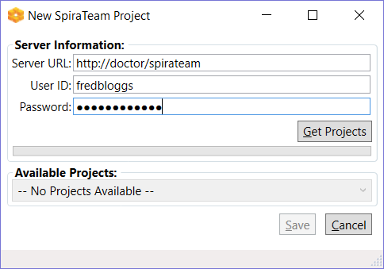
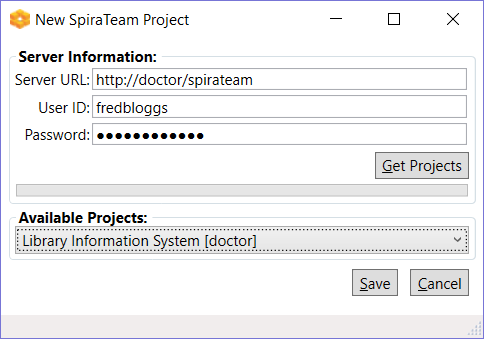
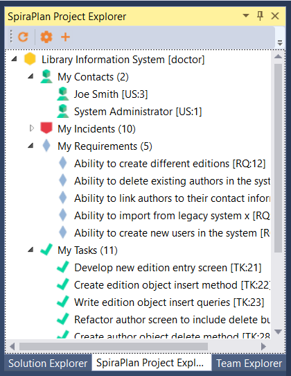
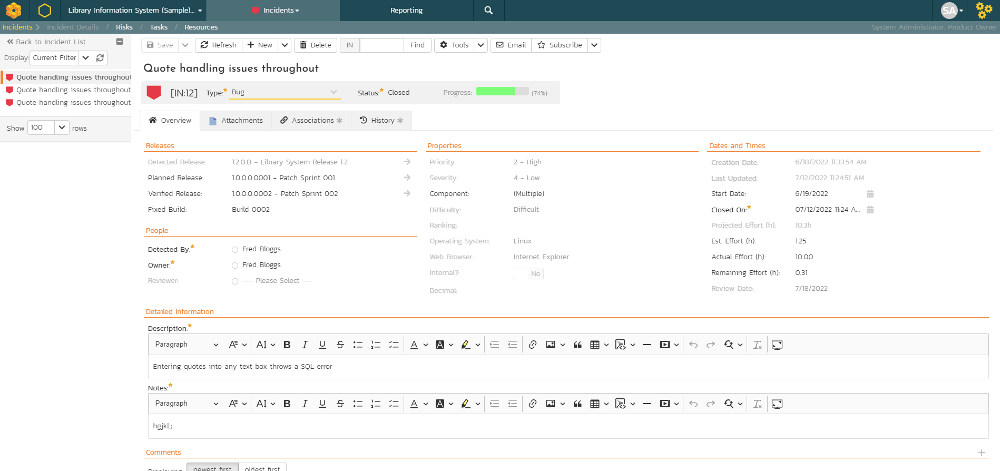
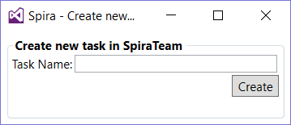

# Visual Studio
!!! abstract "Compatible with SpiraTest, SpiraTeam, SpiraPlan"

This section outlines how to use SpiraTest, SpiraPlan or SpiraTeam (hereafter referred to as Spira) in conjunction with the Visual Studio (VS) integrated development environment (IDE) for viewing Requirements, completing Tasks and fixing Incidents.

This add-in is meant for use with Visual Studio 2012 or later and SpiraTest, SpiraPlan or Spira (hereafter referred to as Spira) version v5.0 or later. It does require that .NET v4.5 be installed;
however this is required by Visual Studio 2012 by default.

## Installing the Visual Studio Add-In
The addin is downloadable from [Microsoft's Visual Studio Gallery](http://visualstudiogallery.msdn.microsoft.com/ef3e5da0-ac1e-48de-9c4b-0a8479ef8498), or from within Visual Studio by going to *Tools* -\> *Extension Manager* and searching for "SpiraTeam". If downloaded from within Visual Studio, after installation the IDE will need to be restarted. If downloaded from the browser, double-click on the VSIP file and it will walk you through the installation process.

## Adding and Assigning Spira Projects
After installing, a new menu item will appear under the "View" menu:

To view the Project Explorer, select "Spira Project Explorer" from the View menu. The tool window will open, and may be docked like any other tool window. When a solution is loaded that hasn't a Spira project assigned to it -- or if no solution is open -- the tool window will give a message saying so:

Once a project is loaded that contains linked Spira projects, or a Spira project is added to the current open solution, then the tool window will load in the Spira projects and display them.

To add, remove, and assign a Spira project to the open solution, click the Spira Configuration Button in the Tool Window (looks like a cog), which will open the configuration dialog:

In the fields, enter in the following:

-   **Server URL**: The root address of your Spira installation. For example: `https://server1/Spira`. Do not put "login.aspx" or any other page address in this field.
-   **User ID**: Your user ID you use to log into the Spira application.
-   **Password**: Your password you use to log into the Spira application.

Once entered, click the "Get Projects" button. The add-in will connect to the server and get a list of projects that you are assigned to.

Select the Spira project that you want to add, and click the "Save" button.

Clicking "Save" will return you to the IDE, and if you made any changes in the configuration, the Project Explorer will refresh and update its display.

## Viewing Spira Project Artifacts
Once a solution is opened and there is a Spira project assigned, you can view the project's contents. At this time, the add-in will display the following items:

-   **Users:** Users in your Spira contacts list
-   **Incidents**: Assigned to you and open.
-   **Tasks**: Assigned to you and not completed.
-   **Requirements**: Assigned to you and not developed yet.

Double-clicking on a node (or clicking on the item's arrow) will open that item up and show all the sub-items:

Clicking the Refresh button on the toolbar will refresh the highlighted item in the tree, and all sub-items contained within it. Spira projects in the Project Explorer.

All items have a right-click menu, and the options available for items are as follows:

-   **View in Browser**: Opens the details of the item in your current web browser.
-   **Refresh List**: For folders and project only. Refreshes the folder or project's contents.
-   **Copy to Clipboard**: Copies the artifact's token into the clipboard, for easy pasting into Version Control commits or descriptions.

## Viewing Artifact Details
By double-clicking an artifact in the Project Explorer (or choosing View in Browser), you can open the details for the item in the current tab of your web browser:

In addition, when you select one of the items in the add-in treeview, the add-in will display the properties for that item in the standard Visual Studio properties window:

This lets you decide whether you want to open the item in Spira before actually doing so. In a similar vein, there is a helpful tooltip displayed for all items in the tree:

## Creating a Task

If you click on the (+) icon in the extension toolbar you will be able to quickly log a new task in Spira or SpiraPlan, making it easier to track new developer tasks and have them sync across machines:

Just enter the name of the new task and it will be created in Spira, then displayed in the task list:

## Troubleshooting
The add-in is designed to capture all errors so that when something unexpected happens, work isn't lost. In most situations where an error occurs, a notification will be displayed of the error. In the Project Explorer, hover the mouse over the error node to get a full description of the error.

Errors will also be logged to the desktop's Application Event Log or a text file in case there was a problem connecting to the Event Log on the local computer. Contact support with the Application Event Log and inform them of the issue.