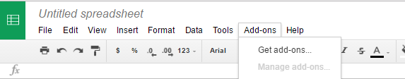
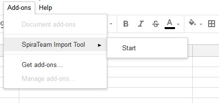
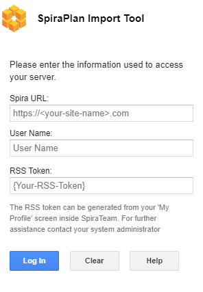
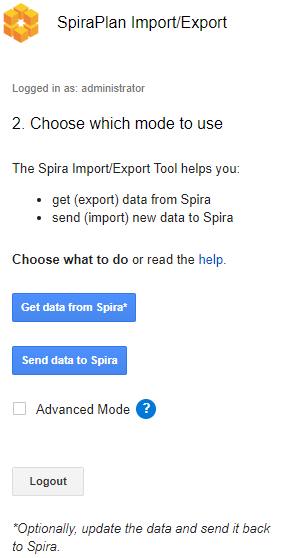
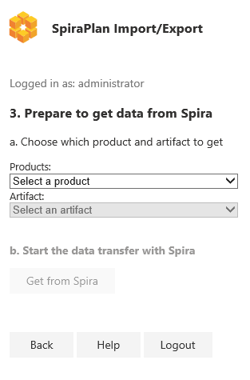
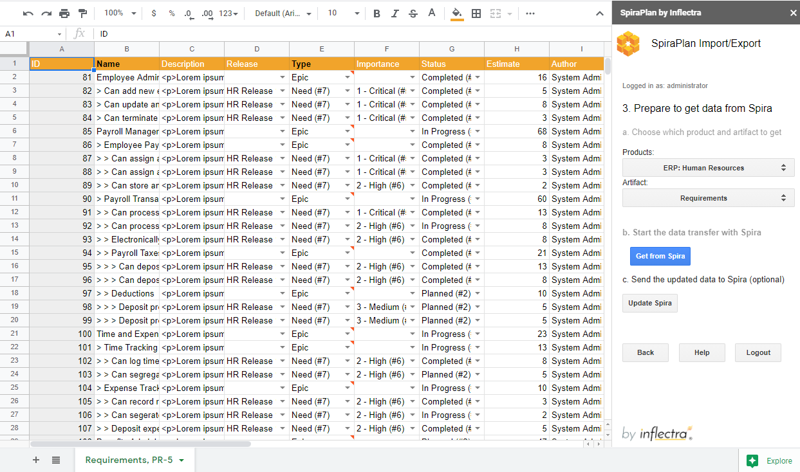

# Importing from Google Sheets

The web-based interface of SpiraTeam® is ideal for creating and managing
all aspects of your projects. However when migrating requirements,
release, tasks, incidents, risks, test sets and test cases with test steps for an
existing project from another system, it is useful to be able to
retrieve and load in a batch of artifacts, rather than having to
manually enter them one at a time.

To simplify this task we've created a Google Sheets (GSheets) add-on for
SpiraTeam® that can import requirements, releases, tasks, risks, test sets, and test cases
with test steps from a generated spreadsheet into SpiraTeam®.

*\*This guide assumes you have a Google account with access to Google
Drive and persistent access to the internet. It also assumes your
instance of SpiraTeam (or SpiraTest, or SpiraPlan) is accessible over
the internet so that Google Sheets can send data to it.*

## Installing the SpiraTeam® Google Sheets Integration Add-on

Like most Google services installation is very simple and
straightforward as long as you have a Google account.

1.  Open a new spreadsheet, navigate to the add-on menu, and click the
"Get add-ons" option.




2.  From there the Add-on store will launch, simply search for
"SpiraTeam" and you will find the SpiraTeam Import Tool Add-on.

<!-- -->

3.  Click install and authorize the add-on to work with documents
related to your account.

## Connecting to SpiraTeam®

*Before connecting to SpiraTeam® with the add-on make sure that you're
working on the first tab in the spreadsheet*.

1.  Launch the add-on from the add-on menu with the "Start" option. The
add-on will launch into a window docked to the side of your current
spreadsheet.




2.  When the add-on fully loads you will be able to enter your
SpiraTeam® log in credentials.

-   **Spira URL** : Please enter the web address that you use to access
SpiraTeam® in your browser. This is usually of the form
http://<hostname\>/SpiraTeam. Make sure that you remove any
suffixes from the address (e.g. Default.aspx).

<!-- -->

-   **User Name** : Please enter the username that you use when logging
into SpiraTeam.

<!-- -->

-   **RSS Token** : Please enter your RSS token including the curly
braces i.e {ExampleRSS}.

-   To activate your RSS Token:

-   Click on the User Profile menu in the application header

-   Click on "My Profile"

-   The string of numbers *including the brackets* listed in the
RSS Token text box is your token.

-   If you don't see an RSS Token in that box, then click on
'Enable RSS Feeds' so that it is checked.

-   Click the button 'Generate New' to get a new RSS token.

-   Click \[Update\] to save your changes




3.  Once you have entered the necessary information, please click \[ Log
In \] to authenticate with the server. If the login information is
invalid, you will see an error message appear, otherwise you will be
connected and will see the modes selection screen.

## Choosing the operation mode

The add-on has two main modes: **getting data** from Spira and **Sending data** to Spira.



Once you have successfully connected to SpiraTeam, you need to decide what you want to use this add-on for. You can go back and change your mind at any time.

### Get data from Spira (exporting)

This button will prompt you to pick a product and artifact to get from Spira and load into the spreadsheet (on the current active sheet - GSheets assumes it is always the first one). Exporting data from Spira in this way can be helpful to share with colleagues who are not using Spira. Please note that this will bring over every one of the artifacts selected in the chosen product so it may take some time. 

!!! info "Updating Data in Spira"
    Once you have the data from Spira loaded into GSheets you can freely edit it. You can then, optionally, update the data in Spira by clicking the "Update" button. This will send every artifact on the sheet back to Spira, updating each and every one. Each row will be sent in full to Spira - if you blank out a cell, that value will be blanked out in Spira.
    
    If there are any errors during the update process you will see relevant explanations, with the specific cells (as relevant) that are causing the problem highlighted in red.
  
    If you only wish to update a single artifact, we recommend deleting all the other rows of data to keep things clean. 
  
    **Note**: when using the update functionality after getting data, you can only update artifacts that already exist in Spira. You cannot create new artifacts at the same time. See below for more information about how the update works for specific artifacts and fields.

### Send data to Spira (importing)
This will button will prompt you to pick a product and artifact to send new data to Spira (from the current active sheet). Before you can enter data to send, the add-in creates a dynamic template for that specific product and artifact to make it easier for you to enter data correctly. Therefore if you have data already in your sheet, make sure to create a new worksheet for GSheets to wipe and then prepare for you. 

Click "Prepare Sheet" to create this template for your chosen product and artifact. Do not alter the worksheet structure in any way after the template has been created (for example do not merge cells, change formatting or delete columns).

Once the template is ready you can start entering your new data. Once you have entered in all required data, click the "Send" button to add the data to Spira. **Note**: cells highlighted grey are not editable.

If there are any errors during the sending process you will see relevant explanations, with the specific cells (as relevant) that are causing the problem highlighted in red.

### Advanced Mode (optional)
When you enable advanced mode, you have more options when sending data to or updating data in Spira that are normally not available. Advanced mode lets you create new comments and add associations between specific artifacts. Check the box 'Advanced Mode' to activate it for all modes of operation.

## 3. Prepare for the data transfer
After you have chosen which mode to use, select the product and artifact from the dropdown menus.



* **Products**:  lists all products in Spira that you are a member of
* **Artifacts**: this menu does not dynamically change based on your permissions, so if you cannot add data to an artifact this could be why.

### Fields: working with required fields
* Required fields are marked by their name in the title row shown as bold black text (standard fields are regular light text)                  
* For test steps, required fields are shown in black, but not bold text.

### Fields: how certain 'special' fields work
* **ID Fields**: This field MUST be left blank *__unchanged__* to add new items to Spira. Any rows with entries in the ID fields *__will be skipped over with error__* are skipped over.

### Fields: dates
* Dates are entered into SpiraPlan as UTC and at midday. Please make sure that your Spira instance and the device you are running GSheets are set to the same timezone, to avoid having date mismatches. In Spira, go to your profile page, then 'Regional Settings' to change your displaying timezone. You can also change this configuration at the system level, under System > General Settings > Default Timezone (admin user is required).

### Fields: multi-select lists
* Some fields in SpiraPlan let you select multiple items from a list. Spreadsheets do not allow this functionality
* When data is sent from SpiraPlan to the spreadsheet, only the first list value selected in Spira (if multiple are selected) will be displayed in the spreadsheet
* When sending data to SpiraPlan you will only be able to select one value
* When updating data, please note that since the value displayed in the spreadsheet will replace the multiple selections in Spira, you may lose data.

### Advanced Fields: New Comments
When advanced mode is enabled you will see a column called "New Comments". This lets you create new comments in Spira when sending the relevant items to Spira

To add a new comment, enter the comment in the column "New Comment". When you send data to or update Spira, this will be saved as a new comment in the artifact.

Please note that you can only create new comments. You cannot get existing comments from Spira.

### Advanced Fields: associations
When advanced mode is enabled you will may see columns that let you create associations between artifacts. This is an advanced feature because you need to know the exact IDs and type them in manually. For a more user friendly experience associating artifacts please use the main application. 

To create an association between artifacts:
- find the column of the artifact type you want to associate to (e.g.: "New Linked Requirement(s)") 
- enter the ID(s) of the artifact(s) to associate with. 
- associate multiple artifacts at a time using a comma-separated list of IDs, e.g.: 335,336,337. 

Using the add-in, it's possible to associate:

* Requirements to Requirements
* TestCases to Requirements
* TestCases to Releases
* TestCases to TestSets

Please note that you can only create new associations. You cannot get existing associations from Spira.


## Entering or Updating Data for different artifacts

### Requirements
**Indenting items**: SpiraPlan lets you create a hierarchy of requirements (where each requirement can have children, who can, in turn, have child of their own). Use a "> " at the start of the "Name" field to mark a requirement a child of the row above it. This is illustrated in the example below

```
Indenting Example:
Item 1
> Item 2 child of item 1
> Item 3 child of item 1
> > Item 4 child of item 3
``` 

**Status**: when adding new Requirements, the status you see in Spira may not match the one you selected in the add-in. This is because the status is often calculated by the system itself. E.g.: the 'Requested' status is automatically updated to 'Planned' in Spira if the requirement is assigned to a Release. You can always get the data from Spira to see the most updated fields in the spreadsheet.

**Estimate Points for Epics**: will get replaced by the child requirement in Spira, even if you selected a different value in the add-in.

**Changing the hierarchy by updating**: you cannot change where a requirement is in the hierarchy when updating. Do not attempt to change any requirement's relative row or indentation - it will be ignored by the add-in. 

### Releases
**Indenting items**: SpiraPlan lets you create a hierarchy of releases (where each release can have children, who can, in turn, have child of their own). Use a "> " at the start of the "Name" field to mark a release a child of the row above it. This is illustrated in the example below

```
Indenting Example:
Item 1
> Item 2 child of item 1
> Item 3 child of item 1
> > Item 4 child of item 3
``` 

**Changing the hierarchy by updating**: you cannot change where a release is in the hierarchy when updating. Do not attempt to change any release's relative row or indentation - it will be ignored by the add-in.


### Test Cases and Test Steps

!!! danger "Don't get confused between test cases and test steps"
    Test steps are an integral part of test cases so we let you view and add test cases and their steps together in the same table. This combination of two different artifacts can be confusing because they have different fields and requirements. Because each row can either be a case or a step, there are columns for both -- some are only for test cases, others are only for tests steps.

    - **Test case fields** are columns with a darker background color
    - **Test steps fields** are columns with a lighter background color
    - **Required fields** are those with black text: darker orange ones are needed for a test case, lighter orange ones for a test step
    
    To create a test case with a step, fill in the test case fields in the first row. Then fill in the test step fields for the second row. Add more steps as needed in new rows. To add a second test case, start a new row and fill in the test case fields again. 
    
    **Make sure**: each row only fills in either the required test case or test step columns. If the system cannot tell whether an entry is a test case or step it is skipped over when sending to Spira.

* A test step must have a test case parent to be linked to and all test steps below a test case will become the steps for that test case.
* There is no need to number the test steps -- SpiraPlan adds this information automatically
* If a row has a mix of required fields in for both test cases and test steps, the addon won't know if it is a test case or a test step, so it will flag this an error

### Incidents
**Remaining Effort**: the add-in populates 'Remaining Effort' in Spira equally to the spreadsheet's entry for 'Estimated Effort'

### Tasks
This artifact does not have any special factors to take into account.

### Test Sets
This artifact does not have any special factors to take into account.

### Risks
This artifact does not have any special factors to take into account.

## Other actions you can do on after you have logged in to the add-in
* **Back**: Go back to select which add-in mode to run
* **Help**: Open the add-ins help menu to this page
* **Logout**: Close your connection with Spira and take you back to the login page



