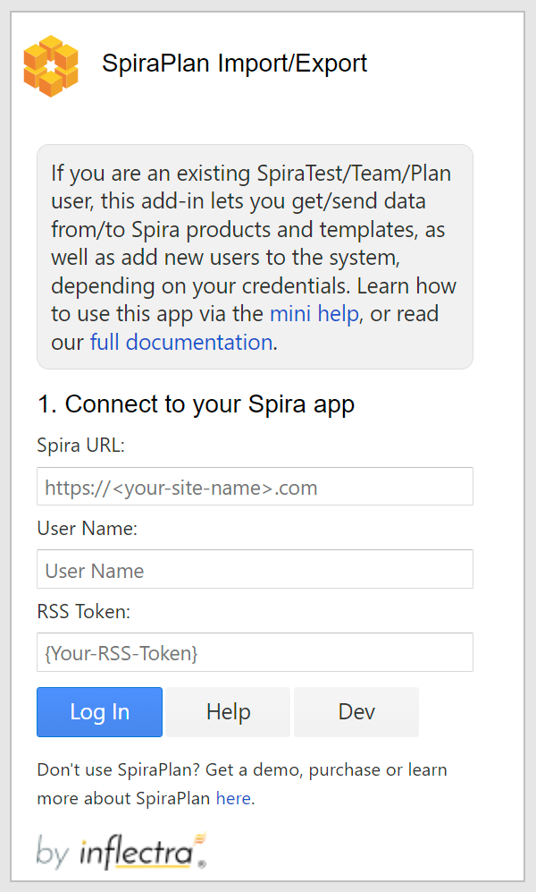
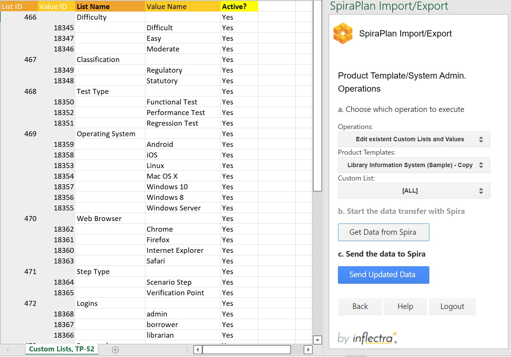

#  Importing from Microsoft Excel (Office 2016+, iOS, web)

If you are using Microsoft Excel 2016+, or in the cloud (via a web browser) or on iPad OS, you can use the dedicated Microsoft Excel 2016+ add-in. With this add-in you can import or export data to and from any product in your SpiraTest, SpiraTeam, or SpiraPlan application. The add-in works for requirements, releases, incidents, tasks, test cases with their test steps, risks and test sets.

In legacy versions of this add-in you need to download a static excel template to help make sure you enter data into it in the correct way. This add-in dynamically creates the sheet headers and cell validation based off of the specific selections you make. 


## Installation

To install the add-in:

* Go to the **insert** tab in Excel
* Click on **"Get Add-Ins"** and in the window that opens navigate to the **store** tab
* Search for **"Spira** or **SpiraPlan**. 
* When you see the correct add-in developed by Inflectra, click on the "Add" button associated with it. 
* You should now see the SpiraPlan icon labeled "Show Taskpane, SpiraPlan" in your home tab. Click on it to begin.


## 1. Connect to your Spira app
You can use this add-on with SpiraTest®, SpiraTeam®, or SpiraPlan®. If you are using Excel in the browser, your Spira app needs to be accessible over the internet.



* **Your Spira Url:** The web address that you use to access SpiraPlan® in your browser. Use the web address you use to access Spira in your browser. This is usually of the form 'http://(company).spiraservice.net'. Make sure you remove any suffixes from the address (e.g. Default.aspx or "/")
* **Your Username:** This is the exact same username you use to log in to Spira. (Not Case Sensitive)
* **Enter your RSS token:** You can find or generate this from your user profile page inside Spira. Make sure to include the curly braces - {ExampleRSS}

You will be notified if there is an issue with your url or the user information you provided. 


## 2. Choose which mode to use
This add-in has two separate modes: exporting; and importing.


Once you have successfully logged in to your Spira application, you need to decide what you want to use this add-in for. You can go back and change your mind at any time.

* **Get data from Spira (exporting)**: This button will prompt you to pick a product and artifact to LOAD FROM Spira loaded into the spreadsheet (on the current active sheet). Exporting data in this way can be helpful to share with colleagues who are not using Spira. Please note that this will bring over 100% of the artifacts in that product so it may take some time. 
  * Optionally, after getting data, you can make changes, then update the data back in Spira, hitting the button 'Update Spira'. Please note that this option only allows you to update the received data, not create new artifacts.
  
* **Send data to Spira (importing)**: This will button will prompt you to pick a product and artifact to SEND TO Spira from the current active sheet. Before you can enter data to send, the add-in creates a dynamic template for that specific product and artifact to make it easier to enter data correctly.


* **Logout**: Close your connection with Spira and take you back to the add-in's login page.
* **Advanced Mode (optional)** This mode allows you to create new comments and associate artifacts. Check the box 'Advanced Mode' to activate it.
   * To associate artifacts, find the column of the artifact type you want to associate to (e.g.: "Linked Requirement") and enter the ID(s) of the artifact(s) to associate to. You can associate multiple artifacts at a time using a comma-separated list of IDs, e.g.: 335,336,337. It's possible to associate:

    * Requirements to Requirements
    * TestCases to Requirements
    * TestCases to Releases
    * TestCases to TestSets
    
    Please note that you can only use this option to create associations, not to retrieve the existent ones from Spira.
    

   * To create a new comment, simply enter the text under the column "New Comment". When you send to / update Spira, this text will be saved as a new comment in the artifact. It's not possible to retrieve comments from Spira, just create new ones.


## 3. Prepare for the data transfer
If you are getting data from or sending data to Spira you first have to select the product and artifact to use from the dropdown menus.


* **Products**:  lists all products in Spira that you are a member of
* **Artifacts**: this menu does not dynamically change based on your permissions, so if you cannot add data to an artifact this could be why.

**Getting data from Spira**: once you have your product and artifact selected, click the button to start the export process. The add-in gets every entry of that artifact in the chosen product so it may take some time.

**Sending data to Spira**: before you can enter data into the sheet click "Prepare Sheet" to create a template for that product and artifact. Once the sheet is ready click the Send button to add that data to Spira.

**Updating data in Spira (advanced mode)**: once you have the data from Spira in the spreadsheet, you can update the available fields and then click on 'Update Spira' to make the changes reflect in Spira. Each row will be sent in full to Spira - if you blank out a cell, that value will be blanked out in Spira. NOTE: you cannot moving artifacts by updating (for example, you cannot move requirements in the hierarchy, or test steps within or between test cases).


### Fields: working with required fields
* Required fields are marked by their name in the title row shown as bold black text (standard fields are regular light text)                  
* For test steps, required fields are shown in black, but not bold text.

### Fields: how certain 'special' fields work
* **ID Fields**: This field MUST be left blank to add new items to Spira. Any rows with entries in the ID fields are skipped over.
* **Test Cases and Test Steps**: 
    - Test case fields are columns with a darker background color. Test steps fields are columns with a lighter background color. 
    - To create a test case with a step, fill in the test case fields in the first row. Then fill in the test step fields for the second row. Add more steps as needed in new rows. To add a second test case, start a new row and fill in the test case fields again. 
    - Make sure: each row only fills in either test case or test step columns. If the system cannot tell whether an entry is a test case or step it is skipped over when sending to Spira.

* **Name**: For REQUIREMENTS and RELEASES this field supports indentation, add a “ > “ symbol to indicate how the items in the artifact hierarchy are organized.
        
```
Example:
Item 1
> Item 2 child of item 1
> Item 3 child of item 1
> > Item 4 child of item 3
```

### Fields: dates
* Dates are entered into SpiraPlan as UTC and at midday.

### Fields: multi-select lists
* Some fields in SpiraPlan let you select multiple items from a list. Spreadsheets do not allow this functionality
* When data is sent from SpiraPlan to the spreadsheet, only the first list value selected in Spira (if multiple are selected) will be displayed in the spreadsheet
* When sending data to SpiraPlan you will only be able to select one value

### Other actions you can do on this page
* **Back**: Go back to select which add-in mode to run
* **Help**: Open the add-ins help menu to this page
* **Logout**: Close your connection with Spira and take you back to the login page




## Entering Data for different artifacts
* **Requirements**: 
    * SpiraPlan allows a hierarchy of requirements (where each requirement can have children, who can, in turn, have child requirements of their own). To designate the hierarchy level of requirements, use the "\>" character at the start of the name field. See above for an example of how to do this.
    * Please note that when adding new Requirements, the status you see in Spira may not match the one you selected in the spreadsheet, because the status gets calculated by the system. E.g.: 'Requested' status is automatically updated to 'Planned' in Spira if the requirement is assigned to a Release. You can always get the data from Spira to see the most updated fields in the spreadsheet.
    * Please note that Estimate Point values for Epics will get replaced by the child requirement in Spira, even if you selected a different value in Excel.
* **Releases**: like Requirements, Releases in SpiraPlan are hierarchical. You designate hierarchy in the exact same way as for requirements.
* **Test Cases and Test Steps**:
    * A test step must have a test case parent to be linked to and all test steps below a test case will become the steps for that test case.
    * There is no need to number the test steps -- SpiraPlan adds this information automatically
    * Because each row can either be a case or a step, there are columns for both -- some are only for test cases, others are only for tests steps
    * The lighter orange column names are ONLY for test step creation
    * Fields with black text are required: darker orange ones are needed for a test case, lighter orange ones for a test step
    * If a row has a mix of required fields in for both test cases and test steps, the addon won't know if it is a test case or a test step, so it will flag this an error
* **Incidents**: Please note that the add-in populates 'Remaining Effort' in Spira equally to the spreadsheet's entry for 'Estimated Effort'
* **Tasks**: this artifact does not have any special factors to take into account


## Functionality Differences from Microsoft Excel Classic plugin
Excel 365 can (and the classic plugin cannot):

- work with customizable template fields like importance, status, and type
- provide much easier data entry with dropdowns to show user names, releases, custom lists
- seamlessly integrates custom fields and standard fields
- works across Windows, Mac OS, and the web
- NOTE: it is compatible only with Excel 2015+ and Spira 6.3.0.1+

Excel Classic can (and the Excel 365 plugin cannot):

- work with version of Spira older than 6.3.0.1 
- work with versions of Excel pre Excel 2015
- create Test Runs