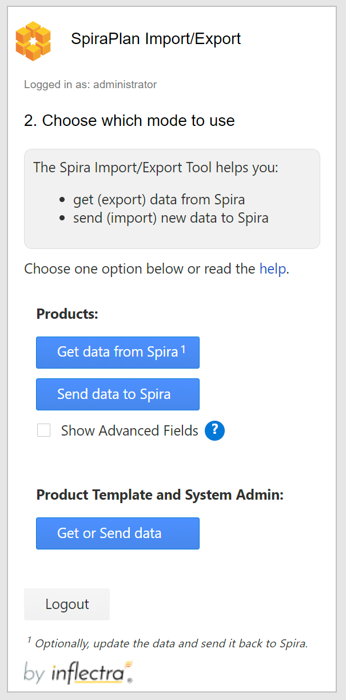
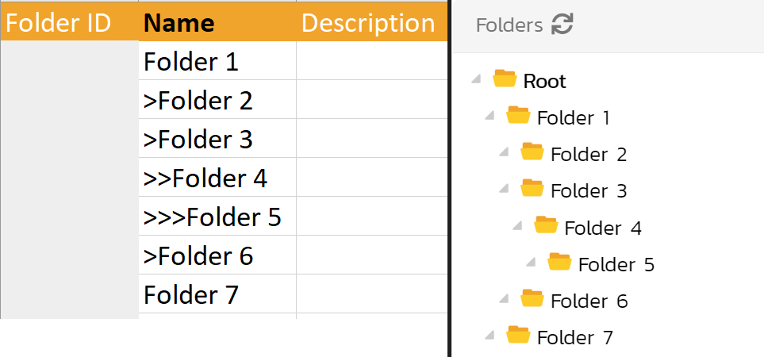

#  Importing from Microsoft Excel (Office 2016+, iOS, web)

This add-in works with Microsoft Excel 2016+, Excel in the cloud (via a web browser), and Excel on iPad OS. The add-in lets you import or export data to and from any product in your SpiraTest, SpiraTeam, or SpiraPlan application. 

**The add-in works for:** 

1.  Requirements
2.  Releases
3.  Incidents
4.  Tasks
5.  Test cases with their Test steps
6.  Test sets
7.  Risks
8.  Components[^1]
9.  Folders[^1]
10. Custom Lists and Values[^1]
11. User[^1]

[^1]: Requires system administrator credentials

In legacy versions of this add-in, you needed to download a static excel template to help make sure you enter data into it in the correct way. However, this new add-in dynamically creates the sheet headers and cell validation based on the artifact and product you select.


## Installation 

To install the add-in:

* Go to the **insert** tab in Excel
* Click on **"Get Add-Ins"** and in the window that opens navigate to the **store** tab
* Search for **"Spira** or **SpiraPlan**. 
* When you see the correct add-in developed by Inflectra, click on the "Add" button associated with it. 
* You should now see the SpiraPlan icon labeled "Show Taskpane, SpiraPlan" in your home tab. Click on it to begin.


## 1. Connect to your Spira app
You can use this add-in with SpiraTest®, SpiraTeam®, or SpiraPlan®. 

If you are using Excel in the browser, make sure your SpiraPlan is accessible over the internet.


* **Your Spira URL:** The web address that you use to access SpiraPlan® in your browser. Use the web address you use to access Spira in your browser. This is usually of the form 'http://**company**.spiraservice.net'. Make sure you remove any suffixes from the address (e.g. Default.aspx or "/")
* **Your Username:** This is the exact same username you use to log in to Spira. (Not Case Sensitive)
* **Enter your RSS token:** You can find or generate this from your user profile page inside Spira - "{ExampleRSS}". Make sure to include the curly braces and *make sure to hit Save after generating a new RSS token.*

**If there is a problem connecting to Spira you will be notified with an error message.**

After you have logged in click **Logout** to close your connection with Spira and take you back to the add-in's login page.

!!! tip "On-premise customers"
    If you have an on-premise Spira installation and you are not able to login to the add-in with valid credentials, please ask your local IT team to issue a self-signed certificate for your Spira instance, as some Excel versions require it.


## 2. Choose which mode to use
The add-in has three main modes: *getting data **from** Spira*, *Sending data **to** Spira*, and *Administrator Functions*. Please choose a mode to proceed. Only Spira administrator users can see the third button.



Once you have successfully connected the Excel add-in to your Spira app, you need to decide what you want to use this add-in for. You can go back and change your mind at any time.

### Get data from Spira (exporting)
This button will prompt you to pick a product and artifact to get from Spira and load into the spreadsheet (on the current active sheet). Getting data from Spira can be helpful to share with colleagues who are not using Spira. You can get up to 2,000 artifacts at a time. If there are more than 2,000 artifacts, use the "Page" option to get subsequent pages / batches of 2,000 artifacts (for example, selecting page 3, will retrieve artifacts 4001 to 6000). The pagination feature may not be available for all the artifacts.

!!! info "Updating Data in Spira"
    Once you have the data from Spira loaded into Excel you can freely edit it. You can then, optionally, update the data in Spira by clicking the "Update Spira" button. This will send every artifact on the sheet back to Spira, **updating each and every one**. Each row will be sent in full to Spira - if you blank out a cell, that value will be blanked out in Spira.
    
    If there are any errors during the update process you will see relevant explanations, with the specific cells (as relevant) that are causing the problem highlighted in red.
  
    If you only wish to update a single artifact, we recommend deleting all the other rows of data to keep things clean. 
  
    You can only update artifacts that already exist in Spira. You cannot create new artifacts at the same time as updating.


### Send data to Spira (importing)
This button will prompt you to pick a product and artifact to send new data to Spira (from the currently active sheet). Before you can enter data to send, the add-in creates a dynamic template for that specific product and artifact to make it easier for you to enter data correctly. Therefore if you have data already in your sheet, make sure to create a new worksheet for Excel to wipe and prepare for you. 

Click "Prepare Sheet" to create this template for your chosen product and artifact. Do not alter the worksheet structure in any way after the template has been created (for example do not merge cells, change formatting or delete columns).

Once the template is ready you can start entering your new data[^max-new-rows]. Once you have entered in all required data, click the "Send" button to add the data to Spira. **Note**: cells highlighted in grey are not editable.

If there are any errors during the sending process you will see relevant explanations, with the specific cells (as relevant) that are causing the problem highlighted in red.

**Show Advanced Fields (optional):** When you enable this, you have more options when sending data to or updating data in Spira that are normally not available. This lets you create new comments and add associations between specific artifacts. Check the box 'Show Advanced Fields' to activate it for the two previous modes of operation.

[^max-new-rows]: Please note that you can currently only send a maximum of 10,000 rows of data to Spira at a a time.


### Administrator Functions
This mode is only available for Spira system administrators. When you login to the add-in with administrator credentials, you will see the "Product Template and System Admin" section, at the bottom of the second screen. Clicking the "Get or Send data" button in this section will let you:

- Add new users to Spira
- Add new Artifact Folders to Spira
- Add new Custom Lists and Values
- Edit Existent Custom Lists and Values

#### Add new users to Spira
Select this under "Operations" and click "Prepare Data Template Sheet" to load the template. 

Populate the sheet with at least the required (bold) fields and hit "Send Data". The just-created new users will already be approved in Spira. If you try to make a new user with a username that already exists, no data will be created or updated in Spira. Instead, the username's ID will be shown in the first column.

#### Add new Artifact Folders to Spira
Select this option under "Operations", then select an Artifact type and a Product to create the folders. Then, click on "Prepare Data Template" to load the template spreadsheet. Enter the new folder data in the spreadsheet. Finally, hit "Send  Data" and wait until the data is sent to Spira. To create subfolders, use a "> " character at the start of the "Name" field to mark the hierarchy. This is illustrated in the example below



```
Folder 1 (root level)
> Folder 2 (subfolder of Folder 1)
> Folder 3 (subfolder of Folder 1)
> > Folder 4 (subfolder of Folder 3)
> > > Folder 5 (subfolder of Folder 4)
> Folder 6 (subfolder of Folder 1)
Folder 7 (root level)

``` 

#### Add new Custom Lists and Values
Select this under "Operations" and then select the product template you want to add the new list(s) and value(s). Then, click on "Prepare Data Template Sheet" to load the template. Populate the sheet with at least the required (bold) fields. Please note that you must reserve one row for a list and one or more for its values. Finally, hit "Send Data" and wait until the data is sent to Spira.

#### Edit Existing Custom Lists and Values
Select this under "Operations" and select the product template to edit the lists in, and then from the dropdown select either:

- the custom lists to edit 
- or select *[ALL]* to get all the lists from that product template. 

Now click on "Get Data from Spira" to load the template. Edit the sheet values freely. Remember to keep/provide new required (bold) fields. Additionally, you can add new values to existing lists, and also add brand new lists (with their values).

When ready, hit "Send Updated Data" and wait until the data is sent to Spira.


## 3. Prepare for the data transfer
This section is valid for the non-admin modes only (getting data and creating new data).

After you have chosen which mode to use, select the product and artifact from the dropdown menus.


* **Products**:  lists all products in Spira that you are a member of
* **Artifacts**: this menu does not dynamically change based on your permissions, so if you cannot add data to an artifact this could be why.

### Fields: working with required fields
* Required fields are marked by their name in the title row shown as bold black text (standard fields are regular light text)                  
* For test steps, required fields are shown in black, but not bold text.
* For a given artifact, the required fields are:

    * System Standard fields that are required for artifact creation such as name/title, type, some dates, and others
    * Custom Property fields if the `Allow Empty` at the custom property definition is toggled to `No`

### Fields: how certain 'special' fields work
* **ID Fields**: This field MUST be left blank *__unchanged__* to add new items to Spira. Any rows with entries in the ID fields *__will be skipped over with error__* are skipped over.

### Fields: dates
* Dates are entered into SpiraPlan as UTC and at midday. Please make sure that your Spira instance and the device you are running Excel are set to the same timezone, to avoid having date mismatches. In Spira, go to your profile page, then 'Regional Settings' to change your displaying timezone. You can also change this configuration at the system level, under System > General Settings > Default Timezone (admin user is required).

### Fields: multi-select lists
* Some fields in SpiraPlan let you select multiple items from a list. Spreadsheets do not allow this functionality
* When data is sent from SpiraPlan to the spreadsheet, only the first list value selected in Spira (if multiple are selected) will be displayed in the spreadsheet
* When sending data to SpiraPlan you will only be able to select one value

### Advanced Fields: New Comments
When "Show Advanced Fields" is enabled you will see a column called "New Comments". This lets you create new comments in Spira when sending the relevant items to Spira

To add a new comment, enter the comment in the column "New Comment". When you send data to or update Spira, this will be saved as a new comment in the artifact.

Please note that you can only create new comments. You cannot get existing comments from Spira.

### Advanced Fields: associations
When "Show Advanced Fields" is enabled you will may see columns that let you create associations between artifacts. This is an advanced feature because you need to know the exact IDs and type them in manually. For a more user friendly experience associating artifacts please use the main application. 

To create an association between artifacts:
- find the column of the artifact type you want to associate to (e.g.: "New Linked Requirement(s)") 
- enter the ID(s) of the artifact(s) to associate with. 
- associate multiple artifacts at a time using a comma-separated list of IDs, e.g.: 335,336,337. 

Using the add-in, it's possible to associate:

* Requirements to Requirements
* TestCases to Requirements
* TestCases to Releases
* TestCases to TestSets

Please note that you can only create new associations. You cannot get existing associations from Spira

## Entering or Updating Data for different artifacts

### Requirements
**Indenting items**: SpiraPlan lets you create a hierarchy of requirements (where each requirement can have children, who can, in turn, have child of their own). Use a "> " at the start of the "Name" field to mark a requirement a child of the row above it. This is illustrated in the example below

```
Indenting Example:
Item 1
> Item 2 child of item 1
> Item 3 child of item 1
> > Item 4 child of item 3
``` 

**Status**: when adding new Requirements, the status you see in Spira may not match the one you selected in the add-in. This is because the status is often calculated by the system itself. E.g.: the 'Requested' status is automatically updated to 'Planned' in Spira if the requirement is assigned to a Release. You can always get the data from Spira to see the most updated fields in the spreadsheet.

**Estimate Points for Epics**: will get replaced by the child requirement in Spira, even if you selected a different value in the add-in.

**Changing the hierarchy by updating**: you cannot change where a requirement is in the hierarchy when updating. Do not attempt to change any requirement's relative row or indentation - it will be ignored by the add-in. 

### Releases
**Indenting items**: SpiraPlan lets you create a hierarchy of releases (where each release can have children, who can, in turn, have child of their own). Use a "> " at the start of the "Name" field to mark a release a child of the row above it. This is illustrated in the example below

```
Indenting Example:
Item 1
> Item 2 child of item 1
> Item 3 child of item 1
> > Item 4 child of item 3
``` 

**Changing the hierarchy by updating**: you cannot change where a release is in the hierarchy when updating. Do not attempt to change any release's relative row or indentation - it will be ignored by the add-in.


### Test Cases and Test Steps

!!! danger "Don't get confused between test cases and test steps"
    Test steps are an integral part of test cases so we let you view and add test cases and their steps together in the same table. This combination of two different artifacts can be confusing because they have different fields and requirements. Because each row can either be a case or a step, there are columns for both -- some are only for test cases, others are only for tests steps.

    - **Test case fields** are columns with a darker background color
    - **Test steps fields** are columns with a lighter background color
    - **Required fields** are those with black text: darker orange ones are needed for a test case, lighter orange ones for a test step
    
    To create a test case with a step, fill in the test case fields in the first row. Then fill in the test step fields for the second row. Add more steps as needed in new rows. To add a second test case, start a new row and fill in the test case fields again. 
    
    **Make sure**: each row only fills in either the required test case or test step columns. If the system cannot tell whether an entry is a test case or step it is skipped over when sending to Spira.

* A test step must have a test case parent to be linked to and all test steps below a test case will become the steps for that test case.
* There is no need to number the test steps -- SpiraPlan adds this information automatically
* If a row has a mix of required fields in for both test cases and test steps, the addon won't know if it is a test case or a test step, so it will flag this an error

Following is an example of how to add Test Cases and Test Steps to Spira:


### Incidents
**Remaining Effort**: the add-in populates 'Remaining Effort' in Spira equally to the spreadsheet's entry for 'Estimated Effort'

### Tasks
This artifact does not have any special factors to take into account.

### Test Sets
This artifact does not have any special factors to take into account.

### Risks
This artifact does not have any special factors to take into account.

### Components
Only system administrators will see this entry in the dropdown for getting and sending data from/to Spira.

### Folders
Only system administrators will see this entry in the dropdown for sending data to Spira. You can create folder for different artifact types at the same time. Just select them under the `Artifact` column in the worksheet.

### Custom Lists and Custom Values
Only system administrators can Add/Edit Custom Lists and Values going to the second/third option of the "Product Template/System Admin. Operation"` menu. Please note that:

- **Custom Lists** are columns with a darker background color (dark orange)
- **Custom Values** are columns with a lighter background color (light orange)
- **Custom Lists AND Custom Values** are columns with a brighter background color (yellow)
- **Required fields** are those with black text. It's not possible to create/update data without them


### Users
Only system administrators can create new users going to the first option of the "Product Template/System Admin Operations" menu.


## Other actions you can do after you have logged in to the add-in
* **Back**: Go back to select which add-in mode to run
* **Help**: Open the add-ins help menu to this page
* **Logout**: Close your connection with Spira and take you back to the login page

--- 

## Functionality Differences to our Legacy Microsoft Excel plugin
**What can the Excel365 add-in do that the Classic Excel add-in cannot?**

- work with customizable template fields like importance, status, and type
- provide much easier data entry with dropdowns to show user names, releases, custom lists
- seamlessly integrates custom fields and standard fields
- works across Windows, Mac OS, and the web
- compatible only with Excel 2016+[^min-version] and Spira 6.3.0.1+

[^min-version]: Not compatible with Excel Professional 2016 and 2019 versions</small>

**What can the Excel Classic add-in do that the Excel365 add-in cannot?**

- work with version of Spira older than 6.3.0.1
- work with versions of Excel pre Excel 2016

**NOTE** The classic version of our Excel importer can create test runs. Please refer to the [SpiraPlan TestRunner](../Unit-Testing-Integration/Using-Test-Runner-For-Excel.md) for Excel 365 add-in to use these functionalities in our new generation of add-ins.