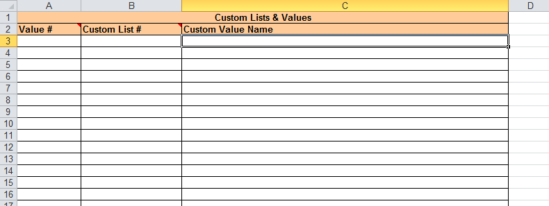

#  Importing from Microsoft Excel
!!! abstract "Compatible with SpiraTest, Spira, SpiraPlan"

!!! danger
    If you are using recent versions of Excel and Spira, then do not use this Add-In. This is legacy addon only.
    
    Please use our [Excel365 importer](./Importing-from-Microsoft-Excel-(Office365).md) instead.

The web-based interface of Spira is ideal for creating and managing requirements, test cases and incidents for a new project. However when migrating requirements, test cases, test steps and incidents for an existing project from another system or Microsoft Office document (e.g. Excel), it is useful to be able to load in a batch of artifacts, rather than having to manually enter them one at a time.

To simplify this task, Spira comes with a Microsoft Excel Add-In that can export requirements, test cases, test steps and incidents from a populated Excel sheet into Spira. In addition, the Add-In allows you to import those same artifacts back into the Excel sheet to make batch updates which can then be used to update the master copies on the server.

Note that this guide refers to Spira, but the Excel Add-In can be used with SpiraTest® and SpiraPlan® as well. The only difference is that some of the artifact types may not be available in SpiraTest.

## Installing the Microsoft Excel Add-In

The first thing you need to do is to go to the "Add-Ons and Downloads" page of the Inflectra Website (it can be found in the SpiraTest, SpiraPlan or Spira sections), and download the **MS-Office Add-Ins** installation package. There are separate packages for the following versions of MS Office:

- **MS-Office 2003 Add-Ins**: these are compatible with Microsoft Office 2003 and 2007. They can connect to Spira v2.3 or later. They also require Microsoft .NET 3.5.
- **MS-Office 2007 Add-Ins**: these are compatible with Microsoft Office 2007 and 2010. They can connect to Spira v3.0 or later. They also require Microsoft .NET 4.0.
- **MS-Office 2010 Add-Ins**: these are compatible with Microsoft Office 2010 and later. They can connect to Spira v5.0 or later. They also require Microsoft .NET 4.0.

This installation package will install the add-ins for Microsoft Excel, Word and Project at the same time. If you don't have the correct version of Microsoft .NET installed or some of the necessary prerequisites, you will be given the opportunity to install them when you first run the installation package.

Once you have the Excel Add-In installed, the second thing you'll need to download is the **SpiraImportTemplate** Excel Sheet. This spreadsheet contains the necessary pre-formatted columns that are needed for the Add-In to easily recognize the data and know how to handle it. There are *three* versions of the template available - **SpiraImportTemplate.xls** for the Excel 2003 Add-In, **SpiraImportTemplate.xlsx** for the Excel 2007 Add-In and **SpiraImportTemplate2010.xslx** for the Excel 2010 Add-In.

Once you have downloaded the template, please double-click on it to open it up in MS-Excel. You will notice that there is an additional toolbar displayed in Excel which is used for importing/exporting data to/from Spira:

If you are using the MS-Excel 2007 or 2010 Add-In, you will see a modified version of the toolbar that makes use of the MS-Office Ribbon:

This toolbar allows you to connect to Spira, and perform the import/export. The process for using this toolbar is described below:

## Connecting to Spira
The first thing you need to do is to click on the \[Connect\] button to specify the information used to connect to your instance of Spira:

Please enter the following information into the dialog box:

-   **Spira URL:** Please enter the web address that you use to access Spira in your browser. This is usually of the form http://<hostname\>/Spira. Make sure that you remove any suffixes from the address (e.g. Default.aspx).

-   **User Name:** Please enter the username that you use for logging in to Spira

-   **Password:** Please enter the password that you use for logging in to Spira

-   **Remember Password:** If you are using this Add-In on a private computer, you can check this option to have the system remember your credentials locally. Please do not use this option on a public computer and it will compromise the security of your Spira installation.

Once you have entered the necessary information, please click
\[Connect\] to authenticate with the server. If the login information is invalid, you will see an error message appear, otherwise you will be connected and the list of projects and artifacts will be populated. If you want to end your session, you should just click the \[Disconnect\]
button and the Add-In will close your connection.

## Choosing the Project and Artifact

Once you have successfully connected to Spira, you should now choose the appropriate Project and Artifact in the system that you will be importing / exporting:

Or

The artifact choice will match the name of the Excel sheet in the template, so if you are going to be importing/exporting Requirements, you should choose "Requirements" from the dropdown list and then click on the "Requirements" tab inside the Excel import template.

Once you have selected the project and artifact, there are three buttons that you can now use:

-   **Import:** Clicking this button will retrieve the data from the Spira server and use that to populate the spreadsheet.
-   **Export:** Clicking this button will take the data in the spreadsheet and use it to add/update items in Spira.
-   **Clear:** This button allows you to quickly clear the data in the import template while leaving all the necessary headings and other information that the Add-In needs to be able to import/export data.
-   **Options:** (Only in MS-Excel 2007/2010 Add-Inx). This button allows you to change some of the import/export options.

## Importing / Exporting Data
The Excel Add-In is capable of either importing data from Spira into the Excel template or exporting data from the Excel template to Spira. However it is important to understand how the system knows whether to add new items to Spira or whether to update existing items:

-   If you start with a blank import spreadsheet and enter items into it, they will not have a value set on their ID column in the spreadsheet (this is always the first column in each sheet). When you perform an Export, it will add these as new items in Spira
-   If you start with a blank import spreadsheet and choose to Import data from Spira, those rows will include the ID of the item in the first column of the spreadsheet. You can either update those rows or add new rows in between. Any rows that have the ID column populated will be *updated* in Spira when you choose Export, whereas any newly added rows will be *inserted* in Spira.

### Importing/Exporting Releases
To import/export releases, first you need to click on the "Releases" tab in the Excel sheet:

Next if you want to import the list of existing Releases from Spira, you should click on the \[Clear\] icon to first remove the sample information from the spreadsheet, then click \[Import\] to load the list of existing releases into the sheet. These items will all have the "Rel\#" column populated so that the system knows to update them rather than insert them when you subsequently click \[Export\].

If you want to simply export a list of releases from a spreadsheet, then you need to either enter the releases into this specially formatted spreadsheet or cut and paste them in from another existing Excel sheet that you've been using to manage releases previously. Then click \[Export\] and the new items will be added to your instance of Spira.

The various columns that can be imported, and the rules for entering data are listed below:

| **Field name**                                | **Description**                                                                                                                                                                                                                                                                                                                                                                                                                                                                                                                                                                                                                                                                                                                                                                                                  |
| --------------------------------------------- | ---------------------------------------------------------------------------------------------------------------------------------------------------------------------------------------------------------------------------------------------------------------------------------------------------------------------------------------------------------------------------------------------------------------------------------------------------------------------------------------------------------------------------------------------------------------------------------------------------------------------------------------------------------------------------------------------------------------------------------------------------------------------------------------------------------------- |
| Rel \#                                        | Stores the ID of the release. Should be left blank for new items being added to Spira                                                                                                                                                                                                                                                                                                                                                                                                                                                                                                                                                                                                                                                                                                                            |
| **Release Name**                              | The name of the release. This field supports indentation, so you need to use Excel's ability to Indent text fields to indicate how the items in the release hierarchy are organized                                                                                                                                                                                                                                                                                                                                                                                                                                                                                                                                                                                                                              |
| Release Description                           | The long description of the release. If you want it formatted, you need to add HTML tags such as <b\> for bold                                                                                                                                                                                                                                                                                                                                                                                                                                                                                                                                                                                                                                                                                                   |
| **Version Number**                            | The version number for the release; acts as the short name                                                                                                                                                                                                                                                                                                                                                                                                                                                                                                                                                                                                                                                                                                                                                       |
| **Active**                                    | Whether this release is active or not. Should be set to either Y/N                                                                                                                                                                                                                                                                                                                                                                                                                                                                                                                                                                                                                                                                                                                                               |
| **Iteration**                                 | Whether this release is an Iteration or not. Should be set to either Y/N                                                                                                                                                                                                                                                                                                                                                                                                                                                                                                                                                                                                                                                                                                                                         |
| Creator                                       | The user that should listed as the release's creator. Needs to be the ID of the user (e.g. user US00005 would be entered as just 5)                                                                                                                                                                                                                                                                                                                                                                                                                                                                                                                                                                                                                                                                              |
| **Start Date**                                | The date that work on the release is scheduled to start                                                                                                                                                                                                                                                                                                                                                                                                                                                                                                                                                                                                                                                                                                                                                          |
| **End Date**                                  | The date that work on the release is scheduled to end                                                                                                                                                                                                                                                                                                                                                                                                                                                                                                                                                                                                                                                                                                                                                            |
| **\# Resources**                              | The number of people / resources that are scheduled to work on the release.                                                                                                                                                                                                                                                                                                                                                                                                                                                                                                                                                                                                                                                                                                                                      |
| Non-Wk Days                                   | The number of non-working days that should be subtracted from the \# available hours for work performed on the release.                                                                                                                                                                                                                                                                                                                                                                                                                                                                                                                                                                                                                                                                                          |
| **MS-Excel 2003/2007 Add-In Specific Fields** |                                                                                                                                                                                                                                                                                                                                                                                                                                                                                                                                                                                                                                                                                                                                                                                                                  |
| TEXT-01 -- TEXT-10                            | The ten (10) custom text properties available in the project                                                                                                                                                                                                                                                                                                                                                                                                                                                                                                                                                                                                                                                                                                                                                     |
| LIST-01 -- LIST-10                            | The ten (10) drop-down list properties available in the project. You need to enter the ID value of the custom property not the display name. E.g. if you have a custom property with ID - PV00005 you would enter just 5 in these boxes.                                                                                                                                                                                                                                                                                                                                                                                                                                                                                                                                                                         |
| **MS-Excel 2010 Add-In Specific Fields**      |                                                                                                                                                                                                                                                                                                                                                                                                                                                                                                                                                                                                                                                                                                                                                                                                                  |
| **Status**                                    | The status of the release. It needs to be one of the values from the dropdown list                                                                                                                                                                                                                                                                                                                                                                                                                                                                                                                                                                                                                                                                                                                               |
| **Type**                                      | The type of the release (major, minor, iteration or phase). It needs to be one of the values from the dropdown list                                                                                                                                                                                                                                                                                                                                                                                                                                                                                                                                                                                                                                                                                              |
| CUS-01 -- CUS-30                              | The thirty (30) custom fields defined in the project. The value entered depends on the type of custom property:    -   **List**: provide the numeric ID of the custom list value (e.g. PV00005 would be entered as just "5")   -   **MultiList**: provide a comma-separated list of the numeric IDs of the custom list values (e.g. PV00005 and PV00003 would be entered as just "5,3")    -   **Text**: enter the text, include HTML tags if rich-text           -   **Decimal**: enter the number (e.g. 1.0)   -   **Integer**: enter the number (e.g. 2)   -   **Date**: enter the number in the current local time format (e.g. m/d/yyyy for the US, d/m/yyyy for Europe)   -   **User**: enter the ID of the user   -   **Boolean**: Enter either "True" or "False" |
| Comment                                       | The description of a comment that should be appended to the item. If you want it formatted, you need to add HTML tags such as <b\> for bold. *Note that this field always appends, so if you want to add two comments, just enter the first value and click \[Export\], then replace it with the second value and click \[Export\]*                                                                                                                                                                                                                                                                                                                                                                                                                                                                              |

Note: the columns that are required are listed in **bold** type.

### Importing/Exporting Requirements
To import/export requirements, first you need to click on the "Requirements" tab in the Excel sheet:

Next if you want to import the list of existing Requirements from Spira, you should click on the \[Clear\] icon to first remove the sample information from the spreadsheet, then click \[Import\] to load the list of existing requirements into the sheet. These items will all have the "Req \#" column populated so that the system knows to update them rather than insert them when you subsequently click \[Export\].

If you want to simply export a list of requirements from a spreadsheet, then you need to either enter the requirements into this specially formatted spreadsheet or cut and paste them in from another existing Excel sheet that you've been using to manage requirements previously. Then click \[Export\] and the new items will be added to your instance of Spira.

The various columns that can be imported, and the rules for entering data are listed below:

| **Field name**                                | **Description**                                                                                                                                                                                                                                                                                                                                                                                                                                                                                                                                                                                                                                                                                                                                                                                          |
| --------------------------------------------- | -------------------------------------------------------------------------------------------------------------------------------------------------------------------------------------------------------------------------------------------------------------------------------------------------------------------------------------------------------------------------------------------------------------------------------------------------------------------------------------------------------------------------------------------------------------------------------------------------------------------------------------------------------------------------------------------------------------------------------------------------------------------------------------------------------- |
| Req \#                                        | Stores the ID of the requirement. Should be left blank for new items being added to Spira                                                                                                                                                                                                                                                                                                                                                                                                                                                                                                                                                                                                                                                                                                                |
| **Requirement Name**                          | The name of the requirement. This field supports indentation, so you need to use Excel's ability to Indent text fields to indicate how the items in the requirement hierarchy are organized                                                                                                                                                                                                                                                                                                                                                                                                                                                                                                                                                                                                              |
| Requirement Description                       | The long description of the requirement. If you want it formatted, you need to add HTML tags such as <b\> for bold                                                                                                                                                                                                                                                                                                                                                                                                                                                                                                                                                                                                                                                                                       |
| Importance                                    | The importance / priority of the requirement. It needs to be one of the values from the dropdown list.                                                                                                                                                                                                                                                                                                                                                                                                                                                                                                                                                                                                                                                                                                   |
| Status                                        | The status of the requirement. It needs to be one of the values from the dropdown list. If this is not specified, the requirement will default to the "Requested" status.                                                                                                                                                                                                                                                                                                                                                                                                                                                                                                                                                                                                                                |
| Author                                        | The user that should listed as the requirement's author. Needs to be the ID of the user (e.g. user US00005 would be entered as just 5)                                                                                                                                                                                                                                                                                                                                                                                                                                                                                                                                                                                                                                                                   |
| Owner                                         | The user that should listed as the requirement's owner. Needs to be the ID of the user (e.g. user US00005 would be entered as just 5)                                                                                                                                                                                                                                                                                                                                                                                                                                                                                                                                                                                                                                                                    |
| **MS-Excel 2003/2007 Add-In Specific Fields** |                                                                                                                                                                                                                                                                                                                                                                                                                                                                                                                                                                                                                                                                                                                                                                                                          |
| Release \#                                    | The release that this requirement is scheduled for. Needs to be the ID of the release (e.g. release RL00005 would be entered as just 5)                                                                                                                                                                                                                                                                                                                                                                                                                                                                                                                                                                                                                                                                  |
| TEXT-01 -- TEXT-10                            | The ten (10) custom text properties available in the project                                                                                                                                                                                                                                                                                                                                                                                                                                                                                                                                                                                                                                                                                                                                             |
| LIST-01 -- LIST-10                            | The ten (10) drop-down list properties available in the project. You need to enter the ID value of the custom property not the display name. E.g. if you have a custom property with ID - PV00005 you would enter just 5 in these boxes.                                                                                                                                                                                                                                                                                                                                                                                                                                                                                                                                                                 |
| **MS-Excel 2010 Add-In Specific Fields**      |                                                                                                                                                                                                                                                                                                                                                                                                                                                                                                                                                                                                                                                                                                                                                                                                          |
| Release Version                               | The release/iteration that this requirement is scheduled for. Needs to be the version number of the release (e.g. 1.0.1.1)                                                                                                                                                                                                                                                                                                                                                                                                                                                                                                                                                                                                                                                                               |
| **Type**                                      | The type of the requirement. It needs to be one of the values from the dropdown list.                                                                                                                                                                                                                                                                                                                                                                                                                                                                                                                                                                                                                                                                                                                    |
| Estimate                                      | The estimate (in points) of the requirement. It should be a decimal number with one decimal place (e.g. 1.0, 2.5, etc.)                                                                                                                                                                                                                                                                                                                                                                                                                                                                                                                                                                                                                                                                                  |
| Component                                     | This should be the Name of the Component the requirement is assigned-to. E.g. "Component 1"                                                                                                                                                                                                                                                                                                                                                                                                                                                                                                                                                                                                                                                                                                              |
| Linked Requirements                           | Comma-separated list of requirement IDs (without the RQ prefix) that this requirement    should be linked to (e.g. 204, 891) Note: This field only Exports to Spira and not the other way around                                                                                                                                                                                                                                                                                                                                                                                                                                                                                                                                                                                                         |
| CUS-01 -- CUS-30                              | The thirty (30) custom fields defined in the project. The value entered depends on the type of custom property:   -   **List**: provide the numeric ID of the custom list value (e.g. PV00005 would be entered as just "5")   -   **MultiList**: provide a comma-separated list of the numeric IDs of the custom list values (e.g. PV00005 and PV00003 would be entered as just "5,3")   -   **Text**: enter the text, include HTML tags if rich-text   -   **Decimal**: enter the number (e.g. 1.0)    -   **Integer**: enter the number (e.g. 2)    -   **Date**: enter the number in the current local time format (e.g. m/d/yyyy for the US, d/m/yyyy for Europe)   -   **User**: enter the ID of the user   -   **Boolean**: Enter either "True" or "False" |
| Comment                                       | The description of a comment that should be appended to the item. If you want it formatted, you need to add HTML tags such as <b\> for bold. *Note that this field always appends, so if you want to add two comments, just enter the first value and click \[Export\], then replace it with the second value and click \[Export\]*                                                                                                                                                                                                                                                                                                                                                                                                                                                                      |

Note: the columns that are required are listed in **bold** type.

### Importing/Exporting Test Sets
To import/export test sets, first you need to click on the "Test Sets" tab in the Excel sheet:

Next if you want to import the list of existing Test Sets from Spira, you should click on the \[Clear\] icon to first remove the sample information from the spreadsheet, then click \[Import\] to load the list of existing test sets into the sheet. These items will all have the "TX \#" column populated so that the system knows to update them rather than insert them when you subsequently click \[Export\].

If you want to simply export a list of test sets from a spreadsheet, then you need to either enter the test sets into this specially formatted spreadsheet or cut and paste them in from another existing Excel sheet that you've been using to manage test sets previously. Then click \[Export\] and the new items will be added to your instance of Spira.

The various columns that can be imported, and the rules for entering data are listed below:

| **Field name**                                | **Description**                                                                                                                                                                                                                                                                                                                                                                                                                                                                                                                                                                                                                                                                                                                                                                                                   |
| --------------------------------------------- | ----------------------------------------------------------------------------------------------------------------------------------------------------------------------------------------------------------------------------------------------------------------------------------------------------------------------------------------------------------------------------------------------------------------------------------------------------------------------------------------------------------------------------------------------------------------------------------------------------------------------------------------------------------------------------------------------------------------------------------------------------------------------------------------------------------------- |
| TX \#                                         | Stores the ID of the test set. Should be left blank for new items being added to Spira                                                                                                                                                                                                                                                                                                                                                                                                                                                                                                                                                                                                                                                                                                                            |
| **Test Set Name**                             | The name of the test set. This field supports indentation, so you need to use Excel's ability to Indent text fields to indicate how the items in the test set hierarchy are organized                                                                                                                                                                                                                                                                                                                                                                                                                                                                                                                                                                                                                             |
| Test Set Description                          | The long description of the test set. If you want it formatted, you need to add HTML tags such as <b\> for bold                                                                                                                                                                                                                                                                                                                                                                                                                                                                                                                                                                                                                                                                                                   |
| **Folder**                                    | Whether this item is a folder or not. Should be set to either Y/N                                                                                                                                                                                                                                                                                                                                                                                                                                                                                                                                                                                                                                                                                                                                                 |
| **Status**                                    | The status of the test set. It needs to be one of the values from the dropdown list.                                                                                                                                                                                                                                                                                                                                                                                                                                                                                                                                                                                                                                                                                                                              |
| Creator                                       | The user that should listed as the test set's creator. Needs to be the ID of the user (e.g. user US00005 would be entered as just 5)                                                                                                                                                                                                                                                                                                                                                                                                                                                                                                                                                                                                                                                                              |
| Owner                                         | The user that should listed as the test set's owner. Needs to be the ID of the user (e.g. user US00005 would be entered as just 5)                                                                                                                                                                                                                                                                                                                                                                                                                                                                                                                                                                                                                                                                                |
| Planned Date                                  | The date that the test set needs to be completed by.                                                                                                                                                                                                                                                                                                                                                                                                                                                                                                                                                                                                                                                                                                                                                              |
| **MS-Excel 2003/2007 Add-In Specific Fields** |                                                                                                                                                                                                                                                                                                                                                                                                                                                                                                                                                                                                                                                                                                                                                                                                                   |
| Release \#                                    | The release that this test set is scheduled for. Needs to be the ID of the release (e.g. release RL00005 would be entered as just 5)                                                                                                                                                                                                                                                                                                                                                                                                                                                                                                                                                                                                                                                                              |
| TEXT-01 -- TEXT-10                            | The ten (10) custom text properties available in the project                                                                                                                                                                                                                                                                                                                                                                                                                                                                                                                                                                                                                                                                                                                                                      |
| LIST-01 -- LIST-10                            | The ten (10) drop-down list properties available in the project. You need to enter the ID value of the custom property not the display name. E.g. if you have a custom property with ID - PV00005 you would enter just 5 in these boxes.                                                                                                                                                                                                                                                                                                                                                                                                                                                                                                                                                                          |
| **MS-Excel 2010 Add-In Specific Fields**      |                                                                                                                                                                                                                                                                                                                                                                                                                                                                                                                                                                                                                                                                                                                                                                                                                   |
| Release Version                               | The release/iteration that this test set is scheduled for. Needs to be the version number of the release (e.g. 1.0.1.1)                                                                                                                                                                                                                                                                                                                                                                                                                                                                                                                                                                                                                                                                                           |
| CUS-01 -- CUS-30                              | The thirty (30) custom fields defined in the project. The value entered depends on the type of custom property:   -   **List**: provide the numeric ID of the custom list value (e.g. PV00005 would be entered as just "5")    -   **MultiList**: provide a comma-separated list of the numeric IDs of the custom list values (e.g. PV00005 and PV00003 would be entered as just "5,3")    -   **Text**: enter the text, include HTML tags if rich-text           -   **Decimal**: enter the number (e.g. 1.0)   -   **Integer**: enter the number (e.g. 2)   -   **Date**: enter the number in the current local time format (e.g. m/d/yyyy for the US, d/m/yyyy for Europe)    -   **User**: enter the ID of the user   -   **Boolean**: Enter either "True" or "False" |
| Comment                                       | The description of a comment that should be appended to the item. If you want it formatted, you need to add HTML tags such as <b\> for bold. *Note that this field always appends, so if you want to add two comments, just enter the first value and click \[Export\], then replace it with  the second value and click \[Export\]*                                                                                                                                                                                                                                                                                                                                                                                                                                                                              |

Note: the columns that are required are listed in **bold** type.

### Importing/Exporting Test Cases
To import/export test cases, first you need to click on the "Test Cases" tab in the Excel sheet:

Next if you want to import the list of existing Test Cases from Spira, you should click on the \[Clear\] icon to first remove the sample information from the spreadsheet, then click \[Import\] to load the list of existing test cases into the sheet. These items will all have the "Test \#" and "Step \#" columns populated so that the system knows to update them rather than insert them when you subsequently click \[Export\].

If you want to simply export a list of test cases from a spreadsheet, then you need to either enter the test cases (including any test steps) into this specially formatted spreadsheet or cut and paste them in from another existing Excel sheet that you've been using to manage test cases previously. Then click \[Export\] and the new items will be added to your instance of Spira.

The various columns that can be imported, and the rules for entering data are listed below:

| **Field name**                           | **Description**                                                                                                                                                                                                                                                                                                                                                                                                                                                                                                                                                                                                                                                                                                                                                                                                      |
| ---------------------------------------- | -------------------------------------------------------------------------------------------------------------------------------------------------------------------------------------------------------------------------------------------------------------------------------------------------------------------------------------------------------------------------------------------------------------------------------------------------------------------------------------------------------------------------------------------------------------------------------------------------------------------------------------------------------------------------------------------------------------------------------------------------------------------------------------------------------------------- |
| Test \#                                  | Stores the ID of the test case. Should be left blank for new items being added to Spira                                                                                                                                                                                                                                                                                                                                                                                                                                                                                                                                                                                                                                                                                                                              |
| **Test Case Name**                       | The name of the test case. This field supports indentation, so you need to use Excel's ability to Indent text fields to indicate how the items in the test case hierarchy are organized                                                                                                                                                                                                                                                                                                                                                                                                                                                                                                                                                                                                                              |
| Test Case Description                    | The long description of the test case. If you want it formatted, you need to add HTML tags such as <b\> for bold                                                                                                                                                                                                                                                                                                                                                                                                                                                                                                                                                                                                                                                                                                     |
| Priority                                 | The priority of the test case. It needs to be one of the values from the dropdown list.                                                                                                                                                                                                                                                                                                                                                                                                                                                                                                                                                                                                                                                                                                                              |
| Owner                                    | The user that should listed as the test case's owner. Needs to be the ID of the user (e.g. user US00005 would be entered as just 5)                                                                                                                                                                                                                                                                                                                                                                                                                                                                                                                                                                                                                                                                                  |
| Row Type                                 | This is used to tell the Add-In what type of row this is. You should enter "FOLDER" if this row is a test folder, "TestCase" if it is a test case and "\>TestStep" if it is a test step belonging to a test case. These values should be selected from the dropdown list. *Note: You should make sure that  test step rows are located        directly underneath the test case they are a part of.*                                                                                                                                                                                                                                                                                                                                                                                                                 |
| Step \#                                  | Stores the ID of the test step. Should be left blank for new test steps being added to a test case                                                                                                                                                                                                                                                                                                                                                                                                                                                                                                                                                                                                                                                                                                                   |
| **Test Step Description**                | The description of the test step. This should contain the description of the actions that the tester needs to take. If you want it formatted, you need to add HTML tags such as <b\> for bold                                                                                                                                                                                                                                                                                                                                                                                                                                                                                                                                                                                                                        |
| **Expected Result**                      | The expected result of the test step. This should contain the description of what the tester should see if the step succeeds. If you want it formatted, you need to add HTML tags such as <b\> for bold                                                                                                                                                                                                                                                                                                                                                                                                                                                                                                                                                                                                              |
| Sample Data                              | The sample date for the test step. This should contain any sample data that the tester can use when testing the step. If you want it formatted, you need to add HTML tags such as <b\> for bold                                                                                                                                                                                                                                                                                                                                                                                                                                                                                                                                                                                                                      |
| **MS-Excel 2003/2007 Add-In**            |                                                                                                                                                                                                                                                                                                                                                                                                                                                                                                                                                                                                                                                                                                                                                                                                                      |
| Specific Fields**                        |                                                                                                                                                                                                                                                                                                                                                                                                                                                                                                                                                                                                                                                                                                                                                                                                                      |
| Requirement                              | The requirement that this test case should be mapped to. Needs to be the ID of the requirement (e.g. requirement RQ00005 would be entered as just 5). *Note that this field always appends, so if you want to add a test case to two requirements, run the export twice, once for each requirement.  *Note: This field only Exports to Spira and not the other way around                                                                                                                                                                                                                                                                                                                                                                                                                                            |
| Release                                  | The release that this test case should be mapped to. Needs to be the ID of the release (e.g. release RL00005 would be entered as just 5). *Note that this field always appends, so if you want to add a test case to two releases, run the export twice, once for each release. *Note: This field only Exports to Spira and not the other way around                                                                                                                                                                                                                                                                                                                                                                                                                                                                 |
| Test Set                                 | The test set that this test case should be added to. Needs to be the ID of the test set (e.g. test set TX00005 would be entered as just 5). *Note that this field always appends, so if you want to add a test case to two test sets, run the export twice, once for each test set. *Note: This field only Exports to Spira and not the other way       around                                                                                                                                                                                                                                                                                                                                                                                                                                                       |
| TEXT-01 -- TEXT-10                       | The ten (10) custom text properties available in the project                                                                                                                                                                                                                                                                                                                                                                                                                                                                                                                                                                                                                                                                                                                                                         |
| LIST-01 -- LIST-10                       | The ten (10) drop-down list properties available in the project. You need to enter the ID value of the custom property not the display name. E.g. if you have a custom property with ID - PV00005 you would enter just 5 in these boxes.                                                                                                                                                                                                                                                                                                                                                                                                                                                                                                                                                                             |
| **MS-Excel 2010 Add-In Specific Fields** |                                                                                                                                                                                                                                                                                                                                                                                                                                                                                                                                                                                                                                                                                                                                                                                                                      |
| Type                                     | The type of the test case. It needs to be one of the values from the dropdown list.                                                                                                                                                                                                                                                                                                                                                                                                                                                                                                                                                                                                                                                                                                                                  |
| Status                                   | The status of the test case. It needs to be one of the values from the dropdown list.                                                                                                                                                                                                                                                                                                                                                                                                                                                                                                                                                                                                                                                                                                                                |
| Requirement                              | The requirement(s) that this test case should be mapped to. Needs to be a comma-separated list of requirement IDs (e.g. requirements RQ00005 and RQ00008 would be entered as just "5,8"). Note: This field only Exports to Spira and not the other way around                                                                                                                                                                                                                                                                                                                                                                                                                                                                                                                                                        |
| Release                                  | The release(s) that this test case should be mapped to. Needs to be a comma-separated list of release version numbers (e.g. releases 1.1.0.0 and 1.2.0.0 would be entered as "1.1.0.0,1.2.0.0"). Note: This field only Exports to Spira and not the other way around                                                                                                                                                                                                                                                                                                                                                                                                                                                                                                                                                 |
| Test Set                                 | The test set(s) that this test case should be added to. Needs to be a comma-separated list of test set IDs (e.g. test sets TX00005 and TX00008 would be entered as just "5,8"). Note: This field only Exports to  Spira and not the other way around                                                                                                                                                                                                                                                                                                                                                                                                                                                                                                                                                                 |
| Components                               | This should be a comma-separated list of the Name of the Components the test case is       assigned-to. E.g. Component 1, Component 2                                                                                                                                                                                                                                                                                                                                                                                                                                                                                                                                                                                                                                                                                |
| CUS-01 -- CUS-30                         | The thirty (30) custom fields defined in the project. The value entered depends on the type of custom property:    -   **List**: provide the numeric ID of the custom list value (e.g. PV00005 would be entered as just "5")    -   **MultiList**: provide a comma-separated list of the numeric IDs of the custom list values (e.g. PV00005 and PV00003 would be entered as just "5,3")    -   **Text**: enter the text, include HTML tags if rich-text            -   **Decimal**: enter the number (e.g. 1.0)    -   **Integer**: enter the number (e.g. 2)    -   **Date**: enter the number in the current local time format (e.g. m/d/yyyy for the US, d/m/yyyy for Europe)   -   **User**: enter the ID of the user   -   **Boolean**: Enter either "True" or "False" |

Note: the columns that are required are listed in **bold** type.

### Importing/Exporting Incidents
To import/export incidents, first you need to click on the "Incidents" tab in the Excel sheet:

Next if you want to import the list of existing Incidents from Spira, you should click on the \[Clear\] icon to first remove the sample information from the spreadsheet, then click \[Import\] to load the list of existing incidents into the sheet. These items will all have the "Inc \#" column populated so that the system knows to update them rather than insert them when you subsequently click \[Export\].

If you want to simply export a list of incidents from a spreadsheet, then you need to either enter the incidents into this specially formatted spreadsheet or cut and paste them in from another existing Excel sheet that you've been using to manage incidents previously. Then click \[Export\] and the new items will be added to your instance of Spira.

The various columns that can be imported/exported, and the rules for entering data are listed below:

| **Field name**                           | **Description**                                                                                                                                                                                                                                                                                                                                                                                                                                                                                                                                                                                                                                                                                                                                                                                                             |
| ---------------------------------------- | --------------------------------------------------------------------------------------------------------------------------------------------------------------------------------------------------------------------------------------------------------------------------------------------------------------------------------------------------------------------------------------------------------------------------------------------------------------------------------------------------------------------------------------------------------------------------------------------------------------------------------------------------------------------------------------------------------------------------------------------------------------------------------------------------------------------------- |
| Inc \#                                   | Stores the ID of the incident. Should be left blank for new items being added to Spira                                                                                                                                                                                                                                                                                                                                                                                                                                                                                                                                                                                                                                                                                                                                      |
| **Incident Name**                        | The name of the incident.                                                                                                                                                                                                                                                                                                                                                                                                                                                                                                                                                                                                                                                                                                                                                                                                   |
| **Incident Description**                 | The long description of the incident. If you want it formatted, you need to add HTML tags such as <b\> for bold                                                                                                                                                                                                                                                                                                                                                                                                                                                                                                                                                                                                                                                                                                             |
| **Type**                                 | The type of the incident. It needs to be one of the values from the dropdown list.                                                                                                                                                                                                                                                                                                                                                                                                                                                                                                                                                                                                                                                                                                                                          |
| **Status**                               | The status of the incident. It needs to be one of the values from the dropdown list.                                                                                                                                                                                                                                                                                                                                                                                                                                                                                                                                                                                                                                                                                                                                        |
| Priority                                 | The priority of the incident. It needs to be one of the values from the dropdown list.                                                                                                                                                                                                                                                                                                                                                                                                                                                                                                                                                                                                                                                                                                                                      |
| Severity                                 | The severity of the incident. It needs to be one of the values from the dropdown list.                                                                                                                                                                                                                                                                                                                                                                                                                                                                                                                                                                                                                                                                                                                                      |
| Detector                                 | The user that found the incident. Needs to be the ID of the user (e.g. user US00005 would be entered as just 5). If left blank, it will default to the user logged in through the Add-In.                                                                                                                                                                                                                                                                                                                                                                                                                                                                                                                                                                                                                                   |
| Owner                                    | The user that the incident should be assigned to Needs to be the ID of the user (e.g. user US00005 would be entered as just 5)                                                                                                                                                                                                                                                                                                                                                                                                                                                                                                                                                                                                                                                                                              |
| Detected Date                            | The date that the incident was found. If this field is not populated, the current date is used instead                                                                                                                                                                                                                                                                                                                                                                                                                                                                                                                                                                                                                                                                                                                      |
| Closed Date                              | The date that the incident was closed. Do not enter a value in this field if the incident is not in a closed status.                                                                                                                                                                                                                                                                                                                                                                                                                                                                                                                                                                                                                                                                                                        |
| **MS-Excel 2003 Add-In Specific Fields** |                                                                                                                                                                                                                                                                                                                                                                                                                                                                                                                                                                                                                                                                                                                                                                                                                             |
| **% Complete**                           | The completion percentage of the incident                                                                                                                                                                                                                                                                                                                                                                                                                                                                                                                                                                                                                                                                                                                                                                                   |
| Detected Release                         | The release that this incident was found in. Needs to be the ID of the release (e.g. release RL00005 would be entered as just 5)                                                                                                                                                                                                                                                                                                                                                                                                                                                                                                                                                                                                                                                                                            |
| Resolved Release                         | The release that this incident is scheduled to be fixed in. Needs to be the ID of the release (e.g. release RL00005 would be entered as just 5)                                                                                                                                                                                                                                                                                                                                                                                                                                                                                                                                                                                                                                                                             |
| TEXT-01 -- TEXT-10                       | The ten (10) custom text properties available in the project                                                                                                                                                                                                                                                                                                                                                                                                                                                                                                                                                                                                                                                                                                                                                                |
| LIST-01 -- LIST-10                       | The ten (10) drop-down list properties available in the project. You need to enter the ID value of the custom property not the display name. E.g. if you have a custom property with ID - PV00005 you would enter just 5 in these boxes.                                                                                                                                                                                                                                                                                                                                                                                                                                                                                                                                                                                    |
| Resolution                               | The description of a resolution/comment that should be appended to the incident. If you want it formatted, you need to add HTML tags such as <b\> for bold. *Note that this field always appends, so if you want to add two comments, just enter the first value and click \[Export\], then replace it with the second value and click \[Export\]*                                                                                                                                                                                                                                                                                                                                                                                                                                                                          |
| **MS-Excel 2007 Add-In Specific Fields** |                                                                                                                                                                                                                                                                                                                                                                                                                                                                                                                                                                                                                                                                                                                                                                                                                             |
| Detected Release                         | The release that this incident was found in. Needs to be the ID of the release (e.g. release RL00005 would be entered as just 5)                                                                                                                                                                                                                                                                                                                                                                                                                                                                                                                                                                                                                                                                                            |
| Resolved Release                         | The release that this incident is scheduled to be fixed in. Needs to be the ID of the release (e.g. release RL00005 would be entered as just 5)                                                                                                                                                                                                                                                                                                                                                                                                                                                                                                                                                                                                                                                                             |
| Est. Effort                              | The estimated effort associated with the task (entered as a whole number of minutes)                                                                                                                                                                                                                                                                                                                                                                                                                                                                                                                                                                                                                                                                                                                                        |
| Act. Effort                              | The actual effort associated with number of minutes)                                                                                                                                                                                                                                                                                                                                                                                                                                                                                                                                                                                                                                                                                                                                                                        |
| Rem. Effort                              | The remaining effort associated with the task (entered as a whole number of minutes)                                                                                                                                                                                                                                                                                                                                                                                                                                                                                                                                                                                                                                                                                                                                        |
| TEXT-01 -- TEXT-10                       | The ten (10) custom text properties available in the project                                                                                                                                                                                                                                                                                                                                                                                                                                                                                                                                                                                                                                                                                                                                                                |
| LIST-01 -- LIST-10                       | The ten (10) drop-down list properties available in the project. You need to enter the ID value of the custom property not the display name. E.g. if you have a custom property with ID - PV00005 you would enter just 5 in these boxes.                                                                                                                                                                                                                                                                                                                                                                                                                                                                                                                                                                                    |
| Resolution                               | The description of a resolution/comment that should be appended to the incident. If you want it formatted, you need to add HTML tags such as <b\> for bold. *Note that this field always appends, so if you want to add two comments, just enter the first value and click \[Export\], then replace it with the second value and click \[Export\]*                                                                                                                                                                                                                                                                                                                                                                                                                                                                          |
| **MS-Excel 2010 Add-In Specific Fields** |                                                                                                                                                                                                                                                                                                                                                                                                                                                                                                                                                                                                                                                                                                                                                                                                                             |
| Detected Release                         | The release/iteration that this incident was found in. Needs to be the version number of the release (e.g. 1.0.1.1)                                                                                                                                                                                                                                                                                                                                                                                                                                                                                                                                                                                                                                                                                                         |
| Resolved Release                         | The release/iteration that this is planned to be fixed in. Needs to be the version number of the release (e.g. 1.0.1.1)                                                                                                                                                                                                                                                                                                                                                                                                                                                                                                                                                                                                                                                                                                     |
| Components                               | This should be a comma-separated list of the Name of the Components the incident is assigned-to. E.g. Component 1, Component 2                                                                                                                                                                                                                                                                                                                                                                                                                                                                                                                                                                                                                                                                                              |
| Est. Effort                              | The estimated effort associated with the task (entered as a whole number of minutes)                                                                                                                                                                                                                                                                                                                                                                                                                                                                                                                                                                                                                                                                                                                                        |
| Act. Effort                              | The actual effort associated with the task (entered as a whole number of minutes)                                                                                                                                                                                                                                                                                                                                                                                                                                                                                                                                                                                                                                                                                                                                           |
| Rem. Effort                              | The remaining effort associated with the task (entered as a whole number of minutes)                                                                                                                                                                                                                                                                                                                                                                                                                                                                                                                                                                                                                                                                                                                                        |
| CUS-01 -- CUS-30                         | The thirty (30) custom fields defined in the project. The value entered depends on the type of custom property:    -   **List**: provide the numeric ID of the custom list value (e.g. PV00005 would be entered as just "5")      -   **MultiList**: provide a comma-separated list of the numeric IDs of the custom list values (e.g. PV00005 and PV00003 would be entered as just "5,3")    -   **Text**: enter the text, include HTML tags if rich-text              -   **Decimal**: enter the number (e.g. 1.0)     -   **Integer**: enter the number (e.g. 2)    -   **Date**: enter the number in the current local time format (e.g. m/d/yyyy for the US, d/m/yyyy for Europe)   -   **User**: enter the ID of the user     -   **Boolean**: Enter either "True" or "False" |
| Comment                                  | The description of a comment that should be appended to the incident. If you want it formatted, you need to add HTML tags such as <b\> for bold. *Note that this field always appends, so if you want to add two comments, just enter the first value and click \[Export\], then replace it with the second value and click \[Export\]*                                                                                                                                                                                                                                                                                                                                                                                                                                                                                     |

Note: the columns that are required are listed in **bold** type.

### Importing/Exporting Tasks
To import/export tasks, first you need to click on the "Tasks" tab in the Excel sheet:

Next if you want to import the list of existing Tasks from Spira, you should click on the \[Clear\] icon to first remove the sample information from the spreadsheet, then click \[Import\] to load the list of existing tasks into the sheet. These items will all have the "Inc \#" column populated so that the system knows to update them rather than insert them when you subsequently click \[Export\].

If you want to simply export a list of tasks from a spreadsheet, then you need to either enter the tasks into this specially formatted spreadsheet or cut and paste them in from another existing Excel sheet that you've been using to manage tasks previously. Then click \[Export\]
and the new items will be added to your instance of Spira.

The various columns that can be imported, and the rules for entering data are listed below:

| **Field name**                           | **Description**                                                                                                                                                                                                                                                                                                                                                                                                                                                                                                                                                                                                                                                                                                                                                                                                             |
| ---------------------------------------- | --------------------------------------------------------------------------------------------------------------------------------------------------------------------------------------------------------------------------------------------------------------------------------------------------------------------------------------------------------------------------------------------------------------------------------------------------------------------------------------------------------------------------------------------------------------------------------------------------------------------------------------------------------------------------------------------------------------------------------------------------------------------------------------------------------------------------- |
| Task \#                                  | Stores the ID of the task. Should be left blank for new items being added to Spira                                                                                                                                                                                                                                                                                                                                                                                                                                                                                                                                                                                                                                                                                                                                          |
| **Task Name**                            | The name of the task.                                                                                                                                                                                                                                                                                                                                                                                                                                                                                                                                                                                                                                                                                                                                                                                                       |
| Task Description                         | The long description of the task. If you want it formatted, you need to add HTML tags such as <b\> for bold                                                                                                                                                                                                                                                                                                                                                                                                                                                                                                                                                                                                                                                                                                                 |
| **Status**                               | The status of the task. It needs to be one of the values from the dropdown list.                                                                                                                                                                                                                                                                                                                                                                                                                                                                                                                                                                                                                                                                                                                                            |
| Priority                                 | The priority of the task. It needs to be one of the values from the dropdown list.                                                                                                                                                                                                                                                                                                                                                                                                                                                                                                                                                                                                                                                                                                                                          |
| Requirement                              | The requirement that this task should be associated with. Needs to be the ID of the requirement (e.g. requirement RQ00005 would be entered as just 5).                                                                                                                                                                                                                                                                                                                                                                                                                                                                                                                                                                                                                                                                      |
| Owner                                    | The user that the task should be assigned to Needs to be the ID of the user (e.g. user US00005 would be entered as just 5)                                                                                                                                                                                                                                                                                                                                                                                                                                                                                                                                                                                                                                                                                                  |
| Start Date                               | The date that work on the task is scheduled to start                                                                                                                                                                                                                                                                                                                                                                                                                                                                                                                                                                                                                                                                                                                                                                        |
| End Date                                 | The date that work on the task is scheduled to end                                                                                                                                                                                                                                                                                                                                                                                                                                                                                                                                                                                                                                                                                                                                                                          |
| Est. Effort                              | The estimated effort associated with the task (entered as a whole number of minutes)                                                                                                                                                                                                                                                                                                                                                                                                                                                                                                                                                                                                                                                                                                                                        |
| Act. Effort                              | The actual effort associated with the task (entered as a whole number of minutes)                                                                                                                                                                                                                                                                                                                                                                                                                                                                                                                                                                                                                                                                                                                                           |
| **MS-Excel 2003 Add-In Specific Fields** |                                                                                                                                                                                                                                                                                                                                                                                                                                                                                                                                                                                                                                                                                                                                                                                                                             |
| **% Complete**                           | The completion percentage of the task                                                                                                                                                                                                                                                                                                                                                                                                                                                                                                                                                                                                                                                                                                                                                                                       |
| Release \#                               | The release/iteration that this task is scheduled for. Needs to be the ID of the release/iteration (e.g. release RL00005 would be entered as just 5).                                                                                                                                                                                                                                                                                                                                                                                                                                                                                                                                                                                                                                                                       |
| TEXT-01 -- TEXT-10                       | The ten (10) custom text properties available in the project                                                                                                                                                                                                                                                                                                                                                                                                                                                                                                                                                                                                                                                                                                                                                                |
| LIST-01 -- LIST-10                       | The ten (10) drop-down list properties available in the project. You need to enter the ID value of the custom property not the display name. E.g. if you have a custom property with ID - PV00005 you would enter just 5 in these boxes.                                                                                                                                                                                                                                                                                                                                                                                                                                                                                                                                                                                    |
| **MS-Excel 2007 Add-In Specific          |                                                                                                                                                                                                                                                                                                                                                                                                                                                                                                                                                                                                                                                                                                                                                                                                                             |
| Fields**                                 |                                                                                                                                                                                                                                                                                                                                                                                                                                                                                                                                                                                                                                                                                                                                                                                                                             |
| Rem. Effort                              | The remaining effort associated with the task (entered as a whole number of minutes)                                                                                                                                                                                                                                                                                                                                                                                                                                                                                                                                                                                                                                                                                                                                        |
| Release \#                               | The release/iteration that this task is scheduled for. Needs to be the ID of the release/iteration (e.g. release RL00005 would be entered as just 5).                                                                                                                                                                                                                                                                                                                                                                                                                                                                                                                                                                                                                                                                       |
| TEXT-01 -- TEXT-10                       | The ten (10) custom text properties available in the project                                                                                                                                                                                                                                                                                                                                                                                                                                                                                                                                                                                                                                                                                                                                                                |
| LIST-01 -- LIST-10                       | The ten (10) drop-down list properties available in the project. You need to enter the ID value of the custom property not the display name. E.g. if you have a custom property with ID - PV00005 you would enter just 5 in these boxes.                                                                                                                                                                                                                                                                                                                                                                                                                                                                                                                                                                                    |
| **MS-Excel 2010 Add-In Specific Fields** |                                                                                                                                                                                                                                                                                                                                                                                                                                                                                                                                                                                                                                                                                                                                                                                                                             |
| Type                                     | The type of the task. It needs to be one of the values from the dropdown list.                                                                                                                                                                                                                                                                                                                                                                                                                                                                                                                                                                                                                                                                                                                                              |
| Rem. Effort                              | The remaining effort associated with the task (entered as a whole number of minutes)                                                                                                                                                                                                                                                                                                                                                                                                                                                                                                                                                                                                                                                                                                                                        |
| Release Version                          | The release/iteration that this  task is scheduled for. Needs to  be the version number of the release (e.g. 1.0.1.1)                                                                                                                                                                                                                                                                                                                                                                                                                                                                                                                                                                                                                                                                                                       |
| CUS-01 -- CUS-30                         | The thirty (30) custom fields defined in the project. The value entered depends on the type of custom property:   -   **List**: provide the numeric ID of the custom list value (e.g. PV00005 would be entered as just "5")     -   **MultiList**: provide a comma-separated list of the numeric IDs of the custom list values (e.g. PV00005 and PV00003 would be entered as just "5,3")    -   **Text**: enter the text, include HTML tags if rich-text                     -   **Decimal**: enter the number (e.g. 1.0)   -   **Integer**: enter the number (e.g. 2)   -   **Date**: enter the number in the current local time format (e.g. m/d/yyyy for the US, d/m/yyyy for Europe)   -   **User**: enter the ID of the user   -   **Boolean**: Enter either "True" or "False" |
| Comment                                  | The description of a comment that should be appended to the task. If you want it formatted, you need to add HTML tags such as <b\> for bold. Note that this field always appends, so if you want to add two comments, just enter the first value and click \[Export\], then replace it with the second value and click \[Export\]                                                                                                                                                                                                                                                                                                                                                                                                                                                                                           |

Note: the columns that are required are listed in **bold** type.

### Execute Test Cases Offline
As well as being able to import/export data, you can also use the import spreadsheet to execute test cases while disconnected from your network and then upload the results to Spira as a single batch.

To do this, when connected to the network, connect to the server using the Add-In \[Connect\] icon, select the project and "Test Runs", then click on the "Test Runs" in the spreadsheet:

Now you should click on the \[Import\] button, and the Add-In will load the list of Test Cases (and in the case of the MS-Office 2007/2010 Add-Ins, any Test Sets as well) that are currently assigned to you together with open cells (marked in green) that you can use to record the actual results of testing:

You can now disconnect from the network and perform the testing activities offline. Enter the following entries into the spreadsheet:

- Status: The execution status of that test step. It should be selected drop the dropdown list. The allowed values are: Failed / Passed / Blocked / Caution. 
- Actual Result: The long description of the actual result experienced during testing. If you want it formatted, you need to add HTML tags such as <b\> for bold 
- Incident Name: If you want to log an incident associated with the test failure, enter the name of the incident here. 
- The description of the incident will be pre-populated with the Test Step Description, Expected Result, and Actual Result.

Once you have finished testing and are connected back on the network, just click on the \[Connect\] icon to have the Add-In connect with the Spira server, choose the project name and "Test Runs" and then click \[Export\]. The test results will now be uploaded to the server.

*Note: If you are using the MS-Excel 2007/2010 Add-Ins, you will also see the Test Set ID, Release ID and TX TC ID (Test-Set, Test Case unique ID). You can manually set a Release ID on test cases that were not part of a test set.*

### Importing Custom Property List Values

To import/export custom property values (for list custom properties), first you need to click on the "Custom Values" tab in the Excel sheet:

Next if you want to import the list of existing custom list values from Spira, you should click on the \[Clear\] icon to first remove the sample information from the spreadsheet, then click \[Import\] to load the list of existing custom list values into the sheet. These items will all have the "Value \#" column populated so that the system knows to update them rather than insert them when you subsequently click
\[Export\].

If you want to export a list of custom list values from a spreadsheet you first need to make sure that a list exists in the right template in Spira. You can only edit a list that already exists in Spira. Then you need to either enter the custom list ID and value name into this specially formatted spreadsheet or cut and paste them in from another existing Excel sheet that you've been using to manage the values previously. Then click \[Export\] and the new items will be added to your instance of Spira. NOTE: These values are initially added as inactive on the list. You will need to log into Spira to make the list values required active.

The various columns that can be imported, and the rules for entering data are listed below:

- **Field name**          
- **Description** Value \#  Stores the ID of the custom list value. Should be left blank for new items being added to Spira 
- **Custom List \#** The ID of the custom list that the value is being added to (with the CL prefix removed). For example custom list CL00005 would be entered as just "5" 
- **Custom Value Name** The name of the custom value that you are inserting/updating in Spira

Note: the columns that are required are listed in **bold** type.

## Changing the Import/Export Options
In the MS-Excel 2007 and 2010 Add-Ins, you can change how the import/export works by clicking on the Options icon. This brings up the Options dialog box:

### Rich Text Setting
When you import artifacts from Spira into MS-Excel, if they have a formatted description, by default all the HTML tags that are used to describe the formatting will be loaded into the Excel cell. This is useful if you plan on making changes and then updating Spira (since it will preserve the formatting).

However if you want to be able to more easily read the descriptions in Excel and do not plan on updating Spira, you can select the option to Remove the Formatting, which will convert the descriptions to plain-text before loading them into Excel.

### Test Run Date Setting
If you set a date for the 'Test Run Date', the importer will use that date to be the date the test runs were executed on, rather than the current date/time, which is used by default.

## Functionality Differences from Microsoft Excel 365 plugin Excel Classic can (and the Excel 365 plugin cannot):
- work with version of Spira older than 6.3.0.1 
- work with versions of Excel pre Excel 2015
- add new custom lists values
- import and export test step custom properties

**Excel 365 can (and the classic plugin cannot)**:

- work with customizable template fields like importance, status, and type
- provide much easier data entry with dropdowns to show user names, releases, custom lists
- seamlessly integrates custom fields and standard fields
- works across Windows, Mac OS, and the web
- NOTE: it is compatible only with Excel 2015+ and Spira 6.3.0.1+

**NOTE** Excel Classic can create test runs. This functionality is in the [SpiraPlan TestRunner](../Unit-Testing-Integration/Using-Test-Runner-For-Excel.md) Excel 365 addin, and not the Excel 365 import/export addin.

For more information about how the Excel Classic plugin works with version 6+ of SpiraPlan see [this blog post](https://www.inflectra.com/Ideas/Entry/migrating-to-60---changes-to-using-the-excel-addon-819.aspx).