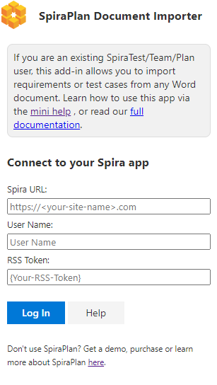
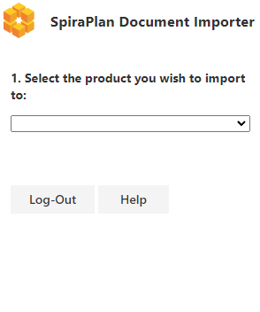
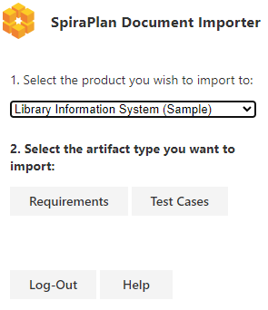
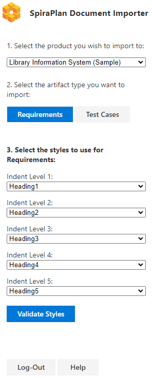
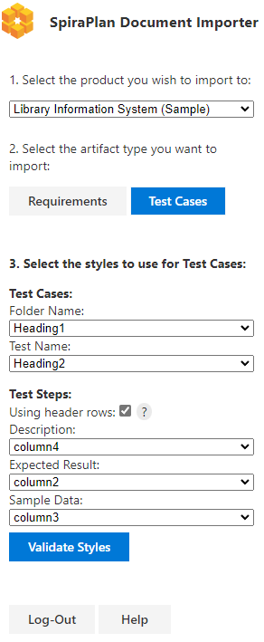

# Importing from Microsoft Word (Office 2019+, iOS, Web)
This add-in lets you import a list of requirements or test cases (with folders and test steps) into any product in your SpiraTest, SpiraTeam, or SpiraPlan application. It lets you specify how your document is organized using its styles and headings so the data added to SpiraPlan will be hierarchically structured in the same way. It supports importing rich text, tables, lists, and images.

This add-in requires:
- a support version of Microsoft Word

    - Word 2019+ (Windows and Mac OS)
    - Word with Office 365 (Windows and Mac OS)
    - Word in the cloud (via a web browser)
    - Word on iPad

- SpiraTest®, SpiraTeam®, or SpiraPlan® application (called SpiraPlan from here on) version 6.3.0.1+

## Installation

To install the add-in:

- Go to the **Insert** tab in Word
- Click on **"Get Add-ins"** and in the window that opens, navigate to the **store** tab
- Search for **"Spira"** or **"SpiraPlan"**
- When you see the correct add-in developed by Inflectra, click on its "Add" button 
- You should now see the SpiraPlan icon labeled "SpiraPlan Document Importer" in your home tab. Click on it to begin.

## Prepare your document
The add-in works with modern Word (docx) documents. The add-in has a number of settings to work flexibly with your existing Word files so that they can be imported into SpiraPlan without any changes. Please note that some preparation of the document may be required in some circumstances if the [styles configuration](#configure-the-styles) does not fully meet your needs.

## Connect to SpiraPlan

You can use this add-in with SpiraTest®, SpiraTeam®, or SpiraPlan®. If you are using Word in the browser, make sure SpiraPlan is accessible over the internet.

When you first open the add-in you will see the connection screen. Fill in the details and click "Log In" to connect the add-in to your SpiraPlan.

* **Spira URL:** The web address that you use to access SpiraPlan® in your browser. This is usually of the form 'http://**company**.spiraservice.net'. Make sure you remove any suffixes from the address (e.g. Default.aspx or "/")
* **Username:** This is the exact same username you use to log in to Spira. (Not Case Sensitive)
* **RSS token:** You can find or generate this from your user profile page inside Spira - "{ExampleRSS}". Make sure to include the curly braces and *make sure to hit Save after generating a new RSS token.*

**If there is a problem connecting to Spira you will be notified with an error message.**

After you have logged in click **Log-out** to close your connection with SpiraPlan and return to the add-in's login page.

## Select a Product

After logging in, first you need to choose the product to import into. The dropdown shows all products you are a member of.

Once you have selected a product, you need to select to either import Requirements or Test Cases. This selection can be changed at any time.

## Configure the styles

Select the styles used in the document which represent either the hierarchy of requirements, or the test case folder names, test case names, and table configuration for test steps. These styles must be selected to match those used in the current document. Your style selections are saved as metadata within the document itself, so next time you open the document, the styles will be pre-populated for you. 

### Requirements
You can select up to 5 indent levels to represent the hierarchical relationship of your requirements in your document. This hierarchy will be replicated when importing into SpiraPlan. Choose the relevant styles that match each indent level. These styles are used as headings for your requirements and will become the requirement names in SpiraPlan

- "Indent Level 1" requirements are fully outdented. 
- "Indent Level 2" requirements are indented and will be the children of the "Indent Level 1" above them
- An "Indent Level 3" requirement is a child of the "Indent Level 2" requirement above it
- And so on for "Indent Level 4" and "Indent Level 5"

Your requirements document must only increase the indent level once per requirement (your document can't have an Indent Level 1 requirement immediately followed by an Indent Level 3 requirement). If the requirements to import do not meet this condition, the add-in will display a relevant error.

### Test Cases
It is common to organize test cases into groups or headings in your document. The add-in support 1 level of groupings and these will get converted into root level test case folders in SpiraPlan. Test case folder descriptions (text immediately below the folder heading in Word) will also be added to SpiraPlan

Select the style that matches your heading used to organize test cases into folders. Then select the style that matches the heading used for your test case names. Any test cases after that heading will be added into that folder. If there is already a folder with that name in SpiraPlan at the root level (case sensitive), relevant test cases will be added to that existing test case folder (in other words, a duplicate test case folder will not be created).

Test cases and their descriptions will be imported into SpiraPlan. Test step information will also be imported if present. 

Test steps need to be in a table inside the relevant test case with rows for each test step. If the test case description has more than one table in it, the last table is assumed to be the one that contains the test steps. The other tables will not be imported into SpiraPlan at all.

The add-in supports tables with or without header rows. Use the "Using header rows" option to toggle between removing the first row (because it has table headers) or sending the first row as a test step. Select which columns match with each test step field. 

Test step table rows with an empty description will get a default description added, and empty rows are ignored. If the table cannot be properly parsed to import into SpiraPlan an error will be shown. This can happen, for example, if a table does not have a description column at all, or the description column is completely blank, or the whole table is empty. 

### Validate Styles
Once the configuration / selection of the styles is complete, click the "Validate Styles" button. This will check the document against your selections to make sure that there are no obvious problems. If there are you will see a popup with an explanation.

Once the validation is complete you will be able to start the import process.

## Importing into SpiraPlan
By default, the add-in imports your entire document into SpiraPlan, based on your setup as described above.

If you want, you can also choose exactly what to import by selecting just part of the document (discussed more below). 

Once you have decided what to import, click the "Send to Spira" button. During the import process you will see a popup showing its progress. Note that closing this pop-up will not stop the import process - to do that you will need to press the cancel button, or close or refresh the add-in (note that this will not un-do any already sent artifacts).

!!! info "Selecting part of a document"
    To send only part of a document:

    - highlight the relevant portion of the document
    - make sure your selection starts with a selected style (eg a heading)

    Make sure no lists within the selection contain styles which are set to any style selector - for instance if Heading 1 is your indent level 1 selection, lists may not contain any Heading 1 text - parsing will throw an error or even crash the add-in depending on the specific instance. 

## Troubleshooting

Documents are often, rich, complex, very long, and have been used for a number of years. Sometimes this means the add-in may struggle to correctly import all relevant artifacts. This can be for a variety of reasons:

- If images are missing in SpiraPlan, your document is likely a "legacy" version - this is discussed in more detail below

!!! warning "How to work with legacy Word documents"
    **Older Word documents (Created or edited in a version of Word 2016 or earlier) may not get imported correctly**
    
    Older versions of Word saved documents in a slightly different format than newer versions. Microsoft add-ins are not able to fully see all parts of these older document formats. Unfortunately, it is hard to know whether your document is in the newer or older format. 
    
    Practically, this means that when working with these older Word documents, the add-in:
    
    - cannot copy across images
    - sometimes lists are not properly handled, with two different lists being exposed to the add-in as a single list by Microsoft

    Currently, the only automatic workaround we can recommend that fixes both of the above issues, is to:

    - upload your document to Google Docs
    - download the Google Docs as a .docx file
    - import that converted (and updated) Word document using the add-in

    There is no way, within Word itself, to update a document to the latest version automatically. If you are not able to use the above method, you may need to manually update all images and lists in your document:

    - **lists**: clear all formatting on the list, then change the paragraphs back into a list
    - **images**: there are two options here 
        
        - Easy but slow: save each image, then replace the images in Word using your modern version of Word
        - Quicker for lots of images but complex. By default, Word will paste images with the setting "Keep source formatting", but this is not what we want, so we have to tell Word to *not* do this.
        
            - cut the image and paste it again in the document
            - press Ctrl OR click on the pop-up with a clipboard on it in the bottom right corner of your image
            - press "U" OR select the "Picture" option in the menu that appears. 
            
            

## Functionality Differences to the Microsoft Word Classic plugin

**What can the Word365 add-in do that the Classic Word add-in cannot?**

* Parse test step tables without removing the first row (the "Using header rows?" option allows you to toggle this)
* Enforce and validate hierarchy rules before sending requirements
* Send Test cases / Requirements without requiring an empty last line under the rest of the selection
* Parse an entire document without selection
* Works not just on Windows but also Mac OS, iPad OS, and on the web

**What can the Classic Word add-in do that the Word365 add-in cannot?**

* Parse images of older formatting styles (Legacy Documents)
* Work with versions of spira older than 6.3.0.1
* Work with versions of Word 2016 or earlier
