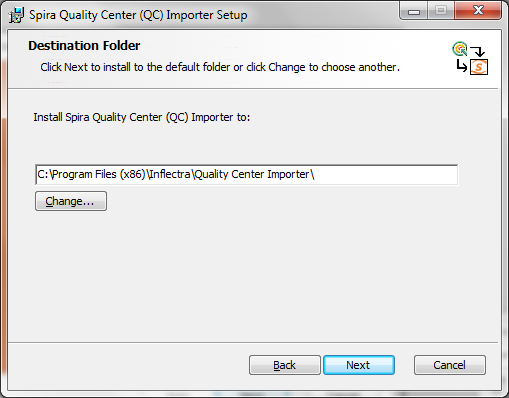
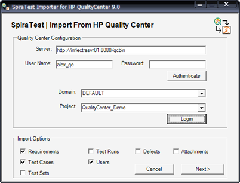
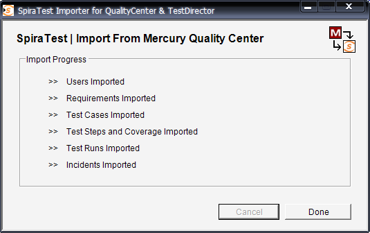

#  Migrating from HP QualityCenter

This section outlines how to use the included Migration Tool for
importing Requirements, Test Cases, Test Runs and Incidents from HP
QualityCenter (formerly known as Mercury TestDirector).

## Installing the QualityCenter Migration Tool

This section outlines how to install the migration tool for
QualityCenter onto a workstation so that you can then migrate whole
projects from QualityCenter to SpiraTest. It assumes that you already
have a working installation of SpiraTest v3.0 or later. If you have an
earlier version of SpiraTest you will need to upgrade to at least v3.0
before trying to migrate projects.

The Windows installation package can be downloaded from the 'Add-Ons &
Downloads" section of the Inflectra website. Once you have obtained the
Windows Installer package, simply double-click on the package to begin
the installation wizard which should display the following welcome page:

 
 

Click the <Next\> button, accept the software license, then click
<Next\> again to choose the folder to install the migration tool to:

 
 

Choose the folder to install to, and then decide whether the application
should be accessible by all users on the workstation or just the current
user. Then click the <Install\> button to start the installation
process. It will confirm if you want to proceed, click <Next\> then
wait for it to finish.

## Using the HP QualityCenter Migration Tool

Now that you have installed the migration tool, you can launch it at any
time by going to Start \> Programs \> SpiraTest \> Tools \>
QualityCenter Importer. This will launch the migration tool application
itself:

 
 

The first thing you need to do is to enter the URL for the instance of
HP QualityCenter that you want to import the information from (typically
of the form http://<server name\>/qcbin) together with a valid username
and password.

Note that the importer has only been tested against version 9.0 of
Quality Center or later. It may not work correctly against previous
versions. Once you have entered this information, click the
<Authenticate\> button and the list of possible domains and projects
will be populated.

Select the QualityCenter domain and project that you want to ***import
from*** and click the <Login\> button:

 
 

Assuming that the user name selected has permission to access this
project, you will be prompted with a message box indicating that the
login was successful. Now choose the types of artifact you want to
import and then click the <Next\> button to move to the next page in
the import wizard:

 
 

This page allows you to enter the URL, user name and password that you
want to use to access the instance of SpiraTest that you want to
***import to*** and click <Login\>. Typically the URL is of the form
(http://<server name\>/SpiraTest). The version of the importer being
used must be compatible with the version of SpiraTest you're importing
into; if not you will receive an error message.

Assuming that the login was successful, click the <Start Import\>
button to actually begin the process of importing the various artifacts
from QualityCenter into SpiraTest. Note that the importer will
automatically create a new project in SpiraTest to hold all the
artifacts with the same name as that used in QualityCenter.

 
 

During the import process, as each of the types of artifact are
imported, the progress display will change (as illustrated above). Once
the import has finished, you will receive a message to that effect and
the <Done\> button will be enabled. Clicking this button closed the
importer. You should now log into SpiraTest using the same user name and
password that was used for the import to view the imported project.

The migration tool will import the following artifacts:

Users (but not their roles and permissions)

Requirements

Test Cases and their associated manual design steps (but not any
automated test scripts)

Test Runs and their associated manual test steps

Test Sets and the association with the test cases

Defects, together with their associated lists of priorities and statuses

The coverage relationship between requirements and test cases

The linkages between any defects and test runs

The first ten (10) user-defined fields on each of the above artifact
types.

Any attachments associated with the requirements, test cases, test sets
or design steps.

*Note: Once you have migrated a project into SpiraTest you will have the
definitions of incident priorities and statuses from both SpiraTest and
QualityCenter (this is because QualityCenter doesn't use the same codes
as SpiraTest, so they will be imported). You should go back in to the
Administration screen and make all the SpiraTest statuses and priorities
inactive.*

