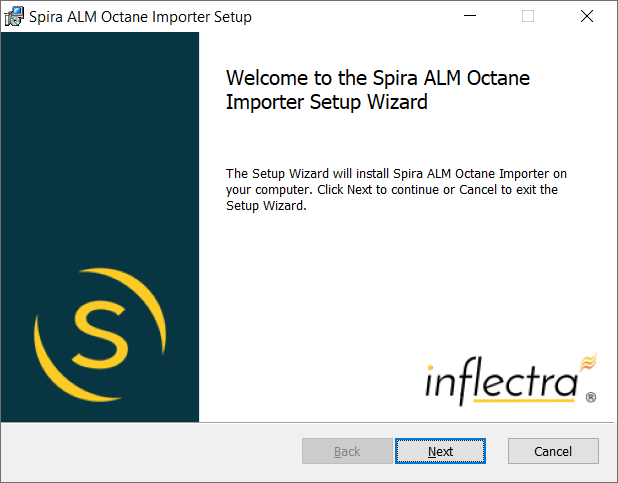
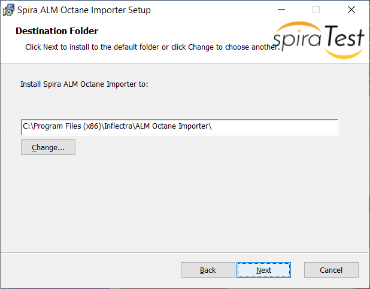
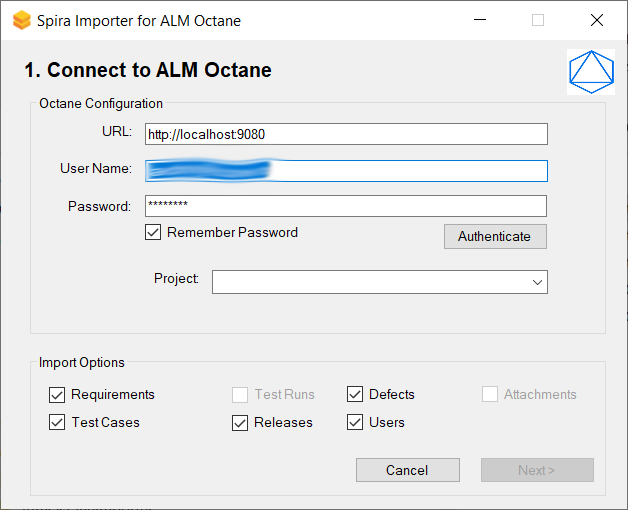
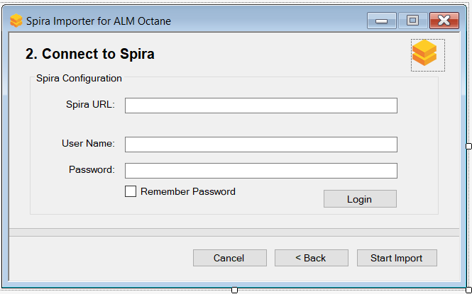
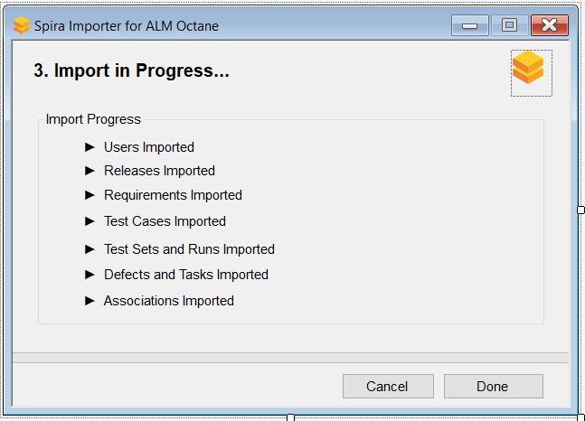
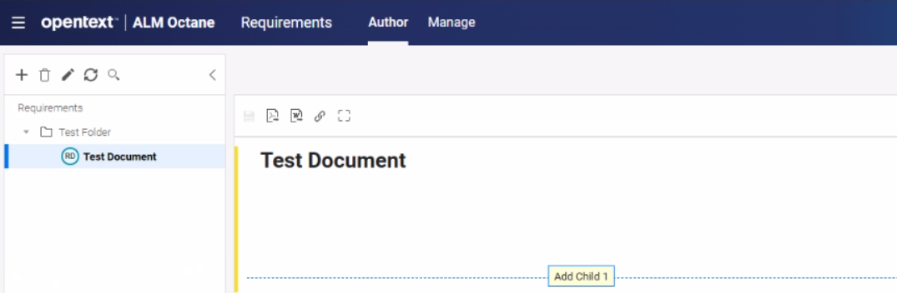
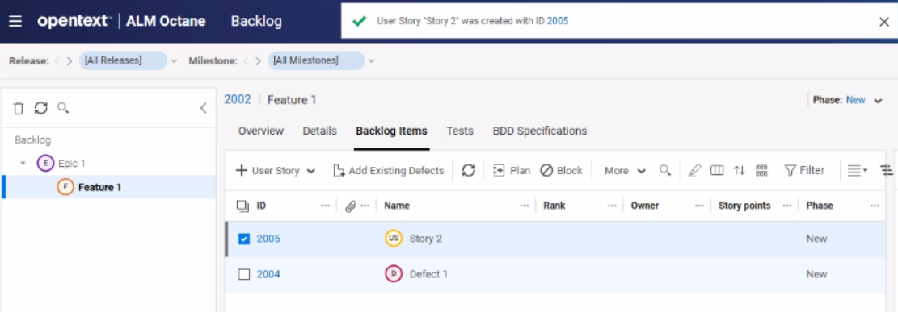
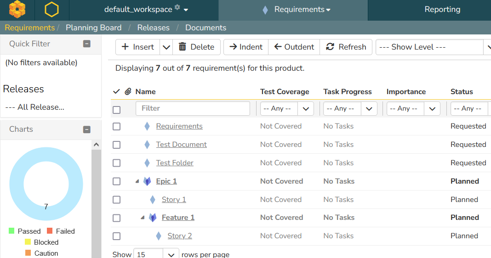
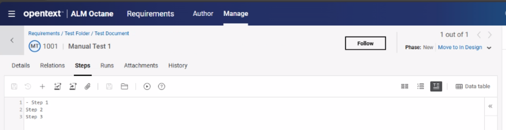
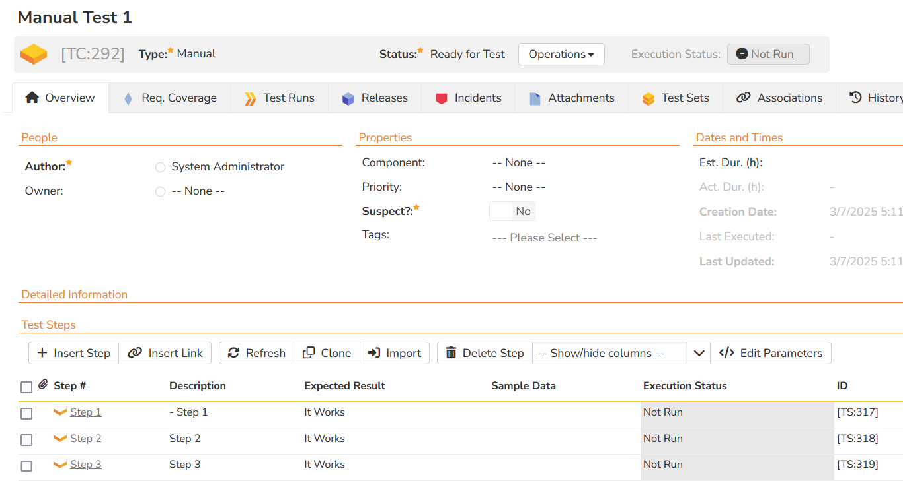

#  Migrating from ALM Octane
!!! abstract "Compatible with SpiraTest, SpiraTeam, SpiraPlan"

This page outlines how to use the ALM Octane Migration Tool to import projects from OpenText ALM Octane into Spira.

Note that this should not be confused with "traditional" **OpenText ALM**, which has its own, [separate migration tool](./Migrating-from-HP-ALM.md).

!!! info "What can be imported from ALM Octane?"
    The migration tool will currently import the following artifacts:

    - Users (but not their roles and permissions)
    - Releases
    - Sprints
    - Requirements
    - Backlog items
    - Defects
    - Tasks
    - Tests
    - Test steps
    - Test suites
    
## Installing the ALM Octane Migration Tool
To get started, you will need to install the migration tool onto a workstation that can access both your ALM Octane server, and your Spira application. You must already have a working installation of Spira v8.0 or later and a recent version of ALM Octane.

The Windows installation package can be downloaded from the "Add-Ons & Downloads" section of the Inflectra website. Once you have obtained the Windows Installer package, simply double-click on the package to begin the installation wizard which should display the following welcome page:

 

Click the `Next` button, accept the software license, then click `Next` again to choose the folder to install the migration tool to:

 
 
Choose the folder to install to, and then decide whether the application should be accessible by all users on the workstation or just the current user. Then click the `Install` button to start the installation process. It will confirm if you want to proceed, click `Next` then wait for it to finish.

## Using the ALM Octane Migration Tool

### Connecting to ALM Octane and choosing artifacts
Now that you have installed the migration tool, you can launch it at any time by going to Start \> Programs \> Inflectra \> SpiraTest \> Tools \> ALM Octane Importer. This will launch the migration tool application itself:

 

The first thing you need to do is to enter the URL for the instance of ALM Octane that you want to import the information from (typically of the form `http://server-name:9080`) together with a valid username and password.

Once you have entered this information, click the `Authenticate` button and the list of possible domains and projects will be populated. Select the HP ALM domain and project that you want to ***import from*** and click the `Login` button. If the user has permission to access this project, you will be see a message that the login was successful. 

Choose the types of artifact you want to import and then click the `Next` button to move to the next page in the import wizard:

### Connecting to Spira and choosing options

 
 
This page allows you to enter the URL, user name and password that you want to use to access the instance of Spira that you want to ***import to*** and click `Login`. Typically the URL is of the form (`https://mycompany.spiraservice.net`). The version of the importer being used must be compatible with the version of Spira you're importing into; if not you will receive an error message.

Click the `Start Import` button to begin the process of importing the various artifacts from ALM Octane into Spira. Note that the importer will automatically create a new project in Spira to hold all the artifacts with the same name as that used in ALM Octane.

### Import progress

 

During the import process, as each of the types of artifact are imported, the progress display will change (as illustrated above).

Once the import has finished, you will receive a message to that effect and the `Done` button will be enabled. Clicking this button will close the importer. You should now log into Spira using the same user name and password that was used for the import to view the imported project.

## What is Imported?

The migration tool will import the following ALM Octane items:

- Users (but not their roles and permissions)
- Releases
- Sprints
- Requirements
- Backlog items
- Defects
- Tasks
- Tests
- Test steps
- Test suites

The following sections provide some additional notes on how artifacts are migrated.

### Requirements

The ALM Octane requirements:

 

 and the ALM Octane Backlog Items:

 

are both imported as Spira requirements:

 

### Test Cases

The ALM Octane test cases include a single field that contains all of the test steps separated by newlines:

 

These test cases are imported into Spira such that the test steps are decomposed from this single field into discrete Spira test steps:

 
 
