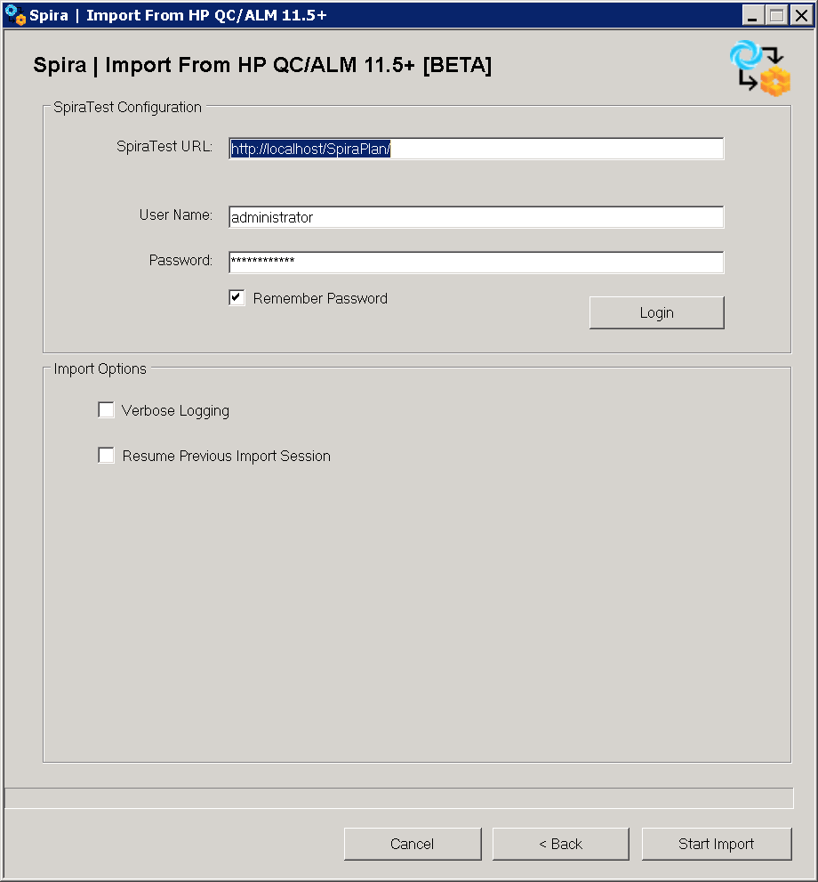

#  Migrating from HP ALM

This section outlines how to use the included Migration Tool for importing Releases, Hosts, Requirements, Test Cases, Test Runs and Incidents from HP ALM (formerly known as HP Quality Center).

## Installing the HP ALM Migration Tool

This section outlines how to install the migration tool for HP ALM onto a workstation so that you can then migrate whole projects from HP ALM to either SpiraTest or SpiraTeam (hereafter referred to as SpiraTest). It assumes that you already have a working installation of SpiraTest v4.0 or later and a working version of HP ALM 11.5 or later. If you have an earlier version of SpiraTest you will need to upgrade to at least v4.0 before trying to migrate projects. If you are using HP QualityCenter 10.0 or older, please refer to the migration tool for this version in
[Using the HP QualityCenter Migration Tool](#using-the-hp-qualitycenter-migration-tool).

The Windows installation package can be downloaded from the 'Add-Ons & Downloads" section of the Inflectra website. Once you have obtained the Windows Installer package, simply double-click on the package to begin the installation wizard which should display the following welcome page:

 

Click the <Next\> button, accept the software license, then click <Next\> again to choose the folder to install the migration tool to:

 
 
Choose the folder to install to, and then decide whether the application should be accessible by all users on the workstation or just the current user. Then click the <Install\> button to start the installation process. It will confirm if you want to proceed, click <Next\> then wait for it to finish.

## Using the HP QualityCenter Migration Tool

Now that you have installed the migration tool, you can launch it at any time by going to Start \> Programs \> Inflectra \> SpiraTest \> Tools \> HP ALM Importer. This will launch the migration tool application itself:

The first thing you need to do is to enter the URL for the instance of HP ALM that you want to import the information from (typically of the form http://<server name\>/qcbin) together with a valid username and password.

Once you have entered this information, click the <Authenticate\> button and the list of possible domains and projects will be populated. Select the HP ALM domain and project that you want to ***import from*** and click the <Login\> button.

Assuming that the user name selected has permission to access this project, you will be prompted with a message box indicating that the login was successful. Assuming this is a new import session, i.e. you are not restoring a previous session, choose the types of artifact you want to import and then click the <Next\> button to move to the next page in the import wizard:

 
 
This page allows you to enter the URL, user name and password that you want to use to access the instance of SpiraTest that you want to ***import to*** and click <Login\>. Typically the URL is of the form (http://<server name\>/SpiraTest). The version of the importer being used must be compatible with the version of SpiraTest you're importing into; if not you will receive an error message.

On this screen, you can check 'Verbose Logging' to add more log entries to the session log, which will be saved on the computer's Desktop directory. The 'Resume Previous Import Session' option is explained in the [next topic](#restoring-a-failed-or-canceled-session).

Assuming that the login was successful, click the <Start Import\> button to actually begin the process of importing the various artifacts from HP ALM into SpiraTest. Note that the importer will automatically create a new project in SpiraTest to hold all the artifacts with the same name as that used in HP ALM.

 
 
During the import process, the importer shows the current session identifier (which is part of the session log name), as well as the progress and estimated remaining time for every artifact. The Event History at the bottom logs important events of the session. As each of the types of artifact are imported, the progress display will change (as illustrated above). Once the import has finished, you will receive a message to that effect and the <Done\> button will be enabled. Clicking this button closes the importer. You can also cancel the importing session at any time by clicking on 'Cancel and Close'. You should now log into SpiraTest using the same username and password that was used for the import to view the imported project.

The migration tool will import the following artifacts:

- Custom Properties and Custom Lists
- Users (but not their roles and permissions)
- Releases
- Requirements
- Automation Hosts
- Test Cases and their associated manual design steps (but not any automated test scripts)
- Test Runs and their associated manual test steps
- Test Sets and the association with the test cases
- Defects, together with their associated lists of priorities and statuses
- The coverage relationship between requirements and test cases
- The linkages between any defects and test runs
- Any attachments associated with the requirements, test cases, test sets or design steps.

*Note: Once you have migrated a project into SpiraTest you will have the definitions of incident priorities and statuses from both SpiraTest and HP ALM (this is because HP ALM doesn't use the same codes as SpiraTest, so they will be imported).*

*You should go back in to the Administration screen and make all the standard SpiraTest statuses and priorities inactive, and then create a new incident workflow using the imported HP ALM statuses.*

## Restoring a failed or canceled Session

You can continue importing artifacts from a previous session that failed for any reason or that was canceled by the user, at any point. To do this, provide your ALM credentials normally on the first screen (you can ignore the artifact selection) and hit 'Next'. On the second screen, provide your Spira credentials and check 'Resume Previous Import Session'. Click on the 'Import Session File' button. You should see then a list of previous session folders (if not, point it to <i>[ApplicationData]\Spira_ALM_QC_Importer_Sessions</i>). 
Select the folder > header.log file that corresponds to the session being restored, based on the date and time of it:

You should see then the identification of the session, followed by the artifacts previously selected for it:

At this point, you can add or remove artifacts from the session. Please note that artifacts that already started importing won't be available for selection. In our example, only Test Runs and Users are available to be included. Since we didn't select Attachments originally, we can now include them for the <u>new</u> artifacts - unselecting it won't remove attachments already imported to Spira. Press 'Start Import' and wait a few seconds until the program loads the previous session data and continues from the point it stopped previously:

Wait until the import session successfully ends. If for any reason, the importer fails or you canceled this import session, the next time you want to continue, please select it as the restoring session (instead of the first one). In other words, <u>always select the most recent session</u>. Otherwise, errors and duplicate data may occur, as some of the artifacts were already imported.