# Migrating from IBM Rational Quality Manager (RQM)

This section outlines how to use the free Migration Tool for importing test plans, test cases, test suites, test scripts and test executions from IBM Rational Quality Manager (RQM) into Spira (SpiraTest, SpiraTeam or SpiraPlan).

## Installing the RQM Migration Tool

This section outlines how to install the migration tool for RQM onto a workstation so that you can then migrate whole projects from RQM to Spira. It assumes that you already have a working installation of Spira v6.0 or later and a live instance of RQM to migrate from. If you have an earlier version of Spira you will need to upgrade to at least v6.0 before trying to migrate projects.

The Windows installation package can be downloaded from the 'Add-Ons & Downloads" section of the Inflectra website. Once you have obtained the Windows Installer package, simply double-click on the package to begin the installation wizard which should display the following welcome page:

 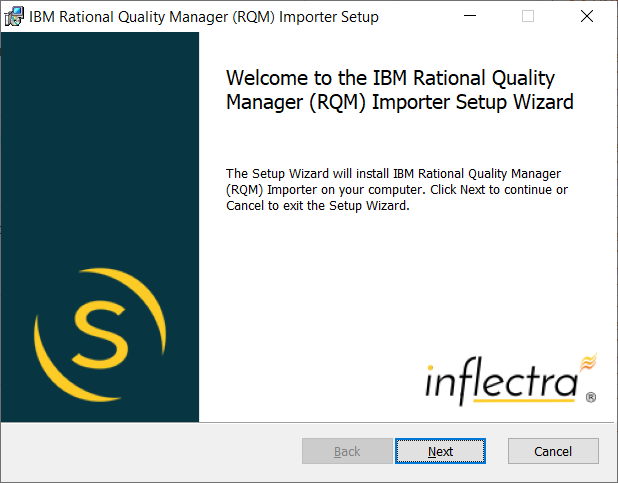  

Click the <Next\> button, accept the software license, then click <Next\> again to choose the folder to install the migration tool to:

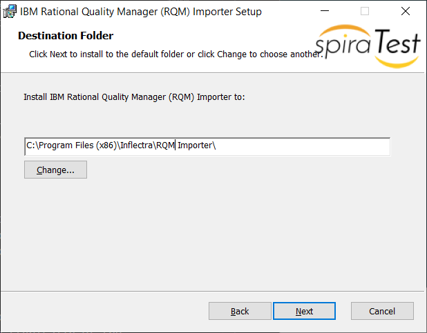

Choose the folder to install to, and then decide whether the application should be accessible by all users on the workstation or just the current user. Then click the <Install\> button to start the installation process. It will confirm if you want to proceed, click <Next\> then wait for it to finish.

## Using the RQM Migration Tool

Now that you have installed the migration tool, you can launch it at any time by going to Start \> Programs \> Inflectra \> SpiraTest \> Tools \> IBM RQM Importer. This will launch the migration tool application itself:

 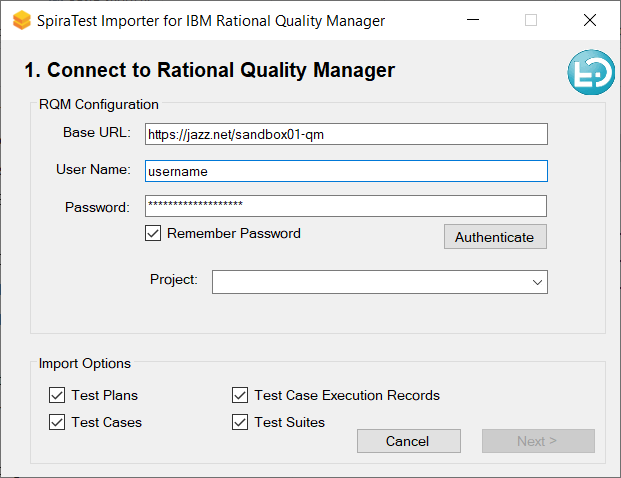  

The first thing you need to do is to enter the URL for the instance of RQM that you want to import the information from (typically of the form https://jazz.net/mycompany) together with a valid username and password.

Once you have entered this information, click the <Authenticate\> button and the list of projects will be populated. Select the RQM project that you want to ***import from*** You can also choose to not import certain artifacts from RQM (e.g. test executions, etc.) then click the <Next\> button to move to the next page in the import wizard:

 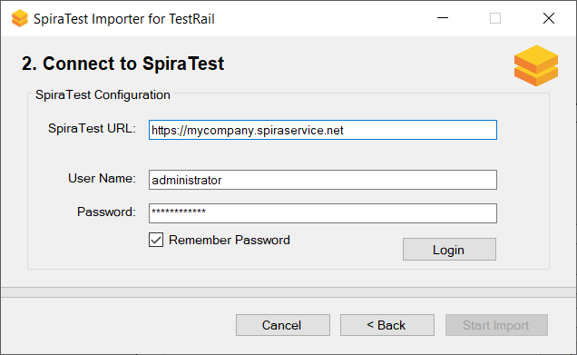  

This page allows you to enter the URL, user name and password that you want to use to access the instance of Spira that you want to ***import to*** and click <Login\>. Typically, the URL is of the form (https://xxxx.spiraservice.net). The version of the importer being used must be compatible with the version of Spira you're importing into;
if not you will receive an error message.

Assuming that the login was successful, click the <Start Import\> button to actually begin the process of importing the various artifacts from RQM into Spira. Note that the importer will automatically create a new project in Spira to hold all the artifacts with the same name as that used in RQM.

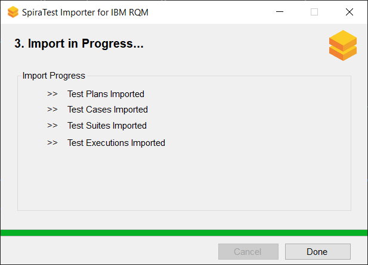

During the import process, as each of the types of artifact are imported, the progress display will change (as illustrated above). Once the import has finished, you will receive a message to that effect and the <Done\> button will be enabled. Clicking this button closed the importer. You should now log into SpiraTest using the same user name and password that was used for the import to view the imported project.

The migration tool will import the following artifacts from RQM:

- The project name and description
- Test plans -> test case folders
- Test scripts -> template test cases with steps
- Test cases -> test cases with linked test steps to the the template test cases
- Test suites -> test sets, linked to test cases
- Test executions -> test runs linked to test cases

*Should the import fail for any reason, there will be a log file created on the Desktop of the person doing the import. The filename is usually:
`Spira_RQM_Import.log`.*

## How The Migration Looks

When you migrate an RQM project to Spira, the data will migrate as described below.

### Test Plans and Test Cases

The test plans and associated test cases from RQM will migrate into Spira test case folders and test cases:

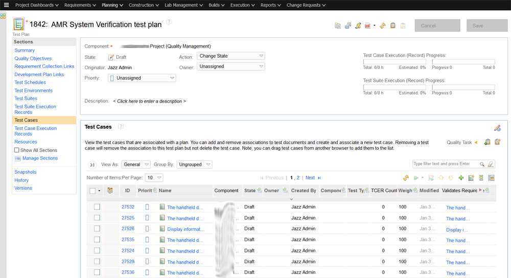

becomes:

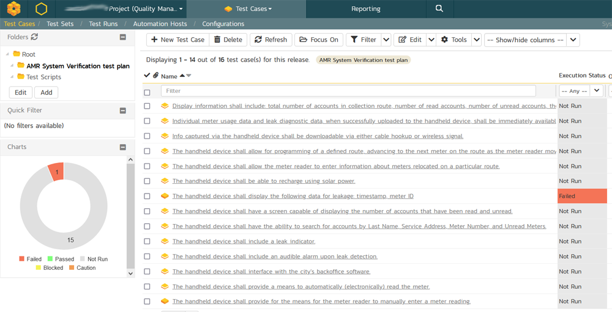

### Test Scripts and Test Steps

The test scripts and associated manual test steps from RQM will migrate into Spira template test cases and test steps:

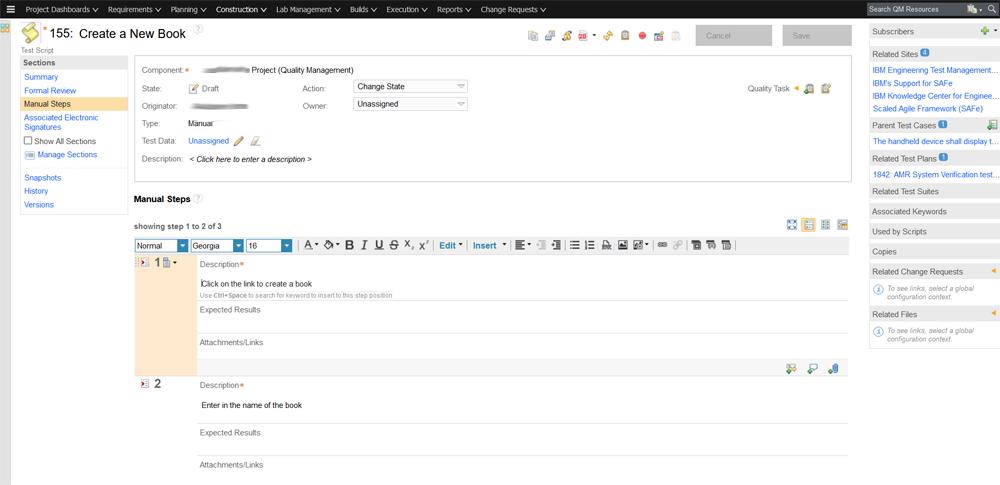

becomes:

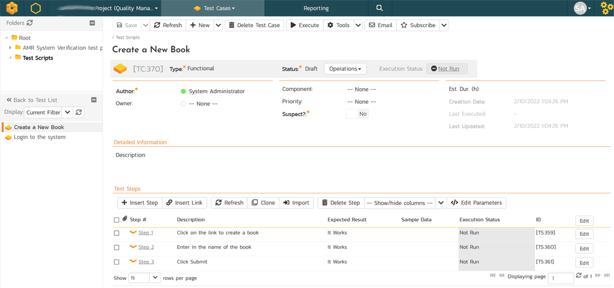

In RQM, the test cases don't contain test steps themselves. Instead, the test case contain references to the test scripts, which contain the test steps.

Therefore when we migrate over the test cases from RQM to Spira, we create linked test cases from the test plan test cases to the test script test cases to maintain these relationships:

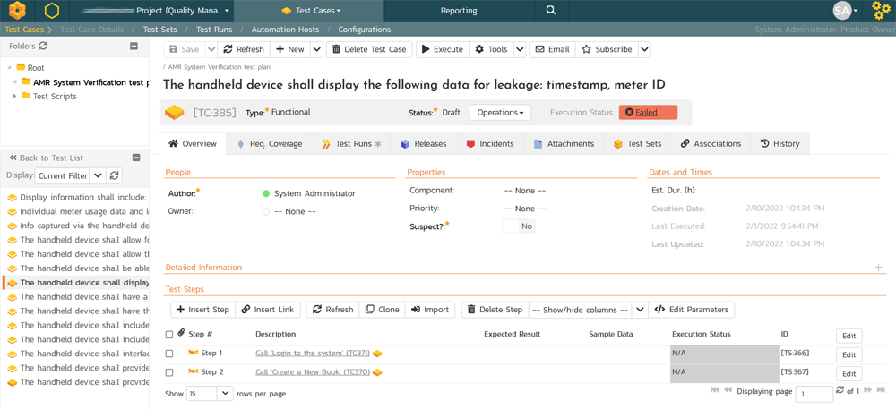

### Test Runs and Test Run Steps

The test executions from RQM contain test steps:

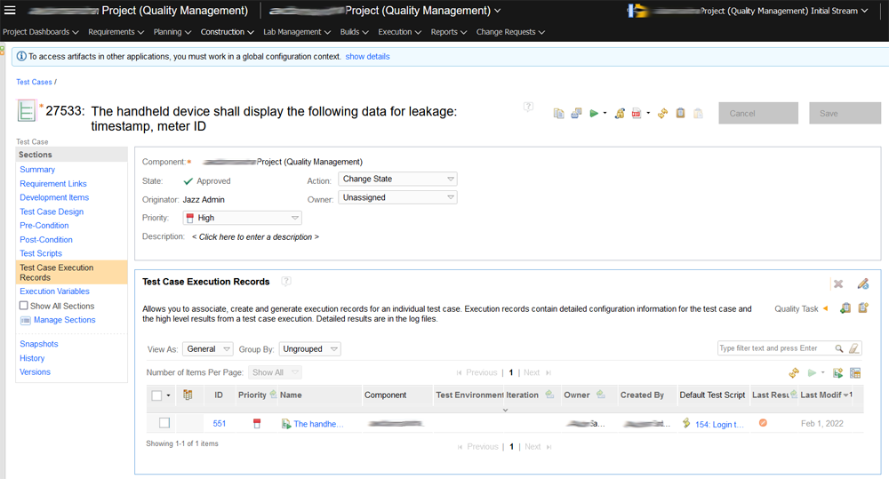

These are migrated over into Spira and test runs and test run steps:

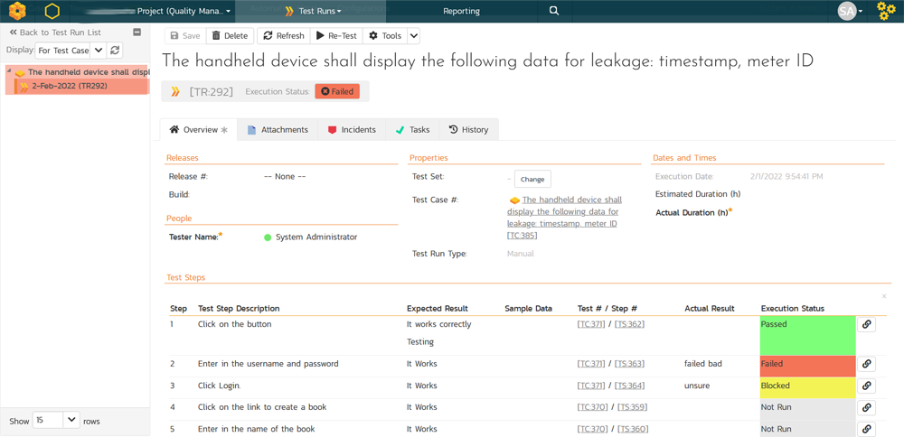