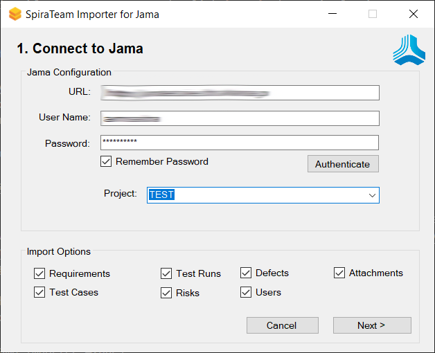

#  Migrating from Jama Connect

This guide explains how to use Inflectra's **Jama Migration Tool** for importing projects, releases, requirements, defects, test cases, test plans, test runs, risks and associated attachments from Jama to Spira from Inflectra. This tool works with both the **cloud** and **on-premise** versions of  Jama.

## Installing the Jama Migration Tool

This guide outlines how to install the migration tool for Jama onto a workstation so that you can then migrate whole projects from Jama to either **SpiraTeam or SpiraPlan** (hereafter referred to as **Spira**). It assumes that you already have a working installation of Spira v8.0 or later and a working version of Jama with an active API license. 

!!! warning "Minimum Version of Spira"
    **You must be on at least Spira 8.0 to use this tool**. If you have an earlier version of Spira you will need to upgrade to at least v8.0 before trying to migrate projects.

The Windows installation package can be downloaded from the 'Add-Ons & Downloads" section of the Inflectra website. Once you have obtained the Windows Installer package, simply double-click on the package to begin the installation wizard which should display the following welcome page:

 

Click the `Next` button, accept the software license, then click `Next` again to choose the folder to install the migration tool to:

 
 
Choose the folder to install to, and then decide whether the application should be accessible by all users on the workstation or just the current user. Then click the `Install` button to start the installation process. It will confirm if you want to proceed, click `Next` then wait for it to finish.

## Using the Jama Migration Tool

Now that you have installed the migration tool, you can launch it at any time by going to Start \> Programs \> Inflectra \> SpiraTeam \> Tools \> Jama Importer. This will launch the migration tool application itself:

### Connecting to Jama

The first thing you need to do is to enter the URL for the instance of Jama that you want to import the information from (typically of the form https://jama.mycompany.com for on-premise and https://mycompany.jamacloud.com for cloud) together with a valid username and password.

Once you have entered this information, click the `Authenticate` button and the list of possible Jama projects will be populated.

Select the Jama project that you want to ***import from***, choose which artifacts you want to import.
The importer currently supports the following:

- **Jama item types**
    - Requirements
    - Test Cases
    - Defects
    - Risks
- **Other Jama artifacts**
    - Attachments
    - Releases
    - Test Plans
    - Test Runs

### Connecting to Spira

 
This page allows you to enter the URL, user name and password (or Api Key if using SSO) that you want to use to access the instance of Spira that you want to ***import to*** and click **Login**. (Typically the URL is of the form https://servername.mycompany.com/SpiraTeam for on-premise and https://myinstance.spiraservice.net for cloud). The version of the importer being used must be compatible with the version of Spira you're importing into; if not you will receive an error message.

Assuming that the login was successful, click the **Next** button to move to the next page in the wizard:

### Mapping Jama Item Types to Spira Artifacts

On this page you will map the different Spira artifacts to the different item types in Jama. Currently, the following artifact types in Spira can be mapped to Jama items:
- **Requirements** (used for most Jama items, including requirements, features, design elements, user stories and use cases)
- **Risks** (used for risks and hazards)
- **Incidents** (used for defects and issues)
- **Test Case** (used for test cases)
- **(Container)** (used for Jama folders, components and sets)

!!! info "Jama Item Mapping"
    To save time, the importer has a default set of item/artifact type mappings that it will apply. These are described in detail in Appendix A.

!!! info "Skipping Item Types"
    If there are any Jama item types you want to skip importing, there is a special Spira *artifact type* called `--- Skip ---`, select this item to skip the item type.

Once you have mapped the artfiacts, click the **Start Import** button to actually begin the process of importing the various artifacts from Jama into Spira.

### Importer Progress

Note that the importer will automatically create a new project in Spira to hold all the artifacts with the same name as that used in Jama.

 
During the import process, as each of the types of artifact are imported, the progress display will change (as illustrated above). Once the import has finished, you will receive a message to that effect and the **Done** button will be enabled. Clicking this button will close the importer. You should now log into Spira using the same user name and password that was used for the import to view the imported project.

## What is Imported?

The migration tool will import the following Jama items:

- Product Definition together with item priorities, types and statuses
- Custom Properties and Custom Lists
- Users (but not their roles and permissions)
- Releases
- Requirements
- Risks
- Defects
- Any attachments, comments, or tags associated with the items
- Test case folders
- Test steps
- Test plans
- Test runs

### Requirements

Any of the Jama item types that are mapped to requirements in Spira:

Will be imported into Spira as types of requirement:

### Risks

Any of the Jama item types that are mapped to risks in Spira will be imported into Spira as types of risk.

### Incidents

Any of the Jama item types that are mapped to incidents in Spira:

Will be imported into Spira as types of incident:

### Test Cases and Test Steps

The test case folders, hierarchy and names are imported together with the test cases:

This is how they will look inside Spira:

The migration tool will migrate Jama test cases that contain test steps:

This is how they will look inside Spira:

### Test Plans and Test Runs

The migration tool will migrate the Jama test plans into Spira as test sets:

The test sets will be imported into a flat list in Spira (that you can organize by folder, post-migration), together with the mapping to the various test cases included in the Jama test plan:

The Jama test runs will be imported into Spira together as Spira test runs. 

## Appendix A: Default Item Mapping

You can configure which items are impored into Spira and which type of Spira artifact they will be represented with. We have implemented the following default mapping to save time.

Unless you know what you are doing, we recommend leaving the mapping alone, apart from skipping any item types you aren't importing.

!!! info "Default Item Mapping"

    | Item Type                                | Category  | Spira Artifact |
    | ---------------------------------------- | --------- | -------------- |
    | Component                                | COMPONENT | (Container)    |
    | Set                                      | SET       | (Container)    |
    | Folder                                   | SECTION   | (Container)    |
    | Text                                     | TEXT      | Requirement    |
    | Feature                                  |           | Requirement    |
    | Requirement                              |           | Requirement    |
    | Use Case                                 |           | Requirement    |
    | Test Case                                | TEST_CASE | Test Case      |
    | OOB Defect                               |           | Incident       |
    | Change Request                           |           | Requirement    |
    | User Story                               |           | Requirement    |
    | Epic                                     |           | Requirement    |
    | Usage Scenario                           |           | Requirement    |
    | Standard                                 |           | Requirement    |
    | Strategic Theme                          |           | Requirement    |
    | Portfolio Epic                           |           | Requirement    |
    | Information                              |           | Requirement    |
    | Semi / Integrated System Use Case        |           | Requirement    |
    | Stakeholder Requirement                  |           | Requirement    |
    | Validation Test Case                     |           | Test Case      |
    | IC Requirement                           |           | Requirement    |
    | Product Description                      |           | Requirement    |
    | Product Rating                           |           | Requirement    |
    | Product Characteristic                   |           | Requirement    |
    | Pin Description                          |           | Requirement    |
    | Register Block                           |           | Requirement    |
    | Register Description                     |           | Requirement    |
    | Package Specification                    |           | Requirement    |
    | System Architecture                      |           | Requirement    |
    | Subsystem Verification                   | TEST_CASE | Test Case      |
    | Business Requirement                     |           | Requirement    |
    | Functional Requirement                   |           | Requirement    |
    | Non-Functional Requirement               |           | Requirement    |
    | Transition Requirement                   |           | Requirement    |
    | Tracking Item                            |           | Requirement    |
    | Stakeholder                              |           | Requirement    |
    | Risk                                     |           | Risk           |
    | Glossary Term                            |           | Requirement    |
    | Document for Analysis                    |           | Requirement    |
    | Model                                    |           | Requirement    |
    | Data Dictionary Element                  |           | Requirement    |
    | Interview Note                           |           | Requirement    |
    | Lesson Learned                           |           | Requirement    |
    | Key Performance Indicator (KPI - Metric) |           | Requirement    |
    | Analysis Item                            |           | Requirement    |
    | Persona                                  |           | Requirement    |
    | Business Rule                            |           | Requirement    |
    | System Requirement                       |           | Requirement    |
    | Subsystem Requirement                    |           | Requirement    |
    | Validation                               | TEST_CASE | Test Case      |
    | Verification                             | TEST_CASE | Test Case      |
    | Risk                                     |           | Risk           |
    | Hazard                                   |           | Risk           |
    | Program Epic                             |           | Requirement    |
    | Design Description                       |           | Requirement    |
    | User Need                                |           | Requirement    |
    | IC Block Requirement                     |           | Requirement    |
    | Capability                               |           | Requirement    |
    | Value Stream Epic                        |           | Requirement    |
    | Datasheet Item                           |           | Requirement    |
    | Item Description                         |           | Requirement    |
    | Automotive System Requirement            |           | Requirement    |
    | Safety Goal                              |           | Requirement    |
    | Automotive Hazard                        |           | Requirement    |
    | Automotive Subsystem Requirement         |           | Requirement    |
    | Automotive Stakeholder Requirement       |           | Requirement    |
    | Operational Requirement                  |           | Requirement    |
    | Mission Need                             |           | Requirement    |
    | Program Increment                        |           | Requirement    |
    | PI Objective                             |           | Requirement    |
    | Team                                     |           | Requirement    |
    | High Level Requirement                   |           | Requirement    |
    | Low Level Requirement                    |           | Requirement    |
    | Code                                     |           | Requirement    |
    | Technical Reference Content              |           | Requirement    |
    | Technical Safety Requirement             |           | Requirement    |
    | Subsystem Safety Requirement             |           | Requirement    |
    | BPM / Requirement                        |           | Requirement    |
    | Functional Design                        |           | Requirement    |
    | Technical Design                         |           | Requirement    |
    | Release Item                             |           | Requirement    |
    | SIT                                      | TEST_CASE | Test Case      |
    | UAT                                      | TEST_CASE | Test Case      |
    | Flow / Model                             |           | Requirement    |
    | Reporting Functional Design              |           | Requirement    |
    | Reporting BPM / Requirement              |           | Requirement    |
    | Meeting Minutes                          |           | Requirement    |
    | Defect                                   |           | Incident       |
    | Reporting Functional Design              |           | Requirement    |
    | Reporting BPM / Requirement              |           | Requirement    |
    | Meeting Minutes                          |           | Requirement    |
    | IE Requirement                           |           | Requirement    |
    | Design Artifact                          |           | Requirement    |
    | Demo Requirement                         |           | Requirement    |
    | RPT_Test Management                      | TEST_CASE | Test Case      |