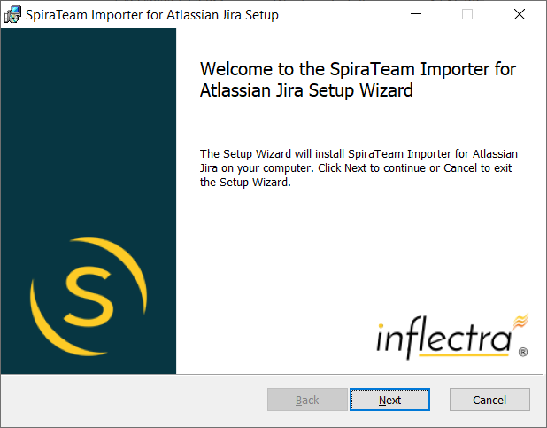
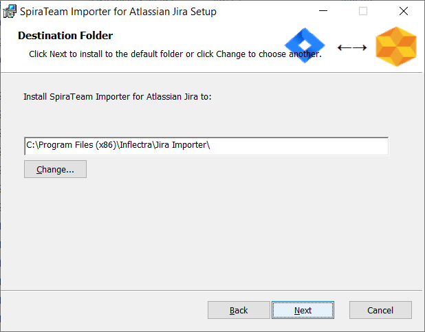
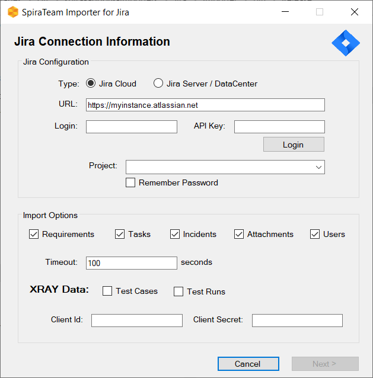
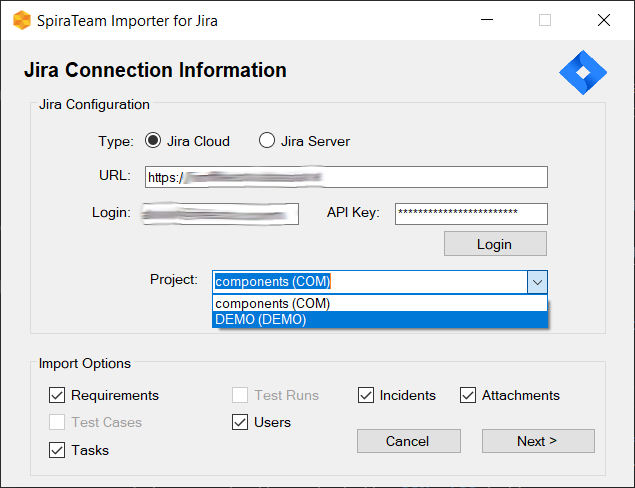

#  Migrating from Atlassian Jira

This section outlines how to use the included Migration Tool for importing projects, versions, requirements, issues, tasks and associated attachments from Atlassian Jira to SpiraTeam.

*Note: This migration tool works with Jira Cloud, Server and Data Center editions.*

## Installing the Jira Migration Tool

This section outlines how to install the migration tool for Jira onto a workstation so that you can then migrate whole projects from Jira to either SpiraTeam or SpiraPlan (hereafter referred to as SpiraTeam). It assumes that you already have a working installation of SpiraTeam v6.0 or later and a working version of Jira Cloud, Server or Data Center. If you have an earlier version of SpiraTeam you will need to upgrade to at least v6.0 before trying to migrate projects.

The Windows installation package can be downloaded from the 'Add-Ons & Downloads" section of the Inflectra website. Once you have obtained the Windows Installer package, simply double-click on the package to begin the installation wizard which should display the following welcome page:

 

Click the <Next\> button, accept the software license, then click <Next\> again to choose the folder to install the migration tool to:

 
 
Choose the folder to install to, and then decide whether the application should be accessible by all users on the workstation or just the current user. Then click the <Install\> button to start the installation process. It will confirm if you want to proceed, click <Next\> then wait for it to finish.

## Using the Jira Migration Tool

Now that you have installed the migration tool, you can launch it at any time by going to Start \> Programs \> Inflectra \> SpiraTeam \> Tools \> Jira Importer. This will launch the migration tool application itself:

The first thing you need to do is to enter the URL for the instance of Jira that you want to import the information from (typically of the form http://servername/jira for on-premise and https://myinstance.atlassian.net for cloud) together with a valid username and password (or API Key if using Jira Cloud).

Once you have entered this information, click the **Login** button and the list of possible Jira projects will be populated.

Select the Jira project that you want to ***import from***, choose which artifacts (requirements, tasks incidents, users, attachments, etc.) you want to import, then click the **Next** button to move to the next page in the import wizard.

 
 
This page allows you to enter the URL, user name and password that you want to use to access the instance of SpiraTeam that you want to ***import to*** and click <Login\>. Typically the URL is of the form (http://<server name\>/SpiraTeam). The version of the importer being used must be compatible with the version of SpiraTeam you're importing into; if not you will receive an error message.

Assuming that the login was successful, click the <Start Import\> button to actually begin the process of importing the various artifacts from HP ALM into SpiraTeam. Note that the importer will automatically create a new project in SpiraTeam to hold all the artifacts with the same name as that used in HP ALM.

 
 
During the import process, as each of the types of artifact are imported, the progress display will change (as illustrated above). Once the import has finished, you will receive a message to that effect and the <Done\> button will be enabled. Clicking this button closed the importer. You should now log into SpiraTeam using the same user name and password that was used for the import to view the imported project.

The migration tool will import the following artifacts:

- Custom Properties and Custom Lists
- Users (but not their roles and permissions)
- Releases
- Requirements
- Automation Hosts
- Test Cases and their associated manual design steps (but not any automated test scripts)
- Test Runs and their associated manual test steps
- Test Sets and the association with the test cases
- Defects, together with their associated lists of priorities and statuses
- The coverage relationship between requirements and test cases
- The linkages between any defects and test runs
- Any attachments associated with the requirements, test cases, test sets or design steps.

*Note: Once you have migrated a project into SpiraTeam you will have the definitions of incident priorities and statuses from both SpiraTeam and HP ALM (this is because HP ALM doesn't use the same codes as SpiraTeam, so they will be imported).*

*You should go back in to the Administration screen and make all the standard SpiraTeam statuses and priorities inactive, and then create a new incident workflow using the imported HP ALM statuses.*