#  Migrating from Atlassian Jira

This section outlines how to use the included Migration Tool for importing projects, versions, requirements, issues, tasks and associated attachments from Atlassian Jira to SpiraTeam.

*Note: This migration tool works with Jira Cloud, Server and Data Center editions.*

## Installing the Jira Migration Tool

This section outlines how to install the migration tool for Jira onto a workstation so that you can then migrate whole projects from Jira to either SpiraTeam or SpiraPlan (hereafter referred to as SpiraTeam). It assumes that you already have a working installation of SpiraTeam v6.0 or later and a working version of Jira Cloud, Server or Data Center. 

!!! warning "Minimum Version of Spira"
    **You must be on at least SpiraTeam 6.13 to use this tool**. If you have an earlier version of SpiraTeam you will need to upgrade to at least v6.13 before trying to migrate projects.

The Windows installation package can be downloaded from the 'Add-Ons & Downloads" section of the Inflectra website. Once you have obtained the Windows Installer package, simply double-click on the package to begin the installation wizard which should display the following welcome page:

 

Click the <Next\> button, accept the software license, then click <Next\> again to choose the folder to install the migration tool to:

 
 
Choose the folder to install to, and then decide whether the application should be accessible by all users on the workstation or just the current user. Then click the <Install\> button to start the installation process. It will confirm if you want to proceed, click <Next\> then wait for it to finish.

## Using the Jira Migration Tool

Now that you have installed the migration tool, you can launch it at any time by going to Start \> Programs \> Inflectra \> SpiraTeam \> Tools \> Jira Importer. This will launch the migration tool application itself:

### Connecting to Jira

The first thing you need to do is to enter the URL for the instance of Jira that you want to import the information from (typically of the form http://servername/jira for on-premise and https://myinstance.atlassian.net for cloud) together with a valid username and password (or API Key if using Jira Cloud).

Once you have entered this information, click the **Login** button and the list of possible Jira projects will be populated.

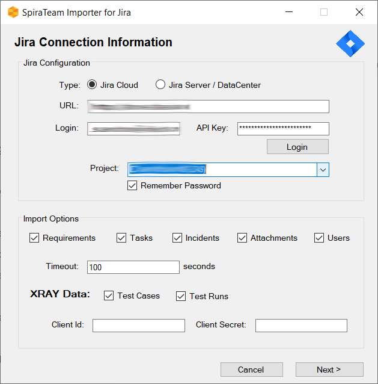

Select the Jira project that you want to ***import from***, choose which artifacts (requirements, tasks incidents, users, attachments, etc.) you want to import, then click the **Next** button to move to the next page in the import wizard.

### Connecting to SpiraTeam

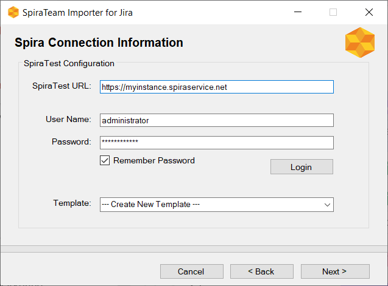
 
This page allows you to enter the URL, user name and password (or Api Key if using SSO) that you want to use to access the instance of SpiraTeam that you want to ***import to*** and click **Login**. (Typically the URL is of the form http://servername/SpiraTeam for on-premise and https://myinstance.spiraservice.net for cloud). The version of the importer being used must be compatible with the version of SpiraTeam you're importing into; if not you will receive an error message.

Assuming that the login was successful, next choose the product template that you want the imported project to use. You can also select the option to '--- Create New Template ---' instead, which will instruct the importer to create a brand new product template for the import.
*We recommend this option for test imports to avoid affecting any production templates*

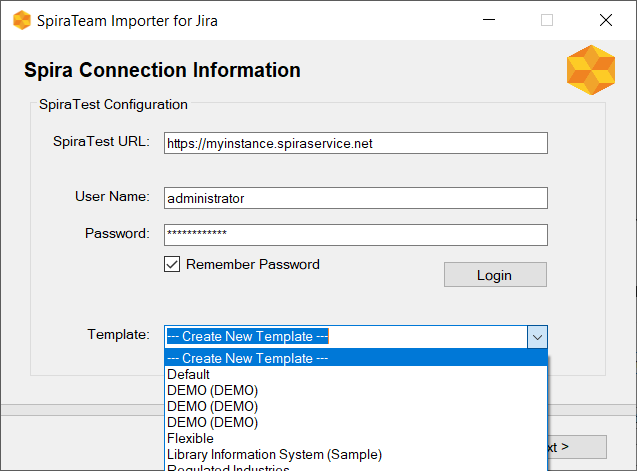

Once you have chosen the template, click the **Next** button to move to the next page in the wizard:

### Mapping Jira Issues Types to SpiraTeam Artifacts

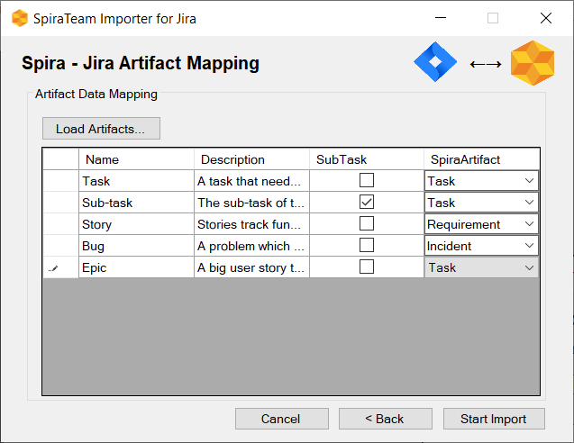

On this page you will map the different SpiraTeam artifacts to the different issue types in Jira. Currently, the following artifact types in SpiraTeam can be mapped to Jira issues:
- **Requirements** (used for user stories, features, epics, etc.)
- **Tasks** (used for tasks and sub-tasks)
- **Incidents** (used for all other issue types such as bugs, defects, issues)

Once you have mapped the artfiacts, click the **Start Import** button to actually begin the process of importing the various artifacts from Jira into SpiraTeam.

### Importer Progress

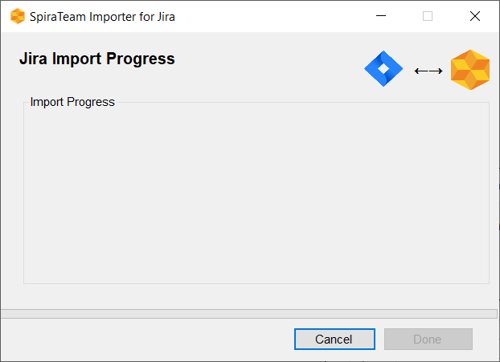

Note that the importer will automatically create a new project in SpiraTeam to hold all the artifacts with the same name as that used in Jira.

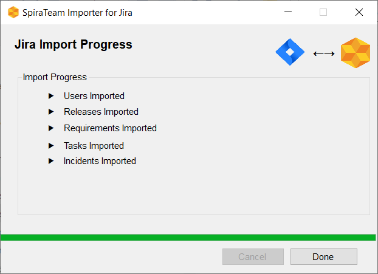
 
During the import process, as each of the types of artifact are imported, the progress display will change (as illustrated above). Once the import has finished, you will receive a message to that effect and the **Done** button will be enabled. Clicking this button will close the importer. You should now log into SpiraTeam using the same user name and password that was used for the import to view the imported project.

## What is Imported?

The migration tool will import the following artifacts:

- Product Definition together with components, priorities, types and statuses
- Custom Properties and Custom Lists
- Users (but not their roles and permissions)
- Releases
- Requirements
- Tasks
- Incidents, together with their associated lists of priorities and statuses
- Any attachments associated with the requirements, tasks and incidents

### Requirements

Any of the Jira issue types that are mapped to requirements in SpiraTeam:

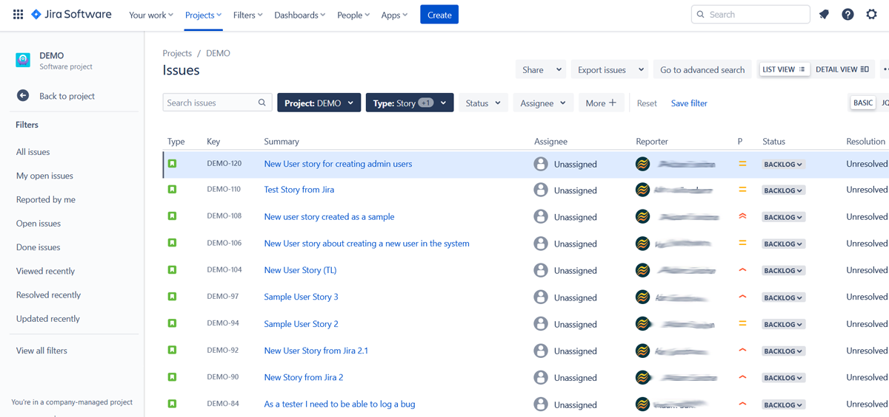

Will be imported into SpiraTeam as types of requirement:

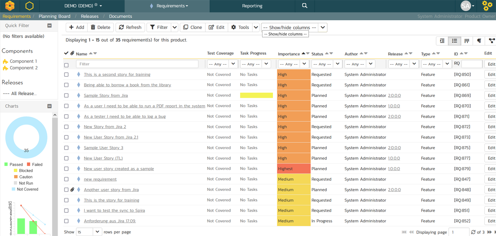

### Tasks

Any of the Jira issue types that are mapped to tasks in SpiraTeam:

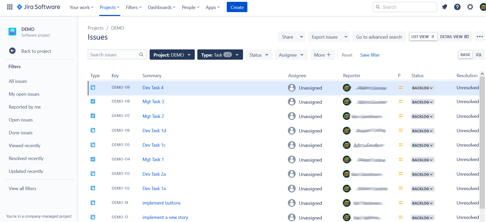

Will be imported into SpiraTeam as types of task:

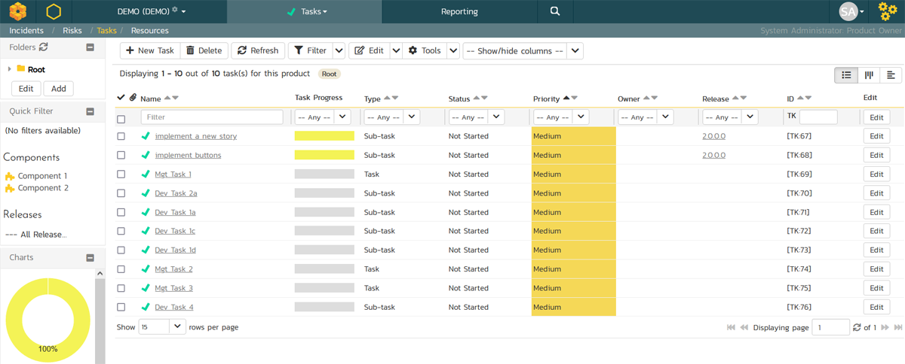

### Incidents

Any of the Jira issue types that are mapped to incidents in SpiraTeam:

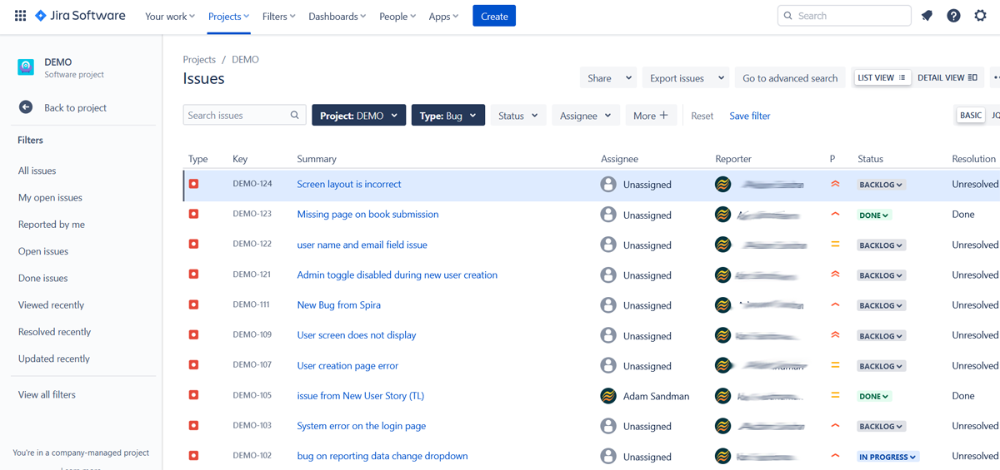

Will be imported into SpiraTeam as types of incident:

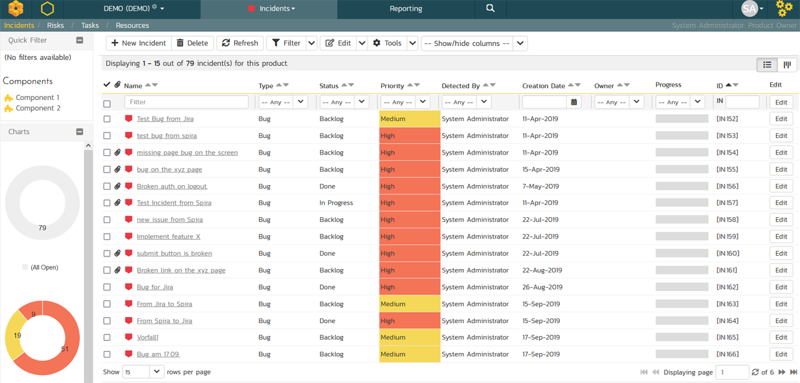