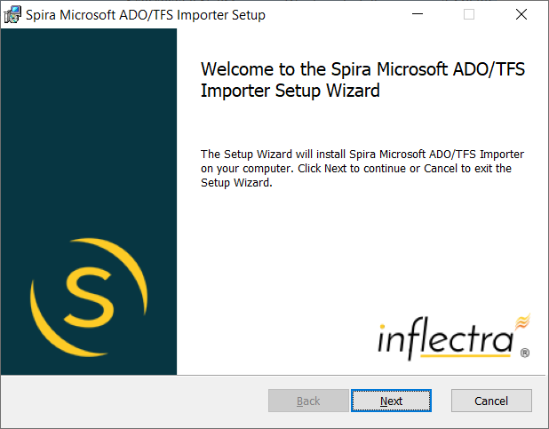
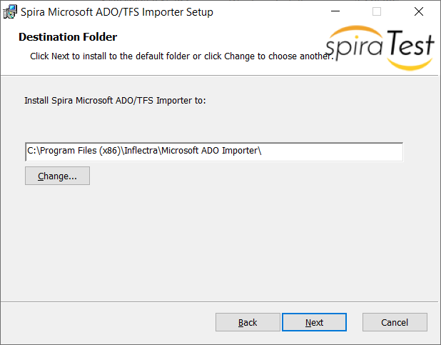
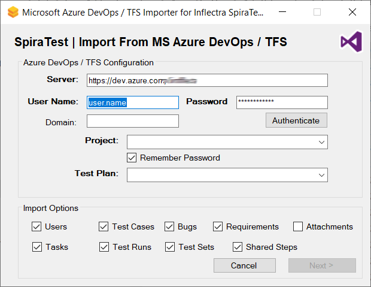
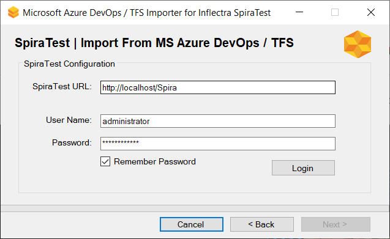
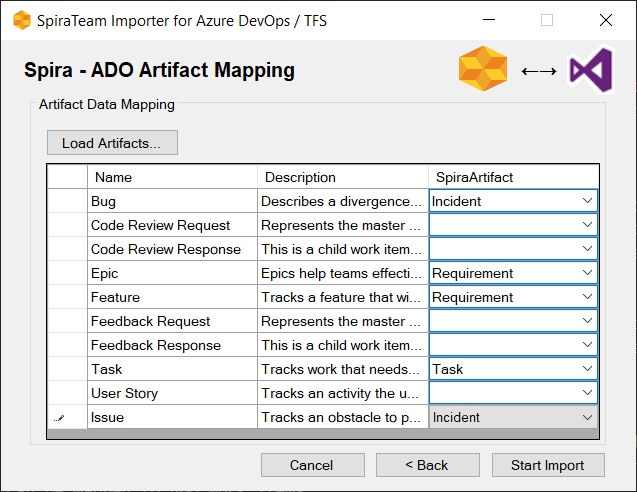
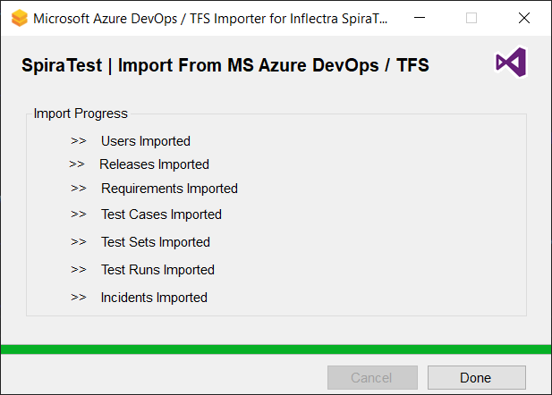

#  Migrating from MS Azure DevOps / TFS
!!! abstract "Compatible with SpiraTest, SpiraTeam, SpiraPlan"

This section outlines how to use the free Migration Tool for importing users, releases, requirements, test plans, test suites, test cases, test runs, tasks and defects from Microsoft Azure DevOps (ADO) also known as Microsoft Team Foundation Server (TFS) into Spira.

## Installing the ADO Migration Tool
This section outlines how to install the migration tool for ADO onto a workstation so that you can then migrate whole projects from ADO into Spira (SpiraTest, SpiraTeam or SpiraPlan). It assumes that you already have a working installation of Spira v7.0 or later. If you have an earlier version of Spira you will need to upgrade to at least v7.0 before trying to migrate projects.

The Windows installation package can be downloaded from the 'Add-Ons & Downloads" section of the Inflectra website. Once you have obtained the Windows Installer package, simply double-click on the package to begin the installation wizard which should display the following welcome page:

   

Click the `Next` button, accept the software license, then click `Next` again to choose the folder to install the migration tool to:

   

Choose the folder to install to, and then decide whether the application should be accessible by all users on the workstation or just the current user. Then click the `Install` button to start the installation process. It will confirm if you want to proceed, click `Next` then wait for it to finish.

## Using the ADO Migration Tool

Now that you have installed the migration tool, you can launch it at any time by going to Start \> Programs \> Spira \> Tools \> ADO/TFS Importer. This will launch the migration tool application itself:

   

The first thing you need to do is to enter the URL for the instance of ADO that you want to import.

For **cloud** ADO instances, the URL will normally be the https://dev.azure.com/account, where 'account' is the name of the ADO organization. You will also need to enter a valid **username** and **Personal Access Token (PAT)**.

For **on-premise** TFS installations, the URL should include the project collection that you want to import the information from (typically of the form **http://server:8080/tfs**) together with a valid **username**, **Windows® domain** and **password**.

Once you have entered this information, click the `Authenticate` button and the list of possible projects will be populated in the **Project** dropdown list. Select the ADO project that you want to ***import from*** and either keep the **Test Plan** dropdown set to 'All Test Plans' or pick a specific test plan to import.

You can also at this point choose which optional items will be imported from ADO - users, requirements, tasks, bugs, test cases, test runs, attachments or test sets. Once you have chosen the project and/or test plan, click the `Next` button to go to the Spira configuration screen.

   

This page allows you to enter the URL, user name and password that you want to use to access the instance of Spira that you want to ***import to*** and click `Login`.

Typically the URL is of the form http://server-name/Spira for on-premise installations and https://mycompany.spiraservice.net for cloud instances. The version of the importer being used must be compatible with the version of Spira you're importing into; if not you will receive an error message.

Assuming that the login was successful, click the `Next` button to go to the next screen where you will map the different types of work item to Spira artifacts:

   

On this page you will map the different Spira artifacts to the different work item types in ADO. Currently, the following artifact types in Spira can be mapped to ADO work items:

- **Requirements** (used for user stories, features, epics, etc.)
- **Tasks** (used for tasks)
- **Incidents** (used for all other issue types such as bugs, defects, issues)

*Note that you don't need to explicitly map **test cases** as they are automatically handled.*

Once you have mapped the work item types you will be importing, click the `Start Import` button to actually begin the process of importing the various artifacts from ADO into Spira. Note that the importer will automatically create a new project in Spira to hold all the artifacts with the same name as that used in ADO.

   

During the import process, as each of the types of artifact are imported, the progress display will change (as illustrated above). Once the import has finished, you will receive a message to that effect and the `Done` button will be enabled. Clicking this button closed the importer. You should now log into Spira using the same user name and password that was used for the import to view the imported project.

The migration tool will import the following artifacts:

- Users (but not their roles and permissions)
- User story, feature and epic work items as requirements
- Releases / iterations as releases and sprints
- Test Plans and their associated Test Suites
- Test Cases and their associated steps, including any shared test steps
- Test Runs and their associated test results
- Test Sets and the association with the test cases
- Bug work items as incidents
- Task work items as tasks
- Any attachments associated with the requirements, test cases, test sets or design steps.

## Checking the Import
Once the import has completed, please open up the the import log file `Spira_ADOTFSImport.log` that will be saved to the Windows Desktop of the user running the import. In this log file you will see what was imported, with any items that failed to import also listed.