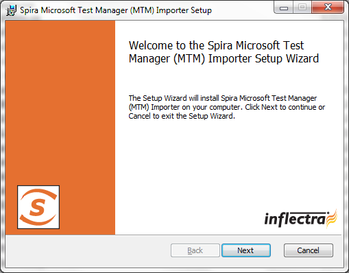
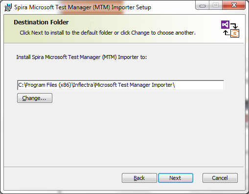
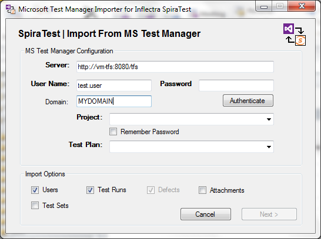
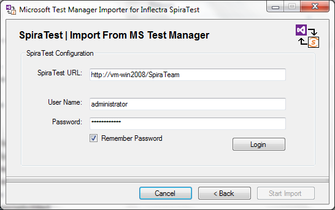
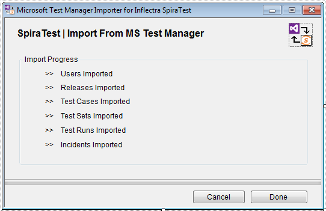

#  Migrating from MS Test Manager
This section outlines how to use the free Migration Tool for importing users, test plans, test suites, test cases and test runs from Microsoft Test Manager (MTM) 2010 or later.

## Installing the MTM Migration Tool

This section outlines how to install the migration tool for MTM onto a workstation so that you can then migrate whole projects from MTM into SpiraTest (or SpiraTeam). It assumes that you already have a working installation of SpiraTest v4.0 or later. If you have an earlier version of SpiraTest you will need to upgrade to at least v4.0 before trying to migrate projects.

The Windows installation package can be downloaded from the 'Add-Ons & Downloads" section of the Inflectra website. Once you have obtained the Windows Installer package, simply double-click on the package to begin the installation wizard which should display the following welcome page:

   

Click the <Next\> button, accept the software license, then click <Next\> again to choose the folder to install the migration tool to:

   

Choose the folder to install to, and then decide whether the application should be accessible by all users on the workstation or just the current user. Then click the <Install\> button to start the installation process. It will confirm if you want to proceed, click <Next\> then wait for it to finish.

## Using the MTM Migration Tool

Now that you have installed the migration tool, you can launch it at any time by going to Start \> Programs \> SpiraTest \> Tools \> MTM Importer. This will launch the migration tool application itself:

   

The first thing you need to do is to enter the URL for the instance of Microsoft Team Foundation Server (TFS) that MTM is running on. The URL should include the project collection that you want to import the information from (typically of the form **http://server:8080/tfs**) together with a valid username, Windows® domain and password.

Once you have entered this information, click the <Authenticate\> button and the list of possible projects will be populated in the **Project** dropdown list. Select the MTM project that you want to ***import from*** and either keep the **Test Plan** dropdown set to 'All Test Plans' or pick a specific test plan to import.

You can also at this point choose which optional items will be imported from MTM (users, test runs, attachments or test sets) -- test cases are always imported. Once you have chosen the project and/or test plan, click the <Next\> button to go to the SpiraTest configuration screen.

   

This page allows you to enter the URL, user name and password that you want to use to access the instance of SpiraTest that you want to ***import to*** and click <Login\>. Typically the URL is of the form (http://<server name\>/SpiraTest). The version of the importer being used must be compatible with the version of SpiraTest you're importing into; if not you will receive an error message.

Assuming that the login was successful, click the <Start Import\> button to actually begin the process of importing the various artifacts from MTM into SpiraTest. Note that the importer will automatically create a new project in SpiraTest to hold all the artifacts with the same name as that used in MTM.

   

During the import process, as each of the types of artifact are imported, the progress display will change (as illustrated above). Once the import has finished, you will receive a message to that effect and the <Done\> button will be enabled. Clicking this button closed the importer. You should now log into SpiraTest using the same user name and password that was used for the import to view the imported project.

The migration tool will import the following artifacts:

- Users (but not their roles and permissions)
- Test Plans and their associated Test Suites
- Test Cases and their associated steps, including any shared test steps
- Test Runs and their associated test results
- Test Sets and the association with the test cases
- Any attachments associated with the requirements, test cases, test sets or design steps.

