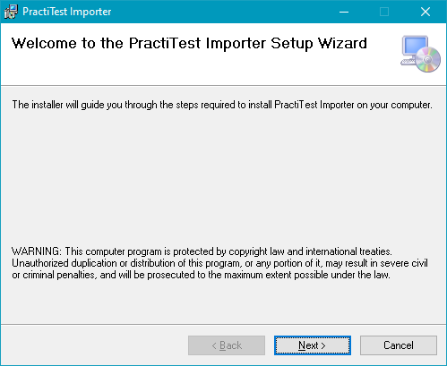
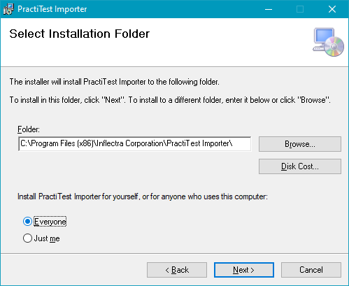
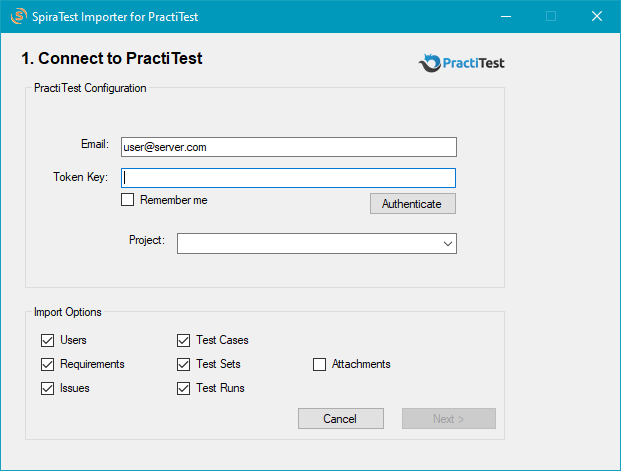
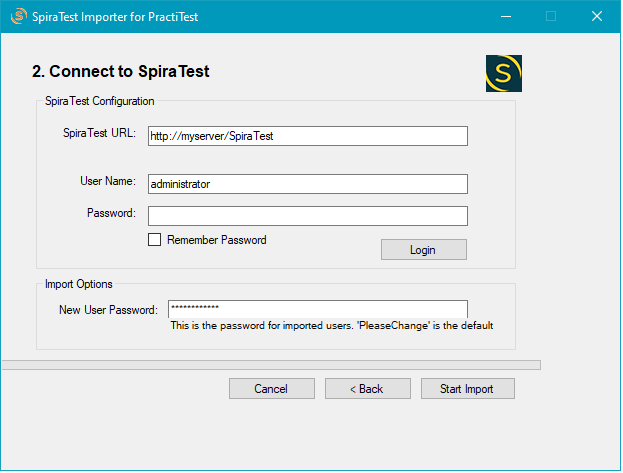
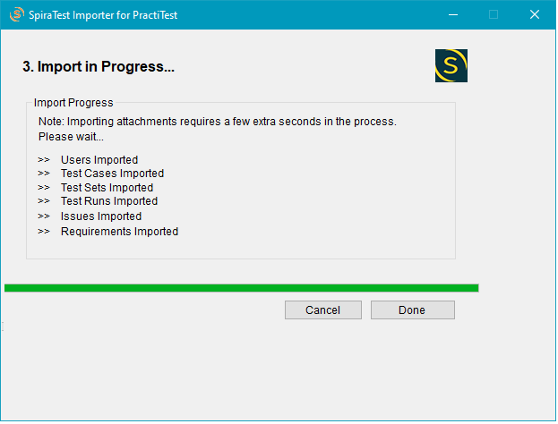

# Migrating from PractiTest
This section outlines how to use the free Migration Tool for importing Users, Test Cases, Test Sets, Test Runs, Issues, Requirements and Attachments from PractiTest into SpiraPlan.

## Installing the PractiTest Migration Tool

This section outlines how to install the migration tool for PractiTest onto a workstation so that you can then migrate whole projects from PractiTest to SpiraTest/SpiraTeam/SpiraPlan (SpiraPlan). It assumes that you already have a working installation of SpiraPlan v5.0 or later and a live instance of PractiTest to migrate from. If you have an earlier version of SpiraPlan you will need to upgrade to at least v5.0 before trying to migrate projects.

The Windows installation package can be downloaded from the "[Add-Ons & Downloads](http://www.inflectra.com/SpiraPlan/Downloads.aspx)" section of the Inflectra website. Double-click the package to begin the installation wizard. The wizard should display the following welcome page:

Click the `Next` button to choose the folder to install the migration tool to:

Choose the folder to install to, and then decide whether the application should be accessible by all users on the workstation or just the current user. Then, click `Next`. It will confirm if you want to proceed, click `Next` then wait for it to finish.

## Using the PractiTest Migration Tool

Now that you have installed the migration tool, you can launch it at any time by going to Start > Programs > Inflectra > SpiraPlan > Tools > PractiTest Importer. This will launch the migration tool application itself:

The first thing you need to do is to enter the user email for the instance of PractiTest that you want to import the information from, together with a valid API Token (provided under Account Settings on Practitest).

Once you have entered this information, click `Authenticate` and the list of projects will be populated. Select the PractiTest project you want to **import from**. You can also choose to not import certain artifacts from PractiTest (e.g. Issues, etc.) then click the `Next` button to move to the next page in the import wizard:

This page allows you to enter the URL, user name and password to access SpiraPlan that you want to **import to**. Enter the information and click `Login`. Typically, the URL is of the form (*https://xxxx.spiraservice.net*). The version of the importer being used must be compatible with the version of SpiraPlan you're importing into; if not you will receive an error message.

If you are importing users, make sure to enter the default password for all users that the importer will create in SpiraPlan. You need to make sure that this password meets the requirements of your SpiraPlan installation or the import will fail with an error message indicating the password is not allowed.

Assuming that the login was successful, click the `Start Import` button to actually begin the process of importing the various artifacts from PractiTest into SpiraPlan. Note that the importer will automatically create a new product in SpiraPlan to hold all the artifacts with the same name as that used in PractiTest. Note: if you run the importer on the same PractiTest project multiple times, it will create a new product in SpiraPlan each time.

During the import process, as each of the types of artifact are imported, the progress display will change (as illustrated above). Once the import has finished, you will receive a message to that effect and the `Done` button will be enabled. Click this button to close the importer. You can now log into SpiraPlan to view the imported project.

The migration tool will import the following artifacts from PractiTest:

- The project name
- Users (not their roles and permissions)
- Requirements
- Defects (imported as Incidents)
- Test cases with their steps (if defined)
- Test Sets
- Test Runs
- Attachments[^1] for test cases, test sets, requirements and incidents. Attachments from test steps are not migrated[^2]
- Associations and test coverage with requirements

!!! info "If the Import Fails"
    In case the import fail for any reason, there will be a log file created on the Desktop of the computer doing the import. The filename is usually: Spira_PractiTest_Import.log . Please send this file to our support team if help is needed.

!!! info "Importing Attachments"
    Because of a limitation in PractiTest, attachments can only be migrated from PractiTest after a delay of a certain number of seconds. So if you have 10 attachments, the migration tool will have to wait 5 seconds, for example, before importing each attachment. There is a user configurable delay in seconds that you can set for attachments. If the import fails because of attachments, try increasing this delay.

[^1]: Due to a PractiTest limitation, if importing attachments, expect the process to take a few extra seconds per attachment. Note that this process may still result in an error because of limitations in the PractiTest API.
[^2]: This feature is not currently available because of missing API calls in PractiTest. Hopefully it will be available in a future PractiTest update
