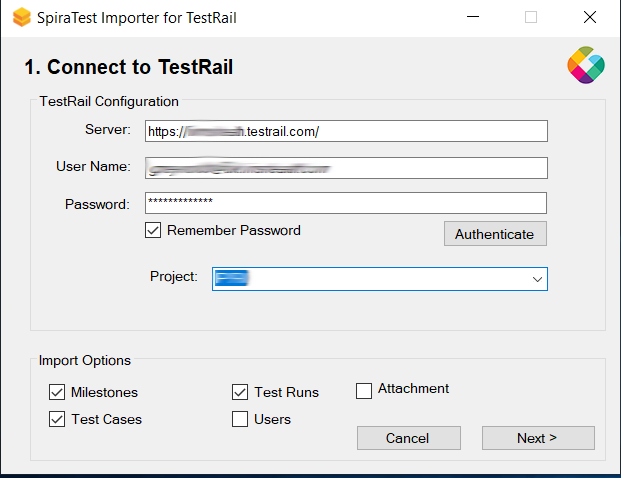

# Migrating from TestRail

This section outlines how to use the free Migration Tool for importing Milestones, Test Cases, Test Suites, Test Plans, Test Runs, and Test Results from Gurock TestRail into SpiraTest.

## Installing the TestRail Migration Tool

This section outlines how to install the migration tool for TestRail onto a workstation so that you can then migrate whole projects from TestRail to either SpiraTest or SpiraTeam (hereafter referred to as SpiraTest). It assumes that you already have a working installation of SpiraTest v8.0 or later and a live instance of TestRail to migrate from. If you have an earlier version of SpiraTest you will need to upgrade to at least v8.0 before trying to migrate projects.

The Windows installation package can be downloaded from the 'Add-Ons & Downloads" section of the Inflectra website. Once you have obtained the Windows Installer package, simply double-click on the package to begin the installation wizard which should display the following welcome page:

   

Click the <Next\> button, accept the software license, then click <Next\> again to choose the folder to install the migration tool to:

Choose the folder to install to, and then decide whether the application should be accessible by all users on the workstation or just the current user. Then click the <Install\> button to start the installation process. It will confirm if you want to proceed, click <Next\> then wait for it to finish.

## Using the TestRail Migration Tool

Now that you have installed the migration tool, you can launch it at any time by going to Start \> Programs \> Inflectra \> SpiraTest \> Tools \> TestRail Importer. This will launch the migration tool application itself:

   

The first thing you need to do is to enter the URL for the instance of TestRail that you want to import the information from (typically of the form `https://xxxxx.testrail.net`) together with a valid username and password.

Once you have entered this information, click the **Authenticate** button and the list of projects will be populated. Select TestRail project that you want to ***import from*** You can also choose to not import certain artifacts from TestRail (e.g. Milestones, etc.) then click the **Next >** button to move to the next page in the import wizard:

   

This page allows you to enter the URL, user name and password that you want to use to access the instance of SpiraTest that you want to ***import to*** and click <Login\>. Typically, the URL is of the form (https://xxxx.spiraservice.net). The version of the importer being used must be compatible with the version of SpiraTest you're importing into;
if not you will receive an error message.

Assumning that the login was successful, click the **Next >** button and you will be taken to the screen where you can map the execution statuses used in your TestRail instance to those in SpiraTest:

On this screen you should enter the IDs of the different test execution statuses configured in your TestRail instance for each SpiraTest status. If you have multiple TestRail statuses that correspond to a single SpiraTest status, just separate them with commas. The importer will be pre-populated with the correct values for a "vanilla" instance of TestRail, so unless you have modified the default TestRail statuses, no changes should be necessary.

Once you have confirmed the mapping, click the **Start Import** button to actually begin the process of importing the various artifacts from TestRail into SpiraTest. Note that the importer will automatically create a new project in SpiraTest to hold all the artifacts with the same name as that used in TestRail.

During the import process, as each of the types of artifact are imported, the progress display will change (as illustrated above). Once the import has finished, you will receive a message to that effect and the **Done** button will be enabled. Clicking this button closes the importer. You should now log into SpiraTest using the same user name and password that was used for the import to view the imported project.

The migration tool will import the following artifacts from TestRail:

- The project name and description
- Custom fields for test cases and test results
- Users (but not their roles and permissions)
- Milestones
- Test suites and their sections
- Test cases with their steps (if defined)
- Test plans with associated tests and test results
- Attachments and images

*Should the import fail for any reason, there will be a log file created on the Desktop of the person doing the import. The filename is usually of the format:
`Spira_TestRail_Import_yyyymmdd.log`.