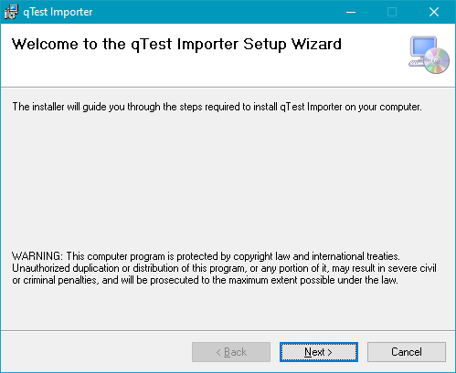
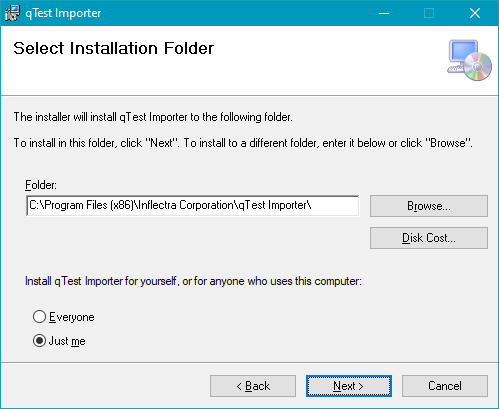
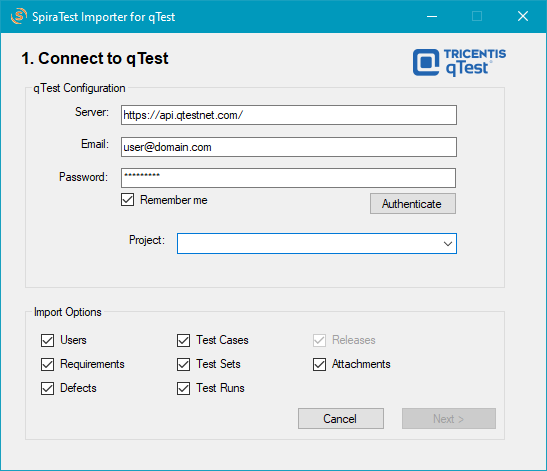
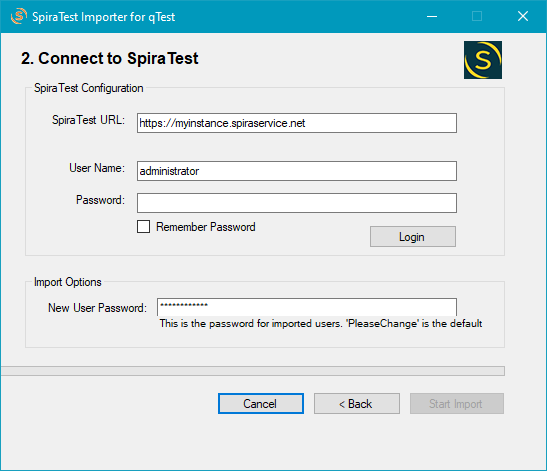
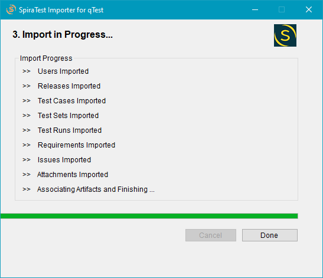

# Migrating from qTest
This section outlines how to use the free Migration Tool for importing Users, Test Cases, Test Sets, Test Runs, Defects, Releases, Requirements and Attachments from qTest into SpiraTest (or SpiraTeam, or SpiraPlan).

## Installing the qTest Migration Tool
For the migration tool to work you need a working installation of SpiraTest/SpiraTeam/SpiraPlan v5.0 or later and a live instance of qTest to migrate from. You will also need a Windows machine to install the migration tool onto, that can access both SpiraPlan and qTest.

First, download the Windows [installation package](https://www.inflectra.com/Downloads/qTestImporter.msi) from the "Add-Ons & Downloads" section of the Inflectra website. Double-click the msi file to start the installation wizard. The first screen of this wizard will look like this:

Click the `Next` button to choose the folder to install the migration tool to:

Choose the folder to install to and then click `Next`. It will confirm if you want to proceed, click `Next` then wait for it to finish.

## Using the qTest Migration Tool
Now that you have installed the migration tool, you can launch it at any time by going to Start > Programs > Inflectra > SpiraTest > Tools > qTest Importer. This will launch the migration tool application itself:

First, enter the qTest information below and click `Authenticate` to verify your details (this will also retrieve the list of projects in qTest): 

- the URL of the instance you want to import the information from (typically in the form https://yourCompany.qtestnet.com/) \
- a valid username
- password

Next, select the qTest project that you want to **import from**. Now choose which artifacts you want to import from qTest (e.g. Defects, Requirements). *NOTE: to import test cases, test sets, or test runs, the wizard needs to also import releases.* 

Click `Next` to move to the Connect to SpiraTest part of the import wizard:

On the Connect to SpiraTest page you have to enter your SpiraTest login information and click `Login`:

- URL (for hosted customers this is of the form https://xxxx.spiraservice.net)
- SpiraTest username
- SpiraTest password

If you are importing users, make sure to enter the default password for all users that the importer will create in SpiraPlan. You need to make sure that this password meets the requirements of your SpiraPlan installation or the import will fail with an error message indicating the password is not allowed.

Once the wizard has verified its connection with SpiraTest and you are logged in, click the now enabled `Start Import` button. This begins the import process from qTest into SpiraPlan. The importer will automatically create a new product in SpiraPlan with the same name as that used in qTest. **Note**: if you run the importer on the same qTest project multiple times, it will create a new product in SpiraTest each time.

During the import process, as each artifact is imported, the progress display will change (as illustrated above). Once the import finishes the `Done` button will be enabled. Click this button to close the importer. You can now log into SpiraPlan to view the imported project.

## Notes
The migration tool can import the following artifacts from qTest:

- Project name
- Users with a default password (but not their roles and permissions)
- Requirements
- Releases
- Test cases with their steps (if defined)
- Test Sets
- Test Runs
- Defects
- Modules (these will be imported automatically as Test Case folders and also as Requirement epics)
- Test Cycles (these will be imported automatically if Test Sets are imported, and will be imported as Test Set folders)
- Attachments for Releases, Requirements, Test Cases, Test Steps and Defects
- Associations between Releases, Requirements, Test Cases, Test Runs, Test Steps

!!! bug "If the import fails"
    If the import fails for any reason, you will find a log file on the Desktop of the computer where the migration tool is installed. The filename will normally be "Spira_qTest_Import.log". Please send this file to our support team if help is needed.

