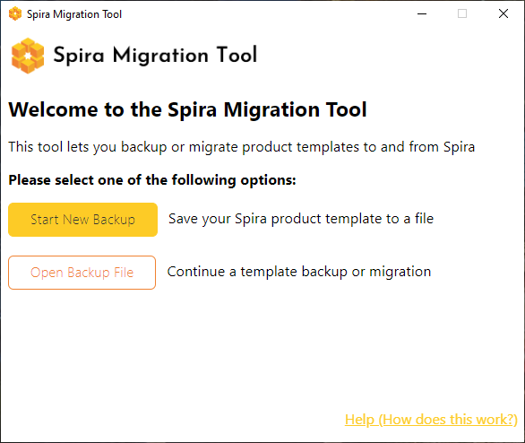
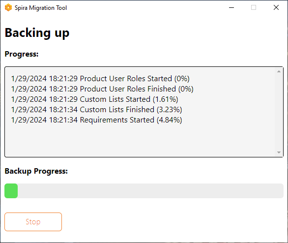
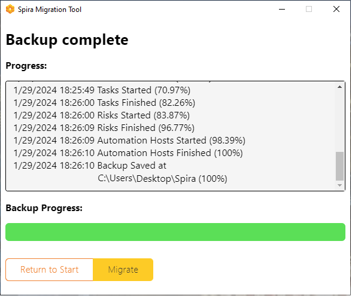
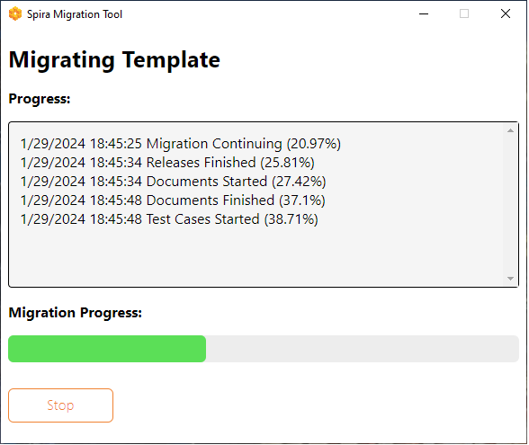

#  Spira Template Backup and Migration Tool

This application allows a Spira Template to be exported to a backup file (*.templ*), for archiving and offline storage. You can also use this tool to migrate a *.templ* file to a Spira instance. The minimum Spira version required for backup or migration is [**7.11**](https://spiradoc.inflectra.com/About/release-notes-v7/).

The Spira Template Backup and Migration Tool is available for Windows and macOS systems. To get it, please go to our [Downloads Page](https://www.inflectra.com/SpiraTest/Downloads.aspx) and choose the correct version according to your system. Then, follow the instructions on the screen to install it on your machine.

## What is Backed-up/Migrated

The application creates a backup file that contains the following Template data:

- User Product Roles

- Custom Lists
    - Custom Values
    
- Requirement:
    - Importances
    - Statuses1
    - Types
    - Custom Properties
    - Workflows
     - Status States
     - Transitions
     - Fields
     
- Release:
    - Statuses
    - Custom Properties
    - Workflows
     - Status States
     - Transitions
     - Fields
     
- Document:
    - Statuses
    - Types
    - Custom Properties
    - Workflows
     - Status States
     - Transitions
     - Fields
     
- Test Case:
    - Priorities
    - Statuses
    - Types
    - Custom Properties
    - Workflows
     - Status States
     - Transitions
     - Fields
     
- Test Step:
    - Custom Properties
    
- Test Set:
    - Custom Properties
    
- Test Run:
    - Custom Properties
     
- Incident:
    - Priorities
    - Statuses1
    - Severities
    - Types
    - Custom Properties
    - Workflows
     - Status States
     - Transitions
     - Fields
     
- Task:
    - Priorities
    - Statuses
    - Types
    - Custom Properties
    - Workflows
     - Status States
     - Transitions
     - Fields
     
- Risk:
    - Impacts
    - Probabilities
    - Statuses
    - Types
    - Custom Properties
    - Workflows
     - Status States
     - Transitions
     - Fields
     
- Automation Host:
    - Custom Properties
    

All items above from a template file can be uploaded to a new Template in the same instance of Spira, or a different one.

## Main Screen

When running the application, you will see the main screen, which gives you two options:

- **Start New Backup**: Select this option to save a Spira Template to a template file. You will need to provide valid administrator credentials to proceed.

- **Open Backup File**: Select this option to either export data from a backup file to a Spira instance or when you need to restore and continue a previously interrupted backup or migration session. See 'Session Restoring' to learn more.

## Template Back-up

To export a Spira Template to a backup file, select 'Start New Backup' on the main screen. Then, provide valid administrator credentials of the instance you want to retrieve data and its URL. If on-prem, please make sure the machine running the application can reach the instance's URL directly.
In the next screen, select the Template you want to export from the list, a valid destination for the template file to be saved, and a name for the file. You can't modify its extension, *.templ*.

Finally, confirm the information you see is correct and click 'Start Backup'. This will lead you to the progress screen, where you can check the progress of the operation and details in the Event History. The application creates a log in the same directory of the backup file in which the session details and any errors or warnings are saved for future reference.

Once the operation is finished, the output file will be created. You can store and backup the file as you need. Click 'Return to Start' to start a new backup, 'Migrate' to upload the just created file, or simply close the application.

## Template Migration

Once you have the backup file ready, select 'Open Backup File' on the main screen to migrate this file to a Spira instance. You will be asked to provide valid administrator credentials and the URL of the **destination** instance, which can be the same or a different Spira instance (e.g.: development and production environments).

Then, please enter a name and description for the new Template.

To proceed, click 'Next'. Make sure the information you see on the screen is correct and click 'Start Migration'.

In the progress screen, you can check the progress of the operation and details in the Event History. The application creates a log in the same directory of the backup file in which the migration session details and any errors or warnings are saved.

**Please note that a backup file can only be migrated once**. If you want to migrate the file more than one time, please duplicate the file before starting the process and select the copy next time.
If for any reason, the migration process is interrupted, please make sure to complete it using the Session Restoring feature explained next, otherwise the template will be unusable in Spira.

## Session Restoring

If for any reason your backup or migration session was interrupted before completion, you can restore it without losing any data. Just select 'Open Backup File' on the main screen. You will be asked to select the previous session file and provide valid administrator credentials to proceed.

***Notes:***

1 Due to an API limitation, currently, the Requirement Status properties Position and Show on Boards and the Incident Status properties Position and Default are not saved nor migrated.
