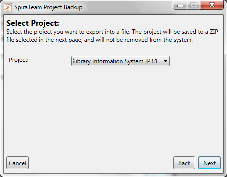
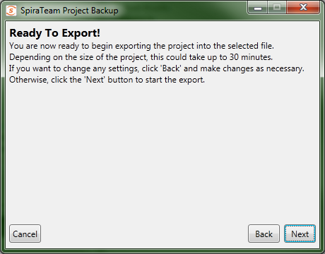
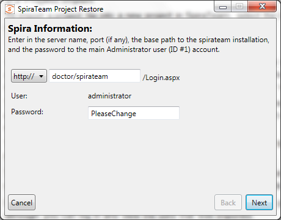
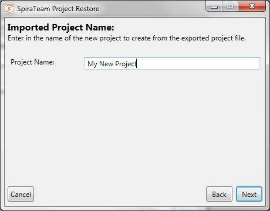
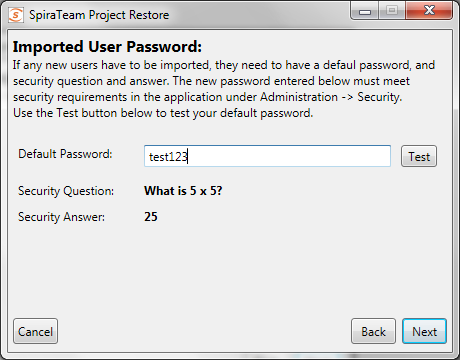
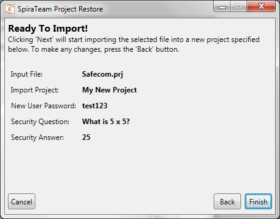
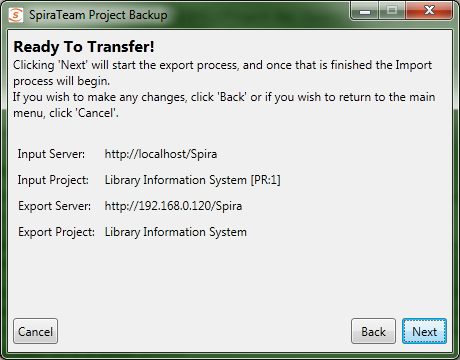

#  Project Backup and Migration
!!! abstract "Compatible with SpiraTest, SpiraTeam, SpiraPlan"

This application allows an entire project to be exported to a backup file, for archiving and offline storage of Spira projects. The base minimum Spira version required is 3.2 (014), and there is some data that is [not backed up](#data-transferred). Also there are separate versions of the backup and migration tool for Spira v3.2, v4.x and v5.x, and you need to use the appropriate version that matches your installations.

The migration tool **does not support upgrading versions**, i.e. you need to have the same version of Spira for both the import and export phase. If you have two different versions of Spira, you must first upgrade the older installation to the same version as the newer one.

## Main Screen
When running the application, you will see the main screen, which gives you three main options: Export, Import, and Transfer:

## Project Export
Clicking the Export button will start the Export wizard, allowing you to save the project to a file.

On the first screen, enter in the Spira server URL, and the administrator account password. The administrator account must be used, so make sure that it is an active account (Active: Yes) in the application. When clicking the 'Next' button, it will verify the server and login information.

The second screen gives you the selection of the project to export. Select the project, and then click the 'Next' button.

On the third screen, select the location and name of the file you wish to export the project to. If the file already exists, it will be overwritten.

The next screen is the verification screen -- make sure you wish to start the export, and then click the 'Next' button. Once started, you cannot cancel or change any options. To change an option, click the
'Back' button at any time before starting the process to go back a screen.

Once finished, your output file will be created. You can store and backup the file as you need.

## Project Import
To import a project file into a new project in Spira, select the Import button on the main screen. This will start the Import wizard:

On the first screen, enter in the Spira server URL, and the administrator account password. The administrator account must be used, so make sure that it is an active account (Active: Yes) in the application. When clicking the 'Next' button, it will verify the server and login information.

The second screen allows you to enter in a name for the project created. You can enter in the name of an existing project, but a new project by that name will be created -- it will not import the project into an existing project.

The third screen is only present on the Spira v4.0 version of the migration tool. This is because the Spira 4.0 API requires that new user's be created with passwords of specific strength. Any user in the project file that is not present in the destination system will be created with the password that you specify:

You should enter a password, click the 'Test' button to make sure it will be accepted by Spira, and then click the 'Next' button. This will then display the fourth screen:

The fourth screen will let you select the PRJ Project file. Select the file by clicking on the folder button, and the application will verify the integrity of the file before performing the import:

The last screen will let you verify your settings before starting the import. If any changes need to be made, click the Back button. Once ready to import the project, click the 'Finish button to start the import.

If any error occurs during import, it's not recommended to use the project created in the application, although you can log in and view the data that was imported.

## Project Transfer

Selecting the 'Transfer' button will start the transfer wizard, which contains screens from both the Import and Export wizards, above.

The first two screens will let you select the Spira application to pull the project from, following the same information as the first two screens in the Export wizard.

The next three screens will ask for the new Spira application to create the project in and the default password for any new users that need to be created. These three screens follow the first three screens of the Import wizard, above. Note that the application will try to determine if you're trying to re-import the project into the same server, and advise that copying the project in the Spira UI is a better choice.

The final screen will provide a summary of the chosen settings. Once you click 'Next', the transfer process will start:

Once transfer starts, the entire project will be unloaded into a temporary directory on the computer running the application, and then the project will be imported into the new system.

## Data Transferred

                 
| Spira              | Exported | Imported |
| ------------------ | -------- | -------- |
| Incidents          | Y        | Y        |
| Requirements       | Y        | Y        |
| Tasks              | Y        | Y        |
| Releases           | Y        | Y        |
| Test Cases         | Y        | Y        |
| Test Sets          | Y        | Y        |
| Test Runs          | Y        | Y        |
| Custom Properties  | Y        | Y        |
| Custom Lists       | Y        | Y        |
| Document Files     | Y        | Y        |
| Document Folders   | Y        | Y        |
| Document Types     | Y        |          |
| Comments           | Y        | Y        |
| Datasync Mappings  | Y        |          |
| Automation Hosts   | Y        | Y        |
| Automation Engines | Y        | Y        |
| Project Roles      | Y        |          |
| Project Users      | Y        | Y[^1]    |

The table on the left shows what data is backed up and restored. Future versions of the Migration tool and Spira may support exporting and importing more data.

The exported project file may be large, since the binary data of all the attachments are downloaded and contained within the file.

Once an export is completed, the migration tool will not delete the project from the system -- you must still do that through the UI. Any changes in the project will not automatically be updated in the export file; you must re-run the export.

[^1]: ]Users imported back into v3.2 will be marked Active, even if they were originally inactive.