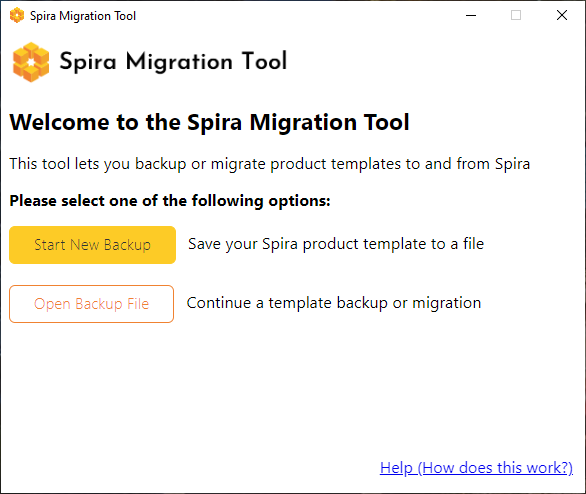
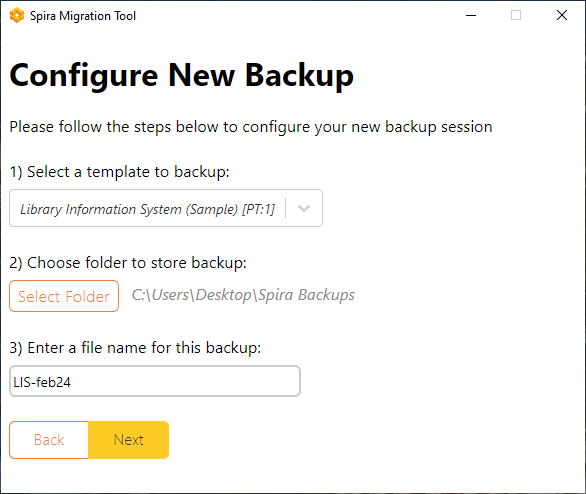
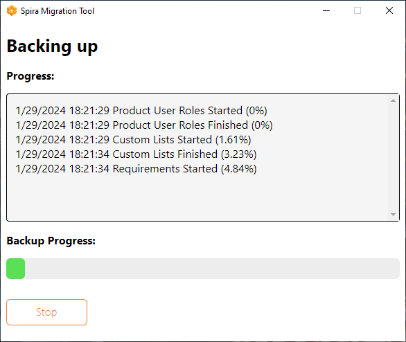
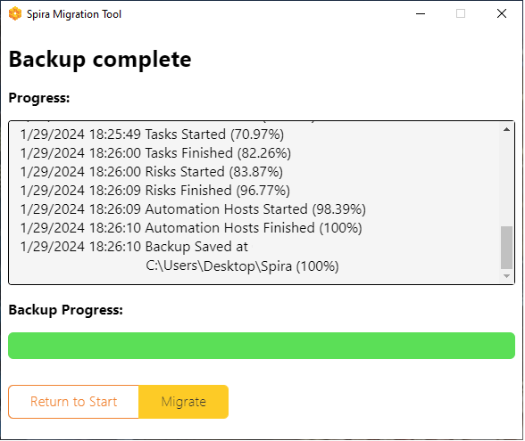
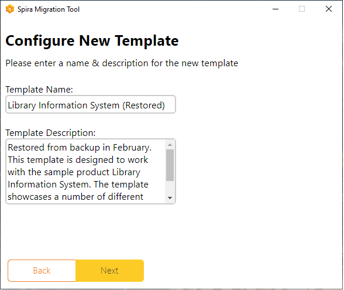
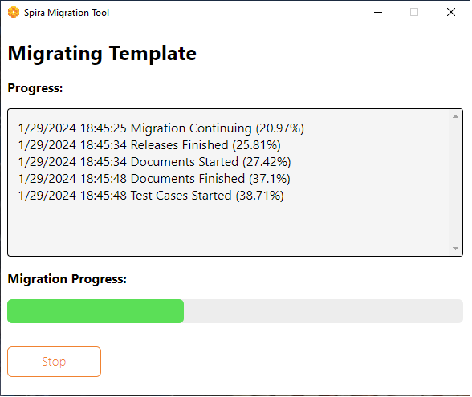

#  Spira Template Backup and Migration Tool
!!! abstract "Compatible with SpiraTest, SpiraTeam, SpiraPlan"

This application lets you save a copy of a Spira product template to a .templ file on your local computer. It also lets you migrate everything about the template to any Spira instance. 

!!! info "Example uses"
    Being able to store, share, and migrate Spira product templates gives you lots of powerful workflows. For example:
    
    - the backup file can be used to audit a live product template in Spira to see if it has changed
    - you can restore a backup to your main Spira instance to clone the template quickly or to help you revert to a template before a serious of now unwanted changes
    - share templates with others that serve a specific need such as for a certain industry or process

The application runs on either Windows or Mac OS and is available to [download](https://www.inflectra.com/SpiraTest/Downloads.aspx). To install it follow the instructions in the application installer on your platform.

!!! warning "This app is compatible with Spira 7.11 and above"

## What data is saved
The application creates a backup file that contains the following product template and related data:

- **Requirement** importance, statuses[^statuses], types, custom properties, workflow steps, and workflow transitions    
- **Release** statuses, custom properties, workflow steps, and workflow transitions     
- **Document** statuses, types, custom properties, workflow steps, and workflow transitions
- **Test Case** priorities, types, custom properties, workflow steps, and workflow transitions
- **Incident** priorities, statuses[^statuses], severities, types, custom properties, workflow steps, and workflow transitions
- **Task** priorities types, custom properties, workflow steps, and workflow transitions
- **Risk** impacts, probabilities, statuses, types, custom properties, workflow steps, and workflow transitions
- **Test Step** custom properties
- **Test Set** custom properties
- **Test Run** custom properties
- **Automation Host** custom properties    
- **Custom lists** and their values
- **User** product poles

[^statuses]: Due to an API limitation the current properties are not saved or migrated: requirement status position and "show on boards" fields; and incident status position and default fields.

## Welcome screen
When you open the application you see the main welcome screen. 

From here you have two options (note that you must be a system administrator to proceed):

- **Start New Backup**: starts a new process to save a Spira product template to a template file
- **Open Backup File**: continues a previous process based on the state of the template file selected. The application will automatically decide what is available to you out of the following options:

    - resume an existing backup
    - start a new migration
    - resume an existing migration

These options are discussed in more detail below.

## Template backup
To start a new backup of a product template to a local file:

- select "Start New Backup" from the welcome screen.
- on the next screen enter valid administrator credentials for the Spira instance you want to backup a template from
- then select the product template to backup and a place to save it on your computer (the file extension will be .templ)

- confirm that all the details selected are correct
- start the backup by clicking "Start Backup"

During the backup process, you will see the progress and details about what actions have been completed. If you click "Stop" during the backup, the process will pause, so you can [resume](#continue-an-operation) it later (you can only migrate after the backup has 100% completed). Just in case there are any issues or errors, the application saves a log alongside the backup file.

Once the backup has finished, you have two options:

- "Return to Start" to go back to the welcome screen. Choose this option to either make another backup, or to then quit the application
- "Migrate" to immediately start the process of migrating the template to a different Spira instance

You can also close the application safely at this time, if you wish.

## Template Migration
Once you have completed a product template backup, you can migrate the product template to another Spira instance. To do so:

- click "Open Backup File" from the application's welcome screen
- select the existing *.templ file from your computer
- on the next screen enter valid administrator credentials for the Spira instance you want to migrate the template to (this can be the same instance the backup is from, or any other Spira instance)
- next, enter a name and plain text description for the new product template

- confirm that all the details selected are correct
- start the migration by clicking "Start Migration"

During the migration process, you will see the progress and details about what actions have been completed. If you click "Stop" during the migration, the process will pause, so you can [resume](#continue-an-operation) it later (the new product template will not be usable in Spira until the migration has 100% completed). Just in case there are any issues or errors, the application saves a log alongside the backup file.

!!! info "How to migrate a product template multiple times"
    The *.templ file stores information about the progress to backup and migrate the product template. Once a migration has successfully completed, the file cannot be migrated again. If you may want to migrate the same product template more than once, we recommend that you make copies of the file before you start any migration.

## Continue an operation
If for any reason your backup or migration session was interrupted before completion, you can continue where it left off without losing any data. To do so:

- click "Open Backup File" from the welcome screen. 
- select the relevant *.templ file
- the application will give you details about what operation will then occur (continuing with a backup if that is not complete yet, or continuing with a migration if that had been started but not finished).
- proceed by entering the credentials and other information as required to proceed

