#  Spira Backup and Migration Tool
!!! abstract "Compatible with SpiraTest, SpiraTeam, SpiraPlan"

This application lets you save a copy of a Spira product template, or a whole Spira product together with its template, to a file on your local computer. It also lets you migrate everything you have saved to any Spira instance.

!!! info "Example uses"
    Being able to store, share, and migrate Spira templates and products gives you lots of powerful workflows. For example:

    - the backup file can be used to audit a live product template or product in Spira to see if it has changed
    - you can restore a backup to your main Spira instance to clone a template or product quickly, or to help you revert to a version before a series of now unwanted changes
    - stand up a copy of a product (with all of its requirements, test cases, incidents, releases, etc.) on another Spira instance for training, testing, or hand-off to another team
    - share templates with others that serve a specific need such as for a certain industry or process

The application runs on either Windows or Mac OS and is available to [download](https://www.inflectra.com/SpiraTest/Downloads.aspx). To install it follow the instructions in the application installer on your platform.

!!! warning "Minimum Spira versions"
    - To **back up** a template or product, the source Spira instance must be **7.11 or above**. To **migrate** a template or product, the destination Spira instance must be **8.13 or above**.

## What you can save
At the start of every backup, you choose to include:

- **A Spira Product and its Template** - the product's data (requirements, test cases, incidents, etc.), along with the template it is based on. Because product data depends on the template, the template is always included automatically. You do not need to select it separately.
- **A Spira Template on its own** - the template (workflows, statuses, types, custom properties, and related settings), with no product data.

Both types of backup are saved into a single file with a **.spirabackup** extension.

### Template data that is saved
When you back up a template, either on its own or as part of a product backup, the file contains the following template and related data:

- **Requirement** importance, statuses[^statuses], types, custom properties, workflow steps, and workflow transitions
- **Release** statuses, types, custom properties, workflow steps, and workflow transitions
- **Document** statuses, types, custom properties, workflow steps, and workflow transitions
- **Test Case** priorities, statuses, types, custom properties, workflow steps, and workflow transitions
- **Incident** priorities, statuses[^statuses], severities, types, custom properties, workflow steps, and workflow transitions
- **Task** priorities, statuses, types, custom properties, workflow steps, and workflow transitions
- **Risk** impacts, probabilities, statuses, types, custom properties, workflow steps, and workflow transitions
- **Test Step** custom properties
- **Test Set** custom properties
- **Test Run** custom properties
- **Automation Host** custom properties
- **Custom lists** and their values
- **User** product roles

[^statuses]: Due to an API limitation the following properties are not saved or migrated: requirement status position and "show on boards" fields; and incident status position and default fields.

### Product data that is saved
When you back up a product, the file contains all of its template data (above) plus the product's actual content:

- **Requirements** - including their comments, attachments, and associations
- **Test Cases** - including folders, test steps, test case parameters, comments, attachments, and associations
- **Test Sets** - including folders, the test cases they contain, parameters, comments, attachments, and associations
- **Test Configuration Sets** - including their entries and Test Sets
- **Test Runs** - both manual and automated
- **Incidents** - including their comments, attachments, and associations
- **Releases** - including builds, comments, attachments, and associations
- **Risks** - including mitigations, comments, attachments, and associations
- **Tasks** - including folders, comments, attachments, and associations
- **Documents** - including document folders, document details, and the document files themselves
- **Components**
- **Automation Hosts**
- **Product users** and their membership and roles

!!! info "Skipping documents or test runs"
    When you back up a product you can choose to leave out documents and/or test runs. See [Skip options](#skip-options) below.

## Welcome screen
When you open the application you see the main welcome screen.

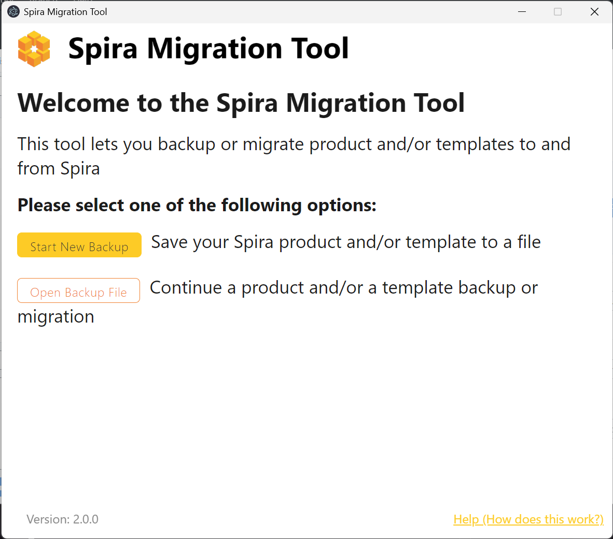

From here you have two options (note that you must be a system administrator on the Spira instance to proceed):

- **Start New Backup**: starts a new process to save a Spira product and/or template to a file
- **Open Backup File**: continues a previous process based on the state of the file you select. The application automatically decides what is available to you out of the following options:

    - resume an existing backup
    - start a new migration
    - resume an existing migration

These options are discussed in more detail below.

## Logging in
Every backup and migration begins by logging in to a Spira instance. On the login screen enter:

- the **URL** of the Spira instance (for example `https://company-name.spiraservice.net`)
- your **Username**
- your **RSS/API Key** (if you don't have one, use the "How to Get your RSS key?" link on the screen)

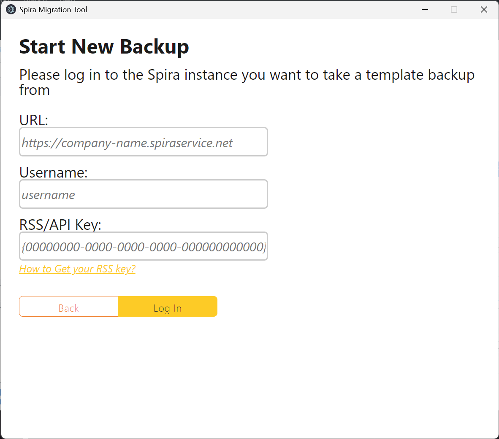

## Backup
To start a new backup:

- select **Start New Backup** from the welcome screen
- log in to the Spira instance you want to back up from

On the next screen you configure the backup.

- First choose **what to back up**:

    - **Backup a Spira Product and its Template**
    - **Backup a Spira Template**

- Then select the item to back up:

    - for a product backup, choose the option **Backup a Spira Product and its Template** from the list.
    - for a template backup, choose the option **Backup a Spira Template** from the list.

- Choose a **folder** to store the backup, and enter a **file name** (letters, numbers, spaces, and the symbols `_`, `-`, and `;` are allowed). The backup is saved with a `.spirabackup` extension.

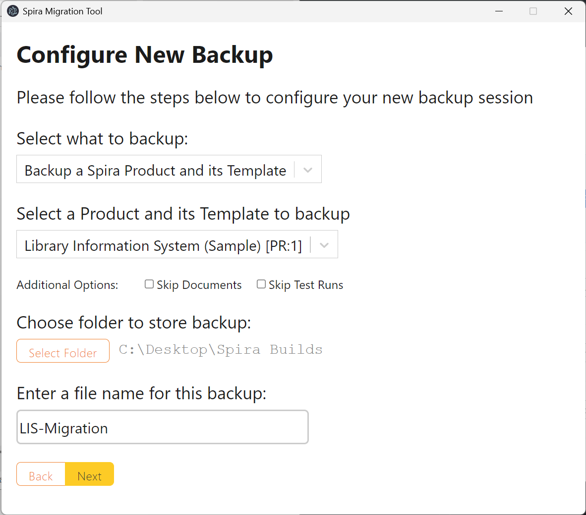

#### Skip options
When you back up a product, you can tick either of two **Additional Options** to reduce the size of the backup:

- **Skip Documents** - leaves out the document library and all attachments across every artifact type
- **Skip Test Runs** - leaves out manual and automated test runs

Leaving both unticked creates a full backup.

Next, confirm that all the details are correct on the summary screen, then start the backup by clicking **Start Backup**.

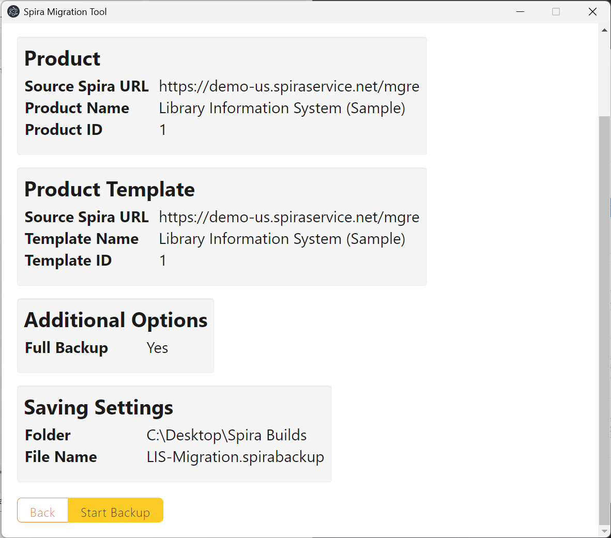

During the backup you see the progress and details of what has been completed. If you click **Stop** during the backup, the process pauses so you can [resume](#continue-an-operation) it later (you can only migrate once the backup has reached 100%). Just in case there are any issues or errors, the application saves a log alongside the backup file.

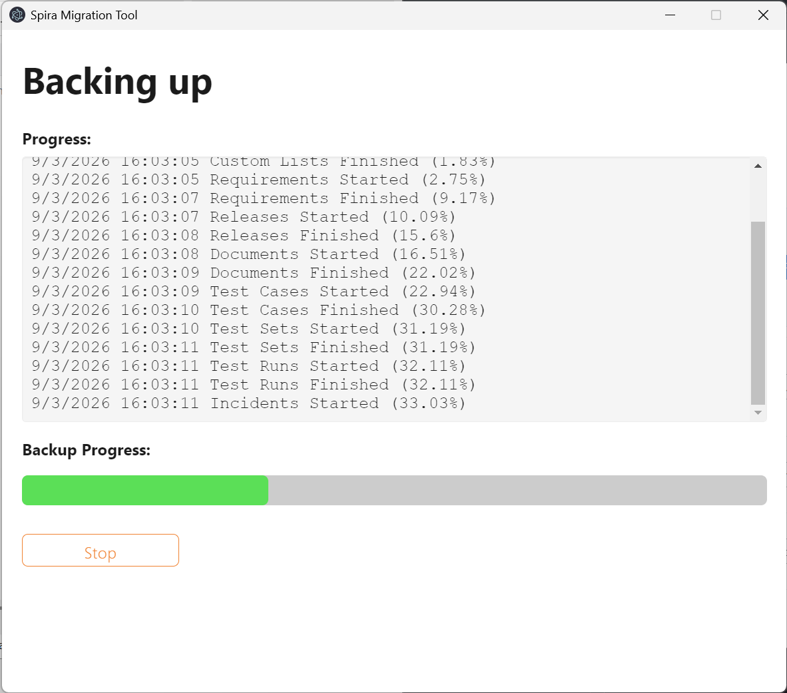

Once the backup has finished, you have two options:

- **Return to Start** to go back to the welcome screen. Choose this to make another backup, or to quit the application.
- **Migrate** to immediately start migrating what you just backed up to a Spira instance.

You can also close the application safely at this time, if you wish.

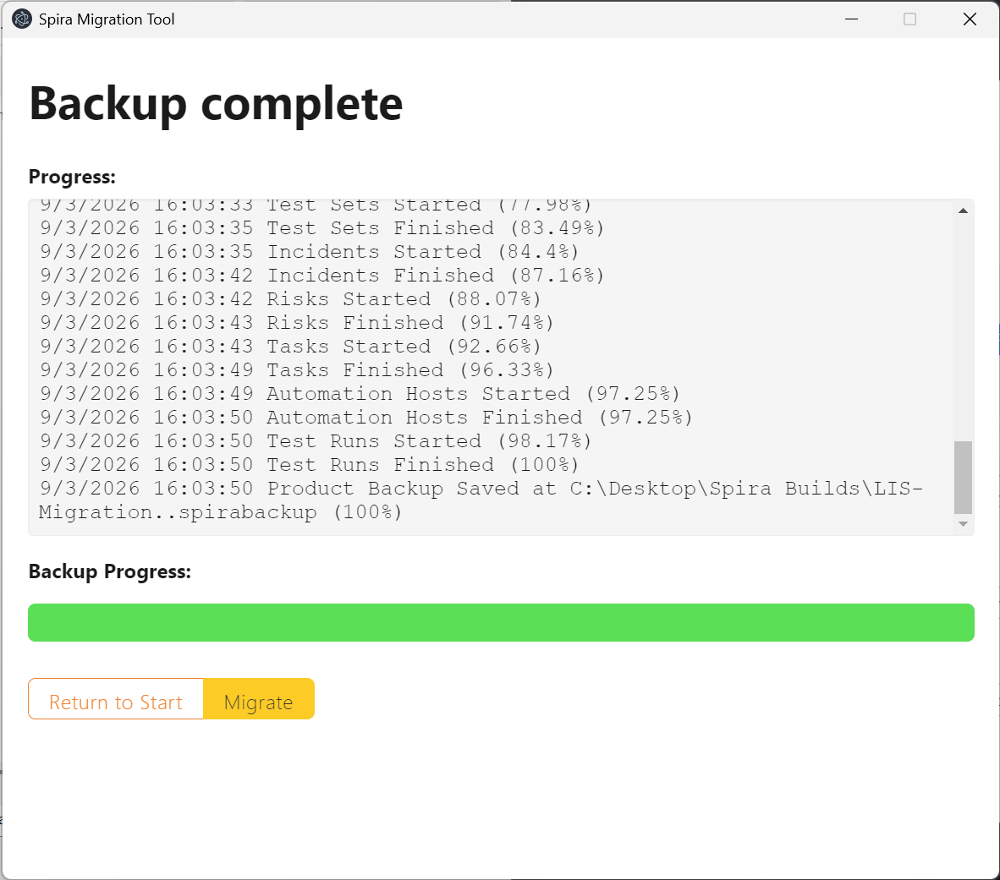

## Migration
Once a backup has completed, you can migrate it to a Spira instance. This can be the same instance the backup came from, or any other Spira instance (version 8.13 or above). To start a migration:

- click **Migrate** straight after a backup finishes, or click **Open Backup File** from the welcome screen and select the completed `.spirabackup` file
- log in to the Spira instance you want to upload to

What you are asked for next depends on whether the file is a template-only backup or a product backup.

### Migrating a template
For a template-only backup, enter a **name** and **description** for the new template that will be created on the destination instance.

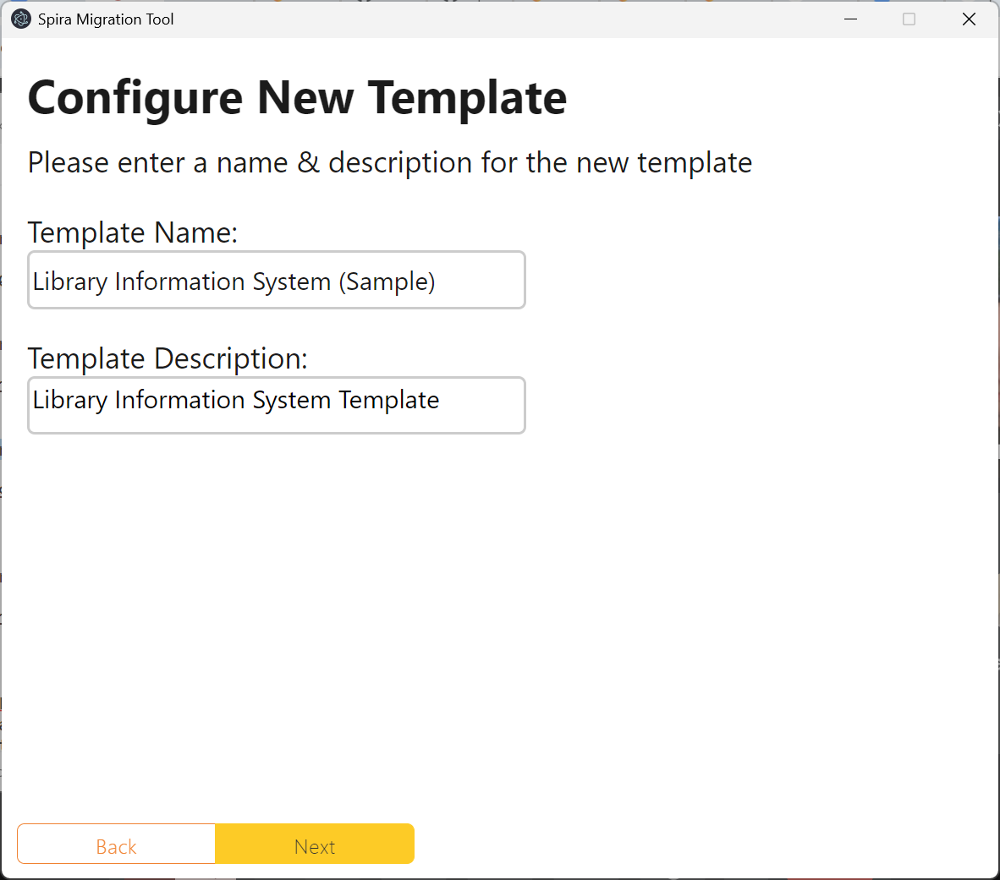

Press **Next** to continue.

### Migrating a product
For a product backup, you provide the details for the new product **and** its template:

- enter a **Product Name** and **Product Description** for the new product
- enter a **Template Name** and **Template Description** for the template it will be based on

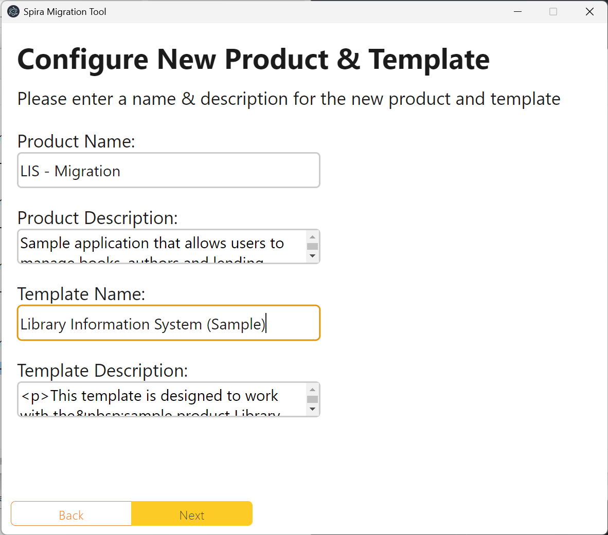

Press **Next** to continue.

#### Default user settings
A product includes its users, so the next screen lets you set **default user settings** that are applied when a user's details in the backup are incomplete:

- **Default Password**
- **Default Password Question**
- **Default Password Answer**

!!! tip "Highly recommended: leave user passwords blank"
    We recommend leaving these fields empty. When they are blank, the application generates secure random values for each new user, and your system administrators configure real credentials later. If you do set your own values, make a note of them, as you will need them to access those accounts after migration.

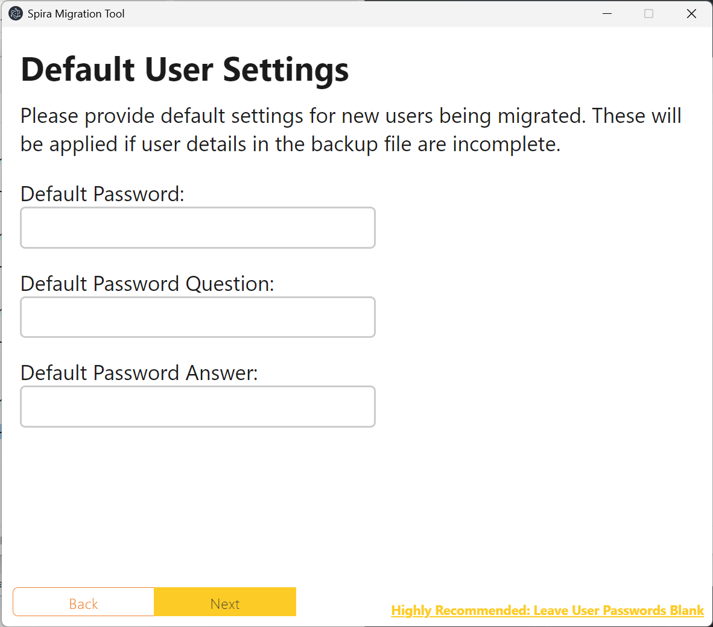

### Confirm and start
Confirm that all the details are correct on the summary screen, then start the migration by clicking **Start Migration**.

!!! info "Your credentials are never stored"
    For your security, any default password, security question, and security answer you enter are used only during the migration and are never saved to the backup file.

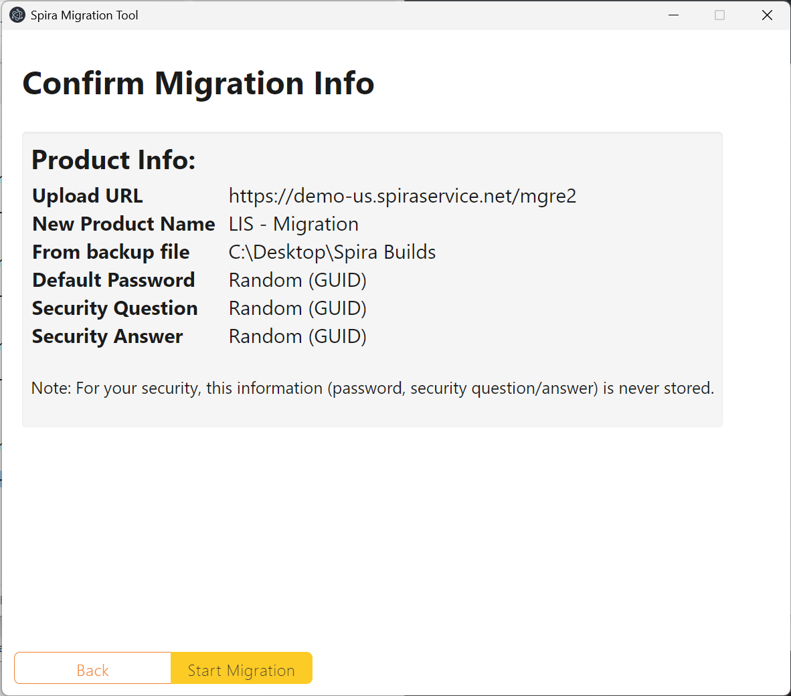

During the migration you see the progress and details of what has been completed. If you click **Stop**, the process pauses so you can [resume](#continue-an-operation) it later (the new template or product will not be fully usable in Spira until the migration reaches 100%). Just in case there are any issues or errors, the application saves a log alongside the backup file.

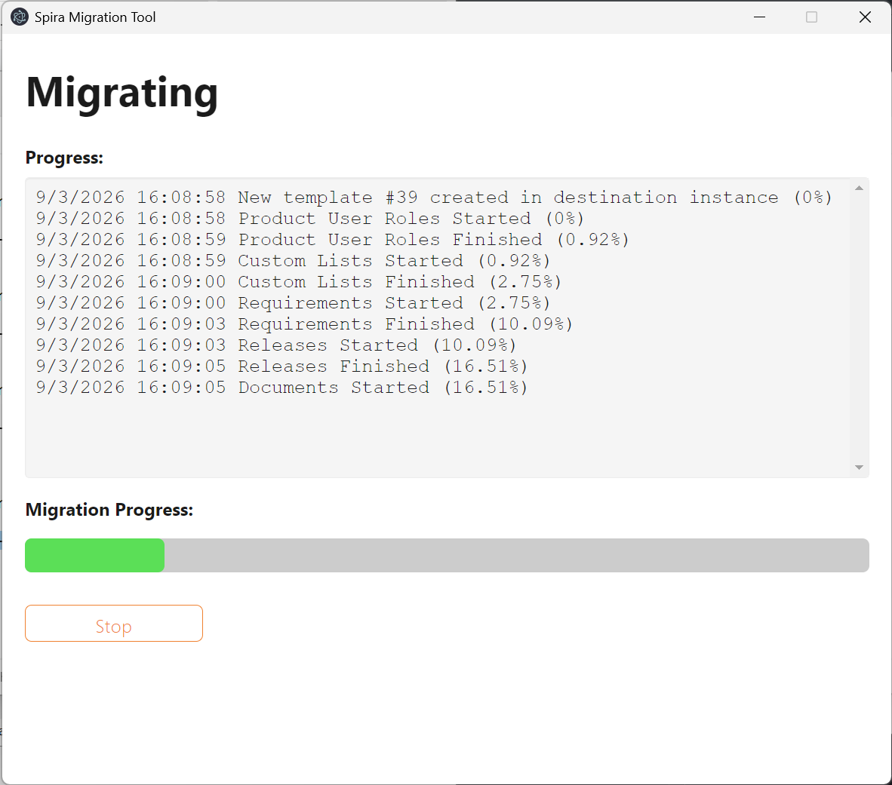

Once the migration has finished, you can select **Return to Start** to go back to the welcome screen. Choose this to make another backup, or to quit the application.

You can also close the application safely at this time, if you wish.

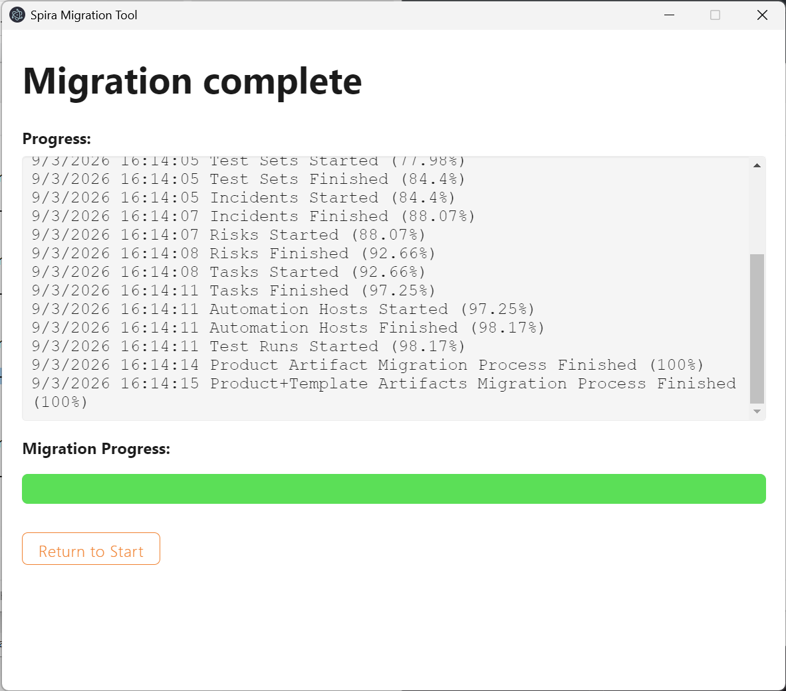

!!! info "Embedded images and attachments"
    When you migrate between different Spira instances, images that were pasted into rich text fields (such as descriptions and comments) are automatically updated to point to their new location on the destination, so they continue to display correctly.

!!! info "How to migrate the same backup multiple times"
    The `.spirabackup` file records the progress of the backup and migration. Once a migration has completed successfully, the same file cannot be migrated again. If you want to migrate the same template or product more than once, we recommend making copies of the file before you start any migration.

## Continue an operation
If your backup or migration was interrupted before completion, you can continue where it left off without losing any data. To do so:

- click **Open Backup File** from the welcome screen
- click **Select File** and select the relevant `.spirabackup` file

The application reads the file and tells you its status and what will happen next:

- an **incomplete backup** will resume the backup
- a **complete backup** will begin the migration
- an **in-progress migration** will resume the migration
- a **completed migration** has nothing left to do

Then enter the credentials and any other information required to proceed. When resuming, the URL and username are already filled in for you, so you only need to re-enter the API key.

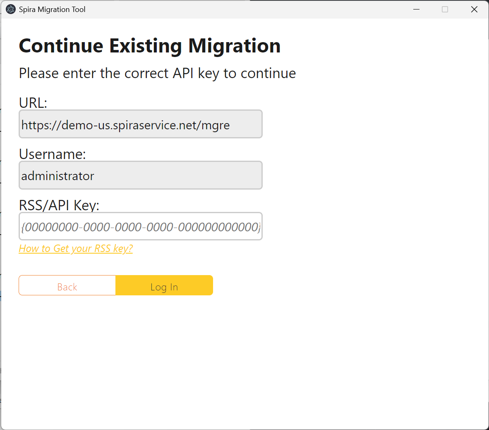
