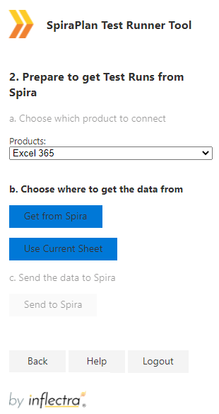

# Spira Test Runner add-in for Excel 365
This add-in lets you retrieve your assigned Test Cases and Test Sets for a specific product in SpiraTest®, SpiraTeam®, or SpiraPlan® application (hereafter referred to as SpiraPlan). You can run your tests straight away or [later](#multi-session-testing). When you are ready you can send your test executions back to SpiraPlan. This addin works with Microsoft Excel 2016+, Excel in the cloud (via a web browser), and Excel on iPad OS.

## Installation 
To install the add-in:

- Go to the **insert** tab in Excel
- Click on **"Get Add-Ins"** and in the window that opens navigate to the **store** tab
- Search for **"Spira** or **SpiraPlan**. 
- When you see the correct add-in **"Test Runner"** developed by Inflectra, click on the "Add" button associated with it.
- You should now see the SpiraPlan icon labeled "SpiraPlan Test Runner" in your home tab. Click on it to begin.

## Connecting to SpiraPlan
Open the add-in from the ribbon and fill in the login form panel on the right of your Excel screen. If you are using Excel in the browser, make sure your SpiraPlan is accessible over the internet.

- **Spira URL:** The web address that you use to access SpiraPlan in your browser. Use the web address you use to access SpiraPlan in your browser. This is usually of the form 'http://company.spiraservice.net'. Make sure you remove any suffixes from the address (e.g. Default.aspx or "/")
- **User Name:** This is the exact same username you use to log in to SpiraPlan. (Not Case Sensitive)
- **RSS token:** You can find or generate this from your user profile page inside SpiraPlan - "{ExampleRSS}". Make sure to include the curly braces and *make sure to hit Save after generating a new RSS token.*

If there is a problem connecting to SpiraPlan you will be notified with an error message.

After you have logged in, click **Logout** to close your connection with SpiraPlan and take you back to the add-in's login page.

## Retrieving Tests from SpiraPlan
After successfully logging in to the application, you need  to get the most up to date list of Test Cases and/or Test Sets assigned to you from SpiraPlan. Select a product to retrieve all your assigned tests cases and sets from and click on '**Get from Spira**'.

When you click the **Get from Spira** button you will see the Test Cases and their Test Steps be added the current sheet of the spreadsheet. The following tests are retrieved:

- Test Cases assigned to you from the product selected
- Test Sets of type "manual" assigned to you from the product selected

!!! info "Resuming Testing"
    The add-in only communicates to SpiraPlan when you first get data from SpiraPlan and then at the end when you send the new data into SpiraPlan. You can therefore carry out your testing described below completely offline if you wish. You can also work on tests over multiple sessions.

    When you return to the spreadsheet with your Test Cases after the first session you need to resume your testing. To do this you can use the spreadsheet without opening the add-in. You only need to login to the add-in when you want to [send the Test Runs to SpiraPlan](#sending-test-runs-to-spiraplan). That is what the "**Use Current Sheet** button directly below the **Get from Spira** button is for.

## Running Tests
On retrieving your assigned tests from SpiraPlan the add-in populates the sheet with the information in a format to make it clear how to run your tests.

### Spreadsheet Structure
The spreadsheet is generating using the following columns:

- **'Send to Spira' Log**: Here, you can see warning, error, and success messages after you finish your testing and record the test runs back into SpiraPlan. Remember to always check this column at the end to make sure the operation was successful. If it wasn't the log information here will help you make the necessary corrections.
- **Test Case ID**: the unique ID of the Test Case from SpiraPlan - this is only populated for test case rows. You can't edit this field.
- **Test Set ID**: if the Test Case came from a Test Step assigned to you, you should see its ID in this field. Otherwise, it will remain blank. This is only populated for test case rows. You can't edit this field.
- **Test Step ID**: the unique ID of each Test Step from SpiraPlan - this is only populated for test step rows. You can't edit this field.
- **Test Case Name**: The name of the Test Case in SpiraPlan.
- **Release**: The release associated with the Test Case in SpiraPlan.
- **Set Case Unique ID**: This is a unique cross-reference ID for the Test Case within the Test Set. It is blank if the Test Case is not part of a Test Set and is only populated in Test Case rows. You can't edit this field.
- **Test Step Description**: the full text of the description field for each Test Step in SpiraPlan (only populated in Test Step rows).
- **Test Step Expected Result**: the full text of the expected result field for each Test Step in SpiraPlan (only populated in Test Step rows).
- **Test Step Sample Data**: the full text of the sample data field for each Test Step in SpiraPlan (only populated in Test Step rows).
- **Execution Status**: the execution status of that test step, chosen from the dropdown list.
- **Actual Result**: the description of the actual result experienced during testing. Plain text only can be sent to SpiraPlan from Excel, so do not add images to these cells. To apply formatting please use HTML tags such as `<b>` for bold.
- **Incident Name** : if you want to log an incident associated with the test failure, enter the name of the incident here. The description of the incident will be automatically populated from the Test Step Description, Expected Result, and Actual Result.

### Background Colors
The add-in uses different cell background colors to help you know what you can or should do in each cell:

- **Gray:** means you can't edit the cell, it's a protected field.
- **Green:** means you are encouraged to populate this cell as part of test execution.
- **White:** means it is an optional field and you can change data here if you wish.
- **Red:** means there was an error in the artifact. Check the "'Send to Spira' Log" column to read the error message.

Let's put the columns and the cell background colors together:

| Column                    | Test Case Rows                                                                                     | Test Step Rows                                                                                                                  |
|---------------------------|----------------------------------------------------------------------------------------------------|---------------------------------------------------------------------------------------------------------------------------------|
| Send to Spira Log         | Gray (disabled)   | Gray (disabled)                                |
| Test Case ID              | Gray (disabled)   | Gray (disabled)                                |
| Test Set ID               | Gray (disabled)   | Gray (disabled)                                |
| Test Step ID              | Gray (disabled)   | Gray (disabled)                                |
| Test Case Name            | Gray (disabled)   | Gray (disabled)                                |
| Release                   | Green (populate) | Gray (disabled)                                |
| Set Case Unique ID        | Gray (disabled)   | Gray (disabled)                                |
| Test Step Description     | Gray (disabled)   | White (optional)   |
| Test Step Expected Result | Gray (disabled)   | White (optional)   |
| Test Step Sample Data     | Gray (disabled)   | White (optional)   |
| Execution Status          | Gray (disabled)   | Green (populate)                              |
| Actual Result             | Gray (disabled)   | Green (populate)                              |
| Incident Name             | Gray (disabled)   | White (optional)   |

### How to Execute Tests
To execute the Test Cases on the spreadsheet:

1. give each test step an **Execution Status** from the dropdown list
2. add any details about the **Actual Result** of each test step
3. optionally, add an **Incident Name** for test steps where you want to create an incident in SpiraPlan
4. If necessary (for example, if they contain errors), update the test steps' **Description**, **Expected Results**, or **Sample Data** fields
5. Review your work
6. When you are ready you can send your tests as Test Runs in SpiraPlan (discussed below).

??? hint "If you don't want to run all your tests"
    Let's say you have 5 Test Cases assigned to you but you plan to only execute 2 of them. How can you execute just these 2 and not the remaining 3? Delete all the rows for the 3 Test Cases you are not testing today. Make sure to delete the rows for the Test Case and all of each Test Case's Test Steps. If this is not done correctly you will not be able to log anything to SpiraPlan.

## Sending Test Runs to SpiraPlan
Once you have finished executing all the tests and recorded the results of your test runs on the spreadsheet, it is time to send the data to Spira to get properly recorded. There are two ways of doing this, depending on how you executed your tests:

- retrieving and executing your assigned tests in a single session
- executing your assigned tests over multiple sessions using the same spreadsheet

### Single Session Testing
If you got your data from SpiraPlan using the add-in, and straight away executed your tests in a single seession, you can easily send the data back to SpiraPlan.

To do so click the button "**Send to Spira**" on the add-in and wait for the operation to complete. 

### Multi Session Testing
If you have first got your data from SpiraPlan and then executed your assigned tests over multiple sessions, you now need to send the data back to SpiraPlan, without wiping out your work. If you have been testing over multiple sessions in this way follow the steps below:

1. Open the saved and completed spreadsheet
2. Open and log in to the add-in
3. Select the product you originally chose to generate the template - it is not possible to save the Test Runs in a different product
4. Click the "**Use Current Sheet**" - this will not touch any data on the spreadsheet. Note that if you clicked the Get from Spira button the current sheet would be completed erased and fresh data from Spira added there: this is NOT what you want in this case
5. Click "**Send to Spira**" to send your results.

### Check the Send to Spira Log
Once everything has been sent to SpiraPlan, results are recorded in the "'Send to Spira' Log" column of the spreadsheet. In this column you will see:

- The Test Run ID in the Test Case row of every Test Case that was successfully recorded in SpiraPlan
- Any Incident IDs in the relevant Test Step rows where you optionally added an Incident Name
- Error messages if the add-in encountered a problem. For each row that has an error message at least once cell will be given a background color of red. The error message itself will usually tell you how to fix the problem. You can also review FAQs below.

## Frequently Asked Questions
Below are common questions and answers related to common errors you may face when using the add-in.

!!! fail "1. After entering my SpiraPlan credentials and clicking 'Log in', I see the error message..."

    `Error: Request has been terminated Possible causes: the network is offline, Origin is not allowed by Access-Control-Allow-Origin, the page is being unloaded, etc.`

    **How to solve this issue**: first, make sure your credentials are correct. You can re-generate your RSS / API Key by going to your user page in SpiraPlan. Always remember to click 'Save' after re-generating your RSS key. If the problem persists, ask your SpiraPlan administrator to check the SpiraPlan API CORS configuration (in SpiraPlan: Admin menu > System > Security Settings > Allowed Domains) to see if it is accepting connections from the add-in domain.

!!! fail "2. When importing data from a spreadsheet on my computer, I get error messages. How do I solve it?"

    Here is a list of possible error messages you may see when importing a spreadsheet into the add-in and how to solve them:

    `Error: The selected product does not match the Spreadsheet data.`

    **Solution**: You cannot run Tests from one product and record them in another product. In the add-in, select the same product of the saved spreadsheet and try again.

    `Error: Database sheet is missing.`

    **Solution**: Your spreadsheet is missing required data. You have to re-import (using the "Get From Spira" button) the data. Never delete/rename any worksheet from the spreadsheet.

    `Error: There are columns missing in the spreadsheet.`

    **Solution**: Your worksheet is missing required data. You have to re-import (using the "Get From Spira" button) the data. Never delete or rename any column from the worksheet.

    `Error: Invalid Test Case detected: missing Test Step(s).`

    **Solution**: Your worksheet is missing Test Case data. You have to re-import (using the "Get From Spira" button) the data. You can delete Test Cases from the worksheet, but make sure to not leave Test Sets with no Test Cases or Test Cases with no Test Steps.

!!! error "3. After clicking on "Send to Spira", I see a red Test Case row and an error message saying..."

    `Invalid Execution Statuses: This TestCase contains an invalid execution statuses combination.`

    **How to solve this issue:** only valid Test Runs can be recorded in SpiraPlan. A valid Test Run is one that meets the conditions below. Check to make sure your test case meets all of these. In particular, review any Test Steps that have an execution status of Not Run still.

    - If at least one Test Step has an Execution Status of Failed, Blocked, or Caution then all other Test Steps can be left as Not Run
    - Otherwise, every Test Step must have an Execution Status other than Not Run (in other words Passed or N/A)

!!! error "4. After clicking on 'Send to Spira', I see a Test Step red row and an error message saying..."

    `Missing Actual Result: This TestStep needs to have an Actual Result, since it failed.`

    **How to solve this issue:** all Test Steps that are run but not passed (steps marked as any of Failed, Blocked, Caution, or N/A) must have an Actual Result. Check your non-passed Test Steps and make sure they all have an actual result and try again.

!!! warning "5. After clicking on 'Get from Spira' or 'Send to Spira', nothing happens for a long time - the add-in is stuck"

    Make sure you are not editing any cell when clicking on any add-in button. Excel does not allow add-ins to modify the spreadsheet when in editing mode. To solve this, click on any blank cell or press the ESC key. If it still does not work, check your internet connection and try again.