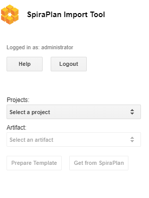
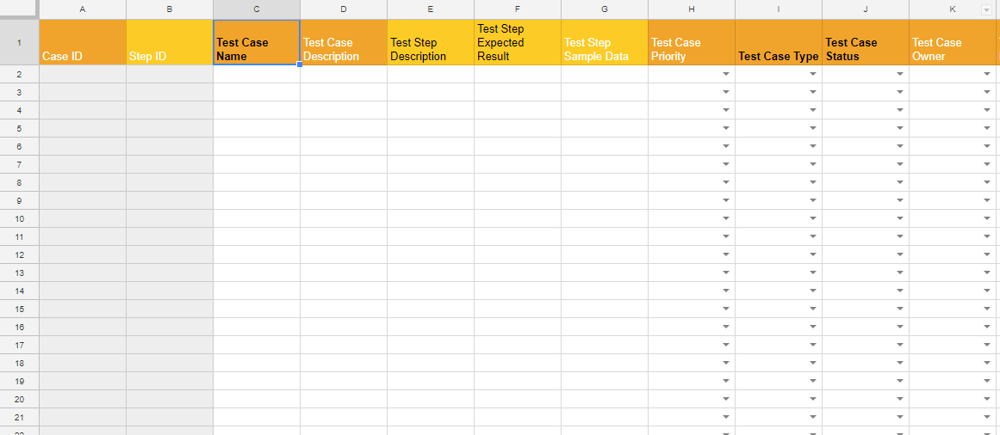
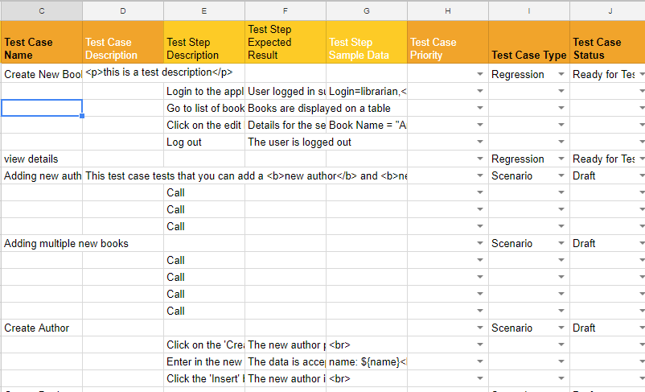

# Importing from Google Sheets

The web-based interface of SpiraTeam® is ideal for creating and managing
all aspects of your projects. However when migrating requirements,
release, tasks, incidents, and test cases with test steps for an
existing project from another system, it is useful to be able to
retrieve and load in a batch of artifacts, rather than having to
manually enter them one at a time.

To simplify this task we've created a Google sheets add-on for
SpiraTeam® that can import requirements, releases, tasks, and test cases
with test steps from a generated spreadsheet into SpiraTeam®.

*\*This guide assumes you have a Google account with access to Google
Drive and persistent access to the internet. It also assumes your
instance of SpiraTeam (or SpiraTest, or SpiraPlan) is accessible over
the internet so that Google Sheets can send data to it.*

## Installing the SpiraTeam® Google Sheets Integration Add-on

Like most Google services installation is very simple and
straightforward as long as you have a Google account.

1.  Open a new spreadsheet, navigate to the add-on menu, and click the
"Get add-ons" option.

2.  From there the Add-on store will launch, simply search for
"SpiraTeam" and you will find the SpiraTeam Import Tool Add-on.

<!-- -->

3.  Click install and authorize the add-on to work with documents
related to your account.

## Connecting to SpiraTeam®

*Before connecting to SpiraTeam® with the add-on make sure that you're
working on the first tab in the spreadsheet*.

1.  Launch the add-on from the add-on menu with the "Start" option. The
add-on will launch into a window docked to the side of your current
spreadsheet.

2.  When the add-on fully loads you will be able to enter your
SpiraTeam® log in credentials.

-   **Spira URL** : Please enter the web address that you use to access
SpiraTeam® in your browser. This is usually of the form
http://\<hostname\>/SpiraTeam. Make sure that you remove any
suffixes from the address (e.g. Default.aspx).

<!-- -->

-   **User Name** : Please enter the username that you use when logging
into SpiraTeam.

<!-- -->

-   **RSS Token** : Please enter your RSS token including the curly
braces i.e {ExampleRSS}.

-   To activate your RSS Token:

-   Click on the User Profile menu in the application header

-   Click on "My Profile"

-   The string of numbers *including the brackets* listed in the
RSS Token text box is your token.

-   If you don\'t see an RSS Token in that box, then click on
\'Enable RSS Feeds\' so that it is checked.

-   Click the button \'Generate New\' to get a new RSS token.

-   Click \[Update\] to save your changes

3.  Once you have entered the necessary information, please click \[ Log
In \] to authenticate with the server. If the login information is
invalid, you will see an error message appear, otherwise you will be
connected and the list of projects and artifacts will be populated.

## Choosing the project and artifact

Once you have successfully connected to SpiraTeam, you should now choose
the appropriate Project and Artifact in the system to which you will be
importing into SpiraTeam. As you make your selections more buttons will
be enabled.

After the project and artifact have been selected both buttons below
these dropdowns should now be clickable. One let's you start entering
data to send to SpiraPlan, the other gets data from SpiraPlan.

## Preparing your Template

The SpiraTeam Google Sheets Integration add-on dynamically generates a
template for each artifact with the click of a button. After a valid
project and artifact have been selected the \[ Prepare Template \]
button will be enabled. Click this button to generate the required
template on the currently selected sheet.

*Warning: make sure no data on this sheet is needed as the entire sheet
will be wiped*

## Filling in The Template

The above template is for requirements. Fields which have list of values
to select from have dropdowns to make choosing the right values easy.

For an artifact to be created successfully in SpiraPlan it has to have
certain fields filled in. These required fields are highlighted in bold
black text. For example, the above screenshot is for requirements, where
both the Name and Type field are required.

Different artifacts have different factors to take account of when
entering the data:

-   **Requirements**: SpiraPlan allows a hierarchy of requirements
(where each requirement can have children, who can, in turn, have
child requirements of their own). To designate the hierarchy level
of requirements, use the "\>" character. For example:

-   "Parent Requirement"

-   "\> Child of Parent"

-   "\> Another child of parent"

-   "\>\> Child of "Another Child""

-   "A second parent requirement"

-   **Releases**: are also hierarchical, and this is set on the sheet in
the same way as requirements

-   **Incidents** **and Tasks**: neither of these artifacts have any
special factors to take into account

-   **Test Cases with Test Steps**: The screenshot below shows the basic
template for Test Cases. Please note the following points:

-   A test step must have a test case parent to be linked to and all
test steps below a test case will become the steps for that test
case.

-   There is no need to number the test steps -- SpiraPlan adds this
information automatically

-   Because each row can either be a case or a step, there are
columns for both -- some are only for test cases, others are
only for tests steps

-   The lighter orange column names are ONLY for test step creation

-   Fields with black text are required: darker orange ones are
needed for a test case, lighter orange ones for a test step

-   If a row has a mix of required fields in for both test cases and
test steps, the addon won't know if it is a test case or a test
step, so it will flag this an error

Below is a partially filled in test case with test steps template -- it
is visually easy to see which rows are steps to which case.

## Import Into SpiraPlan

*Before importing new artifacts, make sure that you're on the correct
tab and the dropdowns in the sidebar show the correct project and
artifact type.*

After the correct/required fields have been entered, click the \[ Send
to SpiraPlan\] button to send your data to SpiraPlan®. You will see a
popup showing overall progress.

When the artifact has been successfully created an ID number will be
placed in the ID column. This is the ID straight from SpiraPlan.

If there are any errors for a particular row (eg if required fields have
not all been filled in, or if there was some other problem with the data
or on the SpiraPlan server) that row will be highlighted with a comment
in column A explain the problem.

For hierarchical artifacts (ones with parents and children), the import
process will stop as soon as any error is found, to ensure SpiraPlan
does not create an incorrect hierarchy

## Get data From SpiraPlan

To get all the data for the specified project and artifact from
SpiraPlan, instead of going through the steps outlined in [Preparing your Template](#preparing-your-template) to [Import Into SpiraPlan](#import-into-spiraplan)
above, click the \[ Get From SpiraPlan \] button. This will first load
up the template on the current sheet then automatically retrieve all
data from SpiraPlan and add it to the sheet.

