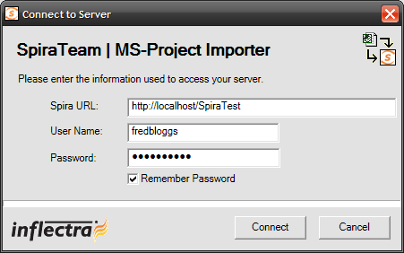
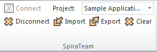

#  Importing from Microsoft Project

The web-based interface of SpiraTeam® is ideal for creating and managing
requirements, releases/iterations and tasks for a new project. However
when migrating requirements and tasks from an existing project, it is
useful to be able to load in an existing project plan in batch and have
SpiraTeam be able to interpret the data.

To simplify this task, SpiraTeam® comes with a Microsoft Project Add-In
that can export requirements, releases and tasks from a populated
MS-Project plan into SpiraTeam®. In addition, the Add-In allows you to
import those same artifacts back into the MS-Project plan to make batch
updates which can then be used to update the master copies on the
server.

Note that this guide refers to SpiraTeam®, but the MS-Project Add-In can
be used with SpiraPlan® as well.

## Installing the Microsoft Project Add-In

The first thing you need to do is to go to the "Add-Ons and Downloads"
page of the Inflectra Website (it can be found in the SpiraPlan or
SpiraTeam sections), and download the **MS-Office Add-Ins** installation
package. There are separate packages for the following versions of MS
Office:

**MS-Office 2003 Add-Ins** -- these are compatible with Microsoft Office
2003 and 2007. They can connect to SpiraTeam v2.3 or later. They also
require Microsoft .NET 3.5.

**MS-Office 2007 Add-Ins** -- these are compatible with Microsoft Office
2007 and 2010. They can connect to SpiraTeam v3.0 or later. They also
require Microsoft .NET 4.0.

**MS-Office 2010 Add-Ins** -- these are compatible with Microsoft Office
2010 and all later versions. They can connect to SpiraTeam v5.0 or
later. They also require Microsoft .NET 4.0.

This installation package will install the add-ins for Microsoft Excel,
Word and Project at the same time. If you don't have the correct version
of Microsoft .NET installed or some of the necessary prerequisites, you
will be given the opportunity to install them when you first run the
installation package.

Once you have the MS-Project Add-In installed, the second thing you may
want to download is the **SampleProjectFile.mpp**
MS-Project plan. This project file contains a fully-populated project
plan and is a good sample to test the import/export before using a real
project plan.

Once you have downloaded the project file, please double-click on it to
open it up in MS-Project. You will notice that there is an additional
toolbar displayed in MS-Project which is used for importing/exporting
data to/from SpiraTeam:

If you are using the MS-Project 2010 Add-In, you will see a modified
version of the toolbar that makes use of the MS-Office Ribbon:

This toolbar allows you to connect to SpiraTeam, and perform the
import/export. The process for using this toolbar is described below:

## Connecting to SpiraTeam®

The first thing you need to do is to click on the \[Connect\] button to
specify the information used to connect to your instance of SpiraTeam:

Please enter the following information into the dialog box:

-   **Spira URL:** Please enter the web address that you use to access
SpiraTeam® in your browser. This is usually of the form
http://\<hostname\>/SpiraTeam. Make sure that you
remove any suffixes from the address (e.g. Default.aspx).

-   **User Name:** Please enter the username that you use for logging in
to SpiraTeam

-   **Password:** Please enter the password that you use for logging in
to SpiraTeam

-   **Remember Password:** If you are using this Add-In on a private
computer, you can check this option to have the system remember your
credentials locally. Please do not use this option on a public
computer and it will compromise the security of your SpiraTeam
installation.

Once you have entered the necessary information, please click
\[Connect\] to authenticate with the server. If the login information is
invalid, you will see an error message appear, otherwise you will be
connected and the list of projects and artifacts will be populated. If
you want to end your session, you should just click the \[Disconnect\]
button and the Add-In will close your connection.

## Choosing the Project

Once you have successfully connected to SpiraTeam, you should now choose
the appropriate Project in the system that you will be importing /
exporting to / from:

Or

Once you have selected the project, there are three buttons that you can
now use:

-   **Import:** Clicking this button will retrieve the data from the
SpiraTeam server and use that to populate the MS-Project file.

-   **Export:** Clicking this button will take the data in the currently
opened MS-Project file and use it to add/update items in SpiraTeam.

-   **Clear:** This button allows you to quickly clear the data in the
current Project file so that you can import a clean version from the
server.

## Importing/Exporting Data

The MS-Project Add-In is capable of either importing data from SpiraTeam
into the project file or exporting data from the project file to
SpiraTeam. However it is important to understand how the system knows
whether to add new items to SpiraTeam or whether to update existing
items:

-   If you start with a blank MS-Project file and enter tasks into it,
they will not have a value set on their Text1 custom field. When you
perform an Export, it will add these as new items in SpiraTeam

-   If you start with a blank import MS-Project file and choose to
Import data from SpiraTeam, those tasks imported will include the ID
of the item in SpiraTeam as their Text1 custom field. You can either
update those tasks or add new tasks in between. Any tasks that have
the Text1 custom property populated will be *updated* in SpiraTeam
when you choose Export, whereas any newly added tasks will be
*inserted* in SpiraTeam.

### Importing from SpiraTeam

The Add-In will import the tasks from SpiraTeam into the MS-Project file
based on the following rules:

-   Any Releases/Iterations in SpiraTeam will be added as zero-effort
(milestone) tasks in the MS-Project plan.

-   Any Requirements in SpiraTeam that have at least one task under
them, will be added as summary tasks in the MS-Project plan. Their
indentation in the project plan will match the requirements'
indentation in SpiraTeam

-   Any Tasks in SpiraTeam will be added as tasks in the MS-Project
plan. The tasks will be nested directly under their parent
requirement's equivalent task in MS-Project.

-   Any Requirements in SpiraTeam that have no tasks under them, will be
added as zero-effort (milestone) tasks in the MS-Project plan. Their
indentation in the project plan will match the requirements'
indentation in SpiraTeam

### Exporting to SpiraTeam

The Add-In will export the tasks in the MS-Project file into SpiraTeam
based on the following rules:

-   Any summary tasks or top-level tasks in the MS-Project file will be
treated as Requirements when being exported to SpiraTeam.

-   Any non-summary tasks that have zero-effort (milestones) that are
not originally Releases/Iterations will be treated as Requirements
when being exported to SpiraTeam.

-   Any non-summary tasks that are NOT at the top-level will be treated
as Tasks when being exported to SpiraTeam. They will be attached to
the requirement that is their parent task in MS-Project.

-   The export function does not update any of the Release/Iteration
items. They need to be updated in SpiraTeam.

-   If you want to prevent an MS-Project Task from being imported into
SpiraTeam simply set the value of its Text1 column to the text
"IGNORE" (without the quotes).

*Be careful when you indent/outdent a task in MS-Project. If you take a
non-summary item (which would be represented by a Task in SpiraTeam) and
make it a summary item by adding child tasks, when you next run Export,
it will get added as a new Requirement in SpiraTeam, with the child
tasks added as Tasks. The old task will still remain in SpiraTeam and
will need to be manually removed.*

