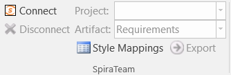
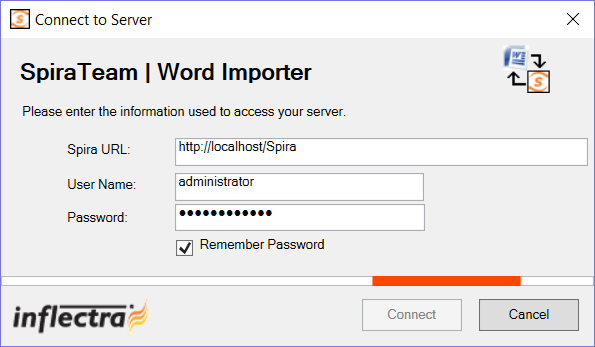
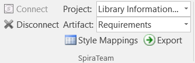
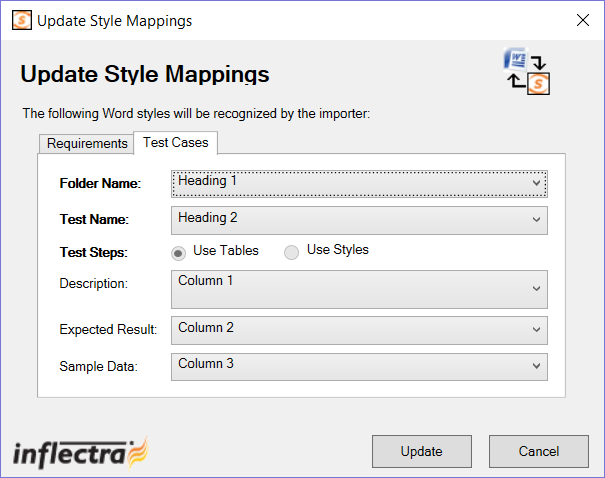

# Importing from Microsoft Word

The web-based interface of SpiraTeam® is ideal for creating and managing
requirements, test cases and incidents for a new project. However often
an organization will often have existing requirements documentation and
test case templates in Microsoft Word format that need to get easily
migrated into SpiraTeam.

To simplify this task, SpiraTeam® comes with a Microsoft Word Add-In
that can export requirements and test cases from a populated Word
document into SpiraTeam®. Note that this guide refers to SpiraTeam®, but
the Word Add-In can be used with SpiraTest® and SpiraPlan® as well. The
only difference is that the Test Case import functionality will not be
applicable for SpiraPlan® users.

## 10Installing the Microsoft Word Add-In

The first thing you need to do is to go to the "Add-Ons and Downloads"
page of the Inflectra Website (it can be found in the SpiraTest,
SpiraPlan or SpiraTeam sections), and download the **MS-Office Add-Ins**
installation package. There are separate packages for the following
versions of MS Office:

**MS-Office 2003 Add-Ins** -- these are compatible with Microsoft Office
2003 and 2007. They can connect to SpiraTeam v2.3 or later. They also
require Microsoft .NET 3.5.

**MS-Office 2007 Add-Ins** -- these are compatible with Microsoft Office
2007 and 2010. They can connect to SpiraTeam v3.0 or later. They also
require Microsoft .NET 4.0.

**MS-Office 2010 Add-Ins** -- these are compatible with Microsoft Office
2010 and later. They can connect to SpiraTeam v5.0 or later. They also
require Microsoft .NET 4.0.

This installation package will install the add-ins for Microsoft Excel,
Word and Project at the same time. If you don't have the correct version
of Microsoft .NET installed or some of the necessary prerequisites, you
will be given the opportunity to install them when you first run the
installation package.

Once you have the Word Add-In installed, the second thing you'll need to
download is the **SampleWordDocument** document. This sample document
contains some example requirements and test cases that be exported into
SpiraTeam. Also the documents make good templates if you're looking for
a way to standardize the import of requirements and test cases. There
are two versions of the document available -
**SampleWordDocument.doc** for Word 2003 and
**SampleWordDocument.docx** for Word 2007 and later.

Once you have downloaded the template, please double-click on it to open
it up in MS-Word. You will notice that there is an additional toolbar
displayed in Word which is used for exporting requirements and test
cases to SpiraTeam:

If you are using the MS-Word 2007 or 2010 Add-In, you will see a
modified version of the toolbar that makes use of the MS-Office Ribbon:

This toolbar allows you to connect to SpiraTeam, and perform the export.
The process for using this toolbar is described below:

## Connecting to SpiraTeam®

The first thing you need to do is to click on the \[Connect\] button to
specify the information used to connect to your instance of SpiraTeam:

Please enter the following information into the dialog box:

-   **Spira URL:** Please enter the web address that you use to access
SpiraTeam® in your browser. This is usually of the form
http://<hostname\>/SpiraTeam. Make sure that you
remove any suffixes from the address (e.g. Default.aspx).

-   **User Name:** Please enter the username that you use for logging in
to SpiraTeam

-   **Password:** Please enter the password that you use for logging in
to SpiraTeam

-   **Remember Password:** If you are using this Add-In on a private
computer, you can check this option to have the system remember your
credentials locally. Please do not use this option on a public
computer and it will compromise the security of your SpiraTeam
installation.

Once you have entered the necessary information, please click
\[Connect\] to authenticate with the server. If the login information is
invalid, you will see an error message appear, otherwise you will be
connected and the list of projects and artifacts will be populated. If
you want to end your session, you should just click the \[Disconnect\]
button and the Add-In will close your connection.

## Choosing the Project and Artifact

Once you have successfully connected to SpiraTeam, you should now choose
the appropriate Project and Artifact in the system that you will be
importing / exporting:

Or

Once you have selected the project and artifact, there are two buttons
that you can now use:

-   **Export:** Clicking this button will take the *currently selected
data* in the document and use it to add new items in SpiraTeam.

-   **Style Mappings:** This button allows you to change the parameters
used by the Add-In when scanning the Word document to know where
each requirement, test case and test step beings and ends.

The parameters selection varies by the type of information being
exported, and will be discussed in the relevant artifact section below:

## Exporting Requirements into SpiraTeam

To export requirements, first you need to open up the MS-Word document
that contains the requirements to be exported. Then you need to click on
the "Style Mappings" icon to display the style mapping configuration
dialog box:

This dialog box allows you to tell the Add-In which styles are being
used in the document to describe each level of Requirements in the
hierarchy. When you run the Export, the Add-In will examine each
paragraph in the document, and any item that matches one of these styles
will be considered the start of a new requirement, and its indentation
level will be based on the appropriate style.

Once you have verified that the styles match those used in your
document, highlight the areas of the document that you wish to import
and click the \[Import\] button. Once you have done this, the Add-In
will scan the selected portions of the document and export the
requirements into the system. During the export, the Add-In uses the
following rules for dealing with the content:

-   The text that matches the selected style will be loaded as the Name
field of the requirement

-   Any text located between the selected styles will be loaded into the
Description field of the requirement. The Add-In will attempt to
match the formatted used in the Word document. However because of
some differences between MS-Word and HTML, it may not be exact.

-   Any embedded images will be added to the requirement as a file
Attachment, with an embedded image tag added to Description field

## Exporting Test Cases into SpiraTeam

To export test cases (and their test steps), first you need to open up
the MS-Word document that contains the test cases to be exported. Then
you need to click on the "Style Mappings" icon to display the style
mapping configuration dialog box:

This dialog box allows you to tell the Add-In which styles are being
used in the document to denote the name of the Test Folder and the name
of the Test Case. For the test steps, the Add-In currently requires that
they be organized in tables, with each column in the table being used
consistently to describe one of the three Test Step fields. For the
import to work correct, your tables need to have at least three (3)
columns so that it can map them correctly. You can use the same column
multiple times (e.g. the contents of column 2 would be imported into
both the expected result and sample data).

Once you have verified that the styles and table columns match those
used in your document, highlight the areas of the document that you wish
to import and click the \[Import\] button. Once you have done this, the
Add-In will scan the selected portions of the document and export the
test cases and test steps into the system. During the export, the Add-In
uses the following rules for dealing with the content:

-   The text that matches the selected style will be loaded as the Name
field of the Test Folder or Test Case

-   Any text located between the selected styles will be loaded into the
Description field of the Test Case. The Add-In will attempt to match
the formatted used in the Word document. However because of some
differences between MS-Word and HTML, it may not be exact.

-   Any embedded images will be added to the Test Case as a file
Attachment, with an embedded image tag added to Description field

-   Any tables located between the selected styles will be treated as
the Test Steps belonging to the previous test case. The fields for
the Test Steps will be populated based on the index of the column.

-   Any text located in the table cells into the appropriate field of
the Test Step. The Add-In will attempt to match the formatted used
in the Word document. However because of some differences between
MS-Word and HTML, it may not be exact.

-   The **first row** of the table is assumed to be a **header row**, so
if you are seeing the first step of your document being omitted, it
means that you need to add a header rows.

## Error Reporting

If there is an error during the import of either requirements or test
cases, the error message will be stored in a text file called
**Spira_WordImport.log** that can be found on the desktop of the user
running the import:

