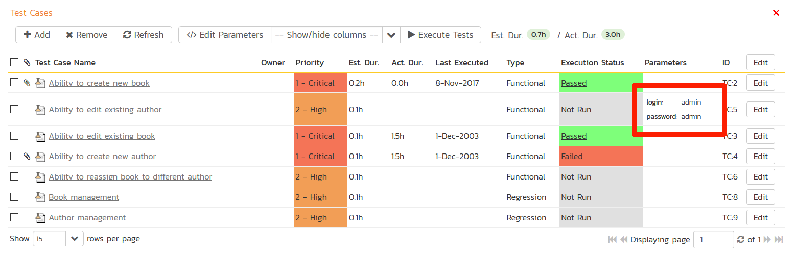

# Command-Line
!!! abstract "Compatible with SpiraTest, SpiraTeam, SpiraPlan"

In addition to the various pre-built plug-ins for different test automation engines, there is a generic command-line engine available that lets RemoteLaunch execute an arbitrary command-line program, capture the console output and send the output back to Spira as the test results. This is useful when you want to be able to use Spira to manage the scheduling and execution of automated testing using an in-house tool or a third-party tool that Inflectra has not yet built a plug-in for.

This section describes how you can use Spira together with RemoteLaunch to schedule and remotely launch instances of a command-line application on different computers and have the "testing" results be transmitted back to Spira. This allows you to extend your Spira's test management capabilities to include automation

*Note: This integration requires at least version 4.0 of Spira and RemoteLaunch.*

## Installing the Command-Line Engine 
This section assumes that you already have a working installation of Spira and have installed RemoteLaunch on the various test automation hosts following the instructions in [RemoteLaunch Guide](RemoteLaunch-Guide.md). Once those prerequisites are in place, please follow these steps:

- Download and extract the CommandLineAutomationEngine.zip file from the Inflectra website and locate the CommandLine.dll
- Copy the file "CommandLine.dll" into the "extensions" sub-folder of the RemoteLaunch installation.
- Log in to Spira as a system administrator and go into Spira main Administration page and click on the "Test Automation" link under **Integration**.
- Click the "Add" button to enter the new test automation engine details page. The fields required are as follows:

    - **Name**: This is the short display name of the automation engine. It can be anything that is meaningful to your users.
    - **Description**: This is the long description of the automation engine. It can be anything that is meaningful to your users. (Optional)
    - **Active**: If checked, the engine is active and able to be used for any project.
    - **Token**: This needs to be the assigned unique token for the automation engine and is used to tell RemoteLaunch which engine to actually use for a given test case. For Command-Line this should be simply **"CommandLine"**.

-   Once you have finished, click the "Insert & Close" button and you will be taken back to the Test Automation list page, with Command-Line listed as an available automation engine.

### Command-Line RemoteLaunch Settings
You may need to modify the Command-Line configuration for some of the specific automation hosts, by right-clicking on the RemoteLaunch icon in the system tray and choosing "Configuration". That will bring up the RemoteLaunch configuration page. The Command-Line engine adds its own tab to this page which allows you to configure how the Command-Line engine operates:

The following fields can be specified on this screen:

- **RunAs Administrator** -- This normally should not be checked. However if your automation tool requires Windows UAC elevation to operate, you will need to select this option. We recommend initially trying your tool with the value unchecked. Then, if you get an error message "requires elevation" in the test results you will need to select the option.
- **Log Results** -- Normally the command-line engine will capture the output results from the command-line and send the results back to Spira as the test result. When you are executing a tool that directly integrates with Spira (e.g. a NUnit test suite that is already integrated with Spira) you don't want two different results to be sent back. In such a scenario, deselecting this option will prevent the command-line engine from sending back its own test result.
- **Default Status** -- This specifies the execution status that will be returned to Spira in the event that none of the regular expressions (Regex) specified match the results returned from the test application. By default, the system will return "Passed" if none of the other regular expressions match correctly.
- **Pass Regex** -- This is the regular expression that is used to match a passed test result. By default the system will search for the phrase "Pass" in the test output and return a Passed status if the match is successful.
- **Fail Regex** -- This is the regular expression that is used to match a failed test result. By default the system will search for the phrases "Fail", "Error" and "Fatal" in the test output and return a Fail status if any of the matches are successful.
- **Caution Regex** -- This is the regular expression that is used to match a caution test result. By default the system will search for the phrases "Warning" and "Caution" in the test output and return a Caution status if any of the matches are successful.
- **Blocked Regex** -- This is the regular expression that is used to match a blocked test result. By default the system will search for the phrase "Blocked" in the test output and return a Blocked status if the match is successful.
- **Test Regular Expressions** -- This text box lets you enter in some sample text and see how the Command-Line extension would interpret it. Once you have entered in the text, click "Test Regular Expression..." and the system will display a popup message box letting you know what the outcome of such a test would be interpreted as:

  

## Setting up the Automated Test Cases
This section describes the process for setting up a test case in Spira for automation and either linking it to an existing test script file or entering a test script directly into Spira.

### Attaching a Command-Line Test Script
First you need to display the list of test cases in Spira (by clicking Testing \> Test Cases) and then add a new test case. Once you have added the new test case, click on it and select the "Automation" tab:

You need to enter the following fields:

- **Automation Engine** - Choose the Command-Line Automation Engine that you created in the previous section from the drop-down list.
- **Script Type** -- This should be set to Attached for this case
- **Filename** -- This needs to consist of the following sections separated by a pipe (\|) character:

    - The full path to the command-line tool. To make this easier across different machines, you can use several constants for standard Windows locations:

        - \[MyDocuments\] -- The user's "My Documents" folder. The user indicated is the user that ran RemoteLaunch.
        - \[CommonDocuments\] -- The Public Document's folder.
        - \[DesktopDirectory\] -- The user's Desktop folder. The user indicated is the user that ran RemoteLaunch.
        - \[ProgramFiles\] -- Translated to the Program Files directory. For 64-bit machines, it's the 64-bit directory.
        - \[ProgramFilesX86\] -- Translated to the 32-bit Program Files directory.

    - Any arguments for the command-line tool, with the filename specified as {filename}. This special token will be replaced by the actual filename of the test script when RemoteLaunch downloads it from Spira. In addition, you can use the following additional tokens for some of the special Spira ID values:

        - \[TestCaseId\] -- the ID of the test case
        - \[TestSetId\] -- the ID of the test set
        - \[ReleaseId\] -- the ID of the release (if specified)
        - \[ProjectId\] -- the ID of the project

    - An example filename would be: C:\\Temp\\TestApp.exe\|-arg1 -arg2 "-arg3={filename}"\|

- **Document Type** -- If using Spira (not Spira) you can choose which document type the automated test script will be categorized under.
- **Document Folder** -- If using Spira (not Spira) you can choose which document folder the automated test script will be stored in.
- **Version** -- The version of the test script (1.0 is used if no value specified)
- **Test Script** -- This needs to contain the complete test script in whatever language and syntax is being expected by the command-line application

If you would like to have Spira pass any parameter values to this test script (this will be discussed in more detail later) you can specify them by using the syntax ${parameterName} inside the test script.

Once you are happy with the values, click \[Save\] to update the test case. Now you are ready to schedule the automated test case for execution.

### Linking a Command-Line Test Script
First you need to display the list of test cases in Spira (by clicking Testing \> Test Cases) and then add a new test case. Once you have added the new test case, click on it and select the "Automation" tab:

You need to enter the following fields:

- **Automation Engine** - Choose the Command-Line Automation Engine that you created in the previous section from the drop-down list.
- **Script Type** -- This should be set to Linked for this case
- **Filename** -- This needs to consist of the following sections separated by a pipe (\|) character:

    - The full path to the command-line tool. To make this easier across different machines, you can use several constants for standard Windows locations:

        - \[MyDocuments\] -- The user's "My Documents" folder. The user indicated is the user that ran RemoteLaunch.
        - \[CommonDocuments\] -- The Public Document's folder.
        - \[DesktopDirectory\] -- The user's Desktop folder. The user indicated is the user that ran RemoteLaunch.
        - \[ProgramFiles\] -- Translated to the Program Files directory. For 64-bit machines, it's the 64-bit directory.
        - \[ProgramFilesX86\] -- Translated to the 32-bit Program Files directory.

    - Any arguments for the command-line tool, including the filepath of the test script file that the command-line tool will be executing. In addition, you can use the following additional tokens for some of the special Spira ID values:

        - \[TestCaseId\] -- the ID of the test case
        - \[TestSetId\] -- the ID of the test set
        - \[ReleaseId\] -- the ID of the release (if specified)
        - \[ProjectId\] -- the ID of the project

    - The mask for converting any parameter values from Spira into valid command line arguments. If parameters are not accepted by the command-line tool, you can leave this section out.

        - The mask can include any symbols together with "name" to refer to the parameter name and "value" to refer to the parameter value.
        - Example 1: If you want parameters to provided in the form: -param1=value1 --param2=value2 you would use the following mask: -name=value
        - Example 2: If you want parameters to provided in the form: /param1:value1 /param2:value2 you would use the following mask: /name:value

    - An example filename would be: C:\\Temp\\TestApp.exe\|-arg1 -arg2\|-name=value

- **Document Type** -- If using Spira (not Spira) you can choose which document type the automated test script will be categorized under.
- **Document Folder** -- If using Spira (not Spira) you can choose which document folder the automated test script will be stored in.
- **Version** -- The version of the test script (1.0 is used if no value specified)
- **Test Script** -- *This is not used when you are using the linked test script option*

Once you are happy with the values, click \[Save\] to update the test case. Now you are ready to schedule the automated test case for execution.

### Using Parameterized Test Cases
There is an advanced feature of Spira/Team and RemoteLaunch that lets you pass parameters from Spira to your command-line automated testing tool. This is very useful if you want to have a data-driven test script that be executed multiple times with different parameter values.

To setup the automated test case for parameters, click on the "Edit Parameters" hyperlink above the "Test Script" box:

The name of the parameter ${login} needs to match the name of a parameter accepted by the command-line tool.

## Executing the Command-Line Test Sets from Spira

There are two ways to execute automated test cases in Spira:

1.  Schedule the test cases to be executed on a specific computer (local or remote) at a date/time in the future
2.  Execute the test cases right now on the local computer.

We shall outline both of these two scenarios in this section. However first we need to setup the appropriate automation hosts and test sets in Spira:

### Configuring the Automation Hosts and Test Sets
Go to Testing \> Automation Hosts in Spira to display the list of automation hosts:

Make sure that you have created an Automation Host for each computer that is going to run an automated test case. The name and description can be set to anything meaningful, but the Token field **must be set to the same token that is specified in the RemoteLaunch application** on that specific machine.

Once you have at least one Automation Host configured, go to Testing \> Test Sets to create the test sets that will contain the automated test case:

Note: Unlike manual test cases, automated test cases *must be executed within a test set* -- they cannot be executed directly from the test case.

Create a new Test Set to hold the Command-Line automated test cases and click on its hyperlink to display the test set details page:

You need to add at least one automated test case to the test set and then configure the following fields:

-   **Automation Host** -- This needs to be set to the name of the automation host that will be running the automated test set.
-   **Planned Date** -- The date and time that you want the scenario to begin. (Note that multiple test sets scheduled at the exact same time will be scheduled by Test Set ID order.)
-   **Status** -- This needs to be set to "Not Started" for RemoteLaunch to pick up the scheduled test set. When you change the Planned Date, the status automatically switches back to "Not Started"
-   **Type** -- This needs to be set to "Automated" for automated testing

If you have parameterized test cases inside the automated test set you can set their values in three different ways:

-   **Test Set Parameter Values** -- this lets you set the same value of a parameter for all the test cases in the test set:

-   **Test Case Parameter Values** -- this lets you set a specific value for a parameter for a particular test case in the test set:

You set these values, by right-clicking on a row and choosing "Edit Parameters":

-   **Test Configurations** -- this lets you create a data grid of possible test parameters and execute the test set multiple times, once for each unique combination:

### Executing the Test Sets
Once you have set the various test set fields (as described above), the Remote Launch instances will periodically poll Spira for new test sets. Once they retrieve the new test set, they will add it to their list of test sets to execute. Once execution begins they will change the status of the test set to "In Progress", and once test execution is done, the status of the test set will change to either "Completed" --
the automation engine could be launched and the test has completed -- or "Blocked" -- RemoteLaunch was not able to start the automation engine.

If you want to immediately execute the test case on your local computer, instead of setting the "Automation Host", "Status" and "Planned Date" fields, you can instead click the \[Execute\] icon on the test set itself. This will cause RemoteLaunch on the local computer to immediately start executing the current test set.

In either case, once all the test cases in the test set have been completed, the status of the test set will switch to "Completed" and the individual test cases in the set will display a status based on the results of the command-line test:

- **Passed** -- The automated test ran successfully and the results output to the console did not include any of the phrases -- FAIL, ERROR, FATAL, WARNING, CAUTION
- **Failed** -- The automated test ran successfully, but one of the phrases -- FAIL, ERROR, FATAL -- was included in the console output
- **Caution** -- The automated test ran successfully, but one of the phrases -- WARNING, CAUTION -- was included in the console output
- **Blocked** -- The automated test did not run successfully

If you receive the "Blocked" status for either the test set or the test cases you should open up the Windows Application Event Log on the computer running RemoteLaunch and look in the event log for error messages.

*Note: While the tests are executing you may see application windows launch as the command-line tool server executes the appropriate tests.*

Once the tests have completed, you can log back into Spira and see the execution status of your test cases. If you click on a Test Run that was generated by the command-line tool, you will see the following information:

This screen indicates the status of the test run that was reported back from command-line tool together with any messages or other information. The execution status will be set according to the rules described above, the Message field will contain the first line of console output and the large details box will contain the full console output from the command-line tool.

Congratulations... You are now able to run a custom command-line run tests and have the results be recorded within Spira.