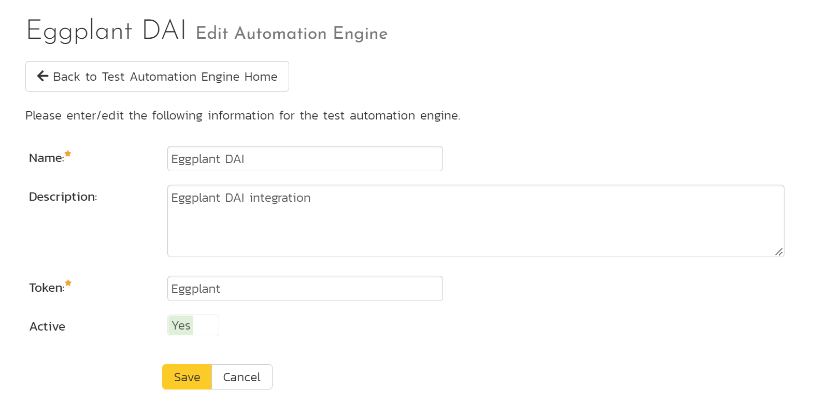
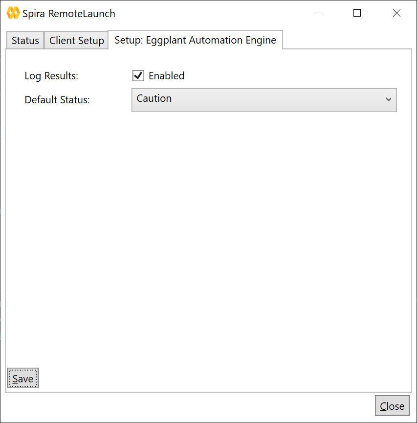
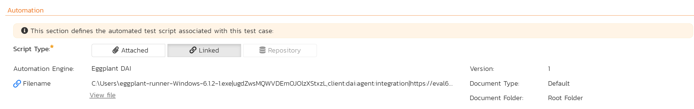
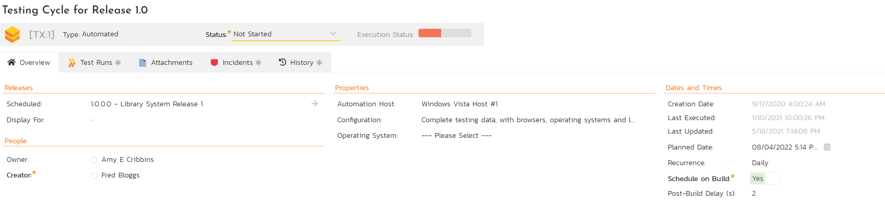
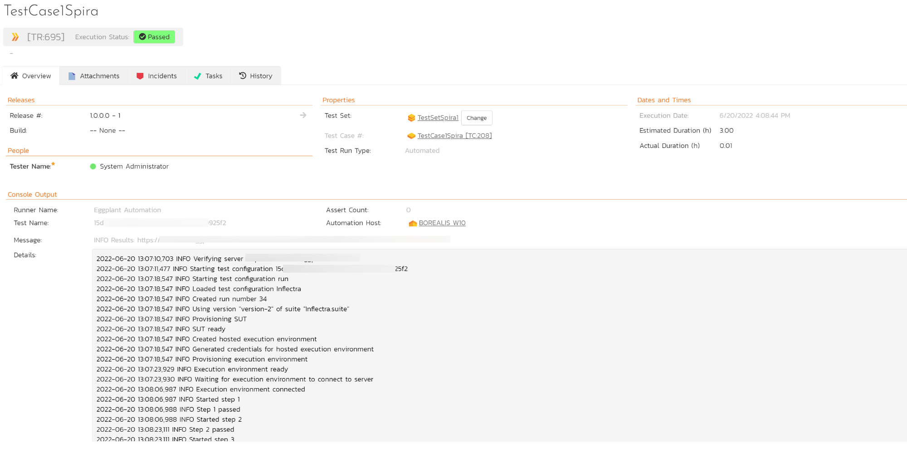

# Eggplant DAI
Eggplant Digital Automation Intelligence (DAI) is a functional test automation system. Eggplany uses a command-line tool to allow users to more easily triggering automated tests remotely. RemoteLaunch's dedicated Eggplant engine uses this command-line tool to run automated tests in Eggplant, once triggered for a SpiraPlan test set. RemoteLaunch's Eggplant engine reports the results of the output from Eggplant back to SpiraPlan as test run results.

This page describes how you can use SpiraTest, SpiraTeam, or SpiraPlan (hereafter SpiraPlan) together with RemoteLaunch to schedule and remotely launch Eggplant DAI tests and have the results transmitted back to SpiraPlan. This allows you to extend your SpiraPlan's test management capabilities to include automation.

*Note: This integration requires at least: SpiraTest/Team v4.0, RemoteLaunch, and Eggplant DAI v6.2.*

## Installing the Eggplant Engine
This section assumes that you already have a working installation of SpiraPlan and of RemoteLaunch as described [here](../RemoteLaunch-Guide/). Once these prerequisites are in place, please follow these steps:

- Download the Eggplant Runner Tool for Windows and save it in a convenient directory, of your choice.
- Download and extract the *EggplantAutomationEngine.zip* file from the Inflectra website and locate the *Eggplant.dll*
- Copy the file *Eggplant.dll* into the "extensions" sub-folder of the RemoteLaunch installation.
- Log in to SpiraPlan as a system administrator and go into SpiraPlan main Administration page and click on the "Test Automation" link under **Integration**.
- Click the "Add" button to enter the new test automation engine details page. The fields required are as follows:

    - **Name**: This is the short display name of the automation engine. It can be anything that is meaningful to your users.
    - **Description**: This is the long description of the automation engine. It can be anything that is meaningful to your users. (Optional)
    - **Active**: If checked, the engine is active and able to be used for any project.
    - **Token**: This needs to be the assigned unique token for the automation engine and is used to tell RemoteLaunch which engine to actually use for a given test case. For this engine, simple use **Eggplant**.

- Once you have finished, click the "Insert & Close" button and you will be taken back to the Test Automation list page, with Eggplant DAI listed as an available automation engine.

### Advanced Settings
You can modify the Eggplant DAI configuration for each of the specific automation hosts, by right-clicking on the RemoteLaunch icon in the system tray and choosing "Configuration". That will bring up the RemoteLaunch configuration page.

The Eggplant DAI engine adds its own tab to this page which allows you to configure how it operates:

The following fields can be specified on this screen:

- **Log Results**: The engine will save the Eggplant console output of every Test Case in the "Details" section of each respective Test Run. Enable this option to also export the Eggplant console outupt to a textfile, saved on a subfolder "logs" at the same directory RemoteLaunch is located. By default, this option is disabled.
- **Default Status**: This specifies the execution status that will be returned to SpiraPlan in the event that Eggplant could not be reached due to external problems (e.g.: network issues, wrong command line, etc.) for each Test Case. By default, the system will save the Test Case as "Not Run".

## Setting up the Automated Test Cases
This section describes the process for setting up a test case in SpiraPlan for automation and either linking it to a command that triggers Eggplant DAI remote execution.

### Attaching a Command-Line Test Script
First, you need to display the list of test cases in SpiraPlan (by clicking Testing \> Test Cases) and then add a new test case. Once you
have added the new test case, click on it and select the "Automation" tab:

You need to enter the following fields:

- **Automation Engine**: Choose the Command-Line Automation Engine that you created in the previous section from the drop-down list.
- **Script Type**: This should be set to **Linked** for this case
- **Filename**: This needs to consist of the following sections separated by a pipe (\|) character:

    - The full path to the Eggplant command-line runner tool. To make this easier across different machines, you can use several constants for standard Windows locations:

        - \[MyDocuments\]: The user's "My Documents" folder
        - \[CommonDocuments\]: The Public Document's folder
        - \[DesktopDirectory\]: The user's Desktop folder
        - \[ProgramFiles\]: Translated to the Program Files directory. For 64-bit machines, it's the 64-bit directory
        - \[ProgramFilesX86\]: Translated to the 32-bit Program Files directory

    - The Eggplant Client Secret number *and* the Eggplant Client Id, separated by a comma (,)
    - The Eggplant instance URL to connect in
    - The Eggplant Test Configuration ID number to associate with this Spira Test Case
    
    - An example of filename would be: `C:\Users\eggplant-runner-Windows-6.1.2-1.exe|umthdbvwiuy76bXStxzL,32584136987|https://mycompany.dai.eggplant.cloud|15d0d5e8-c3frt-8541-v5t9-d423760925f2`

- **Document Type**: If using SpiraPlan (not SpiraTest) you can choose which document type the automated test script will be categorized under.
- **Document Folder**: If using SpiraPlan (not SpiraTest) you can choose which document folder the automated test script will be stored in.
- **Version**: The version of the test script (1.0 is used if no value specified).

Once you are happy with the values, click \[Save\] to update the test case. Now you are ready to schedule the automated test case for execution.

## Executing the Test Sets from SpiraPlan
There are two ways to execute automated test cases in SpiraPlan:

1. Schedule the test cases to be executed on a specific computer (local or remote) at a date/time in the future
2. Execute the test cases right now on the local computer.

We shall outline both of these two scenarios in this section. However, first we need to setup the appropriate automation hosts and test sets in SpiraPlan:

### Configuring the Automation Hosts and Test Sets
Go to Testing > Automation Hosts in SpiraPlan to display the list of automation hosts:

Make sure that you have created an Automation Host for each computer that is going to run an automated test case. The name and description can be set to anything meaningful, but the Token field **must be set to the same token that is specified in the RemoteLaunch application** on that specific machine.

Once you have at least one Automation Host configured, go to Testing \> Test Sets to create the test sets that will contain the automated test case.

Note: Unlike manual test cases, automated test cases *must be executed within a test set* -- they cannot be executed directly from the test case.

Create a new Test Set to hold the Eggplant automated test cases and click on its hyperlink to display the test set details page:

You need to add at least one automated test case to the test set and then configure the following fields:

- **Automation Host**: This needs to be set to the name of the automation host that will be running the automated test set.
- **Planned Date**: The date and time that you want the scenario to begin. (Note that multiple test sets scheduled at the exact same time will be scheduled by Test Set ID order.)
- **Status**: This needs to be set to "Not Started" for RemoteLaunch to pick up the scheduled test set. When you change the Planned Date, the status automatically switches back to "Not Started"
- **Type**: This needs to be set to "Automated" for automated testing

### Executing the Test Sets

Once you have set the various test set fields (as described above), the RemoteLaunch instances will periodically poll SpiraPlan for new test sets. Once they retrieve the new test set, they will add it to their list of test sets to execute. Once execution begins they will change the status of the test set to "In Progress", and once test execution is done, the status of the test set will change to either "Completed" -- the automation engine could be launched and the test has completed -- or "Blocked" -- RemoteLaunch was not able to start the automation engine. If you want to immediately execute the test case on your local computer, instead of setting the "Automation Host", "Status" and "Planned Date" fields, you can instead click the \[Execute\] icon on the test set itself. This will cause RemoteLaunch on the local computer to immediately start executing the current test set.

In either case, once all the test cases in the test set have been completed, the status of the test set will switch to "Completed" and the individual test cases in the set will display a status based on the results of the Eggplant test:

- **Passed**: The automated test ran successfully and the results output to the console include the SUCCESS status
- **Failed**: The automated test ran successfully, but one of the status FAILURE was included in the console output
- **Blocked**: The automated test did not run successfully - please check the console output for details

If you receive the "Blocked" status for either the test set or the test cases you should open up the Windows Application Event Log on the computer running RemoteLaunch and look in the event log for error messages.

*Note: While the tests are executing you may see application windows launch as the command-line tool server executes the appropriate tests. Please do not close them.*

Once the tests have been completed, you can log back into SpiraPlan and see the execution status of your test cases. If you click on a Test Run that was generated by the command-line tool, you will see the following information:

This screen indicates the status of the test run that was reported back from the engine together with any messages or other information. The execution status will be set according to the rules described above,
the Message field will contain a weblink for the detailed online results at Eggplant and the large details box will contain the full console output from the Eggplant command-line tool.

Congratulations! You are now able to run the Eggplant automated tests and have the results recorded within SpiraTest / SpiraPlan.