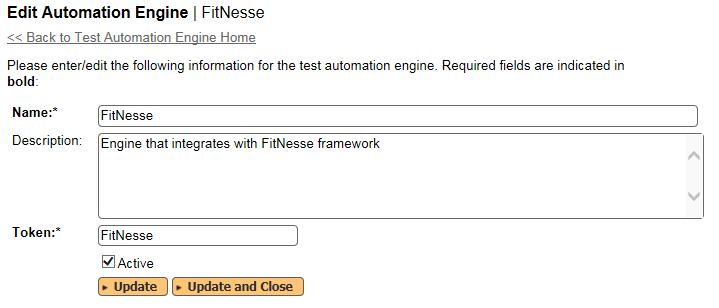
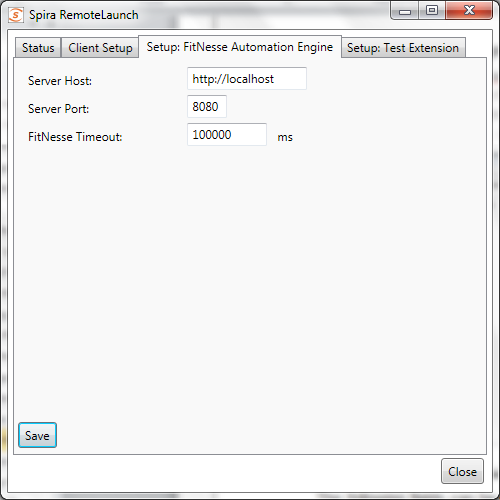
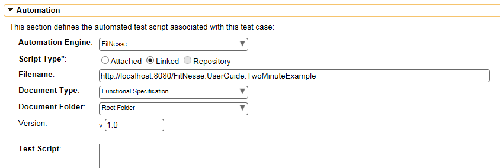
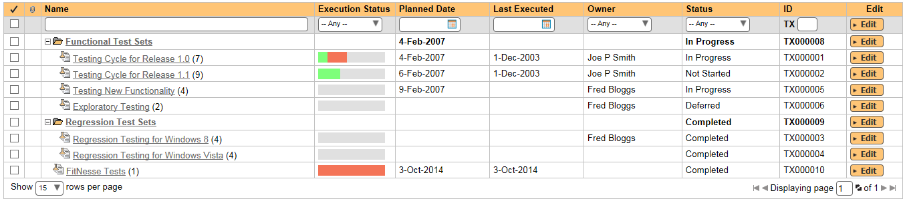
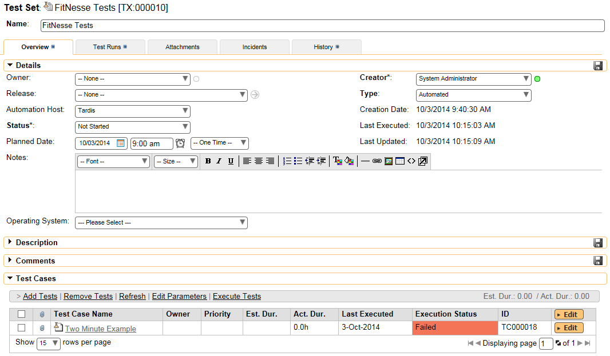
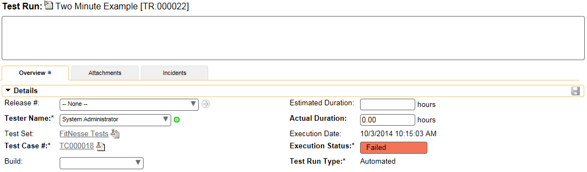
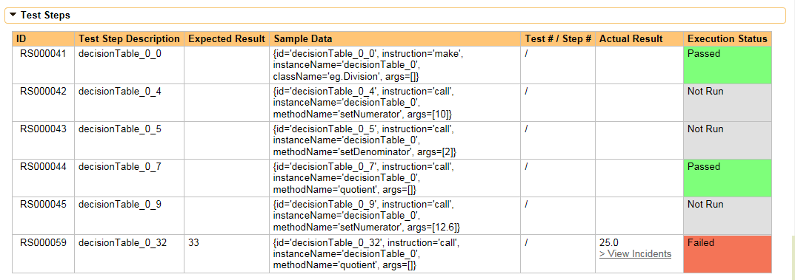
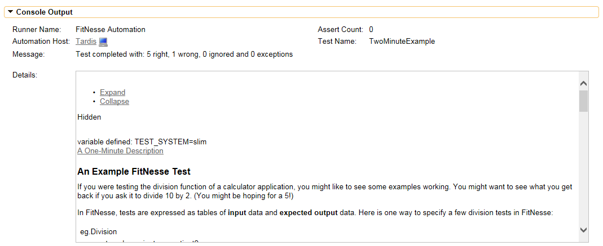

# FitNesse

FitNesse is a lightweight, open-source automated software testing
framework that uses web-based Wikis to define the inputs and expected
results from different combinations of input values and then compare the
results with what is actually generated during testing. For more details
on FitNesse, please refer to the FitNesse website: <http://fitnesse.org>

This section describes how you can use SpiraTest / SpiraTeam (hereafter
SpiraTeam) together with RemoteLaunch to schedule and remotely launch
instances of FitNesse on different computers and have the testing
results be transmitted back to SpiraTeam. This allows you to extend your
SpiraTeam's test management capabilities to include automated FitNesse
acceptance tests.

*Note: This integration requires at least version 4.0 of SpiraTest/Team
and RemoteLaunch.*

## Installing the FitNesse Engine

This section assumes that you already have a working installation of
SpiraTest or SpiraTeam and have installed RemoteLaunch on the various
test automation hosts following the instructions in [RemoteLaunch Guide](../RemoteLaunch-Guide/).
Once those prerequisites are in place, please follow these steps:

Download and extract the FitNesseEngine.zip file from the
Inflectra website and c*opy the file "FitNesseEngine.dll" into the
"extensions" sub-folder of the RemoteLaunch installation.*

You may also need to verify that you have the full Microsoft .NET
Framework 4.0 installed since that is needed by the FitNesse engine.
RemoteLaunch itself only needs the .NET 4.0 Client Profile, so make sure
you have the .NET 4.0 Framework Extended entry listed in the Program &
Features section of the Windows Control Panel.

Log in to SpiraTeam as a system administrator and go into SpiraTeam main
Administration page and click on the "Test Automation" link under
**Integration**.

-   Click the "Add" button to enter the new test automation engine
details page. The fields required are as follows:

-   **Name**: This is the short display name of the automation
engine. It can be anything that is meaningful to your users.

-   **Description**: This is the long description of the automation
engine. It can be anything that is meaningful to your users.
(Optional)

-   **Active**: If checked, the engine is active and able to be used
for any project.

-   **Token**: This needs to be the assigned unique token for the
automation engine and is used to tell RemoteLaunch which engine
to actually use for a given test case. For FitNesse this should
be simply **FitNesse**.

-   Once you have finished, click the "Insert & Close" button and you
will be taken back to the Test Automation list page, with FitNesse
listed as an available automation engine.

### Advanced Settings

You can modify the FitNesse configuration for each of the specific
automation hosts, by right-clicking on the RemoteLaunch icon in the
system tray and choosing "Configuration". That will bring up the
RemoteLaunch configuration page. The FitNesse engine adds its own tab to
this page which allows you to configure how FitNesse operates:

The following fields can be specified on this screen:

**Server Host** -- This should be the base URL for accessing the
installation of FitNesse. Each of the FitNesse test cases will be a URL
relative to this base URL.

**Server Port** -- This should be set to the TCP port that the FitNesse
web server uses for displaying the FitNesse wiki web pages.

**FitNesse Timeout** -- This allows you to extend the timeout for
executing FitNesse tests. This is useful if you find that the FitNesse
tests take a long time to execute and RemoteLaunch is aborting the
execution before they are finished.

## Setting up the Automated Test Cases

This section describes the process for setting up a test case in
SpiraTeam for automation and linking it to an existing FitNesse test
case wiki page. Note: The FitNesse automation engine only supports
Linked test scripts in SpiraTeam (not Attached).

First you need to display the list of test cases in SpiraTeam (by
clicking Testing \> Test Cases) and then add a new test case. Once you
have added the new test case, click on it and go to the "Automation"
section located in the "Overview" tab:

You need to enter the following fields:

- **Automation Engine** - Choose the FitNesse Automation Engine that you
created in the previous section from the drop-down list.

- **Script Type** -- This should be set to Linked for FitNesse tests.

- **Filename** -- This needs to be the relative URL of the FitNesse test
case. I.e. if the FitNesse URL is
<http://myserver/FitNesse.UserGuide.TwoMinuteExample> and the base URL
setup in RemoteLaunch is <http://myserver> then the "filename" would be
just FitNesse.UserGuide.TwoMinuteExample.

- **Document Type** -- You can choose which document type the automated
test script will be categorized under.

- **Document Folder** -- You can choose which document folder the
automated test script will be stored in.

- **Version** -- The version of the test script (1.0 is used if no value
specified)

- **Test Script** -- *This is not used when you are using the linked test
script option*

Once you are happy with the values, click \[Save\] to update the test
case. Now you are ready to schedule the automated test case for
execution.

### Using Parameterized Test Cases

The FitNesse automation engine does not currently support the passing of
parameter values from SpiraTeam to the FitNesse test.

## Executing the FitNesse Test Sets from SpiraTeam

There are three ways to execute automated test cases in SpiraTeam:

1.  Schedule the test cases to be executed on a specific computer (local
or remote) at a date/time in the future

2.  Execute the test cases right now on the local computer.

3.  Execute the test cases from the command-line or a build script

We shall outline each of these three scenarios in this section. However
first we need to setup the appropriate automation hosts and test sets in
SpiraTeam:

### Configuring the Automation Hosts and Test Sets

Go to Testing \> Automation Hosts in SpiraTeam to display the list of
automation hosts:

Make sure that you have created an Automation Host for each computer
that is going to run an automated test case. The name and description
can be set to anything meaningful, but the Token field **must be set to
the same token that is specified in the RemoteLaunch application** on
that specific machine.

Once you have at least one Automation Host configured, go to Testing \>
Test Sets to create the test sets that will contain the automated test
case:

Note: Unlike manual test cases, automated test cases *must be executed
within a test set* -- they cannot be executed directly from the test
case.

Create a new Test Set to hold the FitNesse automated test cases and
click on its hyperlink to display the test set details page:

You need to add at least one automated test case to the test set and
then configure the following fields:

-   **Automation Host** -- This needs to be set to the name of the
automation host that will be running the automated test set.

-   **Planned Date** -- The date and time that you want the scenario to
begin. (Note that multiple test sets scheduled at the exact same
time will be scheduled by Test Set ID order.)

-   **Status** -- This needs to be set to "Not Started" for RemoteLaunch
to pick up the scheduled test set. When you change the Planned Date,
the status automatically switches back to "Not Started"

-   **Type** -- This needs to be set to "Automated" for automated
testing

### Executing the Test Sets

Once you have set the various test set fields (as described above), the
Remote Launch instances will periodically poll SpiraTeam for new test
sets. Once they retrieve the new test set, they will add it to their
list of test sets to be executed. Once execution begins they will change
the status of the test set to "In Progress", and once test execution is
done, the status of the test set will change to either "Completed" --
the automation engine could be launched and the test has completed -- or
"Blocked" -- RemoteLaunch was not able to start the automation engine.

If you want to immediately execute the test case on your local computer,
instead of setting the "Automation Host", "Status" and "Planned Date"
fields, you can instead click the \[Execute\] icon on the test set
itself. This will cause RemoteLaunch on the local computer to
immediately start executing the current test set.

In either case, once all the test cases in the test set have been
completed, the status of the test set will switch to "Completed" and the
individual test cases in the set will display a status based on the
results of the FitNesse test:

**Passed** -- The FitNesse automated test ran successfully and all the
test conditions in the test script passed

**Failed** -- The FitNesse automated test ran successfully, but at least
one test condition in the test script failed.

**Blocked** -- The FitNesse automated test did not run successfully

If you receive the "Blocked" status for either the test set or the test
cases you should open up the Windows Application Event Log on the
computer running RemoteLaunch and look in the event log for error
messages.

*Note: While the tests are executing you may see command windows appear
as the FitNesse server executes the appropriate tests.*

Once the tests have completed, you can log back into SpiraTeam and see
the execution status of your test cases. If you click on a Test Run that
was generated by FitNesse, you will see the following information:

This screen indicates the status of the test run that was reported back
from FitNesse together with any messages or other information. The
execution status will be set to PASSED if all the FitNesse rows report
back OK and all the tests passed. If any of the rows failed or the tests
don't pass, the overall execution status will be listed as FAILED.

You can see a step-by-step record of what happened by scrolling down to
the "Test Steps" section:

In addition, you can scroll down to the "Console Output" section to get
the FitNesse specific information:

The Message field will contain a summary of the number of tests executed
and the number of wrong results and exceptions. The large details box
contains the full command execution log as reported back from FitNesse:

Congratulations... You are now able to run FitNesse automated acceptance
tests and have the results be recorded within SpiraTest / SpiraTeam.

