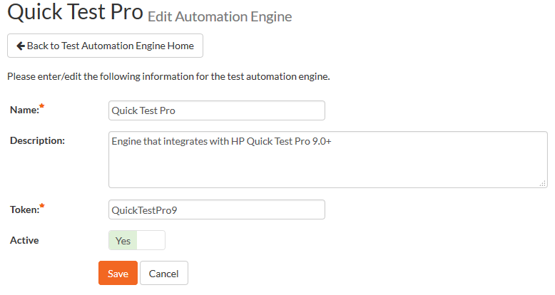
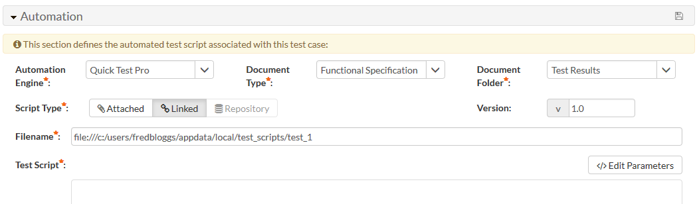
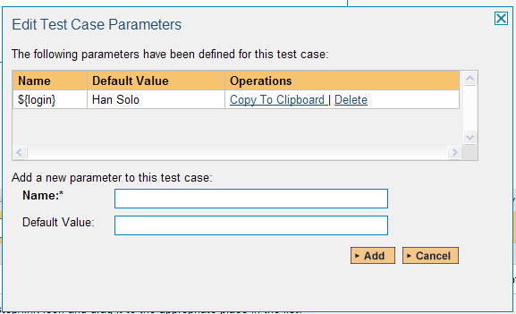
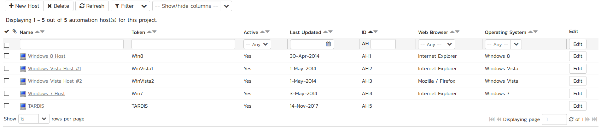
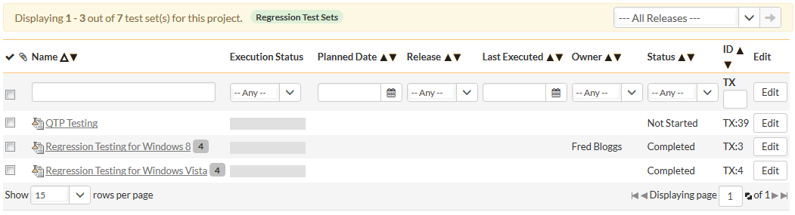
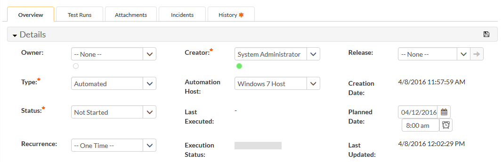
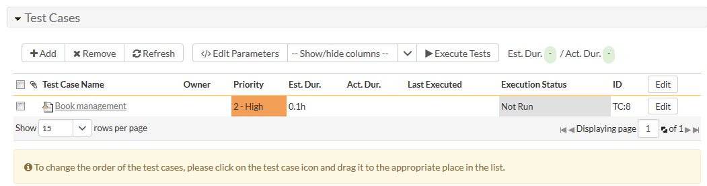
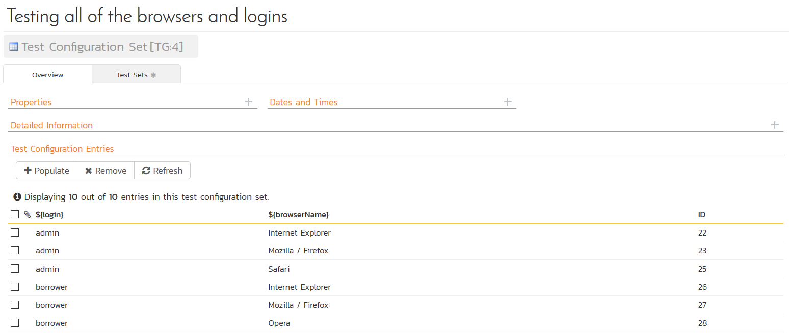
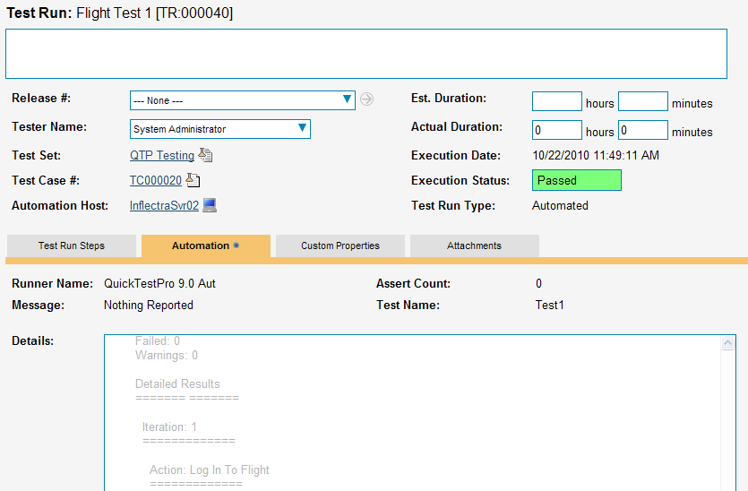

# HP UFT / QTP
!!! abstract "Compatible with SpiraTest, SpiraTeam, SpiraPlan"

HP® QuickTest Professional® (hereafter QTP) is an automated functional test automation system that lets you record application operations and generate VBA test automation scripts that can be used to playback the test script against the test application.

HP® Unified Functional Testing® (hereafter UFT) is an updated version of QTP that also includes functionality for web service testing.

This section describes how you can use Spira (hereafter Spira) together with RemoteLaunch to schedule and remotely launch instances of QTP and UFT on different computers and have the testing results be transmitted back to Spira. This allows you to extend your Spira's test management capabilities to include automated QTP and UFT tests.

*Note: This integration requires at least version 3.0 of Spira and version 9.0 of Quick Test Professional. For accessing UFT, you'd need at least version 4.0 of Spira and version 11.0 of UFT.*

## Installing the UFT/QTP Engine
This section assumes that you already have a working installation of Spira and have installed RemoteLaunch on the various test automation hosts following the instructions in [RemoteLaunch Guide](RemoteLaunch-Guide.md). Once those prerequisites are in place, please follow these steps:

-   Download and extract the QuickTestProAutomationEngine.zip file from the Inflectra website and locate the appropriate QuickTestProX.dll or UftX.dll for the version of QTP or UFT that you are using.
-   If you don't see the version listed, just use the nearest version that is *lower* than your current version.
-   Copy the file "QuickTestProX.dll" or "UftX.dll" (where X is the appropriate version) into the "extensions" sub-folder of the RemoteLaunch installation.
-   Log in to Spira as a system administrator and go into Spira main Administration page and click on the "Test Automation" link under **Integration**.
-   Click the "Add" button to enter the new test automation engine details page. The fields required are as follows:



    -   **Name**: This is the short display name of the automation engine. It can be anything that is meaningful to your users.
    -   **Description**: This is the long description of the automation engine. It can be anything that is meaningful to your users. (Optional)
    -   **Active**: If checked, the engine is active and able to be used for any project.
    -   **Token**: This needs to be the assigned unique token for the automation engine and is used to tell RemoteLaunch which engine to actually use for a given test case.
     
        - For QTP this should be **QuickTestProX** where 'X' is the version number of the DLL file that you are using. 
        - For UFT this should be **UftX** where 'X' is the version number of the DLL file that you are using.
        - Once you have finished, click the "Insert & Close" button and you will be taken back to the Test Automation list page, with QTP listed as an available automation engine.

## Setting up the Automated Test Cases

This section describes the process for setting up a test case in Spira for automation and linking it to an automated QTP or UFT test script.

First you need to display the list of test cases in Spira (by clicking Testing \> Test Cases) and then add a new test case. Once you have added the new test case, click on it and select the "Overview" tab and scroll down to the 'Automation' section:



You need to enter the following fields:

- **Automation Engine** - Choose the QTP/UFT Automation Engine that you created in the previous section from the drop-down list.
- **Script Type**: This should be set to Linked as the integration with QTP/UFT only supports referencing QTP/UFT test script folder paths and not physically uploading the test scripts into Spira.
- **Filename**: This needs to be the full path to the QTP/UFT test script folder (i.e. the folder that you open in QTP/UFT to run the test). To make this easier across different machines, you can use several constants for standard Windows locations (see example in screenshot):

    - \[MyDocuments\] -- The user's "My Documents" folder. The user indicated is the user that ran RemoteLaunch.
    - \[CommonDocuments\] -- The Public Document's folder.
    - \[DesktopDirectory\] -- The user's Desktop folder. The user indicated is the user that ran RemoteLaunch.
    - \[ProgramFiles\] -- Translated to the Program Files directory. For 64-bit machines, it's the 64-bit directory.
    - \[ProgramFilesX86\] -- Translated to the 32-bit Program Files directory.

- **Document Type**: you can choose which document type the automated test script will be categorized under.
- **Document Folder**: you can choose which document folder the automated test script will be stored in.
- **Version**: The version of the test script (1.0 is used if no value specified)
- **Test Script**: *This is not used with the QTP*/UFT *Engine since it only supports linked test scripts.*

Once you are happy with the values, click \[Save\] to update the test case. Now you are ready to schedule the automated test case for execution.

### Using Parameterized Test Cases
There is an advanced feature of Spira and RemoteLaunch that lets you pass parameters from Spira to your QTP/UFT automated test script. This is very useful if you have a data-driven QTP/UFT test script that accepts input parameters from an external data source.

To setup the automated test case for parameters, click on the "Test Steps" tab and click on "Edit Parameters":



The name of the parameter ${login} needs to match the name of the input parameter defined within the QTP/UFT script in its input parameters configuration.

## Executing the QTP/UFT Test Sets from Spira
There are two ways to execute automated test cases in Spira:

1.  Schedule the test cases to be executed on a specific computer (local or remote) at a date/time in the future
2.  Execute the test cases right now on the local computer.

We shall outline both of these two scenarios in this section. However first we need to setup the appropriate automation hosts and test sets in Spira:

### Configuring the Automation Hosts and Test Sets
Go to Testing \> Automation Hosts in Spira to display the list of automation hosts:



Make sure that you have created an Automation Host for each computer that is going to run an automated test case. The name and description can be set to anything meaningful, but the Token field **must be set to the same token that is specified in the RemoteLaunch application** on that specific machine.

Once you have at least one Automation Host configured, go to Testing \> Test Sets to create the test sets that will contain the automated test case:



Note: Unlike manual test cases, automated test cases *must be executed within a test set* -- they cannot be executed directly from the test case.

Create a new Test Set to hold the QTP/UFT automated test cases and click on its hyperlink to display the test set details page.



You need to add at least one automated test case to the test set:



Then configure the following fields:

-   **Automation Host**: This needs to be set to the name of the automation host that will be running the automated test set.
-   **Planned Date**: The date and time that you want the scenario to begin. (Note that multiple test sets scheduled at the exact same time will be scheduled by Test Set ID order.)
-   **Status**: This needs to be set to "Not Started" for RemoteLaunch to pick up the scheduled test set. When you change the Planned Date, the status automatically switches back to "Not Started"
-   **Type**: This needs to be set to "Automated" for automated testing

If you have parameterized test cases inside the automated test set you can set their values in three different ways:

-   **Test Set Parameter Values**: this lets you set the same value of a parameter for all the test cases in the test set:


-   **Test Case Parameter Values**: this lets you set a specific value for a parameter for a particular test case in the test set:


You set these values, by right-clicking on a row and choosing "Edit Parameters":


-   **Test Configurations**: this lets you create a data grid of possible test parameters and execute the test set multiple times, once for each unique combination:



### Executing the Test Sets
Once you have set the various test set fields (as described above), the Remote Launch instances will periodically poll Spira for new test sets. Once they retrieve the new test set, they will add it to their list of test sets to execute. Once execution begins they will change the status of the test set to "In Progress", and once test execution is done, the status of the test set will change to either "Completed" --
the automation engine could be launched and the test has completed -- or "Blocked" -- RemoteLaunch was not able to start the automation engine.

If you want to immediately execute the test case on your local computer, instead of setting the "Automation Host", "Status" and "Planned Date" fields, you can instead click the \[Execute\] icon on the test set itself. This will cause RemoteLaunch on the local computer to immediately start executing the current test set.

In either case, once all the test cases in the test set have been completed, the status of the test set will switch to "Completed" and the individual test cases in the set will display a status based on the results of the QTP/UFT test:

- **Passed**: The QTP/UFT automated test ran successfully and all the test conditions in the test script passed
- **Failed**: The QTP/UFT automated test ran successfully, but at least one test condition in the test script failed.
- **Blocked**: The QTP/UFT automated test did not run successfully

If you receive the "Blocked" status for either the test set or the test cases you should open up the Windows Application Event Log on the computer running RemoteLaunch and look in the event log for error messages.

*Note: While the tests are executing you may see browser or application windows launch as QuickTest Pro (QTP) or Unified Functional Testing (UFT) executes the appropriate tests.*

Once the tests have completed, you can log back into Spira and see the execution status of your test cases. If you click on a Test Run that was generated by QTP/UFT, you will see the following information:



This screen indicates the status of the test run that was reported back from QTP/UFT together with any messages or other information. The Test Name indicates the name of the test inside QTP/UFT, and the execution status corresponds the matching status inside QTP/UFT as illustrated below:

| **QTP/UFT Status** | **Spira Status** |
| ------------------ | ---------------- |
| Passed             | Passed           |
| Failed             | Failed           |
| Warning            | Caution          |
| Stopped            | Blocked          |
| Not Applicable     | N/A              |
| (Any other status) | Not Run          |

In addition, the detailed test report from QTP/UFT is below. It will contain messages such as:
```
QuickTest Professional                                                
                                                                      
Test: Test1                                                           
                                                                      
Results Name: Res21                                                   
                                                                      
Run Started: 10/22/2010 - 11:49:06                                    
                                                                      
Run Ended: 10/22/2010 - 11:49:10                                      
                                                                      
Summary Results                                                       
                                                                      
======= =======                                                       
                                                                      
Passed: 0                                                             
                                                                      
Failed: 0                                                             
                                                                      
Warnings: 0                                                           
                                                                      
Detailed Results                                                      
                                                                      
======= =======                                                       
                                                                      
Iteration: 1                                                          
                                                                      
=============                                                         
                                                                      
Action: Log In To Flight                                              
                                                                      
=============                                                         
                                                                      
Step: Login: Dialog                                                   
                                                                      
Step: Agent Name:.SetText: "Bobba Fett"                               
                                                                      
Step: Agent Name:.Type: "&lt\_\_MicTab&gt"                            
                                                                      
Step: Password:.SetSecureText:                                        
"4cc08e88683135b35bb8a7dab8442c69b8441f3e"                            
                                                                      
Step: OK.Click:                                                       
                                                                      
Step: Flight Reservations: Dialog                                     
                                                                      
Step: OK.Click:                                                       
```

Congratulations... You are now able to run QTP/UFT automated functional tests and have the results be recorded within Spira.