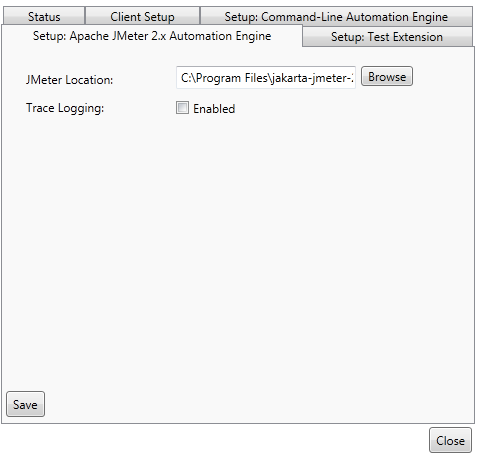
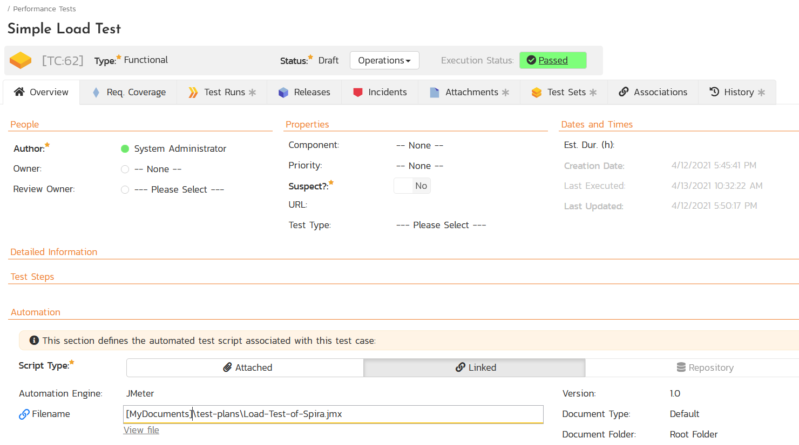
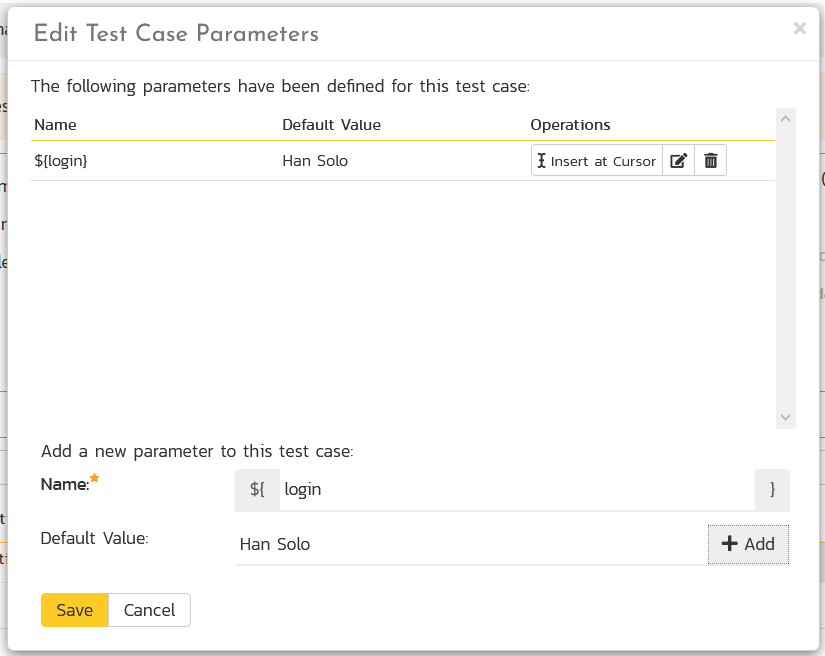
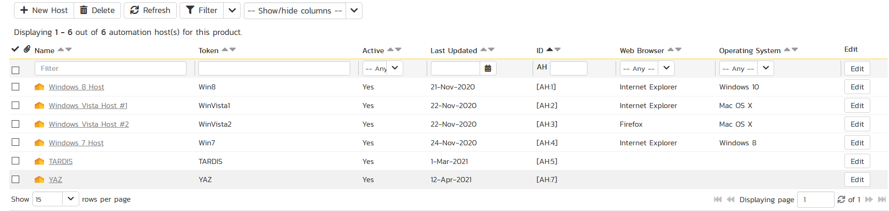
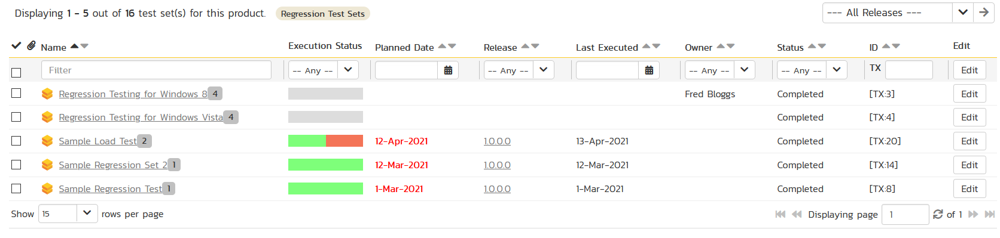
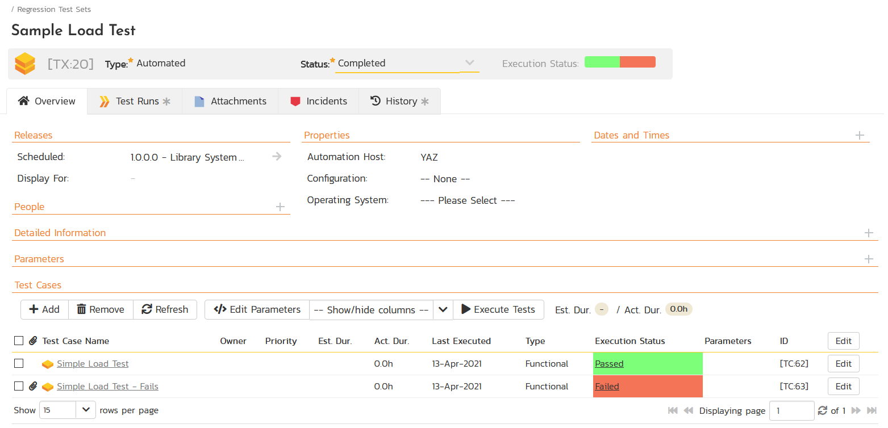
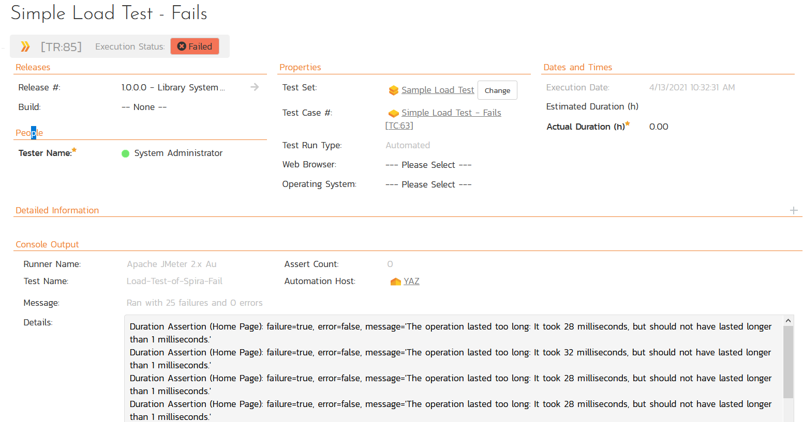

# JMeter

Apache JMeter is a free, open source Java desktop application designed
to load test functional behavior and measure performance. It was
originally designed for testing Web Applications but has since expanded
to other test functions.

This section describes how you can use SpiraTest / SpiraTeam (hereafter
SpiraTeam) together with RemoteLaunch to schedule and remotely launch
instances of JMeter on different computers and have the testing results
be transmitted back to SpiraTeam. This allows you to extend your
SpiraTeam's test management capabilities to include automated JMeter
performance tests.

*Note: This integration requires at least version 3.0 of SpiraTest/Team
and version 2.5 of JMeter.*

## Installing the JMeter Engine

This section assumes that you already have a working installation of
SpiraTest or SpiraTeam and have installed RemoteLaunch on the various
test automation hosts following the instructions in [RemoteLaunch Guide](../RemoteLaunch%20Guide/).
Once those prerequisites are in place, please follow these steps:

-   Download and extract the JMeterEngine.zip file from
the Inflectra website and locate the appropriate JMeterX.dll for the
version of JMeter that you are using.

-   If you don't see the version listed, just use the nearest
version that is *lower* than your current version.

-   Copy the file "*JMeter*X.dll" (where X is the appropriate version)
into the "extensions" sub-folder of the RemoteLaunch installation.

-   Log in to SpiraTeam as a system administrator and go into SpiraTeam
main Administration page and click on the "Test Automation" link
under **Integration**.

-   Click the "Add" button to enter the new test automation engine
details page. The fields required are as follows:

-   **Name**: This is the short display name of the automation
engine. It can be anything that is meaningful to your users.

-   **Description**: This is the long description of the automation
engine. It can be anything that is meaningful to your users.
(Optional)

-   **Active**: If checked, the engine is active and able to be used
for any project.

-   **Token**: This needs to be the assigned unique token for the
automation engine and is used to tell RemoteLaunch which engine
to actually use for a given test case. For JMeter this should be
**JMeterX** where 'X' is the version number of the DLL file that
you are using.

-   Once you have finished, click the "Insert & Close" button and you
will be taken back to the Test Automation list page, with JMeter
listed as an available automation engine.

### Advanced Settings

You can modify the JMeter configuration for each of the specific
automation hosts, by right-clicking on the RemoteLaunch icon in the
system tray and choosing "Configuration". That will bring up the
RemoteLaunch configuration page.

The JMeter 2.x engine adds its own tab to this page which allows you to
configure how JMeter operates:

The following fields can be specified on this screen:

**JMeter Location** -- This should point to the location on the host
computer where JMeter is installed. You can click on the browse button
and navigate to the location of the JMeter.bat file.

**Trace Logging** -- When selected, this will log additional trace and
debugging information to the Windows Event Log. This should not be
selected in a production environment.

## Setting up the Automated Test Cases

This section describes the process for setting up a test case in
SpiraTeam for automation and linking it to an automated JMeter test
script.

First you need to display the list of test cases in SpiraTeam (by
clicking Testing \> Test Cases) and then add a new test case. Once you
have added the new test case, click on it and select the "Automation"
tab:

You need to enter the following fields:

- **Automation Engine** - Choose the JMeter Automation Engine that you
created in the previous section from the drop-down list.

- **Script Type** -- This should be set to Linked as the integration with
JMeter only supports referencing JMeter test script files and not
physically uploading the test scripts into SpiraTeam.

- **Filename** -- This consists of the following elements:

    - The full path to the JMeter test script. To make this easier across
different machines, you can use several constants for standard Windows
locations (see example in screenshot):

        - \[MyDocuments\] -- The user's "My Documents" folder. The user indicated
is the user that ran RemoteLaunch.

        - \[CommonDocuments\] -- The Public Document's folder.

        - \[DesktopDirectory\] -- The user's Desktop folder. The user indicated is
the user that ran RemoteLaunch.

        - \[ProgramFiles\] -- Translated to the Program Files directory. For
64-bit machines, it's the 64-bit directory.

        - \[ProgramFilesX86\] -- Translated to the 32-bit Program Files directory.

    - Optionally you can include JMeter command-line arguments by separating
them with a pipe (\|) character.

    - Examples of Filenames you can enter in SpiraTeam include:

        - \[MyDocuments\]JMeter\\JMeter-SampleScript.jmx

        - \[MyDocuments\]JMeter\\JMeter-SampleScript.jmx\|-P 81

        - \[MyDocuments\]JMeter\\JMeter-SampleScript.jmx\|-P 81 -H 192.168.117.25

- **Document Type** -- This allows you to choose which document type the
automated test script will be categorized under.

- **Document Folder** --This allows you to choose which document folder
the automated test script will be stored in.

- **Version** -- The version of the test script (1.0 is used if no value
specified)

- **Test Script** -- *This is not used with the JMeter Engine since it
only supports linked test scripts.*

Once you are happy with the values, click \[Save\] to update the test
case. Now you are ready to schedule the automated test case for
execution.

### Using Parameterized Test Cases

There is an advanced feature of SpiraTest/Team and RemoteLaunch that
lets you pass parameters from SpiraTeam to your JMeter automated test
script. This is very useful if you have a data-driven JMeter test script
that expects specific JMeter properties to be passed to the test script.

To setup the automated test case for parameters, click on the "Test
Steps" tab and click on "Edit Parameters":

The name of the parameter ${login} needs to match the name of the
property defined within the JMeter script.

## Executing the JMeter Test Sets from SpiraTeam

There are two ways to execute automated test cases in SpiraTeam:

1.  Schedule the test cases to be executed on a specific computer (local
or remote) at a date/time in the future

2.  Execute the test cases right now on the local computer.

We shall outline both of these two scenarios in this section. However
first we need to setup the appropriate automation hosts and test sets in
SpiraTeam:

### Configuring the Automation Hosts and Test Sets

Go to Testing \> Automation Hosts in SpiraTeam to display the list of
automation hosts:

Make sure that you have created an Automation Host for each computer
that is going to run an automated test case. The name and description
can be set to anything meaningful, but the Token field **must be set to
the same token that is specified in the RemoteLaunch application** on
that specific machine.

Once you have at least one Automation Host configured, go to Testing \>
Test Sets to create the test sets that will contain the automated test
case:

Note: Unlike manual test cases, automated test cases *must be executed
within a test set* -- they cannot be executed directly from the test
case.

Create a new Test Set to hold the JMeter automated test cases and click
on its hyperlink to display the test set details page:

You need to add at least one automated test case to the test set and
then configure the following fields:

-   **Automation Host** -- This needs to be set to the name of the
automation host that will be running the automated test set.

-   **Planned Date** -- The date and time that you want the scenario to
begin. (Note that multiple test sets scheduled at the exact same
time will be scheduled by Test Set ID order.)

-   **Status** -- This needs to be set to "Not Started" for RemoteLaunch
to pick up the scheduled test set. When you change the Planned Date,
the status automatically switches back to "Not Started"

-   **Type** -- This needs to be set to "Automated" for automated
testing

If you have parameterized test cases inside the automated test set you
can set their values in three different ways:

-   **Test Set Parameter Values** -- this lets you set the same value of
a parameter for all the test cases in the test set:

-   **Test Case Parameter Values** -- this lets you set a specific value
for a parameter for a particular test case in the test set:

You set these values, by right-clicking on a row and choosing "Edit
Parameters":

-   **Test Configurations** -- this lets you create a data grid of
possible test parameters and execute the test set multiple times,
once for each unique combination:

### Executing the Test Sets

Once you have set the various test set fields (as described above), the
Remote Launch instances will periodically poll SpiraTeam for new test
sets. Once they retrieve the new test set, they will add it to their
list of test sets to be executed. Once execution begins they will change
the status of the test set to "In Progress", and once test execution is
done, the status of the test set will change to either "Completed" --
the automation engine could be launched and the test has completed -- or
"Blocked" -- RemoteLaunch was not able to start the automation engine.

If you want to immediately execute the test case on your local computer,
instead of setting the "Automation Host", "Status" and "Planned Date"
fields, you can instead click the \[Execute\] icon on the test set
itself. This will cause RemoteLaunch on the local computer to
immediately start executing the current test set.

In either case, once all the test cases in the test set have been
completed, the status of the test set will switch to "Completed" and the
individual test cases in the set will display a status based on the
results of the JMeter test:

**Passed** -- The JMeter automated test ran successfully and no failures
or errors were logged.

**Failed** -- The JMeter automated test ran successfully, but at least
one error or failure was logged.

**Blocked** -- The JMeter automated test did not run successfully.

If you receive the "Blocked" status for either the test set or the test
cases you should open up the Windows Application Event Log on the
computer running RemoteLaunch and look in the event log for error
messages.

*Note: While the tests are executing you will see a Windows command
prompt open as JMeter executes the appropriate tests.*

Once the tests have completed, you can log back into SpiraTeam and see
the execution status of your test cases. If you click on a Test Run that
was generated by JMeter, you will see the following information:

This screen indicates the status of the test run that was reported back
from JMeter together with any messages or other information. The Test
Name indicates the name of the test inside JMeter and the execution
status corresponds the rules described above.

In addition, the detailed test report from JMeter is below. It will contain messages such as:

> Response Assertion (http://www.inflectra.com/): failure=true, error=false, 
> message='Test failed: text expected to contain /(?i)Purchase Our Products Online/'
> Response Assertion (http://www.inflectra.com/SpiraTest/Default.aspx): failure=true, 
> error=false, message='Test failed: text expected to contain /(?i)Purchase Our Products Online/'
> Response Assertion (http://www.inflectra.com/Purchase/Default.aspx): failure=false, 
> error=false, message=''
> Response Assertion (https://www.inflectra.com/Purchase/Default.aspx): failure=false, 
> error=false, message=''

Congratulations... You are now able to run JMeter automated functional
tests and have the results be recorded within SpiraTest / SpiraTeam.

