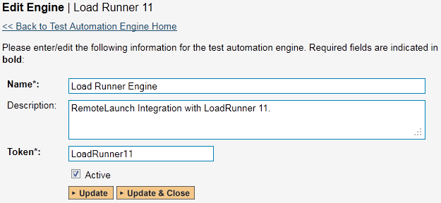
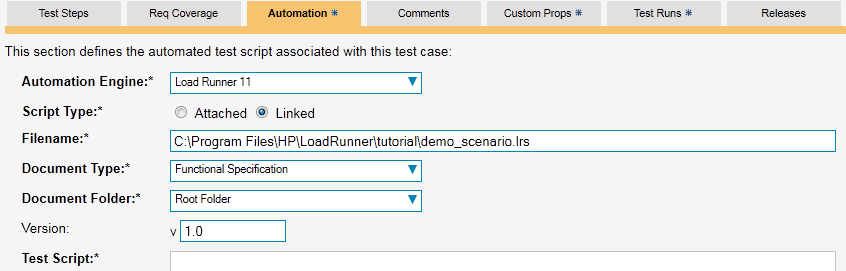
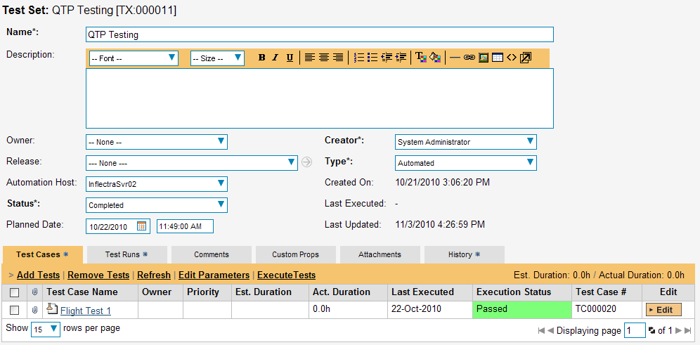
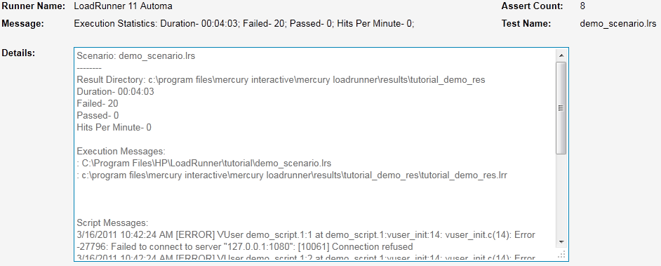

# LoadRunner

HP® LoadRunner is a load testing system that lets you record application
performance by a number of 'virtual users'.

This section covers installing and using the Engine to report back
statistics of run scenarios.

***Note**: This integration requires at least version 3.0 of
SpiraTest/Team and version 11 of LoadRunner. The extension has not been
tested on previous versions of LoadRunner due to lack of availability of
previous released versions.*

## Installing the LoadRunner11 Engine

This section assumes that you already have a working installation of
SpiraTest or SpiraTeam and have installed RemoteLaunch on the various
test automation hosts following the instructions in [RemoteLaunch Guide](../RemoteLaunch%20Guide/).
Once those prerequisites are in place, please follow these steps:

-   Download and extract the LoadRunner11Engine.zip file
from the Inflectra website.

-   Copy the files in the ZIP file into the "extensions" sub-folder of
the RemoteLaunch installation.

-   Log in to SpiraTeam as a system administrator and go into SpiraTeam
main Administration page and click on the "Test Automation" link
under **Integration**.

-   Click the "Add" button to enter the new test automation engine
details page. The fields required are as follows:

-   **Name**: This is the short display name of the automation
engine. It can be anything that is meaningful to your users, and
will be displayed in the dropdown when the user selects the
Tester.

-   **Description**: This is the long description of the automation
engine. It can be anything that is meaningful to your users.
(Optional)

-   **Active**: If checked, the engine is active and able to be used
for any project.

-   **Token**: This needs to be the assigned unique token for the
automation engine and is used to tell RemoteLaunch which engine
to actually use for a given test case. For LoadRunner, it needs
to be "**LoadRunner11**".

-   Once you have finished, click the "Insert & Close" button and you
will be taken back to the Test Automation list page, with LoadRunner
listed as an available automation engine.

## Setting up the Automated Test Cases

This section describes the process for setting up a test case in
SpiraTeam for automation and linking it to a Load Runner Scenario.

First you need to display the list of test
cases in SpiraTeam (by clicking Testing \> Test Cases) and then add a
new test case. Once you have added the new test case, click on it and
select the "Automation" tab:

You need to enter the following fields:

-   **Automation Engine** - Choose the LoadRunner Automation Engine that
you created in the previous section from the drop-down list.

-   **Script Type** -- For LoadRunner, all scenarios must be stored on
the local testing machine so 'Linked' must be selected. If you
select 'Attached', when the scenario is attempted to be executed it
will be marked as blocked and skipped.

-   **Filename** -- This needs to be the full path to the LoadRunner
Scenario (\*.lrs) file. Certain tokens are allowed to be able to
specify common locations across different operating systems. Note
that the tokens are case-sensitive, and there are no spaces in them.
A list of tokens are:

    -   \[MyDocuments\] -- The user's "My Documents" folder. The user
    indicated is the user that ran RemoteLaunch.

    -   \[CommonDocuments\] -- The Public Document's folder.

    -   \[DesktopDirectory\] -- The user's Desktop folder. The user
    indicated is the user that ran RemoteLaunch.

    -   \[ProgramFiles\] -- Translated to the Program Files directory.
    For 64-bit machines, it's the 64-bit directory.

    -   \[ProgramFilesX86\] -- Translated to the 32-bit Program Files
    directory.

-   **Document Type** -- If using SpiraTeam (not SpiraTest) you can
choose which document type the automated scenario will be
categorized under.

-   **Document Folder** -- If using SpiraTeam (not SpiraTest) you can
choose which document folder the automated scenario will be stored
in.

-   **Version** -- The version of the scenario (1.0 is used if no value
specified)

-   **Test Script** -- *Not used.*

Once you are happy with the values, click \[Save\] to update the test
case. Now you are ready to schedule the automated test case for
execution.

### Using Parameterized Test Cases

There is an advanced feature of SpiraTest/Team and RemoteLaunch that
lets you pass parameters from SpiraTeam to your LoadRunner scenario.
This is very useful if you have a data-driven LoadRunner scenario that
has custom parameters used that you would like to change based on the
test.

To setup the automated test case for parameters, click on the "Test
Steps" tab and click on "Edit Parameters":

The name of the parameter ${login} needs to match the name of the
custom parameter defined in the LoadRunner scenario. Invalid parameters
will be silently ignored by the LoadRunner engine. Parameters must have
a unique name.

## Executing the LoadRunner Scenario from SpiraTeam

There are two ways to execute a scenario in SpiraTeam:

1.  Schedule the test cases to be executed on a specific computer (local
or remote) at a date/time in the future

2.  Execute the test cases right now on the local computer.

We shall outline both of these two scenarios in this section. However
first we need to setup the appropriate automation hosts and test sets in
SpiraTeam:

### Configuring the Automation Hosts and Test Sets

Go to Testing \> Automation Hosts in SpiraTeam to display the list of
automation hosts:

Make sure that you have created an Automation Host for each computer
that is going to run an automated test case. The name and description
can be set to anything meaningful, but the Token field **must be set to
the same token that is specified as the Host name in the RemoteLaunch
application** on that specific machine.

Once you have at least one Automation Host configured, go to Testing \>
Test Sets to create the test sets that will contain the automated test
case:

**Note**: Unlike manual test cases, automated test cases *must be
executed within a test set* -- they cannot be executed directly from the
test case.

Create a new Test Set to hold the LoadRunner test cases and click on its
hyperlink to display the test set details page:

You need to add at least one automated test case to the test set and
then configure the following fields:

-   **Automation Host** -- This needs to be set to the name of the
automation host that will be running the automated test set.

-   **Planned Date** -- The date and time that you want the scenario to
begin. (Note that multiple test sets scheduled at the exact same
time will be scheduled by Test Set ID order.)

-   **Status** -- This needs to be set to "Not Started" for RemoteLaunch
to pick up the scheduled test set. When you change the Planned Date,
the status automatically switches back to "Not Started"

-   **Type** -- This needs to be set to "Automated" for automated
testing

If you have parameterized test cases inside the automated test set you
can set their values in three different ways:

-   **Test Set Parameter Values** -- this lets you set the same value of
a parameter for all the test cases in the test set:

-   **Test Case Parameter Values** -- this lets you set a specific value
for a parameter for a particular test case in the test set:

You set these values, by right-clicking on a row and choosing "Edit
Parameters":

-   **Test Configurations** -- this lets you create a data grid of
possible test parameters and execute the test set multiple times,
once for each unique combination:

### Executing the Test Sets

Once you have set the various test set fields (as described above), the
Remote Launch instances will periodically poll SpiraTeam for new test
sets. Once they retrieve the new test set, they will add it to their
list of test sets to be executed. Once execution begins they will change
the status of the test set to "In Progress", and once test execution is
done, the status of the test set will change to either "Completed" --
the automation engine could be launched and the test has completed -- or
"Blocked" -- RemoteLaunch was not able to start the automation engine.

If you want to immediately execute the test case on your local computer,
instead of setting the "Automation Host", "Status" and "Planned Date"
fields, you can instead click the \[Execute\] icon on the test set
itself. This will cause RemoteLaunch on the local computer to
immediately start executing the current test set.

In either case, once all the test cases in the test set have been
completed, the status of the test set will switch to "Completed" and the
individual test cases in the set will display a status based on the
results of the LoadRunner execution:

-   **Passed** -- The Scenario ran and reported no error messages.
Warning, Debug, and Informational messages may have been logged,
however.

-   **Failed** -- The Scenario ran and at least one error message was
reported.

-   **Blocked** -- There was an error with the Test Set or LoadRunner
application.

If you receive the "Blocked" status for either the test set or the test
cases you should open up the Windows Application Event Log on the
computer running RemoteLaunch and look in the event log for error
messages.

***Note**: While the tests are executing you may see browser or
application windows launch as LoadRunner runs the scenario and connects
VUsers to their tasks.*

Once the tests have completed, you can log back into SpiraTeam and see
the execution status of your test cases. If you click on a Test Run that
was generated by LoadRunner, you will see the following information:

This screen indicates the status of the
scenario that was reported back from LoadRunner together with any
messages or other information. Because LoadRunner only reports
statistics on the scenarios that was run, the test set will always be
marked as passed -- regardless of how long it took, unless there were
errors reported. If any errors are reported, the test will be marked as
Failed.

The Message of the test will report the duration the scenario took,
along with the count of VUsers that reported an error, the number that
reported a pass, and the hits per minute on the application.

A more detailed report will be included in the test run's details -- the
information above, and then any added Execution Messages and messages
logged by the script in time order.

**Note**: LoadRunner's engine is very basic at this stage. If you have
issues with a scenario not reporting or executing properly, please let
Inflectra's support team know.

