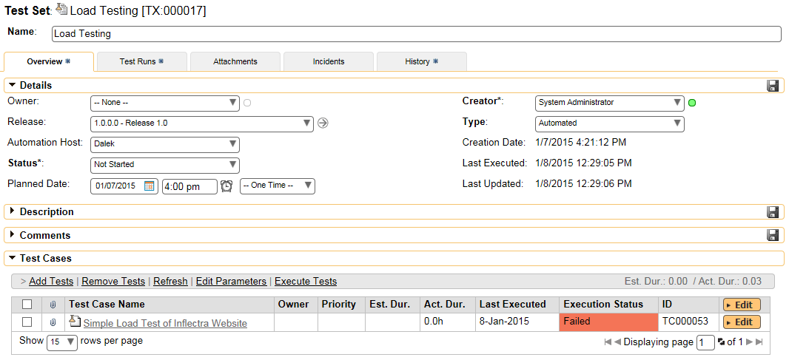
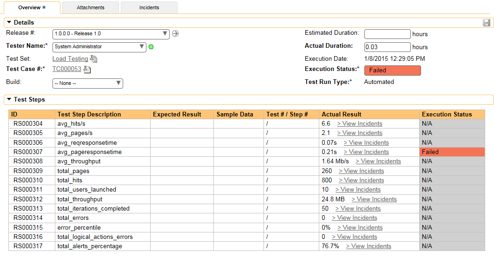
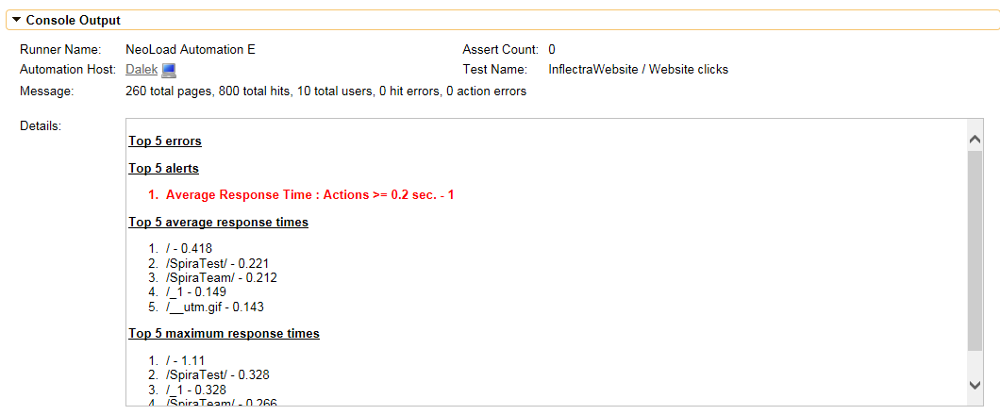

# NeoLoad
!!! abstract "Compatible with SpiraTest, SpiraTeam, SpiraPlan"

Neotys NeoLoad is a performance and load testing system that lets you record application performance by a number of 'virtual users' and measure the performance against specified Service Level Agreement (SLA) metrics for the application. When you use NeoLoad with Spira you can report back pass/fail/caution by comparing the actual results against the specified SLA metrics.

This section covers installing and using the Engine to report back statistics of run scenarios as well as the results of the test compared to the required SLAs.

***Note**: This integration requires at least version 4.0 of Spira and has been tested against version 5.0 of NeoLoad.*

## Installing the NeoLoad Engine
This section assumes that you already have a working installation of Spira and have installed RemoteLaunch on the various test automation hosts following the instructions in [RemoteLaunch Guide](RemoteLaunch-Guide.md). Once those prerequisites are in place, please follow these steps:

-   Download and extract the NeoLoadEngine.zip file from the Inflectra website.
-   Copy the files in the ZIP file into the "extensions" sub-folder of the RemoteLaunch installation.
-   Log in to Spira as a system administrator and go into Spira main Administration page and click on the "Test Automation" link under **Integration**.
-   Click the "Add" button to enter the new test automation engine details page. The fields required are as follows:

-   **Name**: This is the short display name of the automation engine. It can be anything that is meaningful to your users, and will be displayed in the dropdown when the user selects the Tester.
-   **Description**: This is the long description of the automation engine. It can be anything that is meaningful to your users. (Optional)
-   **Active**: If checked, the engine is active and able to be used for any project.
-   **Token**: This needs to be the assigned unique token for the automation engine and is used to tell RemoteLaunch which engine to actually use for a given test case. For NeoLoad, it needs to be simply "**NeoLoad**".

Once you have finished, click the "Insert & Close" button and you will be taken back to the Test Automation list page, with NeoLoad listed as an available automation engine.

### NeoLoad RemoteLaunch Settings
You will need to modify the NeoLoad configuration for each of the specific automation hosts, by right-clicking on the RemoteLaunch icon in the system tray and choosing "Configuration". That will bring up the RemoteLaunch configuration page. The NeoLoad engine adds its own tab to this page which allows you to configure how NeoLoad operates:

The following fields can be specified on this screen:

- **NeoLoad Location**: This should be folder containing the "NeoLoadCmd.exe" executable that will be used to actually run the automated tests.
- **Attach PDF Report** *--* NeoLoad has a built-in report generator that can create detailed Acrobat (PDF) format reports. Enabling this option will attach these reports to the test runs recorded in Spira.
- **Run as Administrator**: Sometimes NeoLoad needs to be run as a Windows elevated process, in which case, choose the "Run as Administrator" option.

## Setting up the Automated Test Cases
This section describes the process for setting up a test case in Spira for automation and linking it to a NeoLoad project and scenario.

First you need to display the list of test cases in Spira (by clicking Testing \> Test Cases) and then add a new test case. Once you have added the new test case, click on it and go to the "Automation" section in the main "Overview" tab:

You need to enter the following fields:

-   **Automation Engine** - Choose the NeoLoad Automation Engine that you created in the previous section from the drop-down list.
-   **Script Type**: For NeoLoad, all scenarios must be stored on the local testing machine so 'Linked' must be selected. If you select 'Attached', when the scenario is attempted to be executed it will be marked as blocked and skipped.
-   **Filename**: This needs to be the full path to the NeoLoad project file (\*.nlp) file followed by the name of the NeoLoad scenario. The two components need to be separated by a pipe (\|) character.  Certain tokens are allowed to be able to specify common locations across different operating systems. Note that the tokens are case-sensitive, and there are no spaces in them. A list of tokens are:

    -   \[MyDocuments\] -- The user's "My Documents" folder. The user indicated is the user that ran RemoteLaunch.
    -   \[CommonDocuments\] -- The Public Document's folder.
    -   \[DesktopDirectory\] -- The user's Desktop folder. The user indicated is the user that ran RemoteLaunch.
    -   \[ProgramFiles\] -- Translated to the Program Files directory. For 64-bit machines, it's the 64-bit directory.
    -   \[ProgramFilesX86\] -- Translated to the 32-bit Program Files directory.

-   **Document Type**: You can choose which document type the automated scenario will be categorized under.
-   **Document Folder**: You can choose which document folder the automated scenario will be stored in.
-   **Version**: The version of the scenario (1.0 is used if no value specified)
-   **Test Script**: *Not used.*

Once you are happy with the values, click \[Save\] to update the test case. Now you are ready to schedule the automated test case for execution.

### Using Parameterized Test Cases
Currently the NeoLoad automation engine does not support the passing of parameter values from Spira to NeoLoad.

## Executing the NeoLoad Scenario from Spira
There are three ways to execute automated test cases in Spira:

1.  Schedule the test cases to be executed on a specific computer (local or remote) at a date/time in the future
2.  Execute the test cases right now on the local computer.
3.  Execute the test cases from the command-line or a build script

We shall outline each of these three scenarios in this section. However first we need to setup the appropriate automation hosts and test sets in Spira:

### Configuring the Automation Hosts and Test Sets
Go to Testing \> Automation Hosts in Spira to display the list of automation hosts:

Make sure that you have created an Automation Host for each computer that is going to run an automated test case. The name and description can be set to anything meaningful, but the Token field **must be set to the same token that is specified as the Host name in the RemoteLaunch application** on that specific machine.

Once you have at least one Automation Host configured, go to Testing \> Test Sets to create the test sets that will contain the automated test case:

**Note**: Unlike manual test cases, automated test cases *must be executed within a test set* -- they cannot be executed directly from the test case.

Create a new Test Set to hold the NeoLoad test cases and click on its hyperlink to display the test set details page:

You need to add at least one automated test case to the test set and then configure the following fields:

-   **Automation Host**: This needs to be set to the name of the automation host that will be running the automated test set.
-   **Planned Date**: The date and time that you want the scenario to begin. (Note that multiple test sets scheduled at the exact same time will be scheduled by Test Set ID order.)
-   **Status**: This needs to be set to "Not Started" for RemoteLaunch to pick up the scheduled test set. When you change the Planned Date, the status automatically switches back to "Not Started"
-   **Type**: This needs to be set to "Automated" for automated testing

### Executing the Test Sets
Once you have set the various test set fields (as described above), the Remote Launch instances will periodically poll Spira for new test sets. Once they retrieve the new test set, they will add it to their list of test sets to be executed. Once execution begins they will change the status of the test set to "In Progress", and once test execution is done, the status of the test set will change to either "Completed" --
the automation engine could be launched and the test has completed -- or "Blocked" -- RemoteLaunch was not able to start the automation engine.

If you want to immediately execute the test case on your local computer, instead of setting the "Automation Host", "Status" and "Planned Date" fields, you can instead click the \[Execute\] icon on the test set itself. This will cause RemoteLaunch on the local computer to immediately start executing the current test set.

In either case, once all the test cases in the test set have been completed, the status of the test set will switch to "Completed" and the individual test cases in the set will display a status based on the results of the NeoLoad execution:

-   **Passed**: The scenario ran and reported no error messages and all SLAs were passed.
-   **Caution**: The scenario ran and at least one SLA reported back as acceptable
-   **Failed**: The scenario ran and at least one error message was reported or at least one SLA was reported back as failed.
-   **Blocked**: There was an error with the Test Set or NeoLoad application.

If you receive the "Blocked" status for either the test set or the test cases you should open up the Windows Application Event Log on the computer running RemoteLaunch and look in the event log for error messages.

***Note**: While the tests are executing you may see browser or application windows launch as NeoLoad runs the scenario and connects VUsers to their tasks.*

Once the tests have completed, you can log back into Spira and see the execution status of your test cases. If you click on a Test Run that was generated by NeoLoad, you will see the following test run summary information:

This section of the screen indicates how long the test took to execute, the overall status, which release was being executed, which test set it was a part of and each of the key summary statistics, together with information on how they compared to the defined SLA:

-   **N/A**: There was no SLA defined for this metric
-   **Passed**: There is an SLA defined for this metric and it was passed.
-   **Caution**: There is an SLA defined for this metric and it was considered less than a pass, but still acceptable.
-   **Failed**: There is an SLA defined for this metric and it was not met successfully.

In addition, if you scroll down, in the "Console Output" section of the report there is more detailed information:

The Message of the test will report the number of total pages, number of total hits, number of total users, number of errors as well as the total count of virtual users.

In addition, more detailed information is displayed in the test run details:

-   Top 5 errors by page
-   Top 5 alerts by page
-   Top 5 average response times by page
-   Top 5 maximum response times by page

Finally, if you have chosen the option to attach the NeoLoad PDF report, in the Attachments section of the Test Run, that will be listed:

Congratulations... You are now able to run automated NeoLoad performance scenarios and have the results be recorded within Spira.