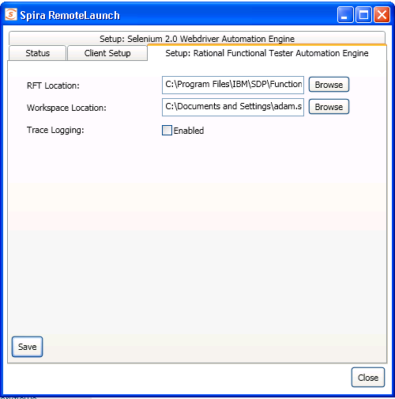
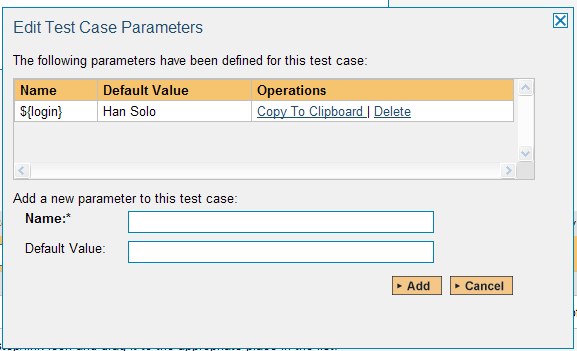

# Rational Functional Tester

IBM Rational Functional Tester (hereafter RFT) is software test
automation tool used by quality assurance teams to perform automated
regression testing. Testers create scripts by using a test recorder
which captures a user's actions against their application under test.
The recording mechanism creates a test script from the actions. The test
script is produced as either a Java or Visual Basic.net application.

This section describes how you can use SpiraTest / SpiraTeam (hereafter
SpiraTeam) together with RemoteLaunch to schedule and remotely launch
instances of RFT on different computers and have the testing results be
transmitted back to SpiraTeam. This allows you to extend your
SpiraTeam's test management capabilities to include automated RFT tests.

*Note: This integration requires at least version 3.0 of
SpiraTest/Team.*

## Installing the RFT Engine

This section assumes that you already have a working installation of
SpiraTest or SpiraTeam and have installed RemoteLaunch on the various
test automation hosts following the instructions in [RemoteLaunch Guide](../RemoteLaunch-Guide/).
Once those prerequisites are in place, please follow these steps:

-   Download and extract the RFTEngine.zip file from the
Inflectra website and locate the appropriate RFTAutomationEngine.dll
for the version of RFT that you are using.

-   If you don't see the version listed, just use the nearest
version that is *lower* than your current version.

-   Copy the file "RFTAutomationEngine.dll" into the "extensions"
sub-folder of the RemoteLaunch installation.

-   Log in to SpiraTeam as a system administrator and go into SpiraTeam
main Administration page and click on the "Test Automation" link
under **Integration**.

-   Click the "Add" button to enter the new test automation engine
details page. The fields required are as follows:

-   **Name**: This is the short display name of the automation
engine. It can be anything that is meaningful to your users.

-   **Description**: This is the long description of the automation
engine. It can be anything that is meaningful to your users.
(Optional)

-   **Active**: If checked, the engine is active and able to be used
for any project.

-   **Token**: This needs to be the assigned unique token for the
automation engine and is used to tell RemoteLaunch which engine
to actually use for a given test case. For RFT this should
always be **RFTAutomationEngine**.

-   Once you have finished, click the "Insert & Close" button and you
will be taken back to the Test Automation list page, with RFT listed
as an available automation engine.

### Advanced Settings

You can modify the RFT configuration for each of the specific automation
hosts, by right-clicking on the RemoteLaunch icon in the system tray and
choosing "Configuration". That will bring up the RemoteLaunch
configuration page.

The RFT engine adds its own tab to this page which allows you to
configure how RFT operates:

The following fields can be specified on this screen:

**RFT Location** -- this is where the installation of RFT can be found.
Typically it's C:\\Program Files\\IBM\\SDP\\FunctionalTester\\bin

**Workspace Location** -- This is the folder where the RFT test scripts
and generated log files will be stored. The currently logged-in user
needs to have Read/Write permissions over this folder. Typically it's:

C:\\Documents and Settings\\\[User Name\]\\IBM\\rationalsdp\\workspace
on a Windows XP workstation or Windows 2003 server.

C:\\Users\\\[User Name\]\\IBM\\rationalsdp\\workspace on a Windows
Vista, 7, 2008 or 2008 R2 computer.

**Trace Logging** -- When selected, this will log additional trace and
debugging information to the Windows Event Log. This should not be
selected in a production environment.

## Setting up the Automated Test Cases

This section describes the process for setting up a test case in
SpiraTeam for automation and linking it to an automated RFT test script.

First you need to display the list of test cases in SpiraTeam (by
clicking Testing \> Test Cases) and then add a new test case. Once you
have added the new test case, click on it and select the "Automation"
tab:

You need to enter the following fields:

- **Automation Engine** - Choose the RFT Automation Engine that you
created in the previous section from the drop-down list.

- **Script Type** -- This should be set to Linked as the integration with
RFT only supports referencing RFT test script files and not physically
uploading the test scripts into SpiraTeam.

- **Filename** -- This needs to consist of the following three components
separated by a pipe (\|) character (see the screenshot for an example):

    - The name of the RFT project that the test is mapped to

    - The name of the RFT script in the project that the test is mapped to

    - Either "java" or "net" depending on whether you have a Java or .NET test
script

- **Document Type** -- This allows you to choose which document type the
automated test script will be categorized under.

- **Document Folder** --This allows you to choose which document folder
the automated test script will be stored in.

- **Version** -- The version of the test script (1.0 is used if no value
specified)

- **Test Script** -- *This is not used with the RFT Engine since it only
supports linked test scripts.*

Once you are happy with the values, click \[Save\] to update the test
case. Now you are ready to schedule the automated test case for
execution.

### Using Parameterized Test Cases

There is an advanced feature of SpiraTest/Team and RemoteLaunch that
lets you pass parameters from SpiraTeam to your RFT automated test
suite. This is very useful if you have a data-driven RFT test suite that
defines input variables from an external data source.

To setup the automated test case for parameters, click on the "Test
Steps" tab and click on "Edit Parameters":

The name of the parameter ${login} is actually not used when passing
the data to RFT, only the values are passed. Therefore it's important
that the parameters are stored in the order they are expected by your
RFT test script.

## Executing the RFT Test Sets from SpiraTeam

There are two ways to execute automated test cases in SpiraTeam:

1.  Schedule the test cases to be executed on a specific computer (local
or remote) at a date/time in the future

2.  Execute the test cases right now on the local computer.

We shall outline both of these two scenarios in this section. However
first we need to setup the appropriate automation hosts and test sets in
SpiraTeam:

### Configuring the Automation Hosts and Test Sets

Go to Testing \> Automation Hosts in SpiraTeam to display the list of
automation hosts:

Make sure that you have created an Automation Host for each computer
that is going to run an automated test case. The name and description
can be set to anything meaningful, but the Token field **must be set to
the same token that is specified in the RemoteLaunch application** on
that specific machine.

Once you have at least one Automation Host configured, go to Testing \>
Test Sets to create the test sets that will contain the automated test
case:

Note: Unlike manual test cases, automated test cases *must be executed
within a test set* -- they cannot be executed directly from the test
case.

Create a new Test Set to hold the RFT automated test cases and click on
its hyperlink to display the test set details page:

You need to add at least one automated test case to the test set and
then configure the following fields:

-   **Automation Host** -- This needs to be set to the name of the
automation host that will be running the automated test set.

-   **Planned Date** -- The date and time that you want the scenario to
begin. (Note that multiple test sets scheduled at the exact same
time will be scheduled by Test Set ID order.)

-   **Status** -- This needs to be set to "Not Started" for RemoteLaunch
to pick up the scheduled test set. When you change the Planned Date,
the status automatically switches back to "Not Started"

-   **Type** -- This needs to be set to "Automated" for automated
testing

If you have parameterized test cases inside the automated test set you
need to set their values by right-clicking on the test case and choosing
"Edit Parameters":

Enter the parameter values and click "Update" to commit the change. This
allows you to have the same test case in the test set multiple times
with different data for each instance.

### Executing the Test Sets

Once you have set the various test set fields (as described above), the
Remote Launch instances will periodically poll SpiraTeam for new test
sets. Once they retrieve the new test set, they will add it to their
list of test sets to execute. Once execution begins they will change
the status of the test set to "In Progress", and once test execution is
done, the status of the test set will change to either "Completed" --
the automation engine could be launched and the test has completed -- or
"Blocked" -- RemoteLaunch was not able to start the automation engine.

If you want to immediately execute the test case on your local computer,
instead of setting the "Automation Host", "Status" and "Planned Date"
fields, you can instead click the \[Execute\] icon on the test set
itself. This will cause RemoteLaunch on the local computer to
immediately start executing the current test set.

In either case, once all the test cases in the test set have been
completed, the status of the test set will switch to "Completed" and the
individual test cases in the set will display a status based on the
results of the RFT test:

**Passed** -- The RFT automated test ran successfully and all the test
steps in the test script passed and no assertions were thrown.

**Failed** -- The RFT automated test ran successfully, but at least one
test step failed or at least one assertion failed.

**Caution** -- The RFT automated test run successfully, but at least one
warning was logged in one of the test steps.

**Blocked** -- The RFT automated test did not run successfully.

If you receive the "Blocked" status for either the test set or the test
cases you should open up the Windows Application Event Log on the
computer running RemoteLaunch and look in the event log for error
messages.

*Note: While the tests are executing you will see browser windows launch
as RFT executes the appropriate tests.*

Once the tests have completed, you can log back into SpiraTeam and see
the execution status of your test cases. If you click on a Test Run that
was generated by RFT, you will see the following information:

This screen indicates the status of the test run that was reported back
from RFT together with any messages or other information. The Test Name
indicates the name of the test inside RFT and the execution status
corresponds the matching status inside RFT as illustrated below:

| **RFT Status**  | **SpiraTeam Status** |
| ------------ | ----------- |
| PASS            | Passed |
| FAIL            | Failed |
| WARNING         | Caution |

In addition, the detailed test report from RFT is available in the large
text-box below. It will contain messages such as:

> 07-Nov-2011 03:00:05.004 PM: Script Start - INFORMATION - Script      
> start \[Script1\]                                                     
>                                                                       
> 07-Nov-2011 03:00:05.035 PM: Simplified Script Group - INFORMATION -  
> firefox.exe: self improvement - QuickStart Tutorials for Rational     
> Functional Tester (RFT) - Stack Overflow - Mozilla Firefox            
>                                                                       
> 07-Nov-2011 03:00:05.035 PM: Timer Start - INFORMATION - Start timer: 
> firefoxexeselfimprovementQuickSta\_1                                  
>                                                                       
> 07-Nov-2011 03:00:25.535 PM: General - WARNING - Object Recognition   
> is weak (above the warning threshold)                                 
>                                                                       
> 07-Nov-2011 03:00:49.488 PM: General - FAIL - Script1.testMain had an 
> unhandled exception.                                                  
>                                                                       
> 07-Nov-2011 03:00:49.488 PM: Script End - FAIL - Script end           
> \[Script1\]                                                           
>                                                                       
> Exception occurred during playback of script \[Script1\]              
> \[CRFCN0019E: RationalTestScriptException on line 49 of script        
> Script1 - com.rational.test.ft.ObjectNotFoundException: CRFCN0661W:   
> The recognition score of the found object does not qualify the object 
> as a match.                                                           
>                                                                       
> Looking for \[GuiSubitemTestObject(Name: goToAWebSitetext, Map:       
> GoToAWebSite)\], best failing candidate score was \[22500\] with best 
> failing description \[{.class=.Text, .name=Go to a Web Site,          
> .classIndex=0}\].\].                                                  

Congratulations... You are now able to run RFT automated functional
tests and have the results be recorded within SpiraTest / SpiraTeam.

