# RemoteLaunch Guide

There are actually two separate versions of RemoteLaunch® that are available from Inflectra:

1.  The Microsoft Windows® compatible **Spira RemoteLaunch®**
application that provides a graphic user interface application for executing automated tests on remote computers using various plugins for different testing technologies and have the results be sent to the configured SpiraTest/SpiraTeam server.
2.  The cross-platform **Spira RemoteLaunchX™** Java application that provides a lightweight console application that can execute simple command line scripts on the target computer and send the results back to the configured SpiraTest/SpiraTeam server. This application can be used in **Microsoft Windows®, Linux or Apple MacOS X®**
computers provided that they have the Java 1.8 (or later) runtime installed.

The first part of this section will describe how to use the Windows-only RemoteLaunch® GUI application and the second part will describe how to use the cross-platform RemoteLaunchX**™** console application.

## Installing RemoteLaunch

It is required that you install the program before copying or installing any test extensions for the program. Testing applications, like Selenium and QuickTest Pro can be installed with no regards to the client application -- if they are not installed by the time a test requiring them needs to be executed, the test extension will simply report an error or block for the specified test set.

There are no options to the installer except for installation path. If you do not use the default installation path (typically `C:\Program Files\Inflectra\Spira RemoteLaunch\`), then make a note of where the installation path is, because it will be needed to install test extensions later.


### Installing a Test Extension

A test extension is a single or a set of DLLs that the program will read upon startup and provides a link in which testing applications (like TestComplete and Squish) to report test information and status back to SpiraTeam.

When you download a test extension, the ZIP file should contain at least one DLL file. Unless otherwise specified by a readme.txt file included in the compressed file, copy the DLL file to the \\extension directory located within Spira RemoteLaunch installation directory. (If no such folder exists, you must create it.)

If an extension is removed or added, the program must be restarted for the any changes to take effect. The program will only load up to the first number of extensions that the license allows. Additional extensions will not be loaded or used during testing.

RemoteLaunch runs in the background. To fully close RemoteLaunch you need to exit the application by right clicking on the icon in the task bar (usually in the lower right of your screen). This will cancel any currently running tests. Any scheduled tests, waiting to be executed will be paused until the program is restarted and polling resumed.

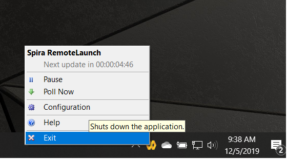

If, when you restart the application, the new engine tab does not show up in RemoteLaunch, Windows may have blocked the engine dll in the extensions folder. To resolve this block:

- right click on the engine .dll file you placed in the extensions folder
- select the properties for the file, and unblock it  
- you should now see the engine name in the RemoteLaunch tab


### Registration

Spira RemoteLaunch has its own License key needed for using the program. You cannot use your existing SpiraTest/Plan/Team key in Spira RemoteLaunch. Upon the first launch of the program, you will be asked to update your license information:


Enter in your organization name and license key in the email that was sent when you purchased the license, or as listed on your customer information page at <http://inflectra.com>.

Trial licenses are good until the 28^th^ day of the listed month. The next time the program is run after the 28^th^ of the month, you will be prompted to re-enter a new permanent license key, or the program will be unusable.

The license key can be updated at any time by going to the Tray Menu and select Help -\> About. Once the About screen opens up, click the Update button in the license details section to update or change license information.


## Using RemoteLaunch


### Basic Unattended Operation

When run, the program will start minimized to the system tray and will start its polling of the server. Polling will occur every 'x' minutes (60 by default) for any automated test sets that are scheduled to be run. When time comes for a test to be launched, it will start the test extension. The installed test extension will then perform the test and report results back to SpiraTeam. At the end of the test, the program will go back and resume scanning for tests that need to be executed.

No user input is ever needed from the application itself. However, testing applications may pop up dialogs needing user input. For existing Inflectra testing extensions, effort was put in to avoid as much user-interaction as possible, but in some cases it is unavoidable.


### Client Configuration

By right clicking on the system tray icon and selecting "Configuration", the application's window will open to the configuration panel. The panel has the following options:

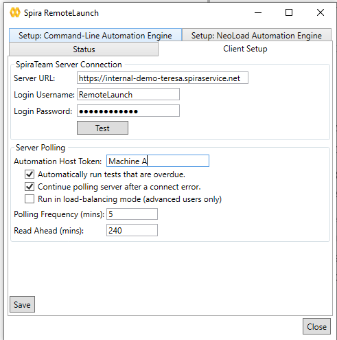

-   SpiraTeam Server Configuration:

      -   **Server URL**: This is the URL of the SpiraTeam installation.
      Be sure to not put /Login.aspx or any other page in the string,
      this should be just the root URL of the application's install.
      -   **Login Username**: This is the SpiraTeam login id of the user
      that you want the tests reported as. Note that while the
      application is polling and updating test results, if the user is
      logged into a web browser session, they will get kicked out.
      -   **Login Password**: The password to the Username above.
      -   **Test**: Clicking this will test the login to make sure the
      application can connect to the server properly.

-   Server Polling:
      -   **Automation Host Token**: This field is required, and uniquely
      identifies the local testing machine. Any scheduled tests
      assigned to the Automation Host on SpiraTeam will get polled for
      this machine. Except in special circumstances, this ID should be
      unique among all testing machines.
         ***Important***: This field must match the string that is entered into the Automation Host Details screen in the **Token**: field, or scheduled tests will not be recognized.
      -   **Automatically Run Overdue Tests**: When this is checked, any tests
      that are pulled from the SpiraTest server that has a scheduled date
      in the past will be marked as Overdue. Normally, overdue tests will
      not be executed. With this check, they will be executed as soon as
      the poll is finished.
      -   **Continue polling server after a connect error:** When this is
      checked, if RemoteLaunch receives an error connecting to the
      SpiraTest server, it will continue polling in the future. If this is
      unchecked, RemoteLaunch will switch to the error status upon
      encountering a connection error. It is important to check this
      option if your SpiraTest server will be periodically unavailable for
      server maintenance.
      -   **Polling Frequency**: How often in minutes the application will
      poll the SpiraTeam server for updates to the automation host's
      schedule. The default is 60 (1 hour), and should be fine for most
      installations. Note that tests will still be executed on their
      scheduled time, this is simply how often the program will talk to
      the SpiraTeam server to detect schedule changes. Updating the
      polling frequency will reset the currently running timers.
      -   **Polling Read Ahead**: How far ahead in minutes the program should
      read the schedule for the Automation host. Tests that are scheduled
      farther in advance will not show up as a pending test on the status
      screen.
      -   **Run in Load Balancing Mode**: This is an advanced mode that lets
      you schedule test sets in Spira for a pool of machines all running RemoteLaunch.
      Then the next available RemoteLaunch machine will take take the next test
      case in the test set and run that.


### Extension Configuration

If an extension has custom configuration options, they will appear as separate tabs located after the **Client Setup** tab. The contents of each tab will vary depending on the extension. View the extension's documentation for options given in those extensions.


### Status Screen

The status screen is usually hidden, but can be brought up for display by double-clicking on the system tray icon. The top of the screen shows the current status, whether it's running a test or waiting to poll the server for an update. It will also show any errors present on the application, like a registration error or configuration issue. Under the status bar is a list of any pending or executing tests that are scheduled for this testing machine. The list will get cleared at every poll, so tests that have executed since the previous poll will still be on the list, and will show their execution status:

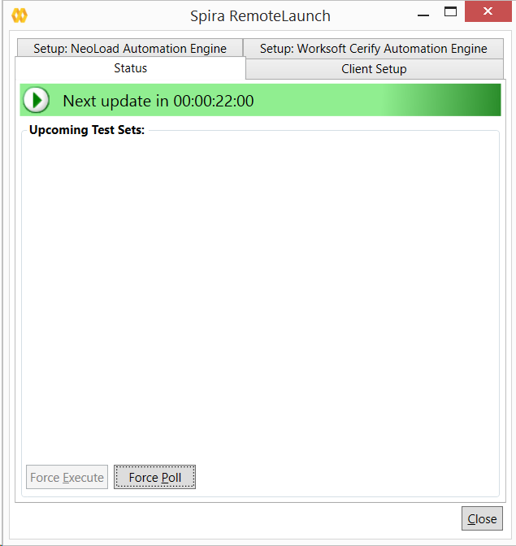

-   **Green Arrow**: A green arrow indicates that the test is still running, or RemoteLaunch is waiting for a reply from the testing engine / test application.

-   **Blue Checkbox**: A blue checkbox indicates that the test is completed, regardless of status of the individual test steps in the scheduled test set.

-   **Red Error**: A red error indicator indicates that the test extension or the testing application ran into an issue (outside of test results). In this case, any further tests that require the extension will be marked as blocked, as the issue needs to be corrected within the extension settings or testing application.

-   **No Indication**: No indication means that the test is currently awaiting for its scheduled date to start. Note that only one test will be launched at a time, so that if two tests are scheduled at the same time, the one with the lower TestSet ID will be executed first, then as soon as it's finished, the second scheduled test will be run.

By highlighting a test that has not been executed yet, you can click the Force Execute button. This will cause the selected test to have its scheduled date to the current time, causing it to be immediately executed (or, if another test is already running, next in line for execution).

At any time the Force Poll button can be clicked, causing RemoteLaunch to initiate an immediate poll of the SpiraTeam server to check for pending runs. The timers for the next server poll will be reset when the button is clicked.


### Tray Icon Menu

Instead of operating from the application window, all functions exist on the tray icon menu as well, as well as some additional commands:

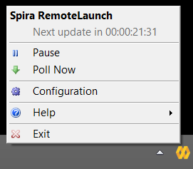

-   **Pause / Resume**: The Pause/Resume option pauses or resumes the timers for polling and executing tests. If a test or server poll is already in progress, it will not cancel these. However, after they are finished, no further polls or tests will be run.

-   **Poll Now**: This will force a server poll for upcoming tests, and reset the poll timer.

-   **Configuration**: Opens the main window to the Configuration page.

-   **Help -\> About**: Opens the About window, which displays the current license information and any loaded extensions.

-   **Help -\> View Help**: Opens this PDF file in a browser.

-   **Exit**: Will completely exit the program. Doing this will cancel any tests currently running and shut down the program. Any tests that were waiting to be executed will not execute until the program is restarted and the polling is resumed.

You can double-click the try icon to bring up the main window on the Status page.


## Test Execution and Reporting

All test handling is performed by the extension that the automated tests are configured for. Test Sets that have multiple Test Cases, the Test Cases will all be executed in order, sequentially. (No parallel executing.)

At the start of execution for a Test Set, the test set will be updated in SpiraTeam as "In Progress". As tests are performed, the Test Cases will be updated with their status. The Test Set on the status screen will be marked with the executing icon.

Once the Test Set is completed, the status of the Test Set will be changed to "Completed", and will be marked on the status screen with a completed icon.

In case of an uncaught exception that is thrown by the testing extension, the Test Set will be marked "Blocked", and the Test Case will be recorded as Blocked. All other following tests will not be run and remain as Not Run. The Test Set must be reset to be executed again, and it is recommended to look into the cause of the error (recorded in the Blocked Test Case results) and correct it before rescheduling the test. This Test Set will be marked with and error icon.

The same results are applied in the case where a Test Set contains a Test Case that references a testing extension that is not installed. Install the extension and re-run the Test Set.

Executing
, Completed
, and Error

 Test Sets are marked with the icons next to their scheduled date in the Status screen. They will stay in the list until the next scheduled server poll. You cannot manually re-run them.


## Running RemoteLaunch from a Build Script

Normally you schedule tests in SpiraTeam using the Planned Date field of the test sets and let the various instances of RemoteLaunch poll SpiraTeam for upcoming tests. In addition (as described in the
*SpiraTeam User Manual*) you can execute a test set on the local machine immediately by clicking the "Execute" button within SpiraTeam.

However there are situations where you want to be able to launch an automated test script using one of the supported engines from an external batch file or build script (e.g. as part of a continuous integration environment) and have those tests report their results back into SpiraTeam. You can achieve this by using the special command-line argument --testset which is passed to RemoteLaunch. For more details on this parameter see the next section.


## Command line arguments

For debugging and additional options when running the program, the following command-line arguments are available:

|  |  |
| ----- | ----- |
| -status                  |  Shows the Status screen upon startup. (Normal action is to run minimized to the system tray.
| -paused                  |  Starts the application with timers Paused instead of active.
| -poll                    |  Forces the program to do an initial poll upon startup. (Normal action is to wait the pending time before doing the initial poll.)
| -trace                   |  Enables tracelogging to the EventLog for debugging and watching tests execute.
| -logfile                 |  Forces events to be written to a text file instead of the Application EventLog. This option enables --trace as well. Files are located in the Local Application Data folder. (C:\\Users\\<user\>\\AppData\\Local on Vista/Win7).
| -testset:\[Test Set ID\] |  Allows you to tell RemoteLaunch to execute a specific test set on the remote computer (e.g. -testset:45 runs test set TX00045)
| <filename\>             |  Must be the last item on the command line. This is a TST file downloaded from SpiraTeam to start immediate execution on.


## Using RemoteLaunchX

When you need to run automated tests on a variety of different platforms (Windows, MacOS X, Linux, Unix, etc.) the RemoteLaunchX cross-platform automated testing agent is a better choice than the standard RemoteLaunch® GUI application.

To start using RemoteLaunchX, please go to the Customer Area of the Inflectra website and download the latest version of the RemoteLaunchX application. It will be packaged as a simple .zip compressed folder that you can extract onto the target computer:

 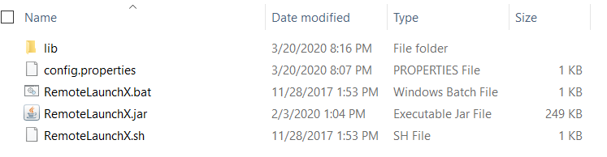
 

The following four files are included:

-   **RemoteLaunchX.jar** -- this is the main application, packaged as a Java JAR file. This version of RemoteLaunch requires Java 1.8 SE or later to be installed.

-   **config.properties** -- this contains all the settings used by RemoteLaunchX. You will need to edit this file in a text editor to configure RemoteLaunchX for use.

-   **RemoteLaunchX.bat** -- this is a sample Windows® batch file that can be used to simplify running RemoteLaunchX on Windows® systems.

-   **RemoteLaunchX.sh** -- this is a sample UNIX/Linux/MacOS X shell script that can be used to run RemoteLaunchX on UNIX, Linux or Mac OS X.

In addition, there is a **lib** folder that also needs to be extracted. It contains various third-party libraries that RemoteLaunchX uses. Currently it only uses the Google json parser library (gson v2.8.6):

 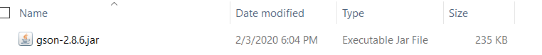

### Configuring RemoteLaunchX

Once you have extracted the files listed above, open up the
**config.properties** file in a text editor:

```

#This file contains the configuration data used by the RemoteLaunch-X application

#Spira connection information
server-url = http://vm-win2012r2/SpiraTeam
server-login = fredbloggs
server-token = {XXXXXXXX-XXXX-XXXX-XXXX-XXXXXXXXXXXX}

#The automation host token 
host-token = MyHost1

#The license key 
license-organization: TBD 
license-key: TBD

#The regular expressions for each of the possible execution statuses
pass-regex = .*
fail-regex = (?i).*(Error|Fail|Fatal).*
caution-regex = .*(Warning|Caution).*
blocked-regex = .*(Blocked).*

#Default status for output not matching any of the regular expressions above
default-test-status = Not Run
```

The following changes need to be made to this configuration file:

-   **server-url** -- This is the URL of the SpiraTest or SpiraTeam installation (hereafter referred to as just SpiraTest). Be sure to not put /Login.aspx or any other page in the string, this should be just the root URL of the application's install.

-   **server-login** -- This is the SpiraTest login id of the user that you want the tests reported as. Note that while the application is polling and updating test results, if the user is logged into a web browser session, they will get kicked out.

-   **server-token** -- The RSS Token of the SpiraTest login listed above. Found in users profile page under the "RSS Token" field; you must have RSS Feeds enabled for this to work.

-   **host-token** -- This field is required, and uniquely identifies the local testing machine. Any scheduled tests assigned to the Automation Host on SpiraTest will get polled for this machine. Except in special circumstances, this ID should be unique among all testing machines.  ***Important***: This field must match the string that is entered into the Automation Host Details screen in the **Token**: field, or scheduled tests will not be recognized.

-   **license-organization** -- The name of the "Organization" that your RemoteLaunch license key was issued to. This is listed in the Customer Area of the Inflectra website alongside the license key. Note: RemoteLaunch and RemoteLaunchX use the same license keys, so you don't need to have a separate RemoteLaunchX one.

-   **license-key** -- The RemoteLaunch license key that is listed in the secure Customer Area of the Inflectra website

You should leave the four **regex** settings alone for now, they can be changed when you start executing tests and need to fine-tune how RemoteLaunchX interprets the results.

Now that you have configured the plugin, you can execute the RemoteLaunchX console application by either running the provided batch /
shell command or just executing the JAR file directly:

> Java --jar RemoteLaunchX.jar

When you run the application, the following should be output to the console:

> Starting RemoteLaunch\...
> 
> ========================
> 
> Server URL: http://localhost/Spira
> 
> Server Login: fredbloggs
> 
> Automation Host: MyHost1
> 
> Checking License Key for: Inflectra Corporation
> 
> Production License Key in Use.
> 
> Testing connection to Spira\...
> 
> Successfully connected to Spira.
> 
> WARNING: Unable to retrieve test runs for SpiraTest project PR2, so
> skipping this project - Automation Host with token 'MyHost1' doesn't
> exist in project PR2.
> 
> WARNING: Unable to retrieve test runs for SpiraTest project PR3, so
> skipping this project - Automation Host with token 'MyHost1' doesn't
> exist in project PR3.
> 
> **Retrieved 0 test run(s) from SpiraTest.**
> 
> Exiting RemoteLaunch\...
> 
> ========================

The system will report back zero Test Runs at this point because nothing has been scheduled in SpiraTest. In the next section we shall setup an automated test set that contains an automated test case.


### Setting up Automated Tests in SpiraTest

This section assumes that you already have a working installation of SpiraTest or SpiraTeam and have installed RemoteLaunchX on the various test automation hosts following the instructions above. Once those prerequisites are in place, please follow these steps:

Log in to SpiraTeam as a system administrator and go into SpiraTeam main Administration page and click on the "Test Automation" link under
**Integration**.

Click the "Add" button to enter the new test automation engine details page. The fields required are as follows:

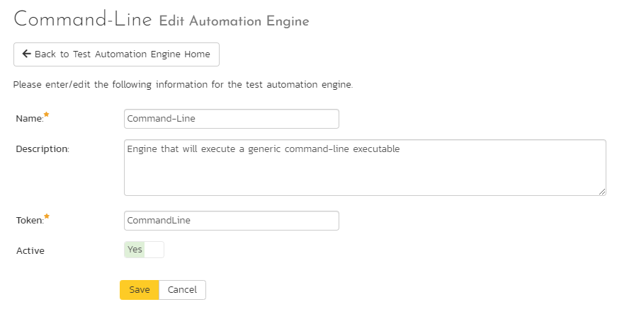

-   **Name**: This is the short display name of the automation engine. It can be anything that is meaningful to your users.

-   **Description**: This is the long description of the automation engine. It can be anything that is meaningful to your users. (Optional)

-   **Active**: If checked, the engine is active and able to be used for any project.

-   **Token**: This needs to be the assigned unique token for the automation engine and is used to tell RemoteLaunch which engine to actually use for a given test case. For Command-Line this should be simply **"CommandLine"**.

Once you have finished, click the "Insert & Close" button and you will be taken back to the Test Automation list page, with Command-Line listed as an available automation engine.

Next you need to display the list of test cases in SpiraTeam (by clicking Testing \> Test Cases) and then add a new test case. Once you have added the new test case, click on it and select the "Automation" tab:

 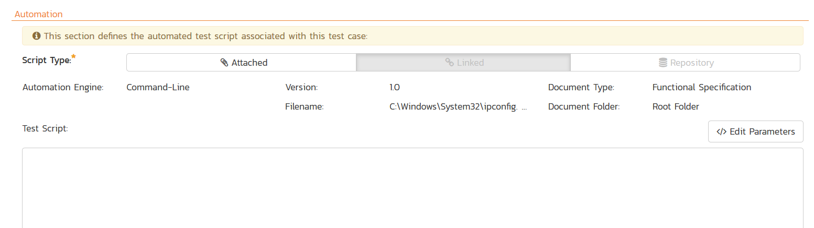
 

You need to enter the following fields:

**Automation Engine** - Choose the Command-Line Automation Engine that you created in the previous section from the drop-down list.

**Script Type** -- This can be set to Attached or Linked (see below for the difference).

**Filename** -- This needs to consist of the following **three** sections separated by a pipe (\|) character:

- 1) The full path to the command-line tool being executed.
- 2) Any arguments for the command-line tool. In addition, you can use the following additional tokens for some of the special RemoteLaunchX values:

    - \[TestCaseId\] -- the ID of the test case
    - \[TestSetId\] -- the ID of the test set
    - \[ReleaseId\] -- the ID of the release (if specified)
    - \[Filename\] - This special token will be replaced by the actual filename of the test script when RemoteLaunchX downloads it from SpiraTeam.

-  3) The mask for converting any parameter values from SpiraTeam into valid command line arguments. If parameters are not accepted by the command-line tool, you can leave this section out.

The mask can include any symbols together with "name" to refer to the parameter name and "value" to refer to the parameter value.

Example 1: If you want parameters to be provided in the form:
-param1=value1 --param2=value2 you would use the following mask:
-name=value

Example 2: If you want parameters to be provided in the form:
/param1:value1 /param2:value2 you would use the following mask:
/name:value

Some example filenames would be:
C:\\Temp\\TestApp.exe\|-arg1 -arg2\|-name=value C:\\Temp\\TestApp.exe\|-arg1 -arg2 "-arg3=\[Filename\]"\|

where the first one is for a **Linked** test and the second one is for an **Attached** test.

**Document Type** -- You can choose which document type the automated test script will be categorized under.

**Document Folder** -- You can choose which document folder the automated test script will be stored in.

**Version** -- The version of the test script (1.0 is used if no value specified)

**Test Script** -- For **Attached** test scripts, this needs to contain the complete test script in whatever language and syntax is being expected by the command-line application. For **Linked** test scripts, you should leave this blank.

If you would like to have SpiraTeam pass any parameter values to this test script you can specify them by using the syntax
${parameterName} **inside the test script**.

here is an advanced feature of SpiraTest/Team and RemoteLaunch that lets you pass parameters from SpiraTeam to your command-line automated testing tool. This is very useful if you want to have a data-driven test script that be executed multiple times with different parameter values.

To setup the automated test case for parameters, click on the "Edit Parameters" hyperlink above the "Test Script" box:

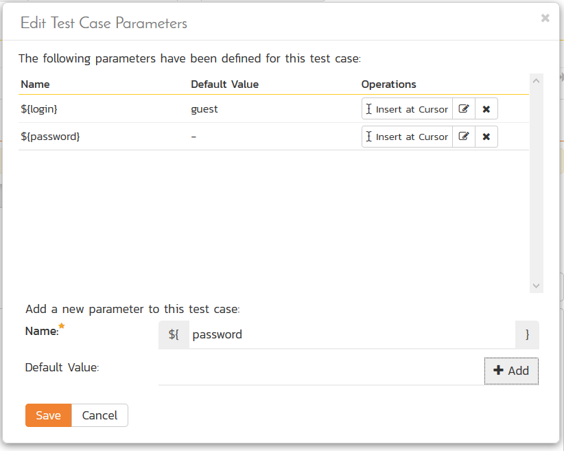

The name of the parameter ${login} needs to match the name of a parameter accepted by the command-line tool.

Once you are happy with the values, click \[Save\] to update the test case. Now you are ready to schedule the automated test case for execution.

Go to Testing \> Automation Hosts in SpiraTeam to display the list of automation hosts:

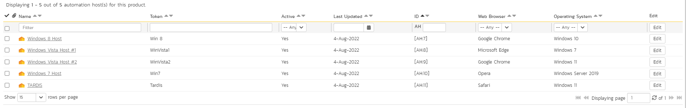

Make sure that you have created an Automation Host for each computer that is going to run an automated test case. The name and description can be set to anything meaningful, but the Token field **must be set to the same token that is specified in the RemoteLaunchX application** on that specific machine.

Once you have at least one Automation Host configured, go to Testing \>
Test Sets to create the test sets that will contain the automated test case. Note: Unlike manual test cases, automated test cases *must be executed within a test set* -- they cannot be executed directly from the test case.

Create a new Test Set to hold the Command-Line automated test cases and click on its hyperlink to display the test set details page:

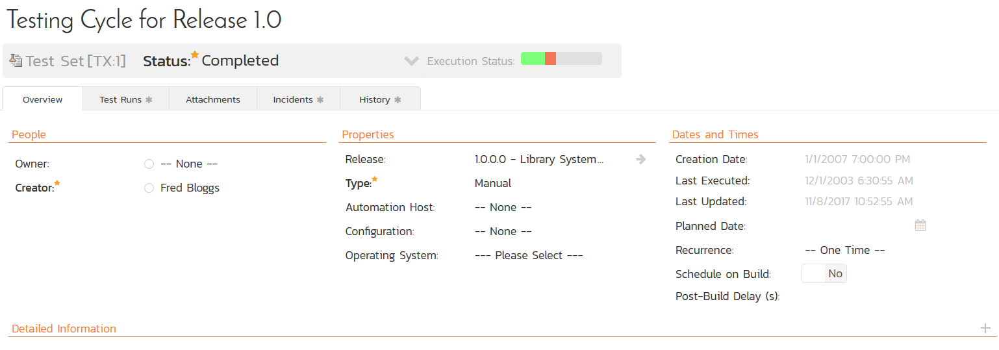

You need to add at least one automated test case to the test set and then configure the following fields:

-   **Automation Host** -- This needs to be set to the name of the automation host that will be running the automated test set.

-   **Planned Date** -- The date and time that you want the scenario to begin. (Note that multiple test sets scheduled at the exact same time will be scheduled by Test Set ID order.)

-   **Status** -- This needs to be set to "Not Started" for RemoteLaunch to pick up the scheduled test set. When you change the Planned Date, the status automatically switches back to "Not Started"

-   **Type** -- This needs to be set to "Automated" for automated testing

If you have parameterized test cases inside the automated test set you can set their values in three different ways:

-   **Test Set Parameter Values** -- this lets you set the same value of a parameter for all the test cases in the test set:


-   **Test Case Parameter Values** -- this lets you set a specific value for a parameter for a particular test case in the test set:
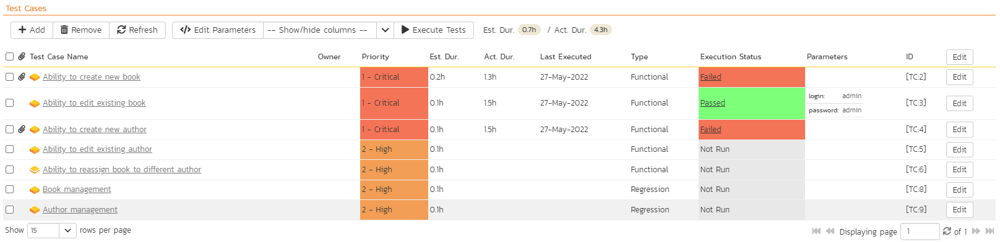

-   **Test Configurations** -- this lets you create a data grid of possible test parameters and execute the test set multiple times, once for each unique combination:


#### RemoteLaunchX Command Line Options

- **testset** -- If you would like to force execution of a test set regardless of its status, you can use the `-testset` command-line option just as in RemoteLaunch. Simply add `-testset:[ID]` where \[ID\] is the ID of the test set you would like to execute. e.g. `java -jar RemoteLaunchX.jar -testset:24 -testset:37`

- **project** -- If you would like to limit the projects scanned by RemoteLaunchX, you can use the `-project` command-line option. Simply add `-project:[ID]` where \[ID\] is the ID of the project. e.g. `java -jar RemoteLaunchX.jar -project:1 project:6`

### Running RemoteLaunchX

Once you have set the various test set fields (as described above), you are now ready to execute RemoteLaunchX. You can execute the RemoteLaunchX console application by either running the provided batch /
shell command or just executing the JAR file directly:

> Java --jar RemoteLaunchX.jar

When you run the application, the following should be output to the console:

> Starting RemoteLaunch\...
> 
> ========================
> 
> Server URL: http://localhost/Spira
> 
> Server Login: fredbloggs
> 
> Automation Host: MyHost1
> 
> Checking License Key for: Inflectra Corporation
> 
> Production License Key in Use.
> 
> Testing connection to Spira\...
> 
> Successfully connected to Spira.
> 
> WARNING: Unable to retrieve test runs for SpiraTest project PR2, so
> skipping this project - Automation Host with token 'MyHost1' doesn't
> exist in projec PR2.
> 
> WARNING: Unable to retrieve test runs for SpiraTest project PR3, so
> skipping this project - Automation Host with token 'MyHost1' doesn't
> exist in projec PR3.
> 
> Retrieved 1 test run(s) from SpiraTest.
> 
> Executing test case TC18 with filename
> 'C:\\Windows\\System32\\ipconfig.exe\|/all'
> 
> This is a Linked test script
> 
> Executing command 'C:\\Windows\\System32\\ipconfig.exe' with arguments
> '/all'
> 
> **Execution Status = Passed**
> 
> Exiting RemoteLaunch\...
> 
> ========================

This can be seen graphically below:

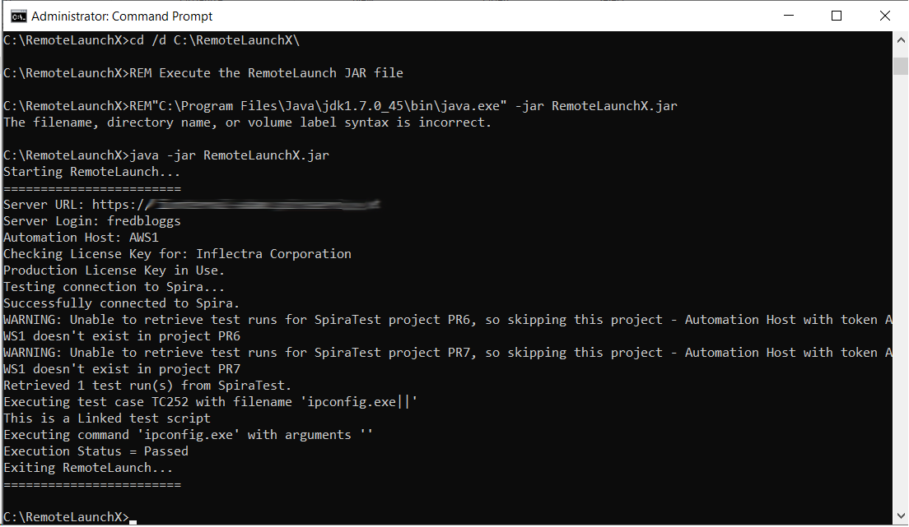

The console output will indicate which test sets are being executed and what the final result was. Inside SpiraTest, once execution begins the status of the test set will change from "Not Started" to "In Progress", and once test execution is done, the status of the test set will change to either "Completed" -- the automation engine could be launched and the test has completed (passed or failed) -- or "Blocked" -- RemoteLaunchX was not able to execute the test.

In addition, the individual test cases in the set will display a status based on the results of the command-line test that was executed:

**Passed** -- The automated test ran successfully and matched the PASS regular expression.

**Failed** -- The automated test ran successfully, and matched the FAIL regular expression.

**Caution** -- The automated test ran successfully, and matched the CAUTION regular expression.

**Blocked** -- The automated test did not run successfully or it matched the BLOCKED regular expression.

If you receive the "Blocked" status for either the test set or the test cases you should open up the Test Run that was recorded and the Console output section will contain the underlying error message(s).

Once the tests have completed, you can log back into SpiraTest and see the execution status of your test cases. If you click on a Test Run that was generated by the command-line tool, you will see the following information:

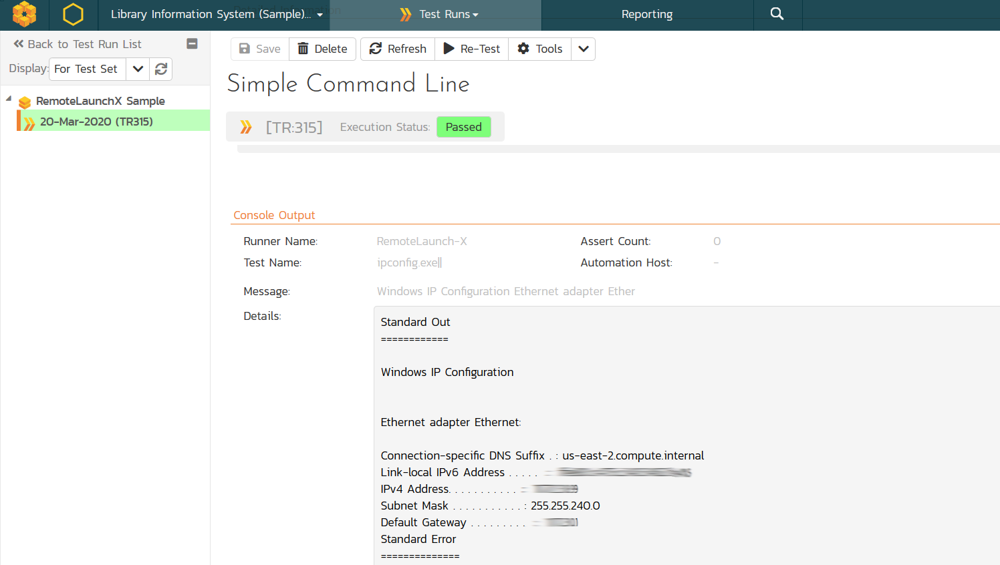

This screen indicates the status of the test run that was reported back from command-line tool together with any messages or other information. The execution status will be set according to the rules described above, the Message field will contain the first line of console output and the large details box will contain the full console output from the command-line tool.

Congratulations... You are now able to run a custom command-line test, and have the results be recorded within SpiraTest / SpiraTeam.


### Scheduling RemoteLaunchX

Unlike the main RemoteLaunch application, RemoteLaunchX does not have a built-in timer and so when executed it will run once, check for pending test sets and then exit. If you want to have it run on a periodic basis, you will need to schedule it externally. If you are using Microsoft Windows® you would use the Windows Task Scheduler and in other operating systems you would setup a CRON job. We recommend scheduling RemoteLaunchX to run every 5 minutes.


### Customizing the Reporting

By default, RemoteLaunchX will use the following rules to determine if a test has passed, failed, blocked or passed with warnings (caution) Note that regular expressions are case sensitive by default. To make them case insensitive, simply add the `(?i)` flag to the beginning just as in the `fail-regex` below.

**Passed** -- The test completed and the console output didn't contain any of the error phrases listed in the other rules (below).

**Failed** -- The test completed and the console output contained the phrases "Error", "Fail" or "Fatal".

**Caution** -- The test completed and the console output contained the phrases "Warning", or "Caution".

**Blocked** -- The automated test did not run successfully or the console output contained the phrase "Blocked".

You can customize the reporting by changing the Regular Expressions (Regex) and the default test status stored in the config.properties files:

```
#The regular expressions for each of the possible execution statuses

pass-regex = .\*
fail-regex = (?i).\*(Error\|Fail\|Fatal).\*
caution-regex = .\*(Warning\|Caution).\*
blocked-regex = .\*(Blocked).\*

#Default status for output not matching any of the regular expressions above
default-test-status = Not Run
```


