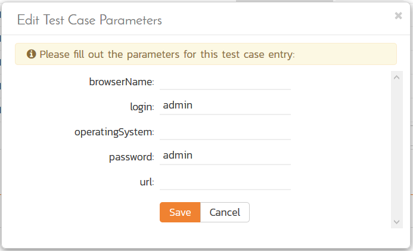

# Selenium

Selenium Remote Control (RC) is a test tool that allows you to write
automated web application user interface tests in any programming
language against any HTTP website using any mainstream
JavaScript-enabled browser. Selenium RC comes in two parts.

- A server which can automatically launch and kill supported browsers, and
acts as a HTTP proxy for web requests from those browsers.

- Client applications that send commands to the Selenium-RC server in a
special language (called Selenese) that tell it what operations to
perform on the launched web browser.

This section describes how you can use SpiraTest / SpiraTeam (hereafter
SpiraTeam) together with RemoteLaunch to schedule and remotely launch
instances of Selenium-RC (hereafter just referred to as Selenium) on
different computers and have the testing results be transmitted back to
SpiraTeam. This allows you to extend your SpiraTeam's test management
capabilities to include automated Selenium web tests.

*Note: This integration requires at least version 3.0 of SpiraTest/Team
and version 1.0 of Selenium-Remote Control.*

## Installing the Selenium Engine

This section assumes that you already have a working installation of
SpiraTest or SpiraTeam and have installed RemoteLaunch on the various
test automation hosts following the instructions in [RemoteLaunch Guide](RemoteLaunch-Guide.md).
Once those prerequisites are in place, please follow these steps:

- Download and extract the SeleniumAutomationEngine.zip file
from the Inflectra website and locate the appropriate SeleniumX.dll for
the version of Selenium that you are using.
    - If you don't see the version listed, just use the nearest version that
is *lower* than your current version.
- Copy the file "SeleniumX.dll" (where X is the appropriate version) into the "extensions" sub-folder of the RemoteLaunch installation. 
- Also copy the ThoughtWorks.Selenium.Core.dll from the
zipfile into the "extensions" sub-folder.
- Log in to SpiraTeam as a system administrator and go into SpiraTeam main
Administration page and click on the "Test Automation" link under
**Integration**.
-   Click the "Add" button to enter the new test automation engine
details page. The fields required are as follows:


-   **Name**: This is the short display name of the automation
engine. It can be anything that is meaningful to your users.

-   **Description**: This is the long description of the automation
engine. It can be anything that is meaningful to your users.
(Optional)

-   **Active**: If checked, the engine is active and able to be used
for any project.

-   **Token**: This needs to be the assigned unique token for the
automation engine and is used to tell RemoteLaunch which engine
to actually use for a given test case. For Selenium this should
be **SeleniumX** where 'X' is the version number of the DLL file
that you are using.

-   Once you have finished, click the "Insert & Close" button and you
will be taken back to the Test Automation list page, with Selenium
listed as an available automation engine.

### Advanced Settings

You can modify the Selenium configuration for each of the specific
automation hosts, by right-clicking on the RemoteLaunch icon in the
system tray and choosing "Configuration". That will bring up the
RemoteLaunch configuration page.

a) Selenium-RC 1.0

The Selenium 1.0 engine adds its own tab to this page which allows you
to configure how Selenium operates:


The following fields can be specified on this screen:

- **Server Host** -- This should be the name / IP address of the Selenium
server. Typically this will be localhost because RemoteLaunch is usually
installed on the Selenium server itself.

- **Server Port** -- This should be set to the custom port that the
Selenium server uses as a proxy when intercepting requests to the
browser. The default value is 4444.

- **Browser String** -- This needs to be the name of the browser that the
Selenium server will launch. Common values include:

    - **\*firefox** -- This will launch the Firefox web browser

    - **\*iexplore** -- This will launch the Microsoft Internet Explorer web
browser

    - **\*safari** -- This will launch the Apple Safari web browser

- **Browser URL** -- This needs to be the initial URL that you want the
browser to open to

a) Selenium WebDriver 2.x

The Selenium 2.x engine adds its own tab to this page which allows you
to configure how Selenium operates:


The following fields can be specified on this screen:

**Browser Type** -- This needs to be set to the type of browser that the
Selenium webdriver will launch.

**Browser URL** -- This needs to be the initial URL that you want the
browser to open to

## Setting up the Automated Test Cases

This section describes the process for setting up a test case in
SpiraTeam for automation and either linking it to an existing Selenium
test script file or entering a Selenium test script directly into
SpiraTeam.

### Attaching a Selenium Test Script

First you need to display the list of test cases in SpiraTeam (by
clicking Testing \> Test Cases) and then add a new test case. Once you
have added the new test case, click on it and select the "Automation"
tab:


You need to enter the following fields:

- **Automation Engine** - Choose the Selenium Automation Engine that you
created in the previous section from the drop-down list.

- **Script Type** -- This should be set to Attached for this case

- **Filename** -- Since the test script is going to be entered directly
into SpiraTeam you can enter any name you like for the filename as long
as it's logical and memorable.

- **Document Type** -- you can choose which document type the automated test script will be categorized under.

- **Document Folder** -- you can choose which document folder the automated test script will be stored in.

- **Version** -- The version of the test script (1.0 is used if no value
specified)

- **Test Script** -- This needs to contain the complete Selenium test
script written in Selenium IDE *Selenese*. Selenium IDE test scripts
consist of three parts:

    - The command
    
    - The target of the command
    
    - The data to be used

- You should enter the three components on each line separated by the Pipe
(\|) character. If you need to use a pipe character inside any of the
components you can escape it with a backslash (\\\|).

    - An example command would be type\|q\|hello

    - If the command doesn't need all three components, you can simply leave
    it out (for example open\|\|http://www.inflectra.com)

- If you would like to have SpiraTeam pass any parameter values to this
test script (this will be discussed in more detail later) you can
specify them by using the syntax ${parameterName}.

    - An example parameterized command would be open\|\|${url}

A complete sample script is illustrated below:

> open\|\|http://www.google.com/webhp
>
> assertTitle\|\|Google
>
> type\|q\|${query}
>
> click\|btnG
>
> waitForPageToLoad\|\|5000
>
> isTextPresent\|\|${matchtext}

Once you are happy with the values, click \[Save\] to update the test
case. Now you are ready to schedule the automated test case for
execution.

### Linking a Selenium Test Script

First you need to display the list of test cases in SpiraTeam (by
clicking Testing \> Test Cases) and then add a new test case. Once you
have added the new test case, click on it and select the "Automation"
tab:


You need to enter the following fields:

- **Automation Engine** - Choose the Selenium Automation Engine that you
created in the previous section from the drop-down list.

- **Script Type** -- This should be set to Linked for this case

- **Filename** -- This needs to be the full path to the Selenium IDE test
script file. To make this easier across different machines, you can use
several constants for standard Windows locations:

    - \[MyDocuments\] -- The user's "My Documents" folder. The user indicated
    is the user that ran RemoteLaunch.
    
    - \[CommonDocuments\] -- The Public Document's folder.
    
    - \[DesktopDirectory\] -- The user's Desktop folder. The user indicated is
    the user that ran RemoteLaunch.
    
    - \[ProgramFiles\] -- Translated to the Program Files directory. For
    64-bit machines, it's the 64-bit directory.
    
    - \[ProgramFilesX86\] -- Translated to the 32-bit Program Files directory.

- **Document Type** -- If using SpiraTeam (not SpiraTest) you can choose
which document type the automated test script will be categorized under.

- **Document Folder** -- If using SpiraTeam (not SpiraTest) you can choose
which document folder the automated test script will be stored in.

- **Version** -- The version of the test script (1.0 is used if no value
specified)

- **Test Script** -- *This is not used when you are using the linked test
script option*

The linked test script needs to be an HTML document that contains a
table with *three columns*. Each row corresponds to a single Selenium
action. Each of the columns in the row corresponds to the three Selenium
command components:

- The command

- The target of the command

- The data to be used

An example Selenium test script is illustrated below:

```html
<html>
    <body>
        <table>
            <tr>
                <td>
                    open
                </td>
                <td>                    
                </td>
                <td>
                    http://www.google.com/webhp
                </td>
            </tr>
            <tr>
                <td>
                    assertTitle</td>
                <td>                    
                    &nbsp;</td>
                <td>
                    Google</td>
            </tr>
            <tr>
                <td>
                    type</td>
                <td>                    
                    q</td>
                <td>
                    ${query}</td>
            </tr>
            <tr>
                <td>
                    click</td>
                <td>                    
                    btnG</td>
                <td>
                    &nbsp;</td>
            </tr>
            <tr>
                <td>
                    waitForPageToLoad</td>
                <td>                    
                    &nbsp;</td>
                <td>
                    5000</td>
            </tr>
            <tr>
                <td>
                    isTextPresent</td>
                <td>                    
                    &nbsp;</td>
                <td>
                    ${matchtext}</td>
            </tr>
        </table>
    </body>
</html>
```

When opened in an HTML editing tool it looks like:

| | | |
| --- | --- | --- |
| open               |      |  http://www.google.com/webhp |
| assertTitle        |      |  Google |
| type               | q    |  ${query} |
| click              | btnG |    |
| waitForPageToLoad  |      |  5000 |
| isTextPresent      |      |  ${matchtext} |

If you would like to have SpiraTeam pass any parameter values to this
test script (this will be discussed in more detail later) you can
specify them by using the syntax ${parameterName}.

An example parameterized command is displayed in the third and sixth
rows of the table above (${query} and ${matchtext}).

Once you are happy with the values, click \[Save\] to update the test
case. Now you are ready to schedule the automated test case for
execution.

### Using Parameterized Test Cases

There is an advanced feature of SpiraTest/Team and RemoteLaunch that
lets you pass parameters from SpiraTeam to your Selenium automated test
script. This is very useful if you want to have a data-driven Selenium
test script that be executed multiple times with different parameter
values.

To setup the automated test case for parameters, click on the "Test
Steps" tab and click on "Edit Parameters":


The name of the parameter ${login} needs to match the name of the input
parameter defined within the Selenium script.

## Executing the Selenium Test Sets from SpiraTeam

There are two ways to execute automated test cases in SpiraTeam:

1.  Schedule the test cases to be executed on a specific computer (local
or remote) at a date/time in the future

2.  Execute the test cases right now on the local computer.

We shall outline both of these two scenarios in this section. However
first we need to setup the appropriate automation hosts and test sets in
SpiraTeam:

### Configuring the Automation Hosts and Test Sets

Go to Testing \> Automation Hosts in SpiraTeam to display the list of
automation hosts:


Make sure that you have created an Automation Host for each computer
that is going to run an automated test case. The name and description
can be set to anything meaningful, but the Token field **must be set to
the same token that is specified in the RemoteLaunch application** on
that specific machine.

Once you have at least one Automation Host configured, go to Testing \>
Test Sets to create the test sets that will contain the automated test
case:


Note: Unlike manual test cases, automated test cases *must be executed
within a test set* -- they cannot be executed directly from the test
case.

Create a new Test Set to hold the Selenium automated test cases and
click on its hyperlink to display the test set details page:


You need to add at least one automated test case to the test set and
then configure the following fields:

-   **Automation Host** -- This needs to be set to the name of the
automation host that will be running the automated test set.

-   **Planned Date** -- The date and time that you want the scenario to
begin. (Note that multiple test sets scheduled at the exact same
time will be scheduled by Test Set ID order.)

-   **Status** -- This needs to be set to "Not Started" for RemoteLaunch
to pick up the scheduled test set. When you change the Planned Date,
the status automatically switches back to "Not Started"

-   **Type** -- This needs to be set to "Automated" for automated
testing

If you have parameterized test cases inside the automated test set you
can set their values in three different ways:

-   **Test Set Parameter Values** -- this lets you set the same value of
a parameter for all the test cases in the test set:


-   **Test Case Parameter Values** -- this lets you set a specific value
for a parameter for a particular test case in the test set:


You set these values, by right-clicking on a row and choosing "Edit
Parameters":



-   **Test Configurations** -- this lets you create a data grid of
possible test parameters and execute the test set multiple times,
once for each unique combination:


### Executing the Test Sets

Once you have set the various test set fields (as described above), the
Remote Launch instances will periodically poll SpiraTeam for new test
sets. Once they retrieve the new test set, they will add it to their
list of test sets to execute. Once execution begins they will change
the status of the test set to "In Progress", and once test execution is
done, the status of the test set will change to either "Completed" --
the automation engine could be launched and the test has completed -- or
"Blocked" -- RemoteLaunch was not able to start the automation engine.

If you want to immediately execute the test case on your local computer,
instead of setting the "Automation Host", "Status" and "Planned Date"
fields, you can instead click the \[Execute\] icon on the test set
itself. This will cause RemoteLaunch on the local computer to
immediately start executing the current test set.

In either case, once all the test cases in the test set have been
completed, the status of the test set will switch to "Completed" and the
individual test cases in the set will display a status based on the
results of the Selenium test:

**Passed** -- The Selenium automated test ran successfully and all the
test conditions in the test script passed

**Failed** -- The Selenium automated test ran successfully, but at least
one test condition in the test script failed.

**Blocked** -- The Selenium automated test did not run successfully

If you receive the "Blocked" status for either the test set or the test
cases you should open up the Windows Application Event Log on the
computer running RemoteLaunch and look in the event log for error
messages.

*Note: While the tests are executing you may see browser windows launch
as the Selenium server executes the appropriate tests.*

Once the tests have completed, you can log back into SpiraTeam and see
the execution status of your test cases. If you click on a Test Run that
was generated by Selenium, you will see the following information:


This screen indicates the status of the test run that was reported back
from Selenium together with any messages or other information. The
execution status will be set to PASSED if all the Selenium commands
report back OK and all the tests passed. If any of the commands failed
or the tests don't pass, the overall execution status will be listed as
FAILED.

The Message field will contain a summary of the number of commands
executed and the number of failed commands, with the large details box
containing the full command execution log as reported back from
Selenium:

> open (, http://www.google.com/webhp) - OK  
>                                            
> assertTitle (, Google) - OK                
>                                            
> type (q, Philomene Long) - OK              
>                                            
> click (btnG, ) - OK                        
>                                            
> waitForPageToLoad (, 5000) - OK            
>                                            
> isTextPresent (, Philomene Long) - OK,true 

Congratulations... You are now able to run Selenium automated web tests
and have the results be recorded within SpiraTest / SpiraTeam.

