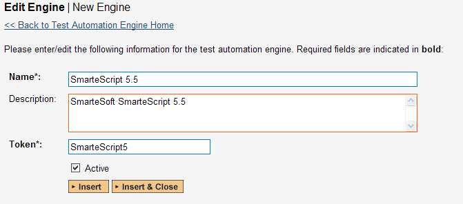
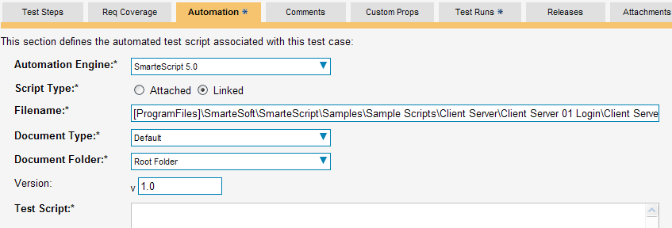
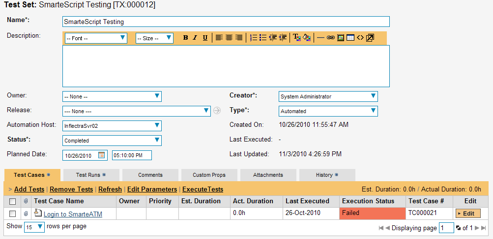
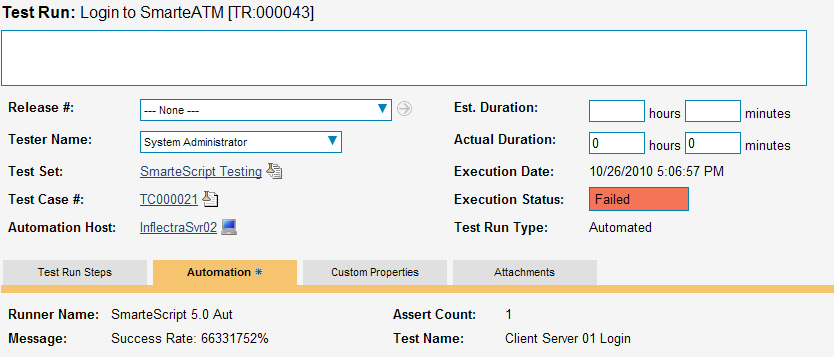

# SmarteScript

SmarteSoft™ SmarteScript™ (hereafter SmarteScript) is a Graphic User
Interface (GUI) script-free functional test automation system that lets
you record application operations by capturing the various testable
objects of the application and then playback the operations to
automatically test the application.

This section describes how you can use SpiraTest / SpiraTeam (hereafter
SpiraTeam) together with RemoteLaunch to schedule and remotely launch
instances of SmarteScript on different computers and have the testing
results be transmitted back to SpiraTeam. This allows you to extend your
SpiraTeam's test management capabilities to include automated
SmarteScript tests.

*Note: This integration requires at least version 3.0 of SpiraTest/Team
and version 5.0 of SmarteScript.*

## Installing the SmarteScript Engine

This section assumes that you already have a working installation of
SpiraTest or SpiraTeam and have installed RemoteLaunch on the various
test automation hosts following the instructions in [RemoteLaunch Guide](RemoteLaunch-Guide.md).
Once those prerequisites are in place, please follow these steps:

Download and extract the SmarteScriptAutomationEngine.zip
file from the Inflectra website and locate the appropriate
SmarteScriptX.dll for the version of SmarteScript that you are using.

If you don't see the version listed, just use the nearest version that
is *lower* than your current version.

-   Copy the file "SmarteScriptX.dll" (where X is the appropriate version) into the "extensions" sub-folder of the RemoteLaunch installation.

-   Log in to SpiraTeam as a system administrator and go into SpiraTeam
main Administration page and click on the "Test Automation" link
under **Integration**.

-   Click the "Add" button to enter the new test automation engine
details page. The fields required are as follows:

-   **Name**: This is the short display name of the automation
engine. It can be anything that is meaningful to your users.

-   **Description**: This is the long description of the automation
engine. It can be anything that is meaningful to your users.
(Optional)

-   **Active**: If checked, the engine is active and able to be used
for any project.

-   **Token**: This needs to be the assigned unique token for the
automation engine and is used to tell RemoteLaunch which engine
to actually use for a given test case. For SmarteScript this
should be **SmarteScriptX** where 'X' is the version number of
the DLL file that you are using.

-   Once you have finished, click the "Insert & Close" button and you
will be taken back to the Test Automation list page, with
SmarteScript listed as an available automation engine.

## Setting up the Automated Test Cases

This section describes the process for setting up a test case in
SpiraTeam for automation and linking it to an automated SmarteScript
test script.

First you need to display the list of test cases in SpiraTeam (by
clicking Testing \> Test Cases) and then add a new test case. Once you
have added the new test case, click on it and select the "Automation"
tab:

You need to enter the following fields:

- **Automation Engine** - Choose the SmarteScript Automation Engine that
you created in the previous section from the drop-down list.

- **Script Type** -- This should be set to Linked as the integration with
SmarteScript only supports referencing SmarteScript test script file
(.ses) and not physically uploading the test scripts into SpiraTeam.

- **Filename** -- This needs to be the full path to the SmarteScript test
script (i.e. the .ses file that you open in SmarteScript to run the
test). To make this easier across different machines, you can use
several constants for standard Windows locations (see example in
screenshot):

- \[MyDocuments\] -- The user's "My Documents" folder. The user indicated
is the user that ran RemoteLaunch.

- \[CommonDocuments\] -- The Public Document's folder.

- \[DesktopDirectory\] -- The user's Desktop folder. The user indicated is
the user that ran RemoteLaunch.

- \[ProgramFiles\] -- Translated to the Program Files directory. For
64-bit machines, it's the 64-bit directory.

- \[ProgramFilesX86\] -- Translated to the 32-bit Program Files directory.

- **Document Type** -- If using SpiraTeam (not SpiraTest) you can choose
which document type the automated test script will be categorized under.

- **Document Folder** -- If using SpiraTeam (not SpiraTest) you can choose
which document folder the automated test script will be stored in.

- **Version** -- The version of the test script (1.0 is used if no value
specified)

- **Test Script** -- *This is not used with the SmarteScript Engine since
it only supports linked test scripts.*

Once you are happy with the values, click \[Save\] to update the test
case. Now you are ready to schedule the automated test case for
execution.

### Using Parameterized Test Cases

*SmarteScript does not support the passing of input test parameters so
the SmarteScript automation engine does not support this feature of
SpiraTeam or RemoteLaunch.*

## Executing the SmarteScript Test Sets from SpiraTeam

There are two ways to execute automated test cases in SpiraTeam:

1.  Schedule the test cases to be executed on a specific computer (local
or remote) at a date/time in the future

2.  Execute the test cases right now on the local computer.

We shall outline both of these two scenarios in this section. However
first we need to setup the appropriate automation hosts and test sets in
SpiraTeam:

### Configuring the Automation Hosts and Test Sets

Go to Testing \> Automation Hosts in SpiraTeam to display the list of
automation hosts:

Make sure that you have created an Automation Host for each computer
that is going to run an automated test case. The name and description
can be set to anything meaningful, but the Token field **must be set to
the same token that is specified in the RemoteLaunch application** on
that specific machine.

Once you have at least one Automation Host configured, go to Testing \>
Test Sets to create the test sets that will contain the automated test
case:

Note: Unlike manual test cases, automated test cases *must be executed
within a test set* -- they cannot be executed directly from the test
case.

Create a new Test Set to hold the SmarteScript automated test cases and
click on its hyperlink to display the test set details page:

You need to add at least one automated test case to the test set and
then configure the following fields:

-   **Automation Host** -- This needs to be set to the name of the
automation host that will be running the automated test set.

-   **Planned Date** -- The date and time that you want the scenario to
begin. (Note that multiple test sets scheduled at the exact same
time will be scheduled by Test Set ID order.)

-   **Status** -- This needs to be set to "Not Started" for RemoteLaunch
to pick up the scheduled test set. When you change the Planned Date,
the status automatically switches back to "Not Started"

-   **Type** -- This needs to be set to "Automated" for automated
testing

### Executing the Test Sets

Once you have set the various test set fields (as described above), the
Remote Launch instances will periodically poll SpiraTeam for new test
sets. Once they retrieve the new test set, they will add it to their
list of test sets to execute. Once execution begins they will change
the status of the test set to "In Progress", and once test execution is
done, the status of the test set will change to either "Completed" --
the automation engine could be launched and the test has completed -- or
"Blocked" -- RemoteLaunch was not able to start the automation engine.

If you want to immediately execute the test case on your local computer,
instead of setting the "Automation Host", "Status" and "Planned Date"
fields, you can instead click the \[Execute\] icon on the test set
itself. This will cause RemoteLaunch on the local computer to
immediately start executing the current test set.

In either case, once all the test cases in the test set have been
completed, the status of the test set will switch to "Completed" and the
individual test cases in the set will display a status based on the
results of the SmarteScript test:

**Passed** -- The SmarteScript automated test ran successfully and all
the test conditions in the test script passed

**Failed** -- The SmarteScript automated test ran successfully, but at
least one test condition in the test script failed.

**Blocked** -- The SmarteScript automated test did not run successfully

If you receive the "Blocked" status for either the test set or the test
cases you should open up the Windows Application Event Log on the
computer running RemoteLaunch and look in the event log for error
messages.

*Note: While the tests are executing you may see browser or application
windows launch as SmarteScript executes the appropriate tests.*

Once the tests have completed, you can log back into SpiraTeam and see
the execution status of your test cases. If you click on a Test Run that
was generated by SmarteScript, you will see the following information:

This screen indicates the status of the test run that was reported back
from SmarteScript together with any messages or other information. The
Test Name indicates the name of the test inside SmarteScript, and the
execution status corresponds the matching status inside SmarteScript.

Congratulations... You are now able to run SmarteScript automated
functional tests and have the results be recorded within SpiraTest /
SpiraTeam.

