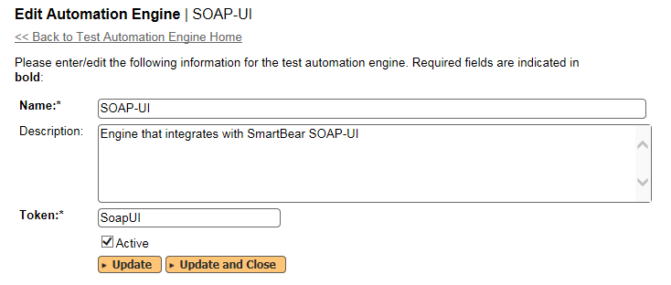
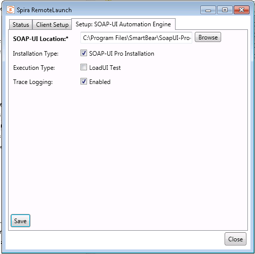
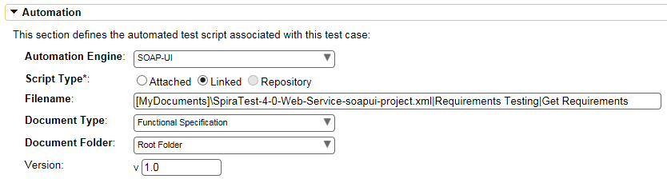
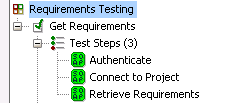
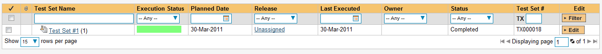
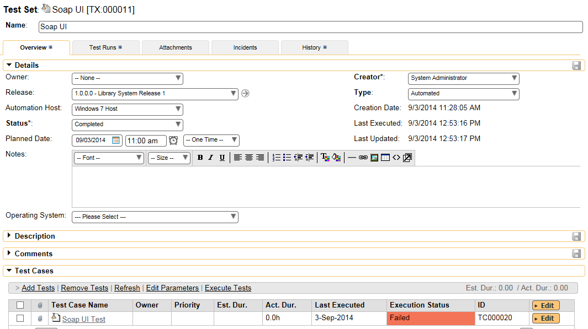
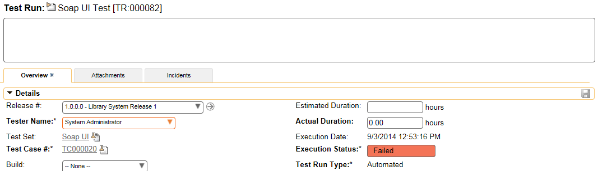
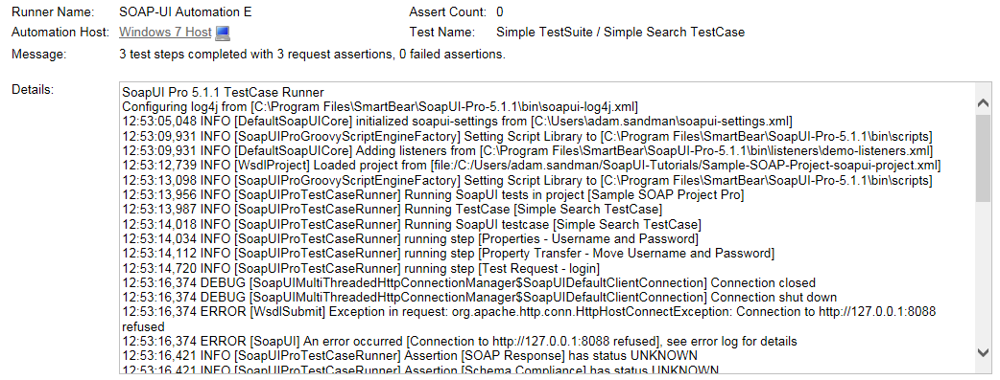
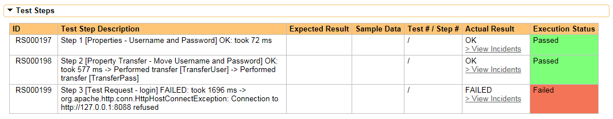

# SoapUI (ReadyAPI)
!!! abstract "Compatible with SpiraTest, SpiraTeam, SpiraPlan"

SmartBear SoapUI / ReadyAPI (hereafter SoapUI) is an open source Web Service testing tool for Service Oriented Architectures (SOAs). There is also a Pro version (Now known as ReadyAPI) that is released as a commercial product. Its functionality mainly covers Web Service Inspection, Invoking, Development, Simulation and Mocking, Functional testing, Load and Compliance testing. Productivity enhancement features can be found in ReadyAPI (previously known as SoapUI Pro).

This section describes how you can use Spira together with RemoteLaunch to schedule and remotely launch instances of soapUI on different computers and have the testing results be transmitted back to Spira. This allows you to extend your Spira's test management capabilities to include automated web service testing.

*Note: This integration requires at least version 4.0 of Spira and an instance of SoapUI, SoapUI Pro, or ReadyAPI running on a Windows® platform.*

## Installing the SoapUI Engine

This section assumes that you already have a working installation of Spira and have installed RemoteLaunch on the various test automation hosts following the instructions in [RemoteLaunch Guide](RemoteLaunch-Guide.md). Once those prerequisites are in place, please follow these steps:

- Download and extract the SoapUIEngine.zip file from the Inflectra website.
- Extract the file "soapUIEngine.dll" from the compressed archive into the "extensions" sub-folder of the RemoteLaunch installation. 
- Log in to Spira as a system administrator and go into Spira main Administration page and click on the "Test Automation" link under **Integration**.
-   Click the "Add" button to enter the new test automation engine details page. The fields required are as follows:

    -   **Name**: This is the short display name of the automation     engine. It can be anything that is meaningful to your users.     **Description**: This is the long description of the automation     engine. It can be anything that is meaningful to your users.     (Optional)
    -   **Active**: If checked, the engine is active and able to be used     for any project.
    -   **Token**: This needs to be the assigned unique token for the     automation engine and is used to tell RemoteLaunch which engine     to actually use for a given test case. For soapUI this should be     **SoapUI**.

-   Once you have finished, click the "Insert & Close" button and you will be taken back to the Test Automation list page, with SoapUI listed as an available automation engine.

### SoapUI RemoteLaunch Settings
You will need to modify the SoapUI configuration for each of the specific automation hosts, by right-clicking on the RemoteLaunch icon in the system tray and choosing "Configuration". That will bring up the RemoteLaunch configuration page. The SoapUI engine adds its own tab to this page which allows you to configure how SoapUI operates:

The following fields can be specified on this screen:

- **SOAP-UI Location**: This should be SOAP-UI Bin folder that contains the "TestRunner.bat" batch file that will be used to actually run the automated tests.
- **Installation Type**: This allows you to take advantage of the enhanced reporting available in the commercial "Pro" edition of SoapUI. Check the "SOAP-UI Pro Installation" box only if you are using the commercial version of SoapUI (known as SoapUI Pro).
- **Execution Type**: If this is a LoadUI performance test rather than a standard SoapUI functional test, check the box and RemoteLaunch will know to parse the load-test report format.
- **Trace Logging**: Normally this can be left unchecked unless you are diagnosing configuration issues and need additional logging.

## Setting up the Automated Test Cases
This section describes the process for setting up a test case in Spira for automation and linking it to an existing SoapUI test suite and test case.

### Linking a SoapUI Test Script
First you need to display the list of test cases in Spira (by clicking Testing \> Test Cases) and then add a new test case. Once you have added the new test case, click on it and expand the "Automation" section of the Test Case Overview tab:

You need to enter the following fields:

- **Automation Engine** - Choose the SoapUI Automation Engine that you created in the previous section from the drop-down list.
- **Script Type**: This should be set to Linked for this case
- **Filename**: This needs to be the full path to the SoapUi test project XML file or composite folder together with the test suite name and test case name separated by the pipe (\|) symbol. You can also pass custom command line switches as an optional final segment

    - For standard tests, you use the format:
    > Project XML File\|Test Suite Name\|Test Case Name\|Switches

    - For composite folder tests, you use the format:
    > Test Folder\|Test Suite Name\|Test Case Name\|Switches

    - For example if the test suite was named "Requirements Testing" and the test case was named "Get Requirements" you'd use:
    > \[MyDocuments\]\\SpiraTest-4-0-Web-Service-soapui-project.xml\|Requirements     > Testing\|Get Requirements

    - To make this easier across different machines, you can use several constants for standard Windows locations:

        - \[MyDocuments\] -- The user's "My Documents" folder. The user indicated is the user that ran RemoteLaunch.
        - \[CommonDocuments\] -- The Public Document's folder.
        - \[DesktopDirectory\] -- The user's Desktop folder. The user indicated is the user that ran RemoteLaunch.
        - \[ProgramFiles\] -- Translated to the Program Files directory. For 64-bit machines, it's the 64-bit directory.
        - \[ProgramFilesX86\] -- Translated to the 32-bit Program Files directory.

- **Document Type**: You can choose which document type the automated test script will be categorized under.
- **Document Folder**: You can choose which document folder the automated test script will be stored in.
- **Version**: The version of the test script (1.0 is used if no value specified)
- **Test Script**: *This is not used when you are using the linked test script option*

Note: The example filename shown above was taken from a test project in SoapUI that has the following structure:

Once you are happy with the values, click \[Save\] to update the test case. Now you are ready to schedule the automated test case for execution.

### Using Parameterized Test Cases
There is an advanced feature of Spira and RemoteLaunch that lets you pass parameters from Spira to your SoapUI automated test. This is very useful if you have a data-driven SoapUI test that has custom project properties used that you would like to change based on the test.

To setup the automated test case for parameters, click on the "Test Steps" tab and click on "Edit Parameters":

The name of the parameter ${login} needs to match the name of the custom parameter defined in the SoapUI project properties. Invalid parameters will be silently ignored by the SoapUI engine. Parameters must have a unique name. *Note that the plugin currently only supports "Project Properties" and not Global or System Properties.*

## Executing the SoapUI Test Sets from Spira
There are three ways to execute automated test cases in Spira:

1.  Schedule the test cases to be executed on a specific computer (local or remote) at a date/time in the future
2.  Execute the test cases right now on the local computer.
3.  Execute the test cases from the command-line or a build script

We shall outline each of these three scenarios in this section. However first we need to setup the appropriate automation hosts and test sets in Spira:

### Configuring the Automation Hosts and Test Sets
Go to Testing \> Automation Hosts in Spira to display the list of automation hosts:

Make sure that you have created an Automation Host for each computer that is going to run an automated test case. The name and description can be set to anything meaningful, but the Token field **must be set to the same token that is specified in the RemoteLaunch application** on that specific machine.

Once you have at least one Automation Host configured, go to Testing \> Test Sets to create the test sets that will contain the automated test case:

Note: Unlike manual test cases, automated test cases *must be executed within a test set* -- they cannot be executed directly from the test case.

Create a new Test Set to hold the SoapUI automated test cases and click on its hyperlink to display the test set details page:

You need to add at least one automated test case to the test set and then configure the following fields:

-   **Automation Host**: This needs to be set to the name of the automation host that will be running the automated test set.
-   **Planned Date**: The date and time that you want the scenario to begin. (Note that multiple test sets scheduled at the exact same time will be scheduled by Test Set ID order.)
-   **Status**: This needs to be set to "Not Started" for RemoteLaunch to pick up the scheduled test set. When you change the Planned Date, the status automatically switches back to "Not Started"
-   **Type**: This needs to be set to "Automated" for automated testing

If you have parameterized test cases inside the automated test set you can set their values in three different ways:

-   **Test Set Parameter Values**: this lets you set the same value of a parameter for all the test cases in the test set:

-   **Test Case Parameter Values**: this lets you set a specific value for a parameter for a particular test case in the test set:

You set these values, by right-clicking on a row and choosing "Edit Parameters":

-   **Test Configurations**: this lets you create a data grid of possible test parameters and execute the test set multiple times, once for each unique combination:

### Executing the Test Sets
Once you have set the various test set fields (as described above), the Remote Launch instances will periodically poll Spira for new test sets. Once they retrieve the new test set, they will add it to their list of test sets to execute. Once execution begins they will change the status of the test set to "In Progress", and once test execution is done, the status of the test set will change to either "Completed" -- the automation engine could be launched and the test has completed -- or "Blocked" -- RemoteLaunch was not able to start the automation engine.

If you want to **immediately execute the test case on your local computer**, instead of setting the "Automation Host", "Status" and "Planned Date" fields, you can instead click the \[Execute\] icon on the test set itself. This will cause RemoteLaunch on the local computer to immediately start executing the current test set.

If you want to run the tests as part of a build script, just call RemoteLaunch.exe with the appropriate test set id passed into the command-line:

> RemoteLaunch.exe --testset:18

In all cases, once all the test cases in the test set have been completed, the status of the test set will switch to "Completed" and the individual test cases in the set will display a status based on the results of the SoapUI test:

- **Passed**: The SoapUI automated test ran successfully and all the assertions in the test script passed
- **Failed**: The SoapUI automated test ran successfully, but at least one assertion in the test script failed.
- **Blocked**: The SoapUI automated test did not run successfully

If you receive the "Blocked" status for either the test set or the test cases you should open up the Windows Application Event Log on the computer running RemoteLaunch and look in the event log for error messages.

*Note: While the tests are executing you may see application or browser windows launch as the SoapUI server executes the appropriate tests.*

Once the tests have completed, you can log back into Spira and see the execution status of your test cases. If you click on a Test Run that was generated by SoapUI, you will see the following information:

This screen indicates the status of the test run that was reported back from SoapUI together with any messages or other information. The execution status will be set according to the worst-case assessment reported back from SoapUI. If you have zero(0) failures, then the status will display as Passed, otherwise it will display as Failed.

Under **Console Output** section you will see more detailed logging information (in both SoapUI and SoapUI Pro):

The Message field will contain a summary of the number of test steps completed, the number of assertions and the number of failed assertions. The Details field will contain the detailed trace of what happened, captured from the summary output log that is generated by SoapUI.

## SoapUI Pro
If you have the commercial SoapUI Pro product and have configured RemoteLaunch so that it knows to use SoapUI Pro, in addition, the **Test Steps** section of the test run will contain more detailed reporting:

Where each test step corresponds to a step recorded in the SoapUI Pro results file.

Congratulations... You are now able to run SoapUI automated web-service tests and have the results be recorded within Spira.