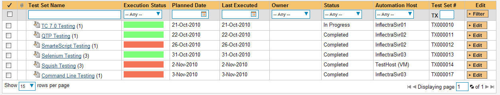
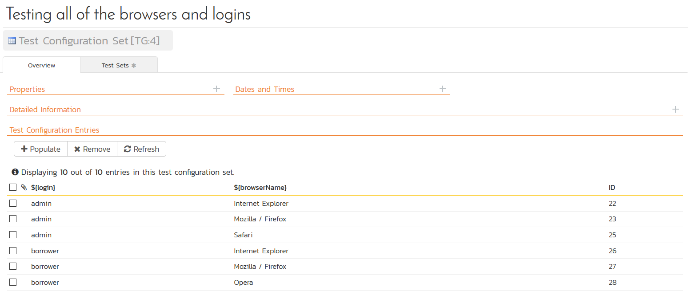

# Squish

Froglogic® Squish® (hereafter Squish) is a functional test automation
system that lets you record application operations and generate test
automation scripts in a variety of different scripting languages
(JavaScript, Tcl, Python) that can be used to playback the test script
against the test application.

This section describes how you can use SpiraTest / SpiraTeam (hereafter
SpiraTeam) together with RemoteLaunch to schedule and remotely launch
instances of Squish on different computers and have the testing results
be transmitted back to SpiraTeam. This allows you to extend your
SpiraTeam's test management capabilities to include automated Squish
tests.

*Note: This integration requires at least version 3.0 of SpiraTest/Team
and version 4.0 of Squish running on a Windows® platform.*

## Installing the Squish Engine

This section assumes that you already have a working installation of
SpiraTest or SpiraTeam and have installed RemoteLaunch on the various
test automation hosts following the instructions in [RemoteLaunch Guide](RemoteLaunch-Guide.md).
Once those prerequisites are in place, please follow these steps:

- Download and extract the SquishAutomationEngine.zip file
from the Inflectra website and locate the appropriate SquishX.dll for
the version of Squish that you are using.

    - If you don't see the version listed, just use the nearest version that
is *lower* than your current version.

- Copy the file "SquishX.dll" (where X is the appropriate version) into the "extensions" sub-folder of the RemoteLaunch installation. 

- Log in to SpiraTeam as a system administrator and go into SpiraTeam main
Administration page and click on the "Test Automation" link under
**Integration**.

-   Click the "Add" button to enter the new test automation engine
details page. The fields required are as follows:


-   **Name**: This is the short display name of the automation
engine. It can be anything that is meaningful to your users.

-   **Description**: This is the long description of the automation
engine. It can be anything that is meaningful to your users.
(Optional)

-   **Active**: If checked, the engine is active and able to be used
for any project.

-   **Token**: This needs to be the assigned unique token for the
automation engine and is used to tell RemoteLaunch which engine
to actually use for a given test case. For Squish this should be
**SquishX** where 'X' is the version number of the DLL file that
you are using.

-   Once you have finished, click the "Insert & Close" button and you
will be taken back to the Test Automation list page, with Squish
listed as an available automation engine.

### Squish RemoteLaunch Settings

You will need to modify the Squish configuration for each of the
specific automation hosts, by right-clicking on the RemoteLaunch icon in
the system tray and choosing "Configuration". That will bring up the
RemoteLaunch configuration page. The Squish engine adds its own tab to
this page which allows you to configure how Squish operates:


The following fields can be specified on this screen:

**Squish Location** -- This should be folder containing the
"SquishRunner" executable that will be used to actually run the
automated tests.

**Server Host** -- This field can be set to the name of a remote Squish
server if you did not install RemoteLaunch on the machine running the
Squish server (optional).

**Server Port** -- This field can be set to the port being used by a
remote Squish server if you did not install RemoteLaunch on the machine
running the Squish server (optional).

**Trace Logging** -- This checkbox can be selected if you need to
provide debugging information to Inflectra support personnel. Normally
this should remain unchecked

*Note: In most cases, the second and third fields can be left empty.*

## Setting up the Automated Test Cases

This section describes the process for setting up a test case in
SpiraTeam for automation and either linking it to an existing Squish
test suite, test case or entering a Squish test script directly into
SpiraTeam.

Note: that the Squish engine only supports passing parameters to an
*attached test script* and not to a *linked test script*.

### Attaching a Squish Test Script

First you need to display the list of test cases in SpiraTeam (by
clicking Testing \> Test Cases) and then add a new test case. Once you
have added the new test case, click on it and select the "Automation"
tab:


You need to enter the following fields:

- **Automation Engine** - Choose the Squish Automation Engine that you
created in the previous section from the drop-down list.

- **Script Type** -- This should be set to Attached for this case

- **Filename** -- Since the test script is going to be entered directly
into SpiraTeam you can enter any filename you like as long as the file
extension matches the scripting language that you're using. After that
you need to add any command-line parameters after the filename,
separated by a pipe (\|) symbol.

    - For example, to launch a web test using Javascript, you'd use:
    address\_test.js\|\--wrapper Web
    
    - For example, to launch an application test using Python, you'd use:
    address\_test.py\|\--aut <application\>

- **Document Type** -- If using SpiraTeam (not SpiraTest) you can choose
which document type the automated test script will be categorized under.

- **Document Folder** -- If using SpiraTeam (not SpiraTest) you can choose
which document folder the automated test script will be stored in.

- **Version** -- The version of the test script (1.0 is used if no value
specified)

- **Test Script** -- This needs to contain the complete Squish test
script. Squish test scripts can be written in JavaScript, Python or TCL.

    - If you would like to have SpiraTeam pass any parameter values to this
test script (this will be discussed in more detail later) you can
specify them by using the syntax ${parameterName}.

A complete sample script (illustrating the use of parameters) is
illustrated below:

```javascript
function main()
{
    // open URL
    loadUrl(":http://address.icefaces.org/address/");
        
    // wait for the first entry object to be available
    waitForObject(":_id0:title_select-one");
        
    // check that the submit button is disabled
    test.compare(findObject(":_id0:Submit_image").disabled, true);
        
    // enter data
    selectOption(":_id0:title_select-one", "${title}");
    setText(":_id0:firstName_text", "${firstname}");
    setText(":_id0:lastName_text", "${lastname}");
    setText(":_id0:city_text", "${city}");
        
    // check that after entering city, the state is automatically chosen correctly
	var state = "${state}";
    setFocus(":_id0:state_text");
    if (!test.verify(waitFor("findObject(':_id0:state_text').value == state", 10000)))
	{
        clickButton(":_id0:Reset_image");
        continue;
    }
        
    // input ZIP
    selectOption(":_id0:zipSelect_select-one", "${zip}");
        
    // check that submit button is enabled now
    setFocus(":_id0:lastName_text");
    if (!test.verify(waitFor("findObject(':_id0:Submit_image').disabled == false", 10000)))
	{
        clickButton(":_id0:Reset_image");
    }
        
    // submit
    clickButton(":_id0:Submit_image");
        
    // wait for results page
    waitForContextExists(":response.iface");
    waitForObject(":_id1:_id3_SPAN");
        
    // verify that data is stored and displayed correctly
    test.compare(findObject(":_id1:_id3_SPAN").innerText, firstName);
    test.compare(findObject(":_id1:_id6_SPAN").innerText, state);
            
    // close browser
    closeWindow(":[Window]");
}
```

Once you are happy with the values, click \[Save\] to update the test
case. Now you are ready to schedule the automated test case for
execution.

### Linking a Squish Test Script

First you need to display the list of test cases in SpiraTeam (by
clicking Testing \> Test Cases) and then add a new test case. Once you
have added the new test case, click on it and select the "Automation"
tab:


You need to enter the following fields:

- **Automation Engine** - Choose the Squish Automation Engine that you
created in the previous section from the drop-down list.

- **Script Type** -- This should be set to Linked for this case

- **Filename** -- This needs to be the full path to the Squish test case
or test suite folder.

    - If specifying a test case folder, you need to also provide the
configuration command-line parameters after the filename, separated by a
pipe (\|) symbol. These are not needed if executing a test suite, since
they are contained in the suite.conf file instead.

        - For example, to launch a web **test** **case** you'd use:
                \[ProgramFiles\]\\Froglogic\\squish-4.0.1-web-win32\\examples\\web\\suite\_examples\\tst\_icefaces\_addressbook\_datadriven\|\--wrapper Web

        - For example, to launch a web **test** **suite** you'd simply use:
        \[ProgramFiles\]\\Froglogic\\squish-4.0.1-web-win32\\examples\\web\\suite\_examples

        - For example, to launch a web **test case within a test suite** you'd use
        the path of the test suite, followed by the pipe (\|) symbol, followed
        by the test case name:
        \[ProgramFiles\]\\Froglogic\\squish-4.0.1-web-win32\\examples\\web\\suite\_examples\|tst\_icefaces

    - To make this easier across different machines, you can use several
constants for standard Windows locations:

        - \[MyDocuments\] -- The user's "My Documents" folder. The user indicated
is the user that ran RemoteLaunch.

        - \[CommonDocuments\] -- The Public Document's folder.

        - \[DesktopDirectory\] -- The user's Desktop folder. The user indicated is
the user that ran RemoteLaunch.

        - \[ProgramFiles\] -- Translated to the Program Files directory. For
64-bit machines, it's the 64-bit directory.

        - \[ProgramFilesX86\] -- Translated to the 32-bit Program Files directory.

- **Document Type** -- If using SpiraTeam (not SpiraTest) you can choose
which document type the automated test script will be categorized under.

- **Document Folder** -- If using SpiraTeam (not SpiraTest) you can choose
which document folder the automated test script will be stored in.

- **Version** -- The version of the test script (1.0 is used if no value
specified)

- **Test Script** -- *This is not used when you are using the linked test
script option*

Once you are happy with the values, click \[Save\] to update the test
case. Now you are ready to schedule the automated test case for
execution.

### Using Parameterized Test Cases

There is an advanced feature of SpiraTest/Team and RemoteLaunch that
lets you pass parameters from SpiraTeam to your *attached* (not linked)
Squish automated test script. This is very useful if you want to have a
data-driven Squish test script that be executed multiple times with
different parameter values.

To setup the automated test case for parameters, click on the "Test
Steps" tab and click on "Edit Parameters":


The name of the parameter ${city} needs to match the name of the
parameter defined within the attached Squish script.

## Executing the Squish Test Sets from SpiraTeam

There are two ways to execute automated test cases in SpiraTeam:

1.  Schedule the test cases to be executed on a specific computer (local
or remote) at a date/time in the future

2.  Execute the test cases right now on the local computer.

We shall outline both of these two scenarios in this section. However
first we need to setup the appropriate automation hosts and test sets in
SpiraTeam:

### Configuring the Automation Hosts and Test Sets

Go to Testing \> Automation Hosts in SpiraTeam to display the list of
automation hosts:


Make sure that you have created an Automation Host for each computer
that is going to run an automated test case. The name and description
can be set to anything meaningful, but the Token field **must be set to
the same token that is specified in the RemoteLaunch application** on
that specific machine.

Once you have at least one Automation Host configured, go to Testing \>
Test Sets to create the test sets that will contain the automated test
case:




Note: Unlike manual test cases, automated test cases *must be executed
within a test set* -- they cannot be executed directly from the test
case.

Create a new Test Set to hold the Squish automated test cases and click
on its hyperlink to display the test set details page:


You need to add at least one automated test case to the test set and
then configure the following fields:

-   **Automation Host** -- This needs to be set to the name of the
automation host that will be running the automated test set.

-   **Planned Date** -- The date and time that you want the scenario to
begin. (Note that multiple test sets scheduled at the exact same
time will be scheduled by Test Set ID order.)

-   **Status** -- This needs to be set to "Not Started" for RemoteLaunch
to pick up the scheduled test set. When you change the Planned Date,
the status automatically switches back to "Not Started"

-   **Type** -- This needs to be set to "Automated" for automated
testing

If you have parameterized test cases inside the automated test set you
can set their values in three different ways:

-   **Test Set Parameter Values** -- this lets you set the same value of
a parameter for all the test cases in the test set:


-   **Test Case Parameter Values** -- this lets you set a specific value
for a parameter for a particular test case in the test set:


You set these values, by right-clicking on a row and choosing "Edit
Parameters":


-   **Test Configurations** -- this lets you create a data grid of
possible test parameters and execute the test set multiple times,
once for each unique combination:



### Executing the Test Sets

Once you have set the various test set fields (as described above), the
Remote Launch instances will periodically poll SpiraTeam for new test
sets. Once they retrieve the new test set, they will add it to their
list of test sets to execute. Once execution begins they will change
the status of the test set to "In Progress", and once test execution is
done, the status of the test set will change to either "Completed" --
the automation engine could be launched and the test has completed -- or
"Blocked" -- RemoteLaunch was not able to start the automation engine.

If you want to immediately execute the test case on your local computer,
instead of setting the "Automation Host", "Status" and "Planned Date"
fields, you can instead click the \[Execute\] icon on the test set
itself. This will cause RemoteLaunch on the local computer to
immediately start executing the current test set.

In either case, once all the test cases in the test set have been
completed, the status of the test set will switch to "Completed" and the
individual test cases in the set will display a status based on the
results of the Squish test:

**Passed** -- The Squish automated test ran successfully and all the
test conditions in the test script passed

**Failed** -- The Squish automated test ran successfully, but at least
one test condition in the test script failed.

**Blocked** -- The Squish automated test did not run successfully

If you receive the "Blocked" status for either the test set or the test
cases you should open up the Windows Application Event Log on the
computer running RemoteLaunch and look in the event log for error
messages.

*Note: While the tests are executing you may see application or browser
windows launch as the Squish server executes the appropriate tests.*

Once the tests have completed, you can log back into SpiraTeam and see
the execution status of your test cases. If you click on a Test Run that
was generated by Squish, you will see the following information:


This screen indicates the status of the test run that was reported back
from Squish together with any messages or other information. The
execution status will be set according to the worst-case assessment
reported back from Squish. The various Squish statuses are mapped to
their nearest equivalent SpiraTeam statuses as illustrated below:

**Squish Status**   **SpiraTeam Status**
PASS                Passed
FAIL                Failed
WARNING             Caution
FATAL               Blocked
ERROR               Failed

In addition, the Message field will contain a summary of the number of
tests completed and the number of tests that reported an error, fatal,
fail, pass or warning status.

> 2010-11-02T16:50:01-04:00 START\_TEST suite\_examples                 
>                                                                       
> 2010-11-02T16:50:01-04:00 START\_TEST                                 
> tst\_icefaces\_addressbook\_datadriven                                
>                                                                       
> 2010-11-02T16:50:05-04:00 PASS Comparison 'true' and 'true' are       
> equal                                                                 
>                                                                       
> 2010-11-02T16:50:25-04:00 PASS Verified True expression               
>                                                                       
> 2010-11-02T16:50:30-04:00 PASS Verified True expression               
>                                                                       
> 2010-11-02T16:50:32-04:00 PASS Comparison 'Reginald' and              
> 'Reginald' are equal                                                  
>                                                                       
> 2010-11-02T16:50:33-04:00 PASS Comparison 'CA' and 'CA' are equal     
>                                                                       
> 2010-11-02T16:50:40-04:00 PASS Comparison 'true' and 'true' are       
> equal                                                                 
>                                                                       
> 2010-11-02T16:50:59-04:00 PASS Verified True expression               
>                                                                       
> 2010-11-02T16:51:09-04:00 PASS Verified True expression               
>                                                                       
> 2010-11-02T16:51:12-04:00 PASS Comparison 'Tanja' and 'Tanja' are     
> equal                                                                 
>                                                                       
> 2010-11-02T16:51:12-04:00 PASS Comparison 'NY' and 'NY' are equal     

Congratulations... You are now able to run Squish automated web tests
and have the results be recorded within SpiraTest / SpiraTeam.

