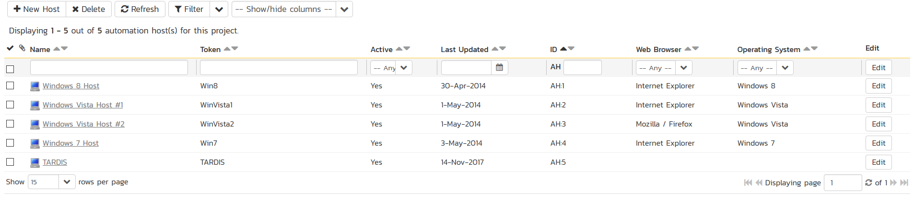

# TestingAnywhere
!!! abstract "Compatible with SpiraTest, SpiraTeam, SpiraPlan"

TestingAnywhere is a powerful and easy to use automated software testing tool that allows users to automate any type of testing. Powerful GUI based recording capabilities and a no-programming required user interface allows testers to quickly set up even complex test cases. A built-in editor allows users to build tests that can be easily edited to allow for changes in the test cases.

This section describes how you can use Spira together with RemoteLaunch to schedule and remotely launch instances of TestingAnywhere on different computers and have the testing results be transmitted back to Spira. This allows you to extend your Spira's test management capabilities to include automated TestingAnywhere tests.

*Note: This integration requires at least version 4.0 of Spira and RemoteLaunch.*

## Installing the TestingAnywhere Engine

This section assumes that you already have a working installation of Spira and have installed RemoteLaunch on the various test automation hosts following the instructions in [RemoteLaunch Guide](RemoteLaunch-Guide.md). Once those prerequisites are in place, please follow these steps:

-   Download and extract the TestingAnywhereEngine.zip file from the Inflectra website and locate the TestingAnywhereAutomationEngine.dll file contained within.
-   Copy the file "TestingAnywhereAutomationEngine.dll" into the "extensions" sub-folder of the RemoteLaunch installation.
-   Log in to Spira as a system administrator and go into Spira main Administration page and click on the "Test Automation" link under **Integration**.
-   Click the "Add" button to enter the new test automation engine details page. The fields required are as follows:

    -   **Name**: This is the short display name of the automation engine. It can be anything that is meaningful to your users.
    -   **Description**: This is the long description of the automation engine. It can be anything that is meaningful to your users. (Optional)
    -   **Active**: If checked, the engine is active and able to be used for any project.
    -   **Token**: This needs to be the assigned unique token for the automation engine and is used to tell RemoteLaunch which engine to actually use for a given test case. For TestingAnywhere this should simply be **TestingAnywhere**.

Once you have finished, click the "Insert & Close" button and you will be taken back to the Test Automation list page, with TestingAnywhere listed as an available automation engine.

   

### Advanced Settings
You can modify the TestingAnywhere configuration for each of the specific automation hosts, by right-clicking on the RemoteLaunch icon in the system tray and choosing "Configuration". That will bring up the RemoteLaunch configuration page.

The TestingAnywhere engine adds its own tab to this page which allows you to configure how TestingAnywhere operates:

   

The following fields can be specified on this screen:

- **Player Location**: this is the folder where the TestingAnywhere player (TAPlayer.exe) can be found. Typically it's C:\\Program Files (x86)\\Testing Anywhere 9.0\\Testing Anywhere
- **Files Location**: This is the folder where the TestingAnywhere test scripts and generated log files will be stored. The currently logged-in user needs to have Read/Write permissions over this folder. Typically it's:

    - C:\\Documents And Settings\\\[UserName\]\\My Documents\\Testing Anywhere Files on a Windows XP workstation or Windows 2003 server.
    - C:\\Users\\\[UserName\]\\Documents\\Testing Anywhere Files on a Windows Vista, 7, 2008 or 2008 R2 computer.

- **Trace Logging**: When selected, this will log additional trace and debugging information to the Windows Event Log. This should not be selected in a production environment.

## Setting up the Automated Test Cases
This section describes the process for setting up a test case in Spira for automation and linking it to an automated TestingAnywhere test script.

First you need to display the list of test cases in Spira (by clicking Testing \> Test Cases) and then add a new test case. Once you have added the new test case, click on it and select the "Overview" tab, and scroll down to the "Automation" section:

You need to enter the following fields:

- **Automation Engine** - Choose the TestingAnywhere Automation Engine that you created in the previous section from the drop-down list.
- **Script Type**: This should be set to Linked as the integration with TestingAnywhere only supports referencing TestingAnywhere test script files and not physically uploading the test scripts into Spira.
- **Filename**: This needs to consist of the relative location of the TestingAnywhere test script to the test script root folder.
- **Document Type**: This allows you to choose which document type the automated test script will be categorized under.
- **Document Folder** --This allows you to choose which document folder the automated test script will be stored in.
- **Version**: The version of the test script (1.0 is used if no value specified)
- **Test Script**: *This is not used with the TestingAnywhere Engine since it only supports linked test scripts.*

Once you are happy with the values, click \[Save\] to update the test case. Now you are ready to schedule the automated test case for execution.

## Executing the TestingAnywhere Test Sets from Spira
There are two ways to execute automated test cases in Spira:

1.  Schedule the test cases to be executed on a specific computer (local or remote) at a date/time in the future
2.  Execute the test cases right now on the local computer.

We shall outline both of these two scenarios in this section. However first we need to setup the appropriate automation hosts and test sets in Spira:

### Configuring the Automation Hosts and Test Sets
Go to Testing \> Automation Hosts in Spira to display the list of automation hosts:

Make sure that you have created an Automation Host for each computer that is going to run an automated test case. The name and description can be set to anything meaningful, but the Token field **must be set to the same token that is specified in the RemoteLaunch application** on that specific machine.

Once you have at least one Automation Host configured, go to Testing \> Test Sets to create the test sets that will contain the automated test case:

Note: Unlike manual test cases, automated test cases *must be executed within a test set* -- they cannot be executed directly from the test case.

Create a new Test Set to hold the TestingAnywhere automated test cases and click on its hyperlink to display the test set details page:

You need to add at least one automated test case to the test set and then configure the following fields:

-   **Automation Host**: This needs to be set to the name of the automation host that will be running the automated test set.
-   **Planned Date**: The date and time that you want the scenario to begin. (Note that multiple test sets scheduled at the exact same time will be scheduled by Test Set ID order.)
-   **Status**: This needs to be set to "Not Started" for RemoteLaunch to pick up the scheduled test set. When you change the Planned Date, the status automatically switches back to "Not Started"
-   **Type**: This needs to be set to "Automated" for automated testing

### Executing the Test Sets
Once you have set the various test set fields (as described above), the Remote Launch instances will periodically poll Spira for new test sets. Once they retrieve the new test set, they will add it to their list of test sets to be executed. Once execution begins they will change the status of the test set to "In Progress", and once test execution is done, the status of the test set will change to either "Completed" --
the automation engine could be launched and the test has completed -- or "Blocked" -- RemoteLaunch was not able to start the automation engine.

If you want to immediately execute the test case on your local computer, instead of setting the "Automation Host", "Status" and "Planned Date" fields, you can instead click the \[Execute\] icon on the test set itself. This will cause RemoteLaunch on the local computer to immediately start executing the current test set.

In either case, once all the test cases in the test set have been completed, the status of the test set will switch to "Completed" and the individual test cases in the set will display a status based on the results of the TestingAnywhere test:

- **Passed**: The TestingAnywhere automated test ran successfully and all the test steps in the test script passed and no assertions were thrown.
- **Failed**: The TestingAnywhere automated test ran successfully, but at least one test step failed or at least one assertion failed.
- **Caution**: The TestingAnywhere automated test run successfully, but at least one warning was logged in one of the test steps.
- **Blocked**: The TestingAnywhere automated test did not run successfully.

If you receive the "Blocked" status for either the test set or the test cases you should open up the Windows Application Event Log on the computer running RemoteLaunch and look in the event log for error messages.

*Note: While the tests are executing you will see browser windows launch as TestingAnywhere executes the appropriate tests.*

Once the tests have completed, you can log back into Spira and see the execution status of your test cases. If you click on a Test Run that was generated by TestingAnywhere, you will see the following high-level test information:

This screen indicates the status of the test run that was reported back from TestingAnywhere together with the execution date/time.

If you scroll down to the 'Console Output' section, you will see:

Finally, to see the detailed test steps, look under the 'Test Steps' section:

Congratulations... You are now able to run TestingAnywhere automated functional tests and have the results be recorded within Spira.