# Tricentis Tosca
!!! abstract "Compatible with SpiraTest, SpiraTeam, SpiraPlan"

Tricentis Tosca is a software testing tool that is used to automate end-to-end testing for software applications. It is developed by Tricentis. Tricentis Tosca combines multiple aspects of software testing to test GUIs and APIs from a business perspective.

You can use Spira together with RemoteLaunch to schedule and remotely launch instances of Tricentis Tosca on different computers and have the testing results be transmitted back to Spira. This allows you to extend your Spira’s test management capabilities to include automated Tosca tests.

This page describes the steps for using Spira with Tosca.

## Installing the Tosca Engine
This section assumes that you already have a working installation of Spira and have installed RemoteLaunch on the various test automation hosts following the instructions in [RemoteLaunch Guide](RemoteLaunch-Guide.md). Once those prerequisites are in place, please follow these steps:

- Download and extract the [TricentisToscaEngine.zip](https://www.inflectra.com/Downloads/TricentisToscaEngine.zip) file from the Inflectra website and extract the file `ToscaEngine.dll` from inside the zipfile. You may need to right-click on the DLL and choose **Unblock** in Windows to confirm that you want to use the downloaded file.
- Copy the file `ToscaEngine.dll` into the "extensions" sub-folder of the RemoteLaunch installation.

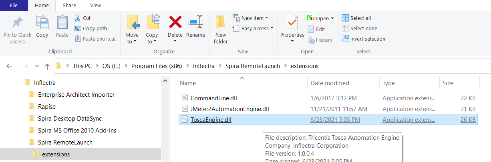

- Log in to Spira as a system administrator and go into Spira main Administration page and click on the "Test Automation" link under **Integration**.
- Click the "Add" button to enter the new test automation engine details page. The fields required are as follows:

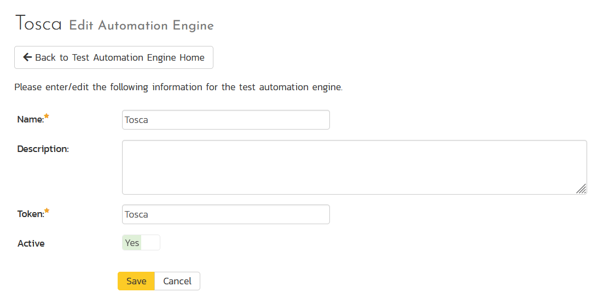

    - **Name**: This is the short display name of the automation engine. It can be anything that is meaningful to your users.
    - **Description**: This is the long description of the automation engine. It can be anything that is meaningful to your users. (Optional)
    - **Active**: If checked, the engine is active and able to be used for any project.
    - **Token**: This needs to be the assigned unique token for the automation engine and is used to tell RemoteLaunch which engine to actually use for a given test case. For Tosca this should always be `Tosca`.

Once you have finished, click the "Insert & Close" button and you will be taken back to the Test Automation list page, with Tosca listed as an available automation engine.

### Configuring the Tosca RemoteLaunch Plugin
Next you need to configure the Tosca configuration for each of the specific automation hosts, by right-clicking on the RemoteLaunch icon in the system tray and choosing "Configuration". That will bring up the RemoteLaunch configuration page.

The Tosca engine adds its own tab to this page which allows you to configure how Tosca operates:

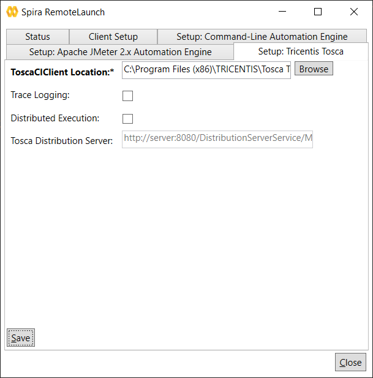

The following fields can be specified on this screen:

- **ToscaCIClient Location**: This is the folder where the Tosca Command Line (CI) Client is located. Normally this will be `C:\Program Files (x86)\TRICENTIS\Tosca Testsuite\ToscaCommander\ToscaCI\Client\`
- **Trace Logging**: When selected, this will log additional trace and debugging information to the Windows Event Log. This should not be selected in a production environment.
- **Distributed Execution**: If you check this box then the Tosca command line interface will launch tests on a remote Tosca server. Otherwise it will assume that RemoteLaunch is running on the Tosca server itself.
- **Tosca Distribution Server**: If you are using the option to use Distributed Execution, you need to enter in the URL of the Tosca server that the Tosca CI will connect with. For example, `http://server:8080/DistributionServerService/ManagerService.svc`

Once you have configured the plugin, click **Save** to save your changes.

## Setting up the Automated Test Cases
This section describes the process for setting up a test case in Spira for automation and linking it to an automated Tosca test script.

Due to the way that Tosca executes tests and reports results, we need to actually create two kinds of test case in Spira:

1. Spira Test Cases that **launch** the Tosca Test Suites.
2. Spira Test Cases that **parse** the Tosca test results and map the results back to specific Spira test cases.

*Note: If you only have the first kind of test cases, you will be able to run automated Tosca test suites, but the reporting will be limited to a simple pass/fail for the entire test suite rather than more granular test case level reporting.*

### Creating a Test Case for Launching a Tosca Suite
Next, display the list of test cases in Spira (by clicking Testing \> Test Cases) and then click on the button to add a new test case. In this example, we have called it `Tricentis Insurance Website (Test Event)` and stored it in the Tosca Suites folder:

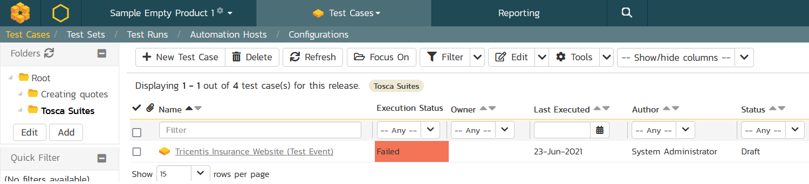

Once you have added the new test case, click on it and scroll down to view the "Automation" tab:

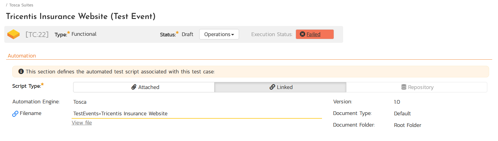

You need to enter the following fields:

- **Automation Engine**: Choose the Tosca Automation Engine that you created in the previous section from the drop-down list.
- **Script Type**: This should be set to Linked as the integration with Tosca only supports referencing Tosca test suites and not physically uploading the test suites into Spira.
- **Filename**: This needs to be the name of the Tosca **test event** that we will be executing. This needs to be prefixed with the identifier `TestEvents=`, so that in our example we have the sample test event: `TestEvents=Tricentis Insurance Website`

Once you are happy with the values, click **\[Save\]** to update the test case.

### Creating additional Test Case for Parsing the Tosca Results
We recommend that you create additional test cases to map to specific test cases in the Tosca test suite. This is an optional feature, but if you don't map these test cases, you will not be able to get detailed reporting and test coverage metrics.

To get this additional level of reporting, create one Spira test case for each of the different Tosca test cases in the Tosca suite, for example we created the following:

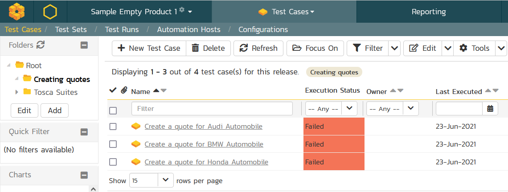

Each of these Spira test cases will have a different format for the **Automation** section:

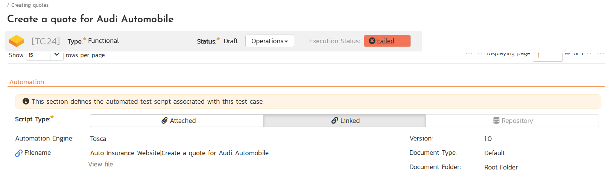

- **Automation Engine**: Choose the Tosca Automation Engine that you created in the previous section from the drop-down list.
- **Script Type**: This should be set to Linked as the integration with Tosca only supports referencing Tosca test suites and not physically uploading the test suites into Spira.
- **Filename**: This needs to be the name of the Tosca **test suite** and the Tosca **test case** separated by a **pipe (|)** character, i.e. you will have `<Test Suite>|<Test Case>`, so that in our example we have the following combination: `Auto Insurance Website|Create a quote for Audi Automobile`. The other test cases will have the same test suite name, but different test case names.

Now you are ready to schedule the automated test case for execution in Spira

## Executing the Tosca Test Sets from Spira
There are two ways to execute automated test cases in Spira:

1.  Schedule the test cases to be executed on a specific computer (local or remote) at a date/time in the future
2.  Execute the test cases right now on the local computer.

We shall outline both of these two scenarios in this section. However first we need to setup the appropriate automation hosts and test sets in Spira:

### Configuring the Automation Hosts and Test Sets
Go to Testing \> Automation Hosts in Spira to display the list of automation hosts:

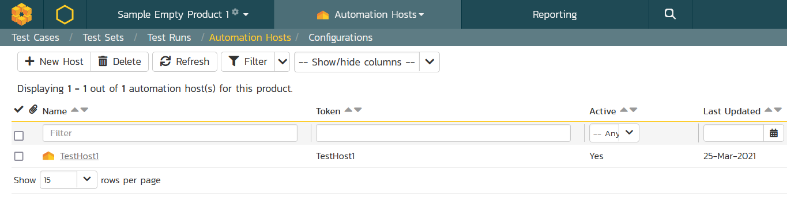

Make sure that you have created an Automation Host for each computer that is going to run an automated test case. The name and description can be set to anything meaningful, but the Token field **must be set to the same token that is specified in the RemoteLaunch application** on that specific machine.

Once you have at least one Automation Host configured, go to Testing \> Test Sets to create the test set that will contain the automated test cases:

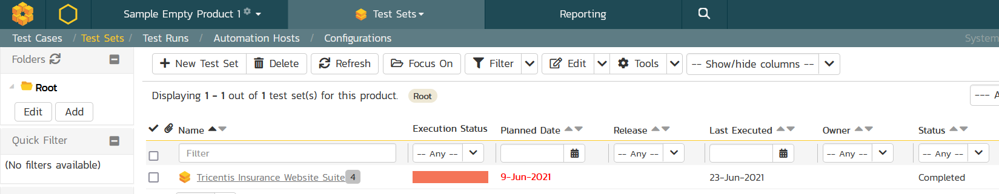

Note: Unlike manual test cases, automated test cases *must be executed within a test set* -- they cannot be executed directly from the test case. Create a new Test Set (for example `Tricentis Insurance Website Suite`), and click on its hyperlink to display the test set details page:

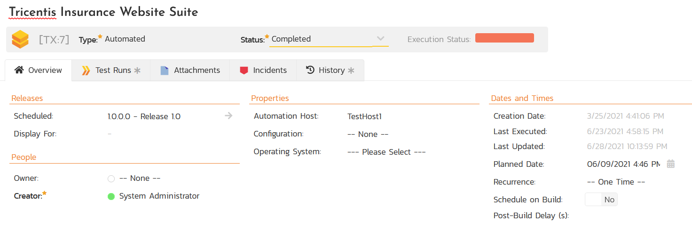

Lower down, the list of test cases in the test set are displayed:

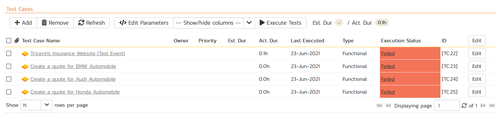

You need to add at least one automated test case to the test set, but to get the best reporting, we recommend having the first test case in the test set be the Tosca *Test Event* that launches the test suite, and the subsequent test cases be the individual test cases that parse the test suite and extract the results specific to the individual test case.

*For example, our first test case in the screenshot will launch the entire insurance website test suite that tries to use the sample website with three different car brands (BMW, Audi and Honda). Each individual car brand will create a unique test case result that we'd want to map to different requirements in Spira.*

Once you have added the appropriate test cases to the test set, the final step is to configure the main test set fields:

- **Automation Host**: This needs to be set to the name of the automation host that will be running the automated test set.
- **Planned Date**: The date and time that you want the scenario to begin. (Note that multiple test sets scheduled at the exact same time will be scheduled by Test Set ID order.)
- **Status**: This needs to be set to "Not Started" for RemoteLaunch to pick up the scheduled test set. When you change the Planned Date, the status automatically switches back to "Not Started"
- **Type**: This needs to be set to "Automated" for automated testing

### Executing the Test Sets
Once you have set the various test set fields (as described above), the Remote Launch instances will periodically poll Spira for new test sets. Once they retrieve the new test set, they will add it to their list of test sets to execute. Once execution begins they will change the status of the test set to "In Progress", and once test execution is done, the status of the test set will change to either "Completed" --
the automation engine could be launched and the test has completed -- or "Blocked" -- RemoteLaunch was not able to start the automation engine.

If you want to immediately execute the test case on your local computer, instead of setting the "Automation Host", "Status" and "Planned Date" fields, you can instead click the \[Execute\] icon on the test set itself. This will cause RemoteLaunch on the local computer to immediately start executing the current test set.

In either case, once all the test cases in the test set have been completed, the status of the test set will switch to "Completed" and the individual test cases in the set will display a status based on the results of the Tosca test:

- **Passed**: The Tosca automated test ran successfully and all the test steps in the test script passed and no assertions were thrown.
- **Failed**: The Tosca automated test ran successfully, but at least one test step failed or at least one assertion failed.
- **Blocked**: The Tosca automated test did not run successfully or at least one timeout error was recorded.

If you receive the "Blocked" status for either the test set or the test cases you should open up the Windows Application Event Log on the computer running RemoteLaunch and look in the event log for error messages.

*Note: While the tests are executing you may see browser windows launch as Tosca executes the appropriate tests.*

### Viewing the Tosca Test Results
Once the tests have completed, you can log back into Spira and see the execution status of your test cases. If you click on a Test Run that was generated by Tosca, you will see the following information:

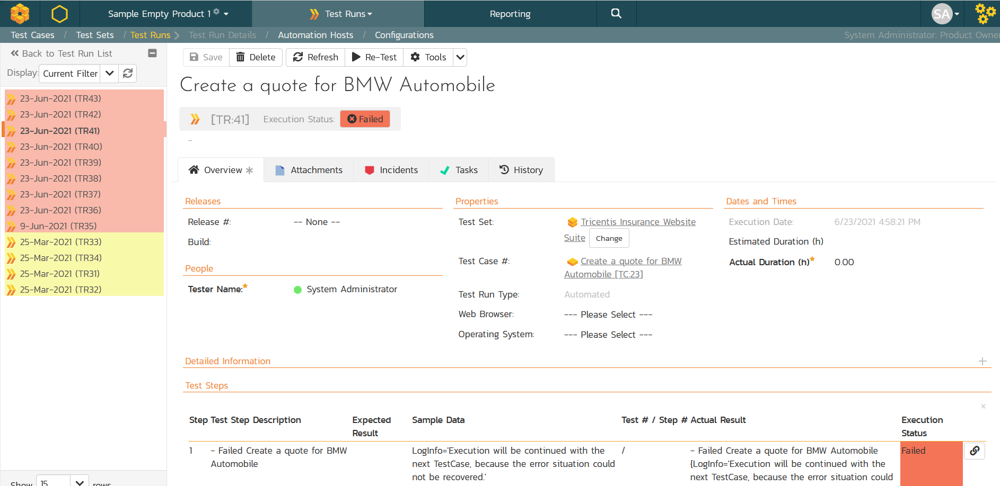

This screen indicates the status of the test run that was reported back from Tosca together with any messages or other information. The Test Name indicates the name of the test inside Tosca and the execution status corresponds the matching status inside Tosca as described above.

Underneath this high-level test result, you will see the detailed Tosca test results that show each entry in the test script step by step:

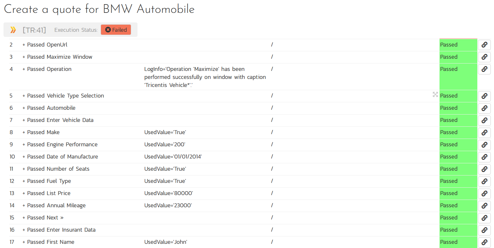

Finally, there is the **Console Output** section which reports back the raw output from the Tosca test result XML file:

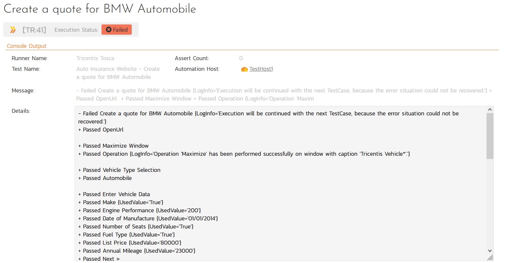

Congratulations... You are now able to run Tosca automated functional tests and have the results be recorded within Spira, with the ability to have those test cases update the requirements test coverage and other enterprise quality metrics in the system.