# WebLOAD
!!! abstract "Compatible with SpiraTest, SpiraTeam, SpiraPlan"

RadView WebLoad is a WebLOAD is a performance, scalability, and reliability testing solution for internet applications.   WebLOAD is easy to use and delivers maximum testing performance and value. WebLOAD verifies the scalability and integrity of internet applications by generating a load composed of Virtual Clients that simulate real-world traffic. Probing Clients let you refine the testing process by acting as a single user that measures the performance of targeted activities, and provides individual performance statistics of the internet application under load.

This section covers installing and using the Engine to report back the success of a WebLoad protocol test scripts/agendas for the WebLOAD environment.

!!! info 
    This integration requires at least version 4.0 of Spira and has been tested against version WebLOAD-Professional-12.2.0.087 of WebLoad.

## Installing the WebLOAD Engine

This section assumes that you already have a working installation of Spira and have installed RemoteLaunch on the various test automation hosts following the instructions in [RemoteLaunch Guide](RemoteLaunch-Guide.md). Once those prerequisites are in place, please follow these steps:

-   Download and extract the WebLOADEngine.zip file from the Inflectra website and locate the appropriate WebLoad.dll for the version of WebLOAD that you are using.
-   If you don't see the version listed, just use the nearest version that is *lower* than your current version.
-   Copy the file "WebLoad.dll"  into the "extensions" sub-folder of the RemoteLaunch installation.
-   Log in to Spira as a system administrator and go into Spira main Administration page and click on the "Test Automation" link under **Integration**.

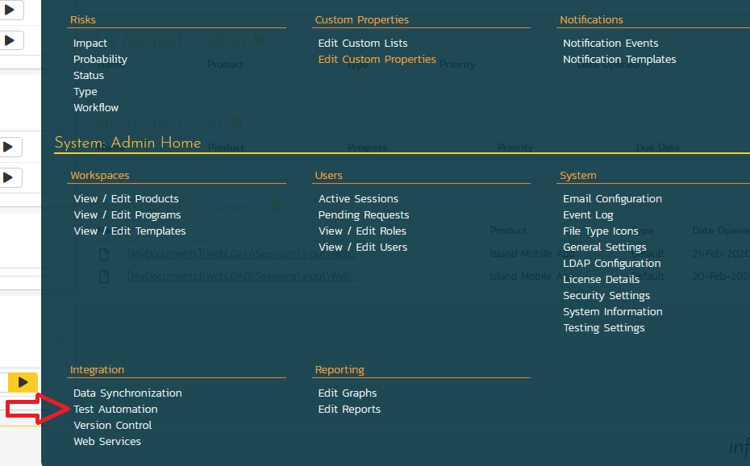

-   Click the "Add" button to enter the new test automation engine details page. The fields required are as follows:

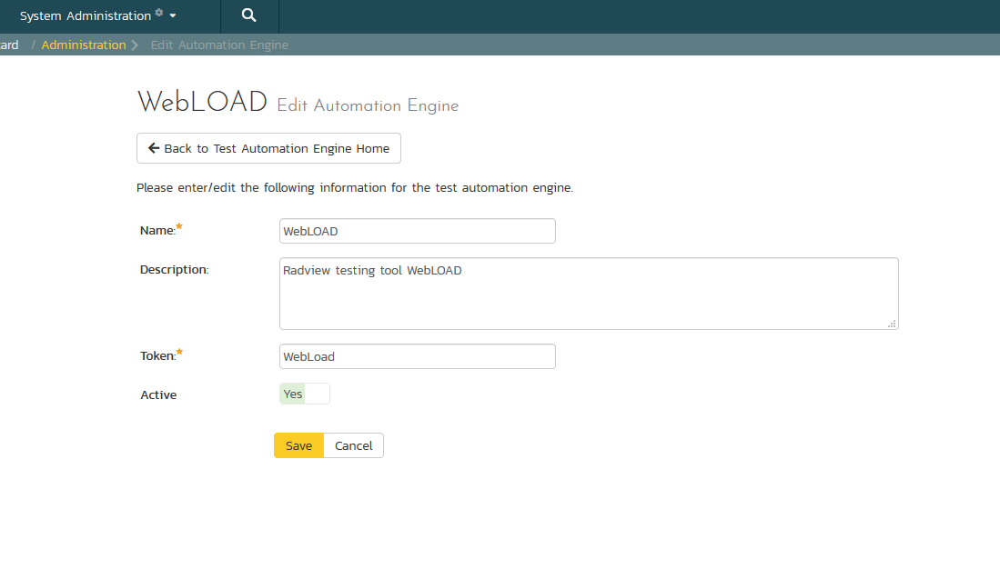

    -   **Name**: This is the short display name of the automation engine.  It can be anything that is meaningful to your users, and will be displayed  in the Automation Host dropdown when the user selects it in the test set.
    -   **Description**: This is the long description of the automation engine. It can be anything that is meaningful to your users. (Optional)
    -   **Active**: If checked, the engine is active and able to be used for any project.
    -   **Token**: This needs to be the assigned unique token for the automation engine and is used to tell RemoteLaunch which engine, in this case WebLoad.dll, to actually use for a given test case. For WebLOAD, it needs to be simply "WebLoad".  This is case sensitive, and if it does not match an error will be written to a Blocked test run that will be phrased using what was entered as the token.  For example, if the token is misspelled, WebLpsd, the error message will say  “Extension 'WebLpsd' was not loaded or was in error condition.  Could not run TC:73 in TX:29”

Once you have finished, click the `Insert & Close` button and you will be taken back to the Test Automation list page, with WebLOAD listed as an available automation engine.

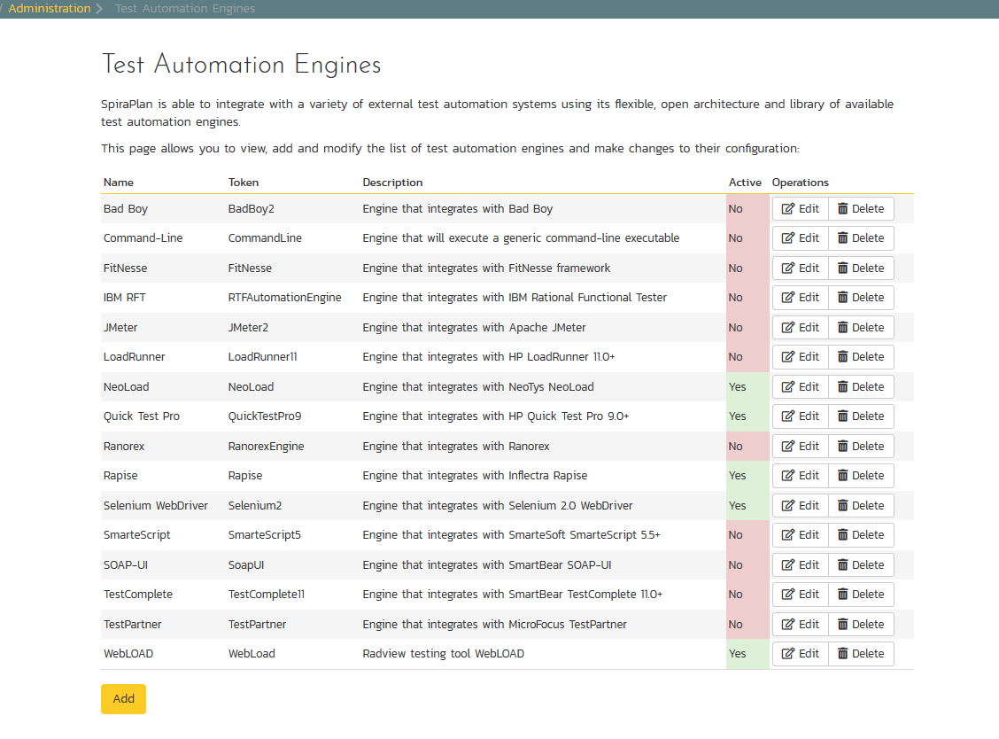

## WebLOAD RemoteLaunch Settings
You will need to modify the WebLOAD configuration for each of the specific automation hosts, by right-clicking on the RemoteLaunch icon in the system tray and choosing "Configuration". That will bring up the RemoteLaunch configuration page. The WebLOAD engine adds its own tab to this page which allows you to configure how WebLOAD operates:

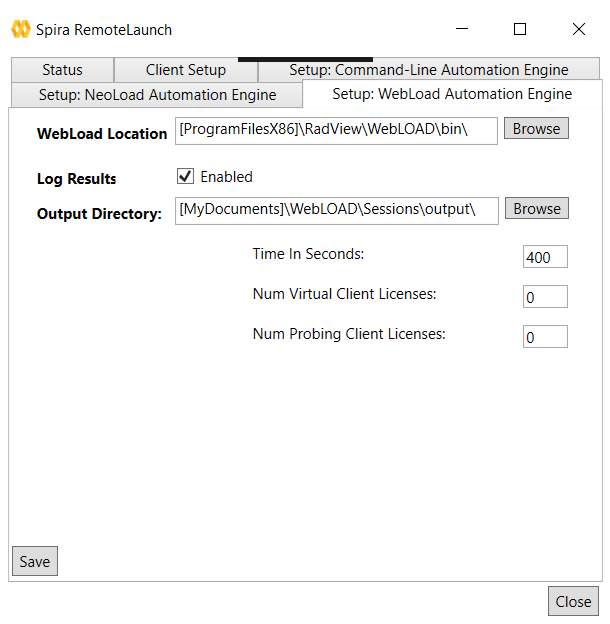

The following fields can be specified on this screen (make sure to hit `Save` after making any changes):

- **WebLOAD Location**: The directory that contains the "WebLoad.exe" executable that will be used to actually run the automated tests.
- **Log Results**: Normally the WebLOAD engine will capture the output results from the command-line. Deselecting this option will provide less information for the test results upon a failure.
- **Output Directory**: The directory where the resulting .ls, .dat, .isd, .mdb, .sdb, and results.xml files will be created containing the test data. These files will have their file names generated using the Load Template script name without the.tpl extension, a time stamp (YYYYMMDDHHMMSS). For example: Output file WebLOADFirstTest20191031122657.ls will be generated from the file name from input script WebLOADFirstTest.tpl
- **Time in Seconds**: The amount of time in seconds to allow the WebLoad test to run.  The default is 24 hours (86,400 seconds).
- **Num Virtual Client Licenses**: The number of Virtual Client licenses to allocate when using WebRM License Server. The default is 0.
- **Num Probing Client Licenses**: The number of Probing Client licenses to allocate when using WebRM License Server. The default is 0.

!!! info "Tokens for Specifying File Locations"
    The full path to the WebLOAD Location and the Output Directory can be shortened via keywords for better visibility, and to make this easier across different machines, you can use several constants for standard Windows locations (see example in screenshot):

    - \[MyDocuments\] -- The user's "My Documents" folder. The user indicated is the user that ran RemoteLaunch.
    - \[CommonDocuments\] -- The Public Document's folder.
    - \[DesktopDirectory\] -- The user's Desktop folder. The user indicated is the user that ran RemoteLaunch.
    - \[ProgramFiles\] -- Translated to the Program Files directory. For 64-bit machines, it's the 64-bit directory.
    - \[ProgramFilesX86\] -- Translated to the 32-bit Program Files directory.

## Setting up the Automated Test Cases

This section describes the process for setting up a test case in Spira for automation and linking it to an automated WebLOAD test script.

First you need to display the list of test cases in Spira (by clicking Testing \> Test Cases) and then add a new test case. Once you have added the new test case, click on it and select the "Overview" tab and scroll down to the Automation section:

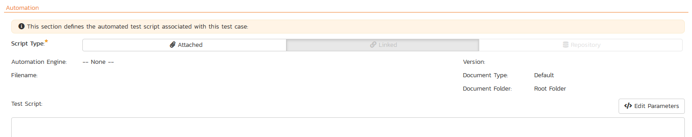

You need to enter the following fields:

- **Automation Engine**: Choose the WebLOAD Automation Engine that you created in the previous section from the drop-down list.
- **Script Type**: This should be left as to Attached as the integration with WebLOAD only supports referencing WebLOAD test script .tpl files and not physically uploading the test scripts into Spira.
- **Filename**: This is the full file path or keyword shortcut to the WebLOAD test script .tpl file. See "Tokens for Specifying File Locations" info panel above for more inforamtion about they keywords you can use
- **Document Type**: Leave as Default
- **Document Folder**: Leave as Root Folder
- **Version**: The version of the test script (1.0 is used if no value specified)
- **Test Script**: *This is not used with the WebLOAD Engine since it only supports linked test scripts.*

Once you are happy with the values, click `Save` to update the test case. Now you are ready to schedule the automated test case for execution.

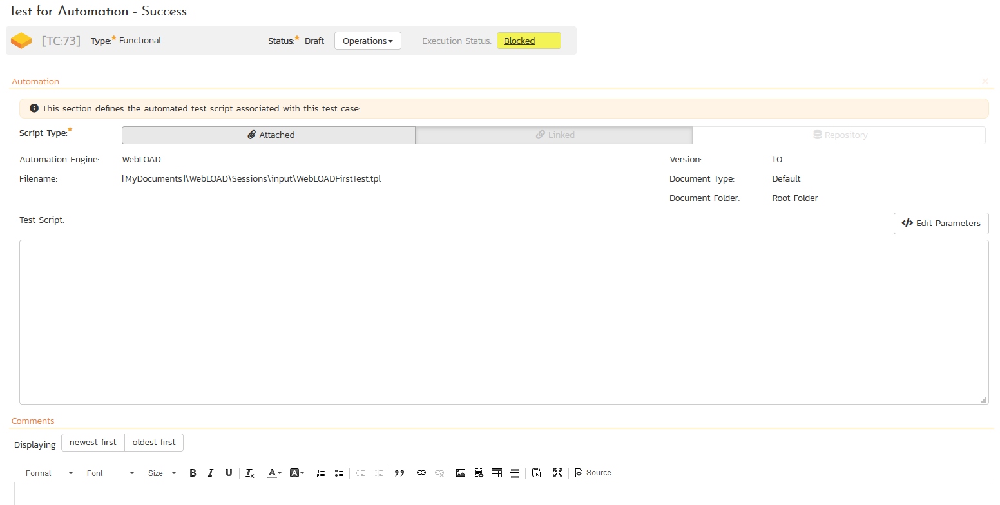

### Using Parameterized Test Cases
Currently the WebLOAD automation engine does not support the passing of parameter values from Spira to WebLOAD.  Only the file path to the WebLOAD project file (*.tpl) file can be passed.  Other parameters must be set in RemoteLaunch as illustrated earlier.

## Executing WebLOAD Test Sets from Spira
Before we can executed tests we need to setup the appropriate automation hosts and test sets in Spira. Once this is done, there are two ways to execute automated test cases in Spira:

1.  Schedule the test cases to be executed on a specific computer (local or remote) at a date/time in the future
2.  Execute the test cases right now on the local computer.

### Setup the Automation Hosts and Test Sets
Go to Testing \> Automation Hosts from the main navbar in Spira to display the list of automation hosts.


Make sure  you have created an Automation Host for each computer that is going to run an automated test case. The name and description can be set to anything meaningful, but the Token field **must be set to the same token that is specified in the RemoteLaunch application** on that specific machine.

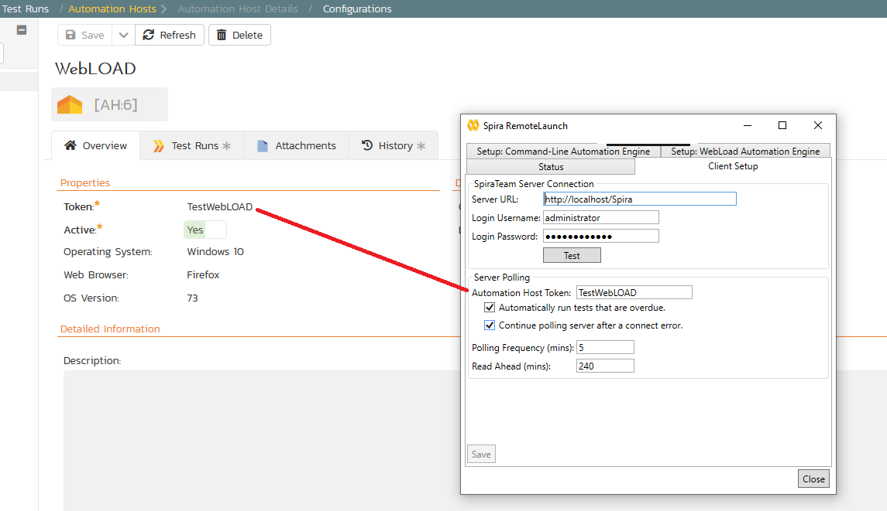

Once you have at least one Automation Host configured, go to Testing \> Test Sets to create the test sets that will contain the automated test case.

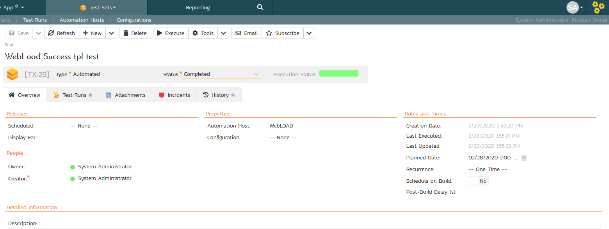

!!! info 
    Unlike manual test cases, automated test cases *must be executed within a test set* -- they cannot be executed directly from the test case.

Create a new Test Set to hold the WebLOAD automated test cases and click on its hyperlink to display the test set details page.

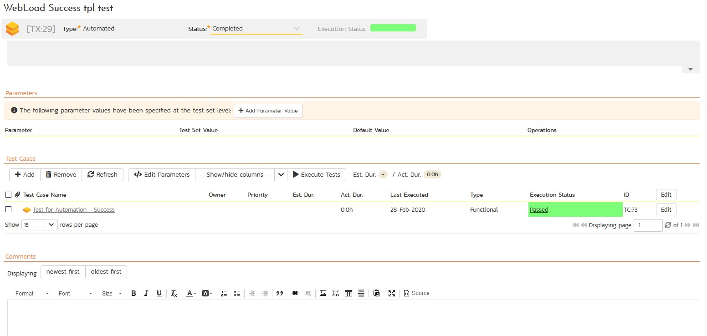

You need to add at least one automated test case to the test set and then configure the following fields:

- **Automation Host**: This needs to be set to the name of the automation host that will be running the automated test set.
- **Planned Date**: The date and time that you want the scenario to begin. (Note that multiple test sets scheduled at the exact same time will be scheduled by Test Set ID order.)
- **Status**: This needs to be set to "Not Started" for RemoteLaunch to pick up the scheduled test set. When you change the Planned Date, the status automatically switches back to "Not Started"
- **Type**: This needs to be set to "Automated" for automated testing

### Execute the Test Sets
Once you have set the various test set fields (as described above), the Remote Launch instances will periodically poll Spira for new test sets. Once they retrieve the new test set, they will add it to their list of test sets to be executed. Once execution begins they will change the status of the test set to "In Progress", and once test execution is done, the status of the test set will change to either:

1. **Completed**: the automation engine could be launched and the test has completed; or
2. **Blocked**: RemoteLaunch was not able to start the automation engine.

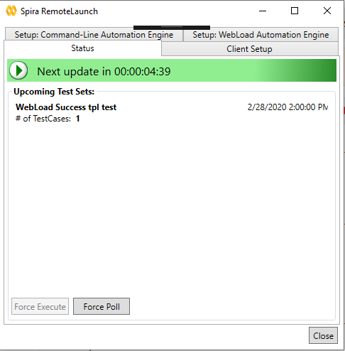

If you want to immediately execute the test case on your local computer, instead of setting the "Automation Host", "Status" and "Planned Date" fields, you can instead click the \[Execute\] icon on the test set itself. This will cause RemoteLaunch on the local computer to immediately start executing the current test set.

In either case, once all the test cases in the test set have been completed, the status of the test set will switch to "Completed" and the individual test cases in the set will display a status based on the results of the WebLOAD test:

- **Passed**: The WebLOAD automated test ran successfully and no failures or errors were logged.
- **Failed**: The WebLOAD automated test ran successfully, but at least one error or failure was logged.
- **Blocked**: The WebLOAD automated test did not run successfully.

If you receive the "Blocked" status for either the test set or the test cases you should open up the Windows Application Event Log on the computer running RemoteLaunch and look in the event log for error messages.

!!! info
    While the tests are executing you will see the WebLOAD application open as WebLOAD executes the appropriate tests.

Once the tests have completed, you can log back into Spira and see the execution status of your test cases. If you click on a Test Run that was generated by WebLOAD, you will see the following information:

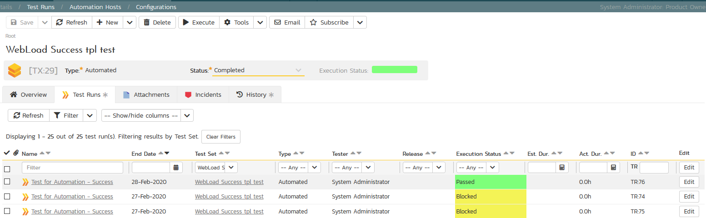

This screen indicates the status of the test run that was reported back from WebLOAD together with any messages or other information. The Test Name indicates the name of the test inside WebLOAD and the execution status corresponds the rules described above.

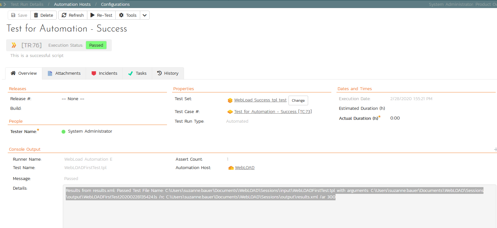

In addition, the details in the test run from WebLOAD lists the input script and the parameters passed to the script so testers will know the file created that are correlated with tis test run in the output directory.  Here is an example of a successful WebLOAD script run through Spira:

```
Results from results.xml: Passed Test 
File Name: C:\Users\suzanne.bauer\Documents\WebLOAD\Sessions\input\WebLOADFirstTest.tpl
with arguments: C:\Users\su.be\Documents\WebLOAD\Sessions\output\WebLOADFirstTest20200228135424.ls /rc C:\Users\su.be\Documents\WebLOAD\Sessions\output\results.xml /ar 300 
```

!!! success "Congratulations"
    You are now able to run WebLOAD automated functional tests and have the results be recorded within Spira.