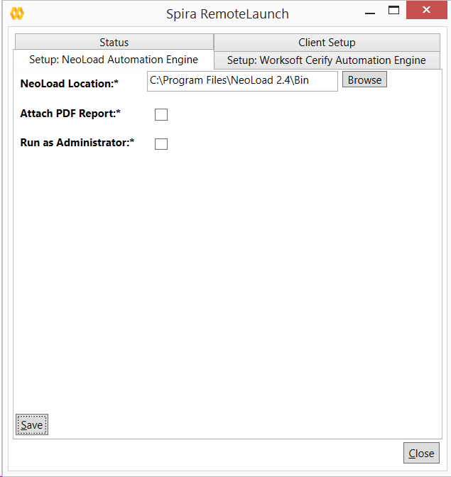

# NeoLoad

Neotys NeoLoad is a performance and load testing system that lets you
record application performance by a number of 'virtual users' and
measure the performance against specified Service Level Agreement (SLA)
metrics for the application. When you use NeoLoad with SpiraTest you can
report back pass/fail/caution by comparing the actual results against
the specified SLA metrics.

This section covers installing and using the Engine to report back
statistics of run scenarios as well as the results of the test compared
to the required SLAs.

***Note**: This integration requires at least version 4.0 of
SpiraTest/Team and has been tested against version 5.0 of NeoLoad.*

## Installing the NeoLoad Engine

This section assumes that you already have a working installation of
SpiraTest or SpiraTeam and have installed RemoteLaunch on the various
test automation hosts following the instructions in Section 1 (above).
Once those prerequisites are in place, please follow these steps:

-   Download and extract the NeoLoadEngine.zip file from
the Inflectra website.

-   Copy the files in the ZIP file into the "extensions" sub-folder of
the RemoteLaunch installation.

-   Log in to SpiraTeam as a system administrator and go into SpiraTeam
main Administration page and click on the "Test Automation" link
under **Integration**.

-   Click the "Add" button to enter the new test automation engine
details page. The fields required are as follows:\

-   **Name**: This is the short display name of the automation
engine. It can be anything that is meaningful to your users, and
will be displayed in the dropdown when the user selects the
Tester.

-   **Description**: This is the long description of the automation
engine. It can be anything that is meaningful to your users.
(Optional)

-   **Active**: If checked, the engine is active and able to be used
for any project.

-   **Token**: This needs to be the assigned unique token for the
automation engine and is used to tell RemoteLaunch which engine
to actually use for a given test case. For NeoLoad, it needs to
be simply "**NeoLoad**".

Once you have finished, click the "Insert & Close" button and you will
be taken back to the Test Automation list page, with NeoLoad listed as
an available automation engine.

### NeoLoad RemoteLaunch Settings

You will need to modify the NeoLoad configuration for each of the
specific automation hosts, by right-clicking on the RemoteLaunch icon in
the system tray and choosing "Configuration". That will bring up the
RemoteLaunch configuration page. The NeoLoad engine adds its own tab to
this page which allows you to configure how NeoLoad operates:

The following fields can be specified on this screen:

**NeoLoad Location** -- This should be folder containing the
"NeoLoadCmd.exe" executable that will be used to actually run the
automated tests.

**Attach PDF Report** *--* NeoLoad has a built-in report generator that
can create detailed Acrobat (PDF) format reports. Enabling this option
will attach these reports to the test runs recorded in SpiraTeam.

**Run as Administrator** -- Sometimes NeoLoad needs to be run as a
Windows elevated process, in which case, choose the "Run as
Administrator" option.

## Setting up the Automated Test Cases

This section describes the process for setting up a test case in
SpiraTeam for automation and linking it to a NeoLoad project and
scenario.

First you need to display the list of test cases in SpiraTeam (by
clicking Testing \> Test Cases) and then add a new test case. Once you
have added the new test case, click on it and go to the "Automation"
section in the main "Overview" tab:

You need to enter the following fields:

-   **Automation Engine** - Choose the NeoLoad Automation Engine that
you created in the previous section from the drop-down list.

-   **Script Type** -- For NeoLoad, all scenarios must be stored on the
local testing machine so 'Linked' must be selected. If you select
'Attached', when the scenario is attempted to be executed it will be
marked as blocked and skipped.

-   **Filename** -- This needs to be the full path to the NeoLoad
project file (\*.nlp) file followed by the name of the NeoLoad
scenario. The two components need to be separated by a pipe (\|)
character.\
\
Certain tokens are allowed to be able to specify common locations
across different operating systems. Note that the tokens are
case-sensitive, and there are no spaces in them. A list of tokens
are:

-   \[MyDocuments\] -- The user's "My Documents" folder. The user
indicated is the user that ran RemoteLaunch.

-   \[CommonDocuments\] -- The Public Document's folder.

-   \[DesktopDirectory\] -- The user's Desktop folder. The user
indicated is the user that ran RemoteLaunch.

-   \[ProgramFiles\] -- Translated to the Program Files directory.
For 64-bit machines, it's the 64-bit directory.

-   \[ProgramFilesX86\] -- Translated to the 32-bit Program Files
directory.

-   **Document Type** -- You can choose which document type the
automated scenario will be categorized under.

-   **Document Folder** -- You can choose which document folder the
automated scenario will be stored in.

-   **Version** -- The version of the scenario (1.0 is used if no value
specified)

-   **Test Script** -- *Not used.*

Once you are happy with the values, click \[Save\] to update the test
case. Now you are ready to schedule the automated test case for
execution.

### Using Parameterized Test Cases

Currently the NeoLoad automation engine does not support the passing of
parameter values from SpiraTeam to NeoLoad.

## Executing the NeoLoad Scenario from SpiraTeam

There are three ways to execute automated test cases in SpiraTeam:

1.  Schedule the test cases to be executed on a specific computer (local
or remote) at a date/time in the future

2.  Execute the test cases right now on the local computer.

3.  Execute the test cases from the command-line or a build script

We shall outline each of these three scenarios in this section. However
first we need to setup the appropriate automation hosts and test sets in
SpiraTeam:

### Configuring the Automation Hosts and Test Sets

Go to Testing \> Automation Hosts in SpiraTeam to display the list of
automation hosts:

Make sure that you have created an Automation Host for each computer
that is going to run an automated test case. The name and description
can be set to anything meaningful, but the Token field **must be set to
the same token that is specified as the Host name in the RemoteLaunch
application** on that specific machine.

Once you have at least one Automation Host configured, go to Testing \>
Test Sets to create the test sets that will contain the automated test
case:

**Note**: Unlike manual test cases, automated test cases *must be
executed within a test set* -- they cannot be executed directly from the
test case.

Create a new Test Set to hold the NeoLoad test cases and click on its
hyperlink to display the test set details page:

You need to add at least one automated test case to the test set and
then configure the following fields:

-   **Automation Host** -- This needs to be set to the name of the
automation host that will be running the automated test set.

-   **Planned Date** -- The date and time that you want the scenario to
begin. (Note that multiple test sets scheduled at the exact same
time will be scheduled by Test Set ID order.)

-   **Status** -- This needs to be set to "Not Started" for RemoteLaunch
to pick up the scheduled test set. When you change the Planned Date,
the status automatically switches back to "Not Started"

-   **Type** -- This needs to be set to "Automated" for automated
testing

### Executing the Test Sets

Once you have set the various test set fields (as described above), the
Remote Launch instances will periodically poll SpiraTeam for new test
sets. Once they retrieve the new test set, they will add it to their
list of test sets to be executed. Once execution begins they will change
the status of the test set to "In Progress", and once test execution is
done, the status of the test set will change to either "Completed" --
the automation engine could be launched and the test has completed -- or
"Blocked" -- RemoteLaunch was not able to start the automation engine.

If you want to immediately execute the test case on your local computer,
instead of setting the "Automation Host", "Status" and "Planned Date"
fields, you can instead click the \[Execute\] icon on the test set
itself. This will cause RemoteLaunch on the local computer to
immediately start executing the current test set.

In either case, once all the test cases in the test set have been
completed, the status of the test set will switch to "Completed" and the
individual test cases in the set will display a status based on the
results of the NeoLoad execution:

-   **Passed** -- The scenario ran and reported no error messages and
all SLAs were passed.

-   **Caution** -- The scenario ran and at least one SLA reported back
as acceptable

-   **Failed** -- The scenario ran and at least one error message was
reported or at least one SLA was reported back as failed.

-   **Blocked** -- There was an error with the Test Set or NeoLoad
application.

If you receive the "Blocked" status for either the test set or the test
cases you should open up the Windows Application Event Log on the
computer running RemoteLaunch and look in the event log for error
messages.

***Note**: While the tests are executing you may see browser or
application windows launch as NeoLoad runs the scenario and connects
VUsers to their tasks.*

Once the tests have completed, you can log back into SpiraTeam and see
the execution status of your test cases. If you click on a Test Run that
was generated by NeoLoad, you will see the following test run summary
information:

This section of the screen indicates how long the test took to execute,
the overall status, which release was being executed, which test set it
was a part of and each of the key summary statistics, together with
information on how they compared to the defined SLA:

-   **N/A** -- There was no SLA defined for this metric

-   **Passed** -- There is an SLA defined for this metric and it was
passed.

-   **Caution** -- There is an SLA defined for this metric and it was
considered less than a pass, but still acceptable.

-   **Failed** -- There is an SLA defined for this metric and it was not
met successfully.

In addition, if you scroll down, in the "Console Output" section of the
report there is more detailed information:

The Message of the test will report the number of total pages, number of
total hits, number of total users, number of errors as well as the total
count of virtual users.

In addition, more detailed information is displayed in the test run
details:

-   Top 5 errors by page

-   Top 5 alerts by page

-   Top 5 average response times by page

-   Top 5 maximum response times by page

Finally, if you have chosen the option to attach the NeoLoad PDF report,
in the Attachments section of the Test Run, that will be listed:

Congratulations... You are now able to run automated NeoLoad performance
scenarios and have the results be recorded within SpiraTest / SpiraTeam.

