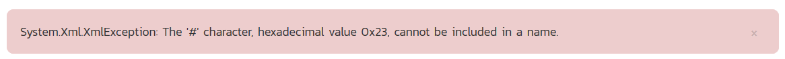

# Custom Graphs Tutorial and Introduction

## Introduction
One of the maxims I always tell developers is that regardless of what you build, customers will never be satisfied with the reports you offer or the integration that you provide. In fact, the two most underestimated tasks in software development are data feeds and reporting. So one of the nice features in our Spira platform is the ability to do custom graphing, so that you are not limited to just the graphs that ship with the system.

## Creating Custom Graphs
To create a custom report,  go to: Administration > System Administration > Reporting > Edit Graphs:


When you click on the **Edit Graphs** link, you will be taken to the custom graph configuration page where you can add / modify custom graphs.

This page lets you create custom graphs and charts in the system that your users can run in the various products they have access to. Note that the graph definitions themselves are global to the system and therefore available in all products.


You can click the `Edit` button to modify an existing graph, or click `Add New Custom Graph` to create an new one. In either case, you will see the custom graph editing screen.

The graph list page has the following additional operations:

*   **Clone**: this will make a copy of the graph with '- Copy' appended to the name
*   **Delete**: this will permanently delete the selected custom graph.


On the graph editing page, you can enter the following fields:

*   **Name**: This is the short name of the graph that will be displayed to users when they choose to display a custom graph.
*   **Description**: This is the longer description of the graph, and should be used to explain what the data in the graph shows, what the purpose of the graph is and how the data should be interpreted. This is what the user will see when they click on the help link on the graph.
*   **Active**: If you set this to "No", the graph will not be accessible by end users
*   **Position**: use this to specify the relative position of the graph in the list of custom graphs.
*   **Query**: this is where you enter the actual query used to generate the graph data. We shall discuss this below.


## Writing the ESQL Query Used in the Graph

The **Query** box is where you can choose the **Reportable Entity** from the dropdown list and then use that base query to create your own custom query.

We recommend that you first choose the appropriate **reportable entity** from the dropdown list. In the example  below, we have selected the "Test Runs" reportable entity:


This will automatically populate the following query in the **Query** editor:

``` sql
select value R from SpiraTestEntities.R_TestRuns as R where R.PROJECT_ID = ${ProjectId}
```

This query tells Spira to select all of the rows in the R_TestRuns collection that are in the current product and include all of the columns in the final report. You cannot graph non-numeric columns, so usually we'd recommend clicking **Display Data Grid** to see all of the columns that you can use in the graph:


This will help you decide which columns are important for your graph. You can then adjust the query to only include those columns:

``` sql
select R.EXECUTION_STATUS_NAME, COUNT (R.TEST_RUN_ID) as COUNT
from SpiraTestEntities.R_TestRuns as R
where R.PROJECT_ID = ${ProjectId}
group by R.EXECUTION_STATUS_NAME
```

In this modified query, we have replaced the keyword **value** with the specific column names. We have also added an aggregation function called **COUNT** to count the number of test runs and group by the execution status name column. Spira uses a modified SQL language called Entity SQL created by Microsoft that we'll be discussing in more detail in later articles in this series.

You may have noticed that we had a special token in the query **${ProjectId}**, this token will be evaluated during the generation of the graph and ensures that only items in the current product are included. If you want to include all the items in a specific Program, you should instead use the token **${ProjectGroupId}**. If you don't use either token, the graph will include all the items in the entire system, across all products and programs.

There are some restrictions about the **select** clause of the query:

*   You need to make the first column in the query the category for the x-axis
*   The other columns need to be purely numeric, and will be used to populate the data series that will be mapped to the x-axis categories.

You can test out your modified query by clicking the **Display Data Grid** button again. For our example test runs query above the system will now display:


Then once you have verified the data makes sense, click on the three different **Preview Graph** buttons to see how the data will look as a donut, bar, or  line graph.

!!! info "Note"
    For donut graphs, only one data range is supported, for line/bar charts, you can have multiple ranges

### a) Donut Chart


### b) Bar Graph


### c) Line Chart


Once you are happy with your graph design, make sure the **Active** flag is set to **Yes** and then click **Save** to publish the graph for your end users.

!!! warning
    If you create a graph that doesn't have either ${ProjectId} or ${ProjectGroupId} in the WHERE clause you could end up displaying data to a user that shouldn't have permission to see that data.

## Viewing Custom Graphs

Once published, the custom graphs can be displayed in the main **Reports** dashboard by your end users:


Once you have added an instance of the **Custom Graphs** to your dashboard, you can choose the specific graph, and the visualization type (donut, bar, and line currently):


You can display the data being used to generate the graph by clicking on the data-grid button in the bottom-left:


As with all of the graphs on the reporting dashboard, you can export the data-grid as a CSV / Excel sheet, and export the actual graph as an image (PNG, JPEG, and BMP formats supported).


## Understanding Entity SQL (ESQL)
This section explains how you can use Entity SQL to write queries to pull back the data you need for your graphs.

The language that we use for creating graphs (and reports) in Spira is called "_Entity SQL_" (abbreviated to **ESQL**) and is based on the standard database Structured Query Language (SQL) but modified by Microsoft to work against a conceptual object oriented data structure rather than a traditional relational database. According to the [Microsoft Entity SQL website](http://docs.microsoft.com/en-us/dotnet/framework/data/adonet/ef/language-reference/entity-sql-overview):

> Entity SQL is a SQL-like language that enables you to query conceptual models in the Entity Framework. Conceptual models represent data as entities and relationships, and Entity SQL allows you to query those entities and relationships in a format that is familiar to those who have used SQL.

## Entity SQL Syntax Basics

Similar to database SQL, ESQL supports query that consists of the following parts:

``` sql
select properties or object
from entity collection as alias
join other entity collections on relationship
where conditions
group by properties
order by properties
```

When using ESQL with Spira's reporting system, the entity collections you can use are the ones generated from the 'Add New Query' dropdown discussed in the previous article. For example, you have:

* SpiraTestEntities.R_Requirements
* SpiraTestEntities.R_TestCases
* SpiraTestEntities.R_RequirementTestCases
* etc...

The **R_xxx** prefix is used to distinguish the entities available for reporting from the core entities used by Spira internally for its data access. You will only ever be able query the R_ prefixed entities from within the Spira reporting system.

A simple query used to retrieve all of the requirements in project 1 sorted by hierarchical order then ID would be:

``` sql
select value RQ
from SpiraTestEntities.R_Requirements as RQ
where RQ.PROJECT_ID = 1
order by RQ.INDENT_LEVEL, RQ.REQUIREMENT_ID
```

A more complex query that selects specific requirement properties (vs. the entire object), joins to other table (e.g. to get test case object properties as well) would be:

``` sql
select RQ.REQUIREMENT_ID, RQ.NAME as REQUIREMENT_NAME, TC.TEST_CASE_ID, TC.NAME as TEST_CASE_NAME
from SpiraTestEntities.R_Requirements as RQ
join SpiraTestEntities.R_RequirementTestCases as RT on RQ.REQUIREMENT_ID = RT.REQUIREMENT_ID
join SpiraTestEntities.R_TestCases as TC on RT.TEST_CASE_ID = TC.TEST_CASE_ID 
where RQ.PROJECT_ID = 1
order by RQ.NAME, TC.NAME
```


Finally, you can add on an aggregation function and group by to group by one property and aggregate the other properties against this. For example to get a count of the test cases associated with each requirement, instead of the test case names would be:

``` sql
select RQ.REQUIREMENT_ID, RQ.NAME as REQUIREMENT_NAME, COUNT(TC.TEST_CASE_ID) as TEST_CASE_COUNT
from SpiraTestEntities.R_Requirements as RQ
join SpiraTestEntities.R_RequirementTestCases as RT on RQ.REQUIREMENT_ID = RT.REQUIREMENT_ID
join SpiraTestEntities.R_TestCases as TC on RT.TEST_CASE_ID = TC.TEST_CASE_ID
where RQ.PROJECT_ID = 1
group by RQ.REQUIREMENT_ID, RQ.NAME
order by TEST_CASE_COUNT desc, RQ.REQUIREMENT_ID
```

In this last case, we're sorting the list of requirements by the count of associated test cases (in descending order).

So now that we have seen some example queries, let's examine each of the parts of the query in turn:

### The SELECT Clause

The **select** clause of an ESQL query can consist of either:

*   a single object reference, prefixed by **value**. This is semantically equivalent to SELECT * in database SQL and means evaluate all of the properties of the object.
*   a comma separated list of discrete object properties. They need to have their object alias prefixes (e.g. RQ in the examples above)

So for example we could have:

``` sql
select value RQ
```

that selects all of the properties in the requirements table (i.e. all the columns).

Alternatively you could select specific properties (columns) from one or more object:

``` sql
select RQ.REQUIREMENT_ID, RQ.NAME as REQUIREMENT_NAME, TC.TEST_CASE_ID, TC.NAME as TEST_CASE_NAME
```

In this case, we omit the **value** prefix since it's not evaluating all of the properties of an object. Since two of the properties have the same name ("NAME") we are using the **as** operator to give the property returned a unique name. This is important. If you try and return back two properties with the same name, Spira will give the following error message:



You get this error message because the Entity framework will try and create a name like (NAME #1) that is not allowed by the Spira reporting system. So make sure you used actual named aliases when the same property name is used more than once.

Finally you can use the following aggregations in the SELECT clause to aggregate data from properties that are not being grouped (see later for information on the group by clause):

* SUM
* COUNT
* MAX
* MIN
* AVG (average)

A full list of [Entity SQL aggregate functions](https://docs.microsoft.com/en-us/dotnet/framework/data/adonet/ef/language-reference/aggregate-canonical-functions) can be found on the Microsoft ESQL reference website.

For example, we can count how many times one property appears relative to another column:

``` sql
select RQ.REQUIREMENT_ID, RQ.NAME as REQUIREMENT_NAME, COUNT(TC.TEST_CASE_ID) as TEST_CASE_COUNT
```

Note that in this case we recommend you always specify an alias for the result of the aggregation function using the **as** operator. If you forget, you'll get the same error message as before:


### The FROM Clause

The **from** </span>clause in ESQL is relatively simple, it contains the primary object collection being queried and an alias that will be used to reference its properties in the other parts of the query:

``` sql
from SpiraTestEntities.R_Requirements as RQ
```

### The JOIN Clauses

If you are only going to need to work with the properties from a single object collection then you don't need to have any **join**</span> clauses in your query. However if you are going to need data from multiple object collections, then you will need to use the join clause to add in those other collections. A simple join clause looks like:

``` sql 
join SpiraTestEntities.R_RequirementTestCases as RT on RQ.REQUIREMENT_ID = RT.REQUIREMENT_ID
```

where you add the name of the entity collection being joined, the alias to refer to it with, and the comparison operator (in this case an equality) used to make the join.

Entity SQL supports the following types of join:

*   **inner join** or **join** - Only rows that exist in both sides of the comparison are returned
*   **left outer join** or **left join** - Only rows that exist in the left hand side of the comparison are returned, plus any matching rows from the other side, or NULL if missing.
*   **right outer join** or **right join** - Only rows that exist in the right hand side of the comparison are returned, plus any matching rows from the other side, or NULL if missing.
*   **full outer join** or **full join** - All rows from both sides of the comparison are returned, with NULL values being used for non-matching rows on the alternate side.
*   **cross join** - This query expression produces the Cartesian product of the two collections from the left and right hand sides.

### The WHERE Clauses

The **where** clause in ESQL lets you filter the results by one or more condition. In addition to the standard ESQL syntax, you can use the special Spira tokens to filter by dynamic data in the system:

*   ${ProjectGroupId} - the current program (formerly known as project group)
*   ${ProjectId} - the current product (formerly known as project)
*   ${ReleaseId} the current release, phase, sprint, or iteration

The where clause consists of a set of conditions that are joined by a boolean operator:

*   **and** (used when condition A and condition B are true)
*   **or** (used when condition A or condition B are true)

Generally **and** operators have higher precedence than **or** operators, so you will need to use parenthesis when you want to have **or** operators that are higher precedence than an **and**.

For example:

``` sql
where (RQ.PROJECT_ID = 1 or RQ.PROJECT_ID = 2) and RQ.IS_DELETED = 0
```

means that you will retrieve any un-deleted requirement that is in project 1 or project 2, whereas this would mean something completely different:

``` sql
where RQ.PROJECT_ID = 1 or RQ.PROJECT_ID = 2 and RQ.IS_DELETED = 0
```

this would retrieve all (including deleted) requirements in project 1, and any un-deleted ones from project 2.

The type of operator you can use in the various conditions include:

*   Comparisons such as:
    *   = Equals
    *   < Less than
    *   > Greater than
    *   <= Less that or equals
    *   >= Greater than or equals
    *   <> or != not equal to
    *   ! not
*   Mathematical operator such as:
    *   + add
    *   - subtract
    *   * multiple
    *   / divide
    *   % modulus (remainder)

For example you might have a compound conditional clause such as:

``` sql
where RQ.PROJECT_ID >= 1 and RQ.PROJECT_ID <= 4 and RQ.IS_DELETED = 0 and (RQ.TASK_ACTUAL_EFFORT + RQ.TASK_REMAINING_EFFORT) > 0
```

### Aggregations and GROUP BY

In the discussion of the **select** clause we mentioned that you can use **aggregation** functions such as **count, sum, min, max**, etc. If you use these in the **select** clause, then any object properties that are not being aggregated need to be included in the **group by** clause:

``` sql 
group by RQ.REQUIREMENT_ID, RQ.NAME
```

If you don't have any aggregation functions, you can still use a **group by** clause to simply group similar rows, but generally speaking you omit the **group by** clause if there are no aggregation functions in the **select** list.

### Sorting and ORDER BY

Finally, you typically want to sort the data by one or more of the object properties, this is done by having an order by clause at the end of the query:

``` sql 
order by TEST_CASE_COUNT desc, RQ.REQUIREMENT_ID asc
```

The syntax of the order by clause is:

*   **order by**
*   property name (e.g. **RQ.REQUIREMENT_ID**) or property alias (e.g. **TEST_CASE_COUNT**). If an alias you don't use the object prefix (e.g. **RQ**)
*   **asc** or **desc** for ascending or descending order (if omitted, it will default to ascending)

If you sort by a property (e.g. requirement name) that could be held by multiple rows, it is recommended to always add a final sort clause by a guaranteed unique ID such as the primary key **REQUIREMENT_ID** since that will ensure the results are consistent each time. This is known as 'stable sorting'

## Differences Between ESQL and Traditional Database SQL

Now that we have covered the basics of writing an Entity SQL (ESQL) query, we'll discuss some of the differences and limitations between ESQL and traditional database SQL.

### No Support for *

Database SQL supports the unqualified * syntax as an alias for the entire row, and the qualified * syntax (t.*) as a shortcut for the fields of that table. In addition, database SQL allows for a special `count(*)` aggregate, which includes nulls.

Entity SQL does not support the * construct. Database SQL queries of the form:

``` sql
select * from T
```

and

``` sql
select T1.* from T1, T2...
```

can be expressed in Entity SQL as

``` sql
select value t from T as t
```

and

``` sql
select value t1 from T1 as t1, T2 as t2...
```

respectively.

Additionally, these constructs handle inheritance (value substitutability), while the `select *` variants are restricted to top-level properties of the declared type. Entity SQL does not support the `count(*)` aggregate. Use `count(0)` instead.

### Changes to Group By

Entity SQL supports aliasing of `group by` keys. Expressions in the `select` clause and `having` clause must refer to the `group by` keys via these aliases. For example, this Entity SQL syntax:

#### ESQL

``` sql
SELECT k1, count(t.a), sum(t.a)
FROM T AS t
GROUP BY t.b + t.c AS k1
```

...is equivalent to the following database SQL:

#### SQL

``` sql
SELECT b + c, count(*), sum(a)
FROM T
GROUP BY b + c
```

### Collection-Based Aggregates

Entity SQL supports two kinds of aggregates.

Collection-based aggregates operate on collections and produce the aggregated result. These can appear anywhere in the query, and do not require a `group by` clause. For example:


``` sql
SELECT t.a AS a, count({1,2,3}) AS b FROM T AS t
```

Entity SQL also supports SQL-style aggregates. For example:

``` sql
SELECT a, sum(t.b) FROM T AS t GROUP BY t.a AS a
```

### ORDER BY Clause Usage

Database SQL allows `ORDER BY` clauses to be specified only in the topmost `SELECT .. FROM .. WHERE` block. In Entity SQL you can use a nested `ORDER BY` expression and it can be placed anywhere in the query, but ordering in a nested query is not preserved.

``` sql
-- The following query will order the results by the last name  
SELECT C1.FirstName, C1.LastName  
        FROM AdventureWorks.Contact AS C1
        ORDER BY C1.LastName  
```

``` sql
-- In the following query ordering of the nested query is ignored.  
SELECT C2.FirstName, C2.LastName  
    FROM (SELECT C1.FirstName, C1.LastName  
        FROM AdventureWorks.Contact as C1  
        ORDER BY C1.LastName) as C2  
```

### Case/Accent Sensitivity

In database SQL, identifier comparison is based on the settings of the current database and the database platform being used (SQL Server, Oracle, MySQL, etc.). In Entity SQL, identifiers are always case insensitive and accent sensitive (that is, Entity SQL distinguishes between accented and unaccented characters; for example, 'a' is not equal to 'ấ'). Entity SQL treats versions of letters that appear the same but are from different code pages as different characters.

### Group By Clause Differences

Entity SQL also imposes additional restrictions on queries involving `group by` clauses. Expressions in the `select` clause and `having` clause of such queries may only refer to the `group by` keys via their aliases. The following construct is valid in most database SQL variants but are not in Entity SQL:

#### SQL

``` sql 
SELECT t.x + t.y FROM T AS t group BY t.x + t.y
```

#### ESQL
To do this in Entity SQL:

``` sql
SELECT k FROM T AS t GROUP BY (t.x + t.y) AS k
```

### Referencing Columns (Properties) of Tables (Collections)

All column references in Entity SQL must be qualified with the table alias. The following construct (assuming that `a` is a valid column of table `T`) is valid in database SQL but not in Entity SQL.

SQL:

``` sql
SELECT a FROM T
```

The Entity SQL form is

``` sql
SELECT t.a AS A FROM T AS t
```

The table aliases are optional in the `from` clause. The name of the table is used as the implicit alias. Entity SQL allows the following form as well:

``` sql
SELECT Tab.a FROM Tab
```

### Navigation Through Objects

Database SQL uses the "." notation for referencing columns of (a row of) a table. Entity SQL extends this notation (borrowed from programming languages) to support navigation through properties of an object.

For example, if `p` is an expression of type Person, the following is the Entity SQL syntax for referencing the city of the address of this person.

``` sql
p.Address.City   
```

### Collections of Literals

In database SQL, if you want to refer to a collection of possible values, you would use an IN clause together with a set of values contained within parenthesis:

**SQL**

``` sql
SELECT t.a FROM T as t WHERE t.b IN (1,2,3)
```

In Entity SQL, the syntax for a collection of values is based on braces / curly brackets instead:</pre>

**ESQL**

``` sql
select t.a from T as t where t.b in { 1,2,3 }
```

### Differences in Literals and Types

There are some differences between how literal values and types are represented in Entity SQL vs. Database SQL:

*   In database SQL, you typically represent boolean values as 1 or 0 whereas in Entity SQL you use **true**</span>** and **false**
*   Database SQL uses database schema types such as **VARCHAR, NVARCHAR** and **INT**, whereas Entity SQL uses Microsoft .NET types such as **String** and **Int32**
*   Integer literals can be of type Int32 (123), UInt32 (123U), Int64 (123L), and UInt64 (123UL)
*   DateTime literals, both date and time parts are mandatory. There are no default values. For example, a date literal would be:

``` sql
DATETIME '2006-12-25 01:01:00.000'
```

*   There are Unicode and non-Unicode character string literals. Unicode strings are prepended with N. For example, `N'hello'`.
*   Typed nulls can be used anywhere. Type inference is not required for typed nulls because the type is known. For example, you can construct a null of type Int16 with the following Entity SQL construct:

``` sql
(cast(null as Int16))
```

### Database SQL Functionality Not Available in Entity SQL

The following database SQL functionality is not available in Entity SQL.

*   **DML Commands** - Entity SQL currently provides no support for DML statements (insert, update, delete).
*   **DDL Commands** - Entity SQL provides no support for DDL in the current version.
*   **Imperative Programming** - Entity SQL provides no support for imperative programming, unlike Transact-SQL. Use a programming language instead.
*   **Grouping Functions** - Entity SQL does not yet provide support for grouping functions (for example, CUBE, ROLLUP, and GROUPING_SET).
*   **Analytic Functions** - Entity SQL does not (yet) provide support for analytic functions.
*   **Built-in Functions, Operators** - Entity SQL supports a subset of most database SQL's built in functions and operators.


## Advanced Entity SQL Queries

Now that we have discussed the differences between traditional database SQL and Entity SQL, we will cover some more advanced queries and functions that customers typically will want to use when creating custom graphs with Spira.

At the top of this tutorial, we outlined a sample ESQL query to get the count of test runs by execution status:

``` sql
select R.EXECUTION_STATUS_NAME, COUNT (R.TEST_RUN_ID) as COUNT
from SpiraTestEntities.R_TestRuns as R
where R.PROJECT_ID = ${ProjectId}
group by R.EXECUTION_STATUS_NAME
```

As we discussed, when using ESQL queries to display custom graphs, there are some restrictions about the **select** clause of the query:

*   You need to make the first column in the query the category for the x-axis
*   The other columns need to be purely numeric, and will be used to populate the data series that will be mapped to the x-axis categories.

We will now be looking at some specific examples of graphs that users have asked us for help with, that we have some suggestions for...

### 1) Requirements Added/Removed Over Time

For example, lets consider that you want to display a graph of requirements added and removed over time. To get a count of this we can query the **SpiraTestEntities.R_HistoryChangeSets** view to get a count of the changes, filter by additions and deletions, then use a combination of aggregation and the **CAST** operator to count the items added/removed:

``` sql
select
R.CHANGE_DATE as Timestamp,
count(CASE
WHEN R.CHANGETYPE_NAME="Added" THEN 1
WHEN R.CHANGETYPE_NAME="Deleted" THEN -1
END
) AS Sum
from SpiraTestEntities.R_HistoryChangeSets as R
where
    R.ARTIFACT_TYPE_NAME = "Requirement"
group by R.CHANGE_DATE
```

This will display the following data:

<table class="table table-striped">
	<tbody>
		<tr class="Header">
			<th>Timestamp</th>
			<th>Sum</th>
		</tr>
		<tr>
			<td>2019-08-17T02:06:18</td>
			<td>0</td>
		</tr>
		<tr>
			<td>2019-08-23T02:51:18</td>
			<td>0</td>
		</tr>
		<tr>
			<td>2020-01-14T11:50:18</td>
			<td>5</td>
		</tr>
		<tr>
			<td>2020-01-14T11:50:18</td>
			<td>7</td>
		</tr>
		<tr>
			<td>2020-01-14T11:50:18</td>
			<td>5</td>
		</tr>
		<tr>
			<td>2020-01-14T11:50:18</td>
			<td>9</td>
		</tr>
		<tr>
			<td>2020-01-14T11:50:18</td>
			<td>7</td>
		</tr>
		<tr>
			<td>2020-01-14T11:50:18</td>
			<td>6</td>
		</tr>
		<tr>
			<td>2020-01-14T11:50:18</td>
			<td>5</td>
		</tr>
		<tr>
			<td>2020-01-14T11:50:18</td>
			<td>7</td>
		</tr>
	</tbody>
</table>

Which when displayed as a graph would look like:


However suppose you want to display this graph by day, not by unique timestamp (a reasonable request), you would use the **TruncateTime** canonical EntitySQL function and combine that with a different way of writing the **GROUP BY** clause:

``` sql
select
DatePart,
count(CASE
WHEN R.CHANGETYPE_NAME="Added" THEN 1
WHEN R.CHANGETYPE_NAME="Deleted" THEN -1
END
) AS Sum
from SpiraTestEntities.R_HistoryChangeSets as R
where
    R.ARTIFACT_TYPE_NAME = "Requirement"
group by TruncateTime(R.CHANGE_DATE) as DatePart
```

This would now give the following results instead:

``` html
<table class="table table-striped">
	<tbody>
		<tr class="Header">
			<th>DatePart</th>
			<th>Sum</th>
		</tr>
		<tr>
			<td>2019-08-17T00:00:00</td>
			<td>0</td>
		</tr>
		<tr>
			<td>2019-08-23T00:00:00</td>
			<td>0</td>
		</tr>
		<tr>
			<td>2020-01-14T00:00:00</td>
			<td>248</td>
		</tr>
	</tbody>
</table>
```

which could be graphed as follows:


## 2) Aggregating Data Over Time Periods

A common need is the ability to aggregate data over multiple time periods. For example, in the query above, we had the list of requirements aggregated by day:

``` html
<table class="table table-striped">
	<tbody>
		<tr class="Header">
			<th>DatePart</th>
			<th>Sum</th>
		</tr>
		<tr>
			<td>2019-08-17T00:00:00</td>
			<td>0</td>
		</tr>
		<tr>
			<td>2019-08-23T00:00:00</td>
			<td>0</td>
		</tr>
		<tr>
			<td>2020-01-14T00:00:00</td>
			<td>248</td>
		</tr>
	</tbody>
</table>
```

Suppose we wanted to group the data over a 20 day time period. We would need to modify the query as follows:

``` sql
select
DatePart,
count(CASE
WHEN R.CHANGETYPE_NAME="Added" THEN 1
WHEN R.CHANGETYPE_NAME="Deleted" THEN -1
END
) AS Sum
from SpiraTestEntities.R_HistoryChangeSets as R
where
    R.ARTIFACT_TYPE_NAME = "Requirement"
group by AddDays(CreateDateTime(Year(R.CHANGE_DATE),1,1,0,0,0), (DayOfYear(R.CHANGE_DATE)/20)*20) as DatePart
```

Now when you execute the query, the system is using the following functions to combines the dates down into 20 day ranges:

*   **DayOfYear** to get the absolute day number this year (1-366)
*   Integer division and multiplication by 20 days to get the day converted to the first day in each 20 day range
*   Using **AddDays** and **CreateDateTime** to compose the full date time again, adding the total number of days back to the year base.

When executed, this will display:

``` html
<table class="table table-striped">
	<tbody>
		<tr class="Header">
			<th>DatePart</th>
			<th>Sum</th>
		</tr>
		<tr>
			<td>2019-08-09T00:00:00</td>
			<td>0</td>
		</tr>
		<tr>
			<td>2020-01-01T00:00:00</td>
			<td>248</td>
		</tr>
	</tbody>
</table>
```

or in graphical form:


## Further Reading

* [Microsoft Entity SQL Reference Documentation](https://docs.microsoft.com/en-us/dotnet/framework/data/adonet/ef/language-reference/entity-sql-language)
* [Custom Reports Section of Inflectra Knowledge Base](https://www.inflectra.com/Support/KnowledgeBase/spira-reports/List.aspx)