# Custom Graphs Tutorial and Introduction
!!! abstract "Available in SpiraTest, SpiraTeam, SpiraPlan"

## Introduction
Standard reports and graphs will never meet the needs of all users. That is why Spira has custom graphing, so that you are not limited to just the graphs that ship with the system.

## Creating Custom Graphs
To create a custom report,  go to: Administration > System Administration > Reporting > Edit Graphs:

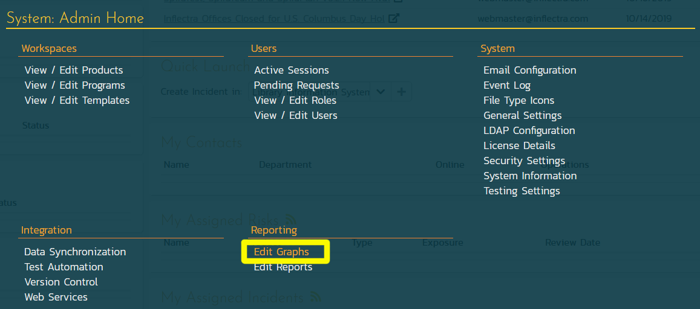

When you click on the **Edit Graphs** link, you will be taken to the custom graph configuration page where you can add / modify custom graphs.

This page lets you create custom graphs and charts in the system that your users can run in the various products they have access to. Note that the graph definitions themselves are global to the system and therefore available in all products.

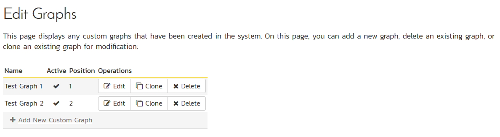

You can click the `Edit` button to modify an existing graph, or click `Add New Custom Graph` to create an new one. In either case, you will see the custom graph editing screen.

The graph list page has the following additional operations:

*   **Clone**: this will make a copy of the graph with '- Copy' appended to the name
*   **Delete**: this will permanently delete the selected custom graph.

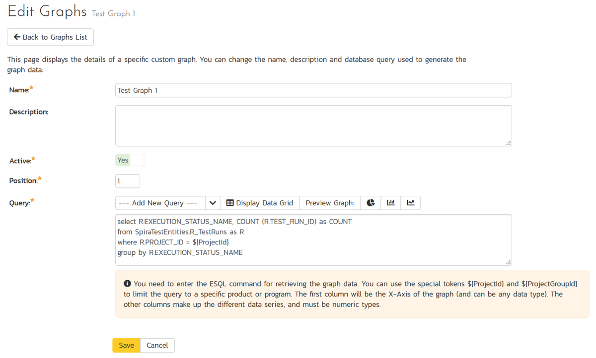

On the graph editing page, you can enter the following fields:

*   **Name**: This is the short name of the graph that will be displayed to users when they choose to display a custom graph.
*   **Description**: This is the longer description of the graph, and should be used to explain what the data in the graph shows, what the purpose of the graph is and how the data should be interpreted. This is what the user will see when they click on the help link on the graph.
*   **Active**: If you set this to "No", the graph will not be accessible by end users
*   **Position**: use this to specify the relative position of the graph in the list of custom graphs.
*   **Query**: this is where you enter the actual query used to generate the graph data. We shall discuss this below.


## Writing the ESQL Query Used in the Graph

The **Query** box is where you can choose the **Reportable Entity** from the dropdown list and then use that base query to create your own custom query.

We recommend that you first choose the appropriate **reportable entity** from the dropdown list. In the example  below, we have selected the "Test Runs" reportable entity:

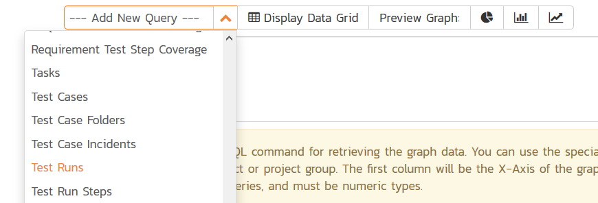

This will automatically populate the following query in the **Query** editor:

``` sql
select value R from SpiraTestEntities.R_TestRuns as R where R.PROJECT_ID = ${ProjectId}
```

This query tells Spira to select all of the rows in the R_TestRuns collection that are in the current product and include all of the columns in the final report. You cannot graph non-numeric columns, so usually we'd recommend clicking **Display Data Grid** to see all of the columns that you can use in the graph:

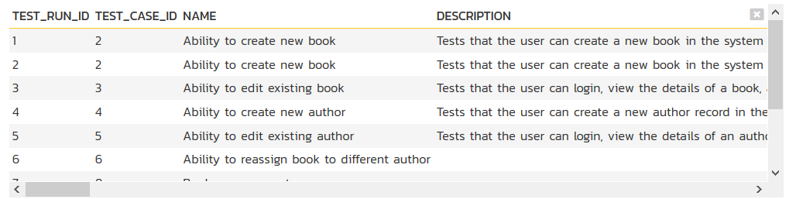

This will help you decide which columns are important for your graph. You can then adjust the query to only include those columns:

``` sql
select R.EXECUTION_STATUS_NAME, COUNT (R.TEST_RUN_ID) as COUNT
from SpiraTestEntities.R_TestRuns as R
where R.PROJECT_ID = ${ProjectId}
group by R.EXECUTION_STATUS_NAME
```

In this modified query, we have replaced the keyword **value** with the specific column names. We have also added an aggregation function called **COUNT** to count the number of test runs and group by the execution status name column. Spira uses a modified SQL language called Entity SQL created by Microsoft that we'll be discussing in more detail in later articles in this series.

You may have noticed that we had a special token in the query **\${ProjectId}**, this token will be evaluated during the generation of the graph and ensures that only items in the current product are included. If you want to include all the items in a specific Program, you should instead use the token **\${ProjectGroupId}**. If you don't use either token, the graph will include all the items in the entire system, across all products and programs.

There are some restrictions about the **select** clause of the query:

*   You need to make the first column in the query the category for the x-axis
*   The other columns need to be purely numeric, and will be used to populate the data series that will be mapped to the x-axis categories.

You can test out your modified query by clicking the **Display Data Grid** button again. For our example test runs query above the system will now display:

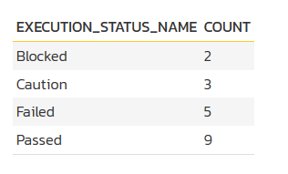

Then once you have verified the data makes sense, click on the three different **Preview Graph** buttons to see how the data will look as a donut, bar, or  line graph.

!!! info "Note"
    For donut graphs, only one data range is supported, for line/bar charts, you can have multiple ranges

### a) Donut Chart

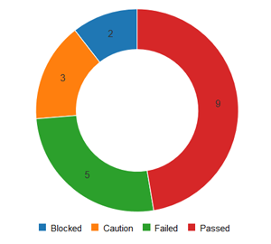

### b) Bar Graph

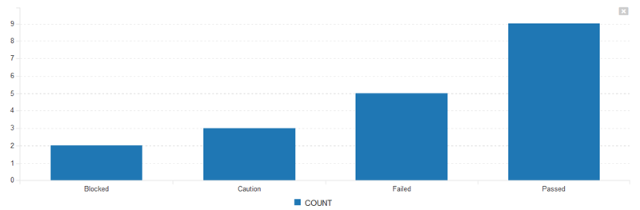

### c) Line Chart

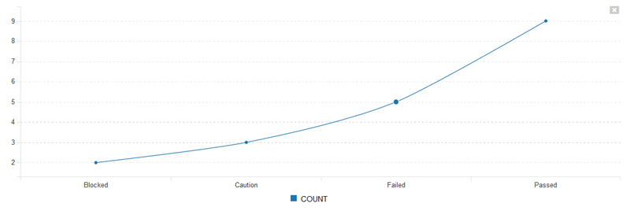

Once you are happy with your graph design, make sure the **Active** flag is set to **Yes** and then click **Save** to publish the graph for your end users.

!!! warning
    If you create a graph that doesn't have either ${ProjectId} or ${ProjectGroupId} in the WHERE clause you could end up displaying data to a user that shouldn't have permission to see that data.

## Viewing Custom Graphs

Once published, the custom graphs can be displayed in the main **Reports** dashboard by your end users:

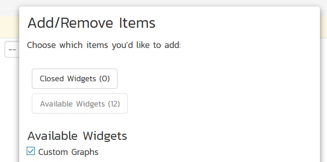

Once you have added an instance of the **Custom Graphs** to your dashboard, you can choose the specific graph, and the visualization type (donut, bar, and line currently):

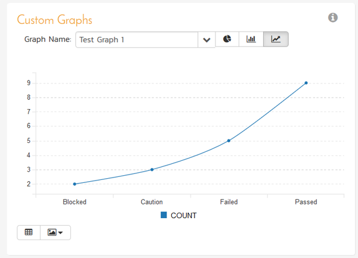

You can display the data being used to generate the graph by clicking on the data-grid button in the bottom-left:

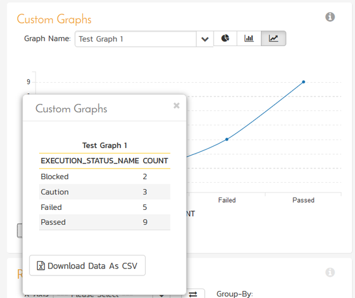

As with all of the graphs on the reporting dashboard, you can export the data-grid as a CSV / Excel sheet, and export the actual graph as an image (PNG, JPEG, and BMP formats supported).


## Understanding Entity SQL (ESQL)
The language that we use for creating custom graphs and reports in Spira is called "_Entity SQL_" (abbreviated to **ESQL**). Please read our [dedicated tutorial](Understanding-Entity-SQL.md) to learn how ESQL works and how it is similar and different to standard SQL. This includes an overview, <span id="entity-sql-syntax-basics">Entity SQL Syntax Basics</span>, and the <span id="differences-between-esql-and-traditional-database-sql">differences Between ESQL and Traditional Database SQL</span>.


## Advanced Entity SQL Queries

Now that we have discussed the differences between traditional database SQL and Entity SQL, we will cover some more advanced queries and functions that customers typically will want to use when creating custom graphs with Spira.

At the top of this tutorial, we outlined a sample ESQL query to get the count of test runs by execution status:

``` sql
select R.EXECUTION_STATUS_NAME, COUNT (R.TEST_RUN_ID) as COUNT
from SpiraTestEntities.R_TestRuns as R
where R.PROJECT_ID = ${ProjectId}
group by R.EXECUTION_STATUS_NAME
```

As we discussed, when using ESQL queries to display custom graphs, there are some restrictions about the **select** clause of the query:

*   You need to make the first column in the query the category for the x-axis
*   The other columns need to be purely numeric, and will be used to populate the data series that will be mapped to the x-axis categories.

We will now be looking at some specific examples of graphs that users have asked us for help with, that we have some suggestions for...

### 1) Requirements Added/Removed Over Time

For example, lets consider that you want to display a graph of requirements added and removed over time. To get a count of this we can query the **SpiraTestEntities.R_HistoryChangeSets** view to get a count of the changes, filter by additions and deletions, then use a combination of aggregation and the **CAST** operator to count the items added/removed:

``` sql
select
R.CHANGE_DATE as Timestamp,
count(CASE
WHEN R.CHANGETYPE_NAME="Added" THEN 1
WHEN R.CHANGETYPE_NAME="Deleted" THEN -1
END
) AS Sum
from SpiraTestEntities.R_HistoryChangeSets as R
where
    R.ARTIFACT_TYPE_NAME = "Requirement"
group by R.CHANGE_DATE
```

This will display the following data:

<table class="table table-striped">
	<tbody>
		<tr class="Header">
			<th>Timestamp</th>
			<th>Sum</th>
		</tr>
		<tr>
			<td>2019-08-17T02:06:18</td>
			<td>0</td>
		</tr>
		<tr>
			<td>2019-08-23T02:51:18</td>
			<td>0</td>
		</tr>
		<tr>
			<td>2020-01-14T11:50:18</td>
			<td>5</td>
		</tr>
		<tr>
			<td>2020-01-14T11:50:18</td>
			<td>7</td>
		</tr>
		<tr>
			<td>2020-01-14T11:50:18</td>
			<td>5</td>
		</tr>
		<tr>
			<td>2020-01-14T11:50:18</td>
			<td>9</td>
		</tr>
		<tr>
			<td>2020-01-14T11:50:18</td>
			<td>7</td>
		</tr>
		<tr>
			<td>2020-01-14T11:50:18</td>
			<td>6</td>
		</tr>
		<tr>
			<td>2020-01-14T11:50:18</td>
			<td>5</td>
		</tr>
		<tr>
			<td>2020-01-14T11:50:18</td>
			<td>7</td>
		</tr>
	</tbody>
</table>

Which when displayed as a graph would look like:

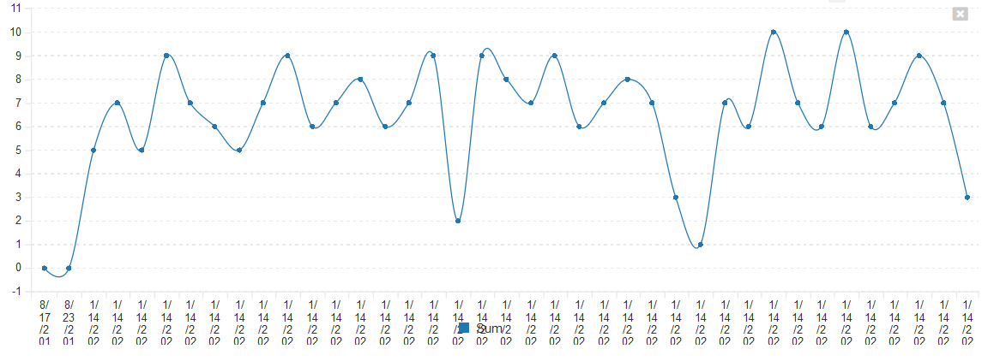

However suppose you want to display this graph by day, not by unique timestamp (a reasonable request), you would use the **TruncateTime** canonical EntitySQL function and combine that with a different way of writing the **GROUP BY** clause:

``` sql
select
DatePart,
count(CASE
WHEN R.CHANGETYPE_NAME="Added" THEN 1
WHEN R.CHANGETYPE_NAME="Deleted" THEN -1
END
) AS Sum
from SpiraTestEntities.R_HistoryChangeSets as R
where
    R.ARTIFACT_TYPE_NAME = "Requirement"
group by TruncateTime(R.CHANGE_DATE) as DatePart
```

This would now give the following results instead:

``` html
<table class="table table-striped">
	<tbody>
		<tr class="Header">
			<th>DatePart</th>
			<th>Sum</th>
		</tr>
		<tr>
			<td>2019-08-17T00:00:00</td>
			<td>0</td>
		</tr>
		<tr>
			<td>2019-08-23T00:00:00</td>
			<td>0</td>
		</tr>
		<tr>
			<td>2020-01-14T00:00:00</td>
			<td>248</td>
		</tr>
	</tbody>
</table>
```

which could be graphed as follows:

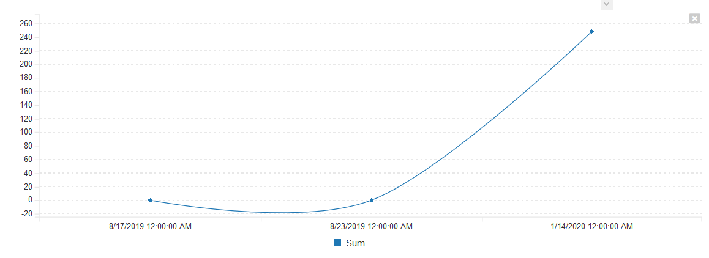

## 2) Aggregating Data Over Time Periods

A common need is the ability to aggregate data over multiple time periods. For example, in the query above, we had the list of requirements aggregated by day:

``` html
<table class="table table-striped">
	<tbody>
		<tr class="Header">
			<th>DatePart</th>
			<th>Sum</th>
		</tr>
		<tr>
			<td>2019-08-17T00:00:00</td>
			<td>0</td>
		</tr>
		<tr>
			<td>2019-08-23T00:00:00</td>
			<td>0</td>
		</tr>
		<tr>
			<td>2020-01-14T00:00:00</td>
			<td>248</td>
		</tr>
	</tbody>
</table>
```

Suppose we wanted to group the data over a 20 day time period. We would need to modify the query as follows:

``` sql
select
DatePart,
count(CASE
WHEN R.CHANGETYPE_NAME="Added" THEN 1
WHEN R.CHANGETYPE_NAME="Deleted" THEN -1
END
) AS Sum
from SpiraTestEntities.R_HistoryChangeSets as R
where
    R.ARTIFACT_TYPE_NAME = "Requirement"
group by AddDays(CreateDateTime(Year(R.CHANGE_DATE),1,1,0,0,0), (DayOfYear(R.CHANGE_DATE)/20)*20) as DatePart
```

Now when you execute the query, the system is using the following functions to combines the dates down into 20 day ranges:

*   **DayOfYear** to get the absolute day number this year (1-366)
*   Integer division and multiplication by 20 days to get the day converted to the first day in each 20 day range
*   Using **AddDays** and **CreateDateTime** to compose the full date time again, adding the total number of days back to the year base.

When executed, this will display:

``` html
<table class="table table-striped">
	<tbody>
		<tr class="Header">
			<th>DatePart</th>
			<th>Sum</th>
		</tr>
		<tr>
			<td>2019-08-09T00:00:00</td>
			<td>0</td>
		</tr>
		<tr>
			<td>2020-01-01T00:00:00</td>
			<td>248</td>
		</tr>
	</tbody>
</table>
```

or in graphical form:

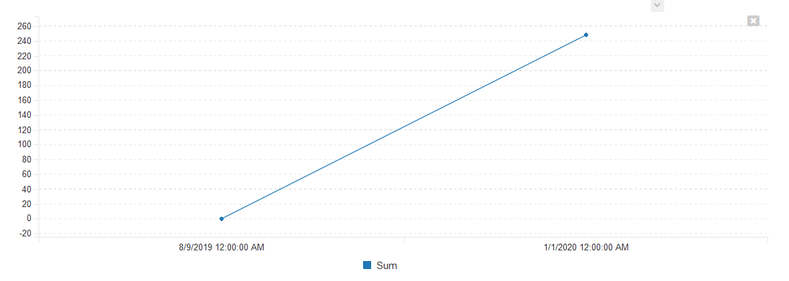


## Further Reading

* [Microsoft Entity SQL Reference Documentation](https://docs.microsoft.com/en-us/dotnet/framework/data/adonet/ef/language-reference/entity-sql-language)
* [Custom Reports Section of Inflectra Knowledge Base](https://www.inflectra.com/Support/KnowledgeBase/spira-reports/List.aspx)