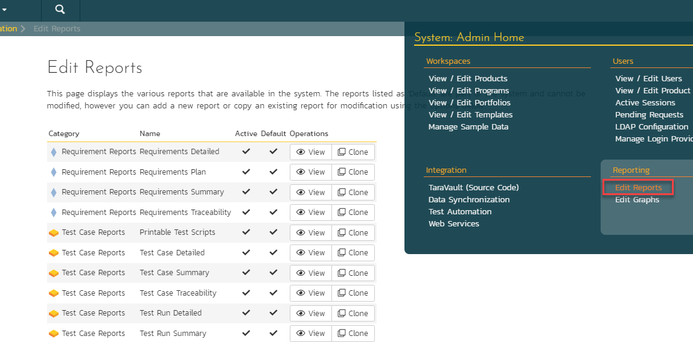
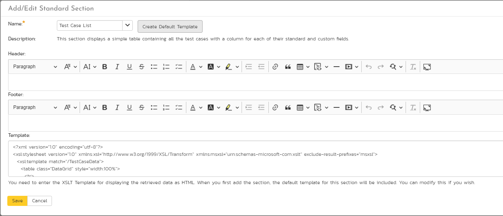
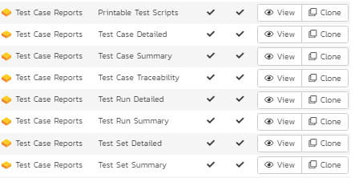
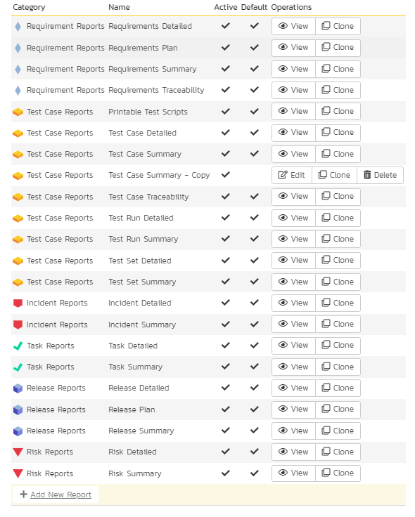
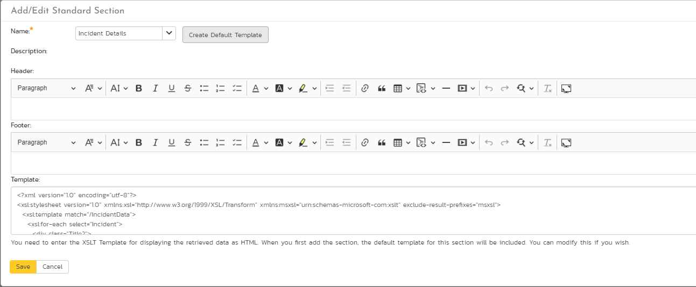

# Custom Reports Tutorial and Introduction
!!! abstract "Available in SpiraTest, SpiraTeam, SpiraPlan"

## Introduction 
Standard reports will never meet the needs of all users. That is why Spira has custom reporting, so that you are not limited to only the reports that ship with the system. This guide explains how to use these powerful custom reporting features.

!!! info "How to get more info and gotchas"

	- You can find information about all the available tables and fields for fully custom reports [here](Custom-Reporting-Tokens.md).
	- For performance reasons, custom reports are limited to a maximum of 10,000 rows.


## Basics and Terminology

You need to be a Spira system administrator to create or modify reports because they have the potential to affect all products in the system. To get to reports go to: Administration > System Administration >
Reporting > Edit Reports:



From here you can either make a copy of one of the existing Spira built-in reports or create completely new report from scratch. The decision of which choice to make will depend on whether:

1.  You want to take one of the existing reports and modify it for your needs (in which case make a clone of it)
2.  You want to create a report of your own that is not similar to any of the built-in ones (in which case just create a new one).

Once you have created your custom report, click on the `Edit` button for the report to go to the report details page. This displays a list of formats, sections, and the header and footer of the report.


### Terminology

When you edit a report you will see the following different items that can be changed/edited:

- **Name**: the name of the report is simply how it will be listed in the main Reports section of the application
- **Description**: this is the description of what the report is for. It will not be displayed in the report itself, but will be displayed as a tooltip in the Reports section of Spira
- **Header**: This is a rich text box that you can enter formatted text into. This will appear at the top of the report above any of the different content sections. You can embed images and include tables, lists or other stylistic elements
- **Footer**: This is a rich text box that you can enter formatted text into. This will appear at the bottom of the report after all of the different content sections. You can embed images and include tables, lists or other stylistic elements
- **Active**: This simply marks whether this report is ready to be used (active) or not.
- **Formats**: All of the Spira reports are generated first into HTML and then converted into one of the other formats. This section lets you choose which formats your report will be available in. Note that if your record has a lot of textual data, it may not convert well into a tabular format such as Excel.
- **Standard Sections**: these are described in more detail below
- **Custom Sections**: these are described in more detail below


### Types of Report Section

There are two types of report section that you can use in your report:

- A **standard section** basically uses an existing pre-defined query that returns back some structured XML data from Spira. For example the 'Project Overview' section will include the project name, description and other meta-data and the 'Requirements Summary' section will include an XML representation of all the requirements in the project together with any child data nested (e.g. all of tasks that belong to a requirement or the list of comments, etc.). A key aspect of a standard section is that the data itself is not customizable, but you can change the XML Template (XSLT) that is used to extract the data and convert it into a viewable form. So you have the ability to use XSLT to transform the data. You also allow the user who runs the report to use the standard set of filters on the data (e.g. return only requirements in release 1.0 or test cases that are priority 1,2,3)
- On the other hand, a **custom section**, lets you use a custom database query using the **Microsoft Entity SQL (ESQL)** language to query the different database view in the system join records, aggregate data to generate a completely custom table of data that you can then transform using an **XML template** (XSLT) to display it in a specific form (e.g. a table of  data, a simple list, etc.). So you have the ability to use two tools: ESQL and XSLT to generate the report. The advantage over the standard section is that you are not limited to the queries that we have already defined in the system, but a custom section does not provide filter options for the end user.

A report you create can have a mixture of the two sections, for example you could start the report with the standard project name and description and follow that with a custom section that displays a table of custom data (e.g. a risk cube or other table of data).


## How to Create and Edit a Custom Report

In this tutorial you will learn how to:

1.  Clone a built-in standard report
2.  Use the "Standard Section" XML editor to make some changes to the XSLT template to hide some columns and add a new calculated column.


### Clone a Standard Report

The first thing we need to do is make a copy of one of the standard reports s that we can change it. For your safety, Spira will not let you modify the original copy of the report. To create a copy:

- Go to Administration > System Administration > Reporting > Edit Reports.
- Click `Clone` next to the report you want to clone. In this example, we are going to make a copy of the "Test Case Summary Report":


### View The New Report

- Once you have cloned the report, click on the 'Edit' link for this report and you will now be taken to the report editing page:


When editing a report, you can change the following fields:

- **Name**: the name of the report is simply how it will be listed in the main Reports section of the application
- **Description**: this is the description of what the report is for. It will not be displayed in the report itself, but will be displayed as a tooltip in the Reports section of Spira
- **Header**: This is a rich text box that you can enter formatted text into. This will appear at the top of the report above any of the different content sections. You can embed images and include tables, lists or other stylistic elements
- **Footer**: This is a rich text box that you can enter formatted text into. This will appear at the bottom of the report after all of the different content sections. You can embed images and include tables, lists or other stylistic elements
- **Active**: This simply marks whether this report is ready to be used (active) or not.
- **Formats**: All of the Spira reports are generated first into HTML and then converted into one of the other formats. This section lets you choose which formats your report will be available in. Note that if your record has a lot of textual data, it may not convert well into a tabular format such as Excel.

For this example, we will edit the second Standard Section of the "Test Case Summary Report" clone. This report is a table-based layout. We will:

- remove a couple of columns that we don't need
- add a new calculated column


### Explore the XML Template

Under the list of 'Standard Sections', click the `Customize` button next to the 'Test Case List' section. This will show the edit dialog box for this section of the report:



Here, you can edit the following parts of the report section:

- **Name**: this is the name of the standard section you want to use in the report. You can choose a different standard section, but you cannot edit the name itself.
- **Description**: this is the description of what the section is designed to do, this is read only and changes if you select a different section name from the dropdown above.
- **Header**: This is a rich text box that you can enter formatted text into. This will appear at the top of the section before any of the dynamic content. You can embed images and include tables, lists or other stylistic elements
- **Footer**: This is a rich text box that you can enter formatted text into. This will appear at the bottom of the section after all of the dynamic content. You can embed images and include tables, lists or other stylistic elements
- **Template**: This contains the eXtensible StyLesheet Template (XSLT) that is used to transform the raw data coming from Spira into the desired presentation format. XSLT includes both HTML elements (e.g. a list or table) plus XSLT specific tags that select the data from Spira and present it in some way. This is used to generate the dynamic portion of the report section. We shall discuss this next.

Feel free to edit the **Header** and **Footer** to make your section more readable, for example include a section heading or some introductory text. You might want to add a horizontal line (\<HR>) to the footer to mark the end the report section.

The full contents of the **Template** section looks like the example below:

``` xml
<?xml version="1.0" encoding="utf-8"?>
<xsl:stylesheet version="1.0" xmlns:xsl="http://www.w3.org/1999/XSL/Transform" xmlns:msxsl="urn:schemas-microsoft-com:xslt" exclude-result-prefixes="msxsl">
	<xsl:template match="/TestCaseData">
		<table class="DataGrid" style="width:100%">
			<tr>
				<th>Test #</th>
				<th>Name</th>
				<th>Description</th>
				<th>Priority</th>
				<xsl:if test="TestCase/TestSteps">
					<th>Test Step</th>
					<th>Test Step Description</th>
					<th>Test Step Expected Result</th>
					<th>Test Step Sample Data</th>
				</xsl:if>
				<th>Status</th>
				<th>Author</th>
				<th>Owner</th>
				<th>Automation Engine</th>
				<th>Est. Duration</th>
				<th>Created On</th>
				<th>Last Modified</th>
				<th>Last Executed</th>
				<xsl:for-each select="TestCase[1]/CustomProperties/CustomProperty">
					<th>
						<xsl:value-of select="Alias" />
					</th>
				</xsl:for-each>
			</tr>
			<xsl:for-each select="TestCase">
				<tr>
					<td>
						<xsl:value-of select="TestCaseId" />
					</td>
					<td>
						<xsl:attribute name="style">
							padding-left: <xsl:value-of select="string-length(IndentLevel)*2" />
							px;
						</xsl:attribute>
						<if test="FolderYn='Y'">
							<b><xsl:value-of select="Name" /></b>
						</if>
						<if test="FolderYn='N'">
							<xsl:value-of select="Name" />
						</if>
					</td>
					<td>
						<xsl:value-of select="Description" disable-output-escaping="yes" />
					</td>
					<td>
						<xsl:value-of select="TestCasePriorityName" />
					</td>
					<if test="TestSteps">
						<td></td>
						<td></td>
						<td></td>
						<td></td>
					</if>
					<td>
						<xsl:value-of select="ExecutionStatusName" />
					</td>
					<td>
						<xsl:value-of select="AuthorName" />
					</td>
					<td>
						<xsl:value-of select="OwnerName" />
					</td>
					<td>
						<xsl:value-of select="AutomationEngineName" />
					</td>
					<td class="Timespan">
						<xsl:value-of select="EstimatedDuration" />
					</td>
					<td class="Date">
						<xsl:call-template name="format-date">
							<xsl:with-param name="datetime" select="CreationDate" />
						<\xsl:call-template>
					</td>
					<td class="Date">
						<xsl:call-template name="format-date">
							<xsl:with-param name="datetime" select="LastUpdateDate" />
						<\xsl:call-template>
					</td>
					<td class="Date">
						<xsl:call-template name="format-date">
							<xsl:with-param name="datetime" select="ExecutionDate" />
						<\xsl:call-template>
					</td>
					<xsl:for-each select="CustomProperties/CustomProperty">
						<td>
							<xsl:value-of select="Value" />
						</td>
					</xsl:for-each>
				</tr>
				<xsl:for-each select="TestSteps/TestStep">
					<tr>
						<td></td>
						<td></td>
						<td></td>
						<td></td>
						<td>
							<xsl:value-of select="position()" />
						</td>
						<td>
							<xsl:value-of select="Description" disable-output-escaping="yes" />
							<xsl:value-of select="' '" />
							<xsl:value-of select="LinkedTestCaseName" />
						</td>
						<td>
							<xsl:value-of select="ExpectedResult" disable-output-escaping="yes" />
						</td>
						<td>
							<xsl:value-of select="SampleData" disable-output-escaping="yes" />
						</td>
						<td>
							<xsl:value-of select="ExecutionStatusName" />
						</td>
						<td></td>
						<td></td>
						<td></td>
						<td></td>
						<td></td>
						<td></td>
					</tr>
				</xsl:for-each>
			</xsl:for-each>
		</table>
	</xsl:template>
	<xsl:template name="format-date">
		<xsl:param name="datetime" />
		<xsl:variable name="date" select="substring-before($datetime, 'T')" />
		<xsl:variable name="year" select="substring-before($date, '-')" />
		<xsl:variable name="month" select="substring-before(substring-after($date, '-'), '-')" />
		<xsl:variable name="day" select="substring-after(substring-after($date, '-'), '-')" />
		<xsl:variable name="time" select="substring-before(substring-after($datetime, 'T'), '.')" />
		<xsl:variable name="monthname">
			<xsl:choose>
				<xsl:when test="$month='01'">
					<xsl:value-of select="'Jan'" />
				</xsl:when>
				<xsl:when test="$month='02'">
					<xsl:value-of select="'Feb'" />
				</xsl:when>
				<xsl:when test="$month='03'">
					<xsl:value-of select="'Mar'" />
				</xsl:when>
				<xsl:when test="$month='04'">
					<xsl:value-of select="'Apr'" />
				</xsl:when>
				<xsl:when test="$month='05'">
					<xsl:value-of select="'May'" />
				</xsl:when>
				<xsl:when test="$month='06'">
					<xsl:value-of select="'Jun'" />
				</xsl:when>
				<xsl:when test="$month='07'">
					<xsl:value-of select="'Jul'" />
				</xsl:when>
				<xsl:when test="$month='08'">
					<xsl:value-of select="'Aug'" />
				</xsl:when>
				<xsl:when test="$month='09'">
					<xsl:value-of select="'Sep'" />
				</xsl:when>
				<xsl:when test="$month='10'">
					<xsl:value-of select="'Oct'" />
				</xsl:when>
				<xsl:when test="$month='11'">
					<xsl:value-of select="'Nov'" />
				</xsl:when>
				<xsl:when test="$month='12'">
					<xsl:value-of select="'Dec'" />
				</xsl:when>
				<xsl:otherwise>
					<xsl:value-of select="''" />
				</xsl:otherwise>
			</xsl:choose>
		<xsl:variable>
		<xsl:value-of select="concat($day, '-' ,$monthname, '-', $year , ' ', $time)" />
	</xsl:template>
</xsl:stlyesheet>
```

This is the underlying template that reads the data in Spira and turns it into a simple HTML table containing all of the columns and rows to be reported on. As you can see, it includes the HTML elements for the table:

``` xml
<table class="DataGrid" style="width:100%">
```

The template also includes XSLT selectors for looping through all of the test cases in the Spira product:

``` xml
<xsl:for-each select="TestCase">
```

Before we can successfully modify the report, we need to understand what data is being returned by Spira.


### Viewing the Data Available for Reporting

To see the data that is available for reporting, you need to open up another browser tab and then go to the **Reports** section of Spira:



Now click on the 'Test Case Summary' report from the left-hand navigation. This displays the Report Configuration page:


- Choose the 'XML' output format for the report. 
- Leave all of the other filters alone and uncheck the 'Test Steps' report element. 
- Click the `Create Report` button

Spira will generate the report in "raw XML format":

``` xml
<Report>
	<Title>
		Test Case Summary Report
	</Title>
	<ProjectData>
		<Project>
			<ArtifactPrefix>PR</ArtifactPrefix>
			<ArtifactType>Project</ArtifactType>
			<ArtifactToken>PR-1</ArtifactToken>
			<ArtifactId>1</ArtifactId>
			<ProjectId>1</ProjectId>
			<ProjectGroupId>2</ProjectGroupId>
			<Name>Library Information System</Name>
			<Description>
				Sample application that allows users to manage books, authors and lending records for a typical branch library
			</Description>
			<CreationDate>2005-11-30T19:00:00</CreationDate>
			<Website>www.libraryinformationsystem.org</Website>
			<IsActive>True</IsActive>
		</Project>
	</ProjectData>
	<TestCaseData>
		<TestCase>
			<TestCaseId>1</TestCaseId>
			<ProjectId>1</ProjectId>
			<ExecutionStatusId>4</ExecutionStatusId>
			<AuthorId>2</AuthorId>
			<OwnerId>2</OwnerId>
			<TestCasePriorityId />
			<AutomationEngineId />
			<AutomationAttachmentId />
			<Name>l Tests</Name>
			<Description />
			<IndentLevel>A</IndentLevel>
			<ExecutionDate>3-11-30T19:00:00</ExecutionDate>
			<CreationDate>3-11-30T19:00:00</CreationDate>
			<LastUpdateDate>3-11-30T19:00:00</LastUpdateDate>
			<ConcurrencyDate>3-11-30T19:00:00</ConcurrencyDate>
			<EstimatedDuration />
			<VisibleYn>Y</VisibleYn>
			<FolderYn>Y</FolderYn>
			<ExpandedYn>Y</ExpandedYn>
			<ActiveYn>Y</ActiveYn>
			<AttachmentsYn>N</AttachmentsYn>
			<TestStepsYn>N</TestStepsYn>
			<FolderCountPassed>1</FolderCountPassed>
			<FolderCountFailed>3</FolderCountFailed>
			<FolderCountCaution>1</FolderCountCaution>
			<FolderCountBlocked>1</FolderCountBlocked>
			<FolderCountNotRun>0</FolderCountNotRun>
			<FolderCountNotApplicable>0</FolderCountNotApplicable>
			<ExecutionStatusName>N/A</ExecutionStatusName>
			<AuthorName>Fred Bloggs</AuthorName>
			<OwnerName>Fred Bloggs</OwnerName>
			<ProjectName />
			<TestCasePriorityName />
			<AutomationEngineName />
			<Custom_01 />
			<Custom_02 />
			...
			<Custom_30 />
			<IsDeleted>False</IsDeleted>
			<CustomProperties>
				<CustomProperty>
					<Alias>URL</Alias>
					<Name>Custom_01</Name>
					<Type>Text</Type>
				</CustomProperty>
				<CustomProperty>
					<Alias>Test Type</Alias>
					<Name>Custom_02</Name>
					<Type>List</Type>
				</CustomProperty>
			</CustomProperties>
			<Discussions />
		</TestCase>
		...
		<TestCaseData>
		</TestCaseData>
	</TestCaseData>
</Report>
```

This fragment of the report lets you see all of the data that is available for displaying in your report. You can navigate this hierarchy of information using the special XSLT selection language called XPATH. This lets you query the data returned from Spira to retrieve specific data elements that can be displayed in the report. Before we start modifying the report XSLT to use this data, we first need to get a basic understanding of XPATH itself.


### Understanding XPATH
XPath is used to navigate through elements and attributes in an XML document. XPath uses path expressions to select nodes or node-sets in an XML document. These path expressions look very much like the expressions you see when you work with a traditional computer file system.

In XPath, there are seven kinds of nodes:

1.  element
2.  attribute
3.  text
4.  namespace
5.  processing-instruction
6.  comment
7.  document nodes

XML documents are treated as trees of nodes. The topmost element of the tree is called the root element.

In the examples that follow we shall be using the following simple XML document:

``` xml
<?xml version="1.0" encoding="UTF-8"?>
<bookstore>
	<book>
		<title lang="en">Harry Potter</title>
		<author>J K. Rowling</author>
		<year>2005</year>
		<price>29.99</price>
	</book>
</bookstore>
```

This document contains the following node types:

- **root element**: \<bookstore\>
- **element node**: \<book\>, \<title\>, \<author\>, etc.
- **attribute node**: lang=\"en\"


#### Selecting Nodes

XPath uses path expressions to select nodes in an XML document. The node is selected by following a path or steps. The most useful path expressions are listed below:


| Expression     | Description                                       |
|----------------|---------------------------------------------------|
| *nodename*     | Selects all nodes with the name \"*nodename*\"    |
| /              | Selects from the root node                        |
| //             | Selects nodes in the document from the current node that match the selection no matter where they are |
| .              | Selects the current node                          |
| ..             | Selects the parent of the current node            |
| @              | Selects attributes                                |

In the table below we have listed some path expressions and the result of the expressions if used on our sample document:

| Path Expression     | Result                                        |
|---------------------|-----------------------------------------------|
| bookstore           | Selects all nodes with the name \"bookstore\" |
| /bookstore          | Selects the root element bookstore <br/>  **Note:** If the path starts with a slash ( / ) it always represents an absolute path to an element! |
| bookstore/book      | Selects all book elements that are children of bookstore |
| //book              | Selects all book elements no matter where they are in the document |
| bookstore//book     | Selects all book elements that are descendant of the bookstore element, no matter where they are under the bookstore element |
| //\@lang            | Selects all attributes that are named lang    |


#### Predicates

Predicates are used to find a specific node or a node that contains a specific value. Predicates are always embedded in square brackets.

In the table below we have listed some path expressions with predicates and the result of the expressions:


|   Path Expression                     |   Result                                                                                                       |
|---------------------------------------|---------------------------------------------------------------------------------------------------------------|
| /bookstore/book\[1\]                  | Selects the first book element that is the child of the bookstore element                                     |
| /bookstore/book\[last()\]             | Selects the last book element that is the child of the bookstore element                                       |
| /bookstore/book\[last()-1\]           | Selects the last but one book element that is the child of the bookstore element                               |
| /bookstore/book\[position()\<3\]      | Selects the first two book elements that are children of the bookstore element                                 |
| //title\[\@lang\]                     | Selects all the title elements that have an attribute named lang                                               |
| //title\[\@lang='en'\]                | Selects all the title elements that have a \"lang\" attribute with a value of \"en\"                           |
| /bookstore/book\[price>35.00\]        | Selects all the book elements of the bookstore element that have a price element with a value greater than 35.00 |
| /bookstore/book\[price>35.00\]/title  | Selects all the title elements of the book elements of the bookstore element that have a price element with a value greater than 35.00 |

#### Selecting Unknown Nodes

XPath wildcards can be used to select unknown XML nodes:

|   Wildcard          |   Description                                 |
|---------------------|-----------------------------------------------|
| \*                  | Matches any element node                      |
| @\*                 | Matches any attribute node                    |
| node()              | Matches any node of any kind                  |

In the table below we have listed some path expressions and the result of the expressions:

|   Path Expression   |   Result                                                                  |
|---------------------|---------------------------------------------------------------------------|
| /bookstore/\*       |  Selects all the child element nodes of the bookstore element             |
| //\*                |  Selects all elements in the document                                     |
| //title\[@\*\]      |  Selects all title elements which have at least one attribute of any kind |


#### Selecting Several Paths

By using the \| operator in an XPath expression you can select several paths.

In the table below we have listed some path expressions and the result of the expressions:

|   Path Expression               |   Result                                                                  |
|---------------------------------|---------------------------------------------------------------------------|
| //book/title \| //book/price    | Selects all the title AND price elements of all book elements             |
| //title \| //price              | Selects all the title AND price elements in the document                  |
| /bookstore/book/title \| //price| Selects all the title elements of the book element of the bookstore element AND all the price elements in the document |

Now that we understand the basics of XPath we can use that knowledge to modify our XSLT template to change the data that is included in our report.


### Modifying the Report XML Template

In the standard report it will display a list of test cases with various standard fields plus all of the custom properties (it uses an XSLT for-each loop to dynamically add all of the custom properties). For our example, we want to do the following:

1.  Remove the list of test steps from the report
2.  Remove the creation date
3.  Add a new column that displays for folders the % of tests that passed and the % of test cases that failed


#### Removing the Test Steps

To remove the test steps, delete the following sections from the XSLT template:

``` xml
<xsl:if test=\"TestCase/TestSteps\">
	<th>Test Step</th>
	<th>Test Step Description</th>
	<th>Test Step Expected Result</th>
	<th>Test Step Sample Data</th>
</xsl:if>
```
and

``` xml
<xsl:if test="TestSteps">
	<td><td>
	<td></td>
	<td></td>
	<td></td>
</xsl:if>
```

This removes the four columns related to test steps.


#### Removing the Creation Date

To remove the creation date, delete the header cell and body cell:

``` xml
<th>Created On</th>
```

and

``` xml
<td class="Date">\
	<xsl:call-template name="format-date">
		<xsl:with-param name="datetime" select="CreationDate" />
	</xsl:call-template>\
</td>
```


#### Adding a Calculated Column

Now to add the cell headers, we just need to add two \<th> tags to the header of the table. This is done by adding:

``` xml
<th>% Passed</th>
<th>% Failed</th>
```

Now to actually get the data, we need to use the following XPATH queries:

- **% Passed**: FolderCountPassed div (FolderCountPassed + FolderCountFailed + FolderCountCaution + FolderCountNotRun + FolderCountBlocked)\* 100
- **% Failed**: FolderCountFailed div (FolderCountPassed + FolderCountFailed + FolderCountCaution + FolderCountNotRun + FolderCountBlocked) \* 100

Note: the mathematical operators for XPATH are: + (add), \* (multiply), - (subtract), and div (division). The slash is not used for division because it is already used as a node path separator.

So the section we need to add to the table body in the report would be:

``` xml
<td>
	<xsl:value-of select="FolderCountPassed div (FolderCountPassed + FolderCountFailed + FolderCountCaution + FolderCountNotRun + FolderCountBlocked) * 100" />
	%
</td>
<td>
	<xsl:value-of select="FolderCountFailed div (FolderCountPassed + FolderCountFailed + FolderCountCaution + FolderCountNotRun + FolderCountBlocked) * 100" />
	%
</td>
```

Now that have make the changes, the complete XSLT template will be:

```xml 
<?xml version="1.0" encoding="utf-8"?>
<xsl:stylesheet version="1.0" xmlns:xsl="http://www.w3.org/1999/XSL/Transform" xmlns:msxsl="urn:schemas-microsoft-com:xslt" exclude-result-prefixes="msxsl">
	<xsl:template match="/TestCaseData">
		<table class="DataGrid" style="width:100%">
			<tr>
				<th>Test #</th>
				<th>Name</th>
				<th>Description</th>
				<th>Priority</th>
				<th>Status</th>
				<th>Author</th>
				<th>Owner</th>
				<th>Automation Engine</th>
				<th>Est. Duration</th>
				<th>% Passed</th>
				<th>% Failed</th>
				<th>Last Modified</th>
				<th>Last Executed</th>
				<xsl:for-each select="TestCase[1]/CustomProperties/CustomProperty">
					<th>
						<xsl:value-of select="Alias" />
					</th>
				</xsl:for-each>
			</tr>
			<xsl:for-each select="TestCase">
				<tr>
					<td>
						<xsl:value-of select="TestCaseId" />
					</td>
					<td>
						<xsl:attribute name="style">
							padding-left: <xsl:value-of select="string-length(IndentLevel)*2" />
							px;
						</xsl:attribute>
						<if test="FolderYn='Y'">
							<b><xsl:value-of select="Name" /></b>
						</if>
						<if test="FolderYn='N'">
							<xsl:value-of select="Name" />
						</if>
					</td>
					<td>
						<xsl:value-of select="Description" disable-output-escaping="yes" />
					</td>
					<td>
						<xsl:value-of select="TestCasePriorityName" />
					</td>
					<td>
						<xsl:value-of select="ExecutionStatusName" />
					</td>
					<td>
						<xsl:value-of select="AuthorName" />
					</td>
					<td>
						<xsl:value-of select="OwnerName" />
					</td>
					<td>
						<xsl:value-of select="AutomationEngineName" />
					</td>
					<td class="Timespan">
						<xsl:value-of select="EstimatedDuration" />
					</td>
					<td>
						<xsl:value-of select="FolderCountPassed div (FolderCountPassed + FolderCountFailed + FolderCountCaution + FolderCountNotRun + FolderCountBlocked) * 100" />
						%
					</td>
					<td>
						<xsl:value-of select="FolderCountFailed div (FolderCountPassed + FolderCountFailed + FolderCountCaution + FolderCountNotRun + FolderCountBlocked) * 100" />
						%
					</td>
					<td class="Date">
						<xsl:call-template name="format-date">
							<xsl:with-param name="datetime" select="LastUpdateDate" />
						</xsl:call-template>
					</td>
					<td class="Date">
						<xsl:call-template name="format-date">
							<xsl:with-param name="datetime" select="ExecutionDate" />
						</xsl:call-template>
					</td>
					<xsl:for-each select="CustomProperties/CustomProperty">
						<td>
							<xsl:value-of select="Value" />
						</td>
					</xsl:for-each>
				</tr>
				<xsl:for-each select="TestSteps/TestStep">
					<tr>
						<td></td>
						<td></td>
						<td></td>
						<td></td>
						<td>
							<xsl:value-of select="position()" />
						</td>
						<td>
							<xsl:value-of select="Description" disable-output-escaping="yes" />
							<xsl:value-of select="' '" />
							<xsl:value-of select="LinkedTestCaseName" />
						</td>
						<td>
							<xsl:value-of select="ExpectedResult" disable-output-escaping="yes" />
						</td>
						<td>
							<xsl:value-of select="SampleData" disable-output-escaping="yes" />
						</td>
						<td>
							<xsl:value-of select="ExecutionStatusName" />
						</td>
						<td></td>
						<td></td>
						<td></td>
						<td></td>
						<td></td>
						<td></td>
					</tr>
				</xsl:for-each>
			</xsl:for-each>
		</table>
	</xsl:template>
	<xsl:template name="format-date">
		<param name="datetime" />
		<xsl:variable name="date" select="substring-before($datetime, 'T')" />
		<xsl:variable name="year" select="substring-before($date, '-')" />
		<xsl:variable name="month" select="substring-before(substring-after($date, '-'), '-')" />
		<xsl:variable name="day" select="substring-after(substring-after($date, '-'), '-')" />
		<xsl:variable name="time" select="substring-before(substring-after($datetime, 'T'), '.')" />
		<xsl:variable name="monthname">
			<xsl:choose>
				<xsl:when test="$month='01'">
					<xsl:value-of select="'Jan'" />
				</xsl:when>
				<xsl:when test="$month='02'">
					<xsl:value-of select="'Feb'" />
				</xsl:when>
				<xsl:when test="$month='03'">
					<xsl:value-of select="'Mar'" />
				</xsl:when>
				<xsl:when test="$month='04'">
					<xsl:value-of select="'Apr'" />
				</xsl:when>
				<xsl:when test="$month='05'">
					<xsl:value-of select="'May'" />
				</xsl:when>
				<xsl:when test="$month='06'">
					<xsl:value-of select="'Jun'" />
				</xsl:when>
				<xsl:when test="$month='07'">
					<xsl:value-of select="'Jul'" />
				</xsl:when>
				<xsl:when test="$month='08'">
					<xsl:value-of select="'Aug'" />
				</xsl:when>
				<xsl:when test="$month='09'">
					<xsl:value-of select="'Sep'" />
				</xsl:when>
				<xsl:when test="$month='10'">
					<xsl:value-of select="'Oct'" />
				</xsl:when>
				<xsl:when test="$month='11'">
					<xsl:value-of select="'Nov'" />
				</xsl:when>
				<xsl:when test="$month='12'">
					<xsl:value-of select="'Dec'" />
				</xsl:when>
				<xsl:otherwise>
					<xsl:value-of select="''" />
				</xsl:otherwise>
			</xsl:choose>
		</xsl:variable>
		<xsl:value-of select="concat($day, '-' ,$monthname, '-', $year , ' ', $time)" />
	</xsl:template>
</xsl:stylesheet>
```

Click on the `Save` button to save your section and then the main `Save` button to save the report. You can now run the report through the main reports center and get something like:


| Test # | Name  | Description | Priority | Status | Author | Owner | Automation Engine | Est. Duration | % Passed | % Failed | Last Modified | Last Executed |
|---|---|---|---|---|---|---|---|---|---|---|---|---|
| 1     | Functional Tests  |   |   | N/A   | Fred Bloggs| Fred Bloggs|    |    | 16% | 50%  | 30-Nov-2003 | 30-Nov-2003 |


### Conclusion

Now we have learned how to modify one of the standard reports and use XSLT, XPATH and a 'standard section' to reformat how the data appears. You can use your knowledge of XPATH and XSLT to make more sophisticated changes. For example you could delete the entire XSLT default template and create a new template that displays a simple list of test cases, or a table of just test case names and IDs.


## How to Make Custom Queries

In this article we shall be creating a whole new custom report that has a custom header, footer and a custom section that displays data based on a custom ESQL (Entity SQL) query. This is useful in cases where you have some special metrics that you want to be able publish in a report.


### Create the New Report

First, go to Administration > System Administration > Reporting > Edit Reports.



and click on the `Add New Report` option. This will bring up the create new report page:


Enter the Name and Description of your new report (the description is optional and is used to describe the purpose of the report, the text is not displayed in the report itself). For example, we will enter:

- **Name** = Test Case Summary Metrics Report
- **Description** = This report shows a table containing the summary number of passes and fails per release in our project

Now enter in some text for the header and footer of the report (these will be displayed at the top and bottom of the entire report):

- **Header** = This report displays the number of passed and failed test cases per release in the project:
- **Footer** = (c) Copyright MyCompany 2020, All Rights Reserved

For our report, we'll choose the following formats and category:

- **Formats** = MS-Word, PDF and HTML
- **Category** = Test Case Reports

The format choice is up to you, however the **category is important** because:

- it determines which category the report will appear in the Rreporting home page
- it will **determine the permissions** that the user needs to have to run your report.

Before you add a custom section, let's include the name of the project and its description into the top of the report, underneath the header. To do that, click on the `Add New Standard Section` button and that will display the Standard Section dialog box:



On this page, choose the 'Product Overview' section from the dropdown list and then click 'Create Default Template' to display the standard XSLT template used for this report. This will populate the **Template** field with the standard Project Overview XSLT template. As described above, you can modify this XSLT to adjust how the Project Overview is displayed.

Click on the `Save` button.

Now we need to add our new custom section that contains our ESQL query. Click on the `Add New Custom Section` button and the new custom section dialog is displayed:


In this dialog box, we need to enter the name of the new section, a description, header, footer and then our ESQL query that is used to retrieve the data we need. For this example we'll enter:

- **Name**: Test Case Counts By Release
- **Description**: (leave this blank)
- **Header**: Enter in the text 'Test Summary by Release' and make it bold and underlined.
- **Footer**: Insert a simple horizontal line

Now in the query section, choose **'Releases'** as the base query to use. This will insert the following query:

select value R from SpiraTestEntities.R\_Releases as R where R.PROJECT\_ID = \${ProjectId}

Click on the `Preview Results` button to display the table of all the release fields. From this we can see what we want to include in the query:


Now change the query to only include the data that we want:

``` sql
select R.NAME, R.VERSION_NUMBER, R.COUNT_PASSED, R.COUNT_FAILED, R.COUNT_NOT_RUN, R.COUNT_BLOCKED, R.COUNT_CAUTION from SpiraTestEntities.R_Releases as R where R.PROJECT_ID = ${ProjectId}
```

This will display the release name, and the test case counts for the current project. It will also include the deleted releases, so we need to add on a clause to the WHERE part of the query to make sure they are excluded:

``` sql
select R.NAME, R.VERSION_NUMBER, R.COUNT_PASSED, R.COUNT_FAILED, R.COUNT_NOT_RUN, R.COUNT_BLOCKED, R.COUNT_CAUTION from SpiraTestEntities.R_Releases as R where R.PROJECT_ID = ${ProjectId}
and R.IS_DELETED = False
```

Click on the `Preview Results` button again to display the data we want:

| NAME                         | VERSION\_NUMBER | COUNT\_PASSED | COUNT\_FAILED | COUNT\_NOT\_RUN | COUNT\_BLOCKED | COUNT\_CAUTION  |
|------------------------------|-----------------|---------------|---------------|-----------------|----------------|-----------------|
| Library System Release 1     | 1.0.0.0         | 0             | 2             | 4               | 0              | 1               |
| Library System Release 1 SP1 | 1.0.1.0         | 3             | 0             | 3               | 1              | 0               |
| Library System Release 1 SP2 | 1.0.2.0         | 2             | 0             | 5               | 0              | 0               |

To change the names of the columns to look a bit nicer, we can change the generated template. To do this, first click `Create Default Template` to generate the standard XSLT template for this query:

``` xml
<?xml version="1.0" encoding="utf-8"?>
<xsl:stylesheet version="1.0" xmlns:xsl="http://www.w3.org/1999/XSL/Transform" xmlns:msxsl="urn:schemas-microsoft-com:xslt" exclude-result-prefixes="msxsl">
	<xsl:template match="/RESULTS">
		<table class="DataGrid">
			<tr>
				<th>NAME</th>
				<th>VERSION_NUMBER</th>
				<th>COUNT_PASSED</th>
				<th>COUNT_FAILED</th>
				<th>COUNT_NOT_RUN</th>
				<th>COUNT_BLOCKED</th>
				<th>COUNT_CAUTION</th>
			</tr>
			<xsl:for-each select="ROW">
				<tr>
					<td><xsl:value-of select="NAME"/></td>
					<td><xsl:value-of select="VERSION_NUMBER"/></td>
					<td><xsl:value-of select="COUNT_PASSED"/></td>
					<td><xsl:value-of select="COUNT_FAILED"/></td>
					<td><xsl:value-of select="COUNT_NOT_RUN"/></td>
					<td><xsl:value-of select="COUNT_BLOCKED"/></td>
					<td><xsl:value-of select="COUNT_CAUTION"/></td>
				</tr>
			</xsl:for-each>
		</table>
	</xsl:template>
</xsl:stylesheet>
```

To change the column headings to make them look better, we can change the template to look like this:

``` xml
<?xml version="1.0" encoding="utf-8"?>
<xsl:stylesheet version="1.0" xmlns:xsl="http://www.w3.org/1999/XSL/Transform" xmlns:msxsl="urn:schemas-microsoft-com:xslt" exclude-result-prefixes="msxsl">
	<xsl:template match="/RESULTS">
		<table class="DataGrid">
		<tr>
			<th>Release</th>
			<th>Version</th>
			<th># Passed</th>
			<th># Failed</th>
			<th># Not Run</th>
			<th># Blocked</th>
			<th># Caution</th>
		</tr>
		<xsl:for-each select="ROW">
			<tr>
			<td><xsl:value-of select="NAME"/></td>
			<td><xsl:value-of select="VERSION_NUMBER"/></td>
			<td><xsl:value-of select="COUNT_PASSED"/></td>
			<td><xsl:value-of select="COUNT_FAILED"/></td>
			<td><xsl:value-of select="COUNT_NOT_RUN"/></td>
			<td><xsl:value-of select="COUNT_BLOCKED"/></td>
			<td><xsl:value-of select="COUNT_CAUTION"/></td>
			</tr>
		</xsl:for-each>
		</table>
	</xsl:template>
</xsl:stylesheet>
```


Once you are happy with the result, click on the `Save` button on the custom section and then the `Save` button on the report editing screen itself.

You can now run the report through the main reports center and get something like:

| Release                      |Version #   | Passed # | Failed #  | Not Run # | Blocked # | Caution |
|------------------------------|------------|----------|-----------|-----------|-----------|---------|
| Library System Release 1     | 1.0.0.0    | 0        | 2         | 4         | 0         | 1       | 
| Library System Release 1 SP1 | 1.0.1.0    | 3        | 0         | 3         | 1         | 0       | 
| Library System Release 1 SP2 | 1.0.2.0    | 2        | 0         | 5         | 0         | 0       |


### Conclusion

Now we have learned how to create a custom report and a use a combination of standard sections and custom sections to product a report that includes data specific to your business. You can use your knowledge of SQL and XSLT to make more sophisticated changes. For example, you could join multiple tables and use SQL aggregation functions to generate summary reports from other parts of the system.

The language that we use for creating custom graphs and reports in Spira is called "_Entity SQL_" (abbreviated to **ESQL**). Please read our [dedicated tutorial](Understanding-Entity-SQL.md) to learn how ESQL works and how it is similar and different to standard SQL.