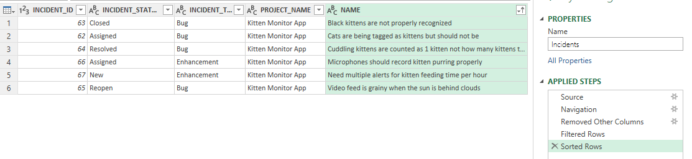

# OData Tutorial
## Introduction
[OData](https://en.wikipedia.org/wiki/Open_Data_Protocol) is an open protocol that lets you easily query data, over the web. Exclusive to SpiraPlan (6.9+), with OData you can directly query the raw data in your database in a secure and safe way. Whenever you use OData in SpiraPlan you are communicating through a secure intermediary (the application itself) to get data from read-only [reporting views](Custom-Report-Tables.md). Tools like Excel, PowerBI, Tableau support OData and can therefore communicate with SpiraPlan to access this data with just a few clicks.

With OData you don't need to be a SQL expert to generate rich and dynamic insights into your data. If you can fiddle with a spreadsheet, you can stich tables of data from SpiraPlan ("joins" in database language) to get just the data you need. What sort of insights can you get with OData and SpiraPlan reporting views? Here are some examples:

- a pie chart of how many users are members of each of SpiraPlan's products
- a list of how long ago each open task was assigned to the current owner
- get the most recent test run for each test case against each requirement assigned to a sprint
- the top 5 most closed then reopened bugs in a product (or program)

In this tutorial series we will be using Excel and its built-in Power Query to communicate with SpiraPlan. Over this series we will build up to creating the final example listed above: a list of the most reopened bugs. This is not meant as a tutorial of Power Query itself, there are lots of those online. But if you don't know how to use Power Query don't worry, you will still be able to follow along

## Connecting Excel and SpiraPlan using OData
In the first tutorial you will learn how to: 

- connect Excel to SpiraPlan
- pick a table to explore (incidents in this case)
- filter incidents to those from just one product
- get rid of columns you don't need to make our data more readable
- get the data into Excel itself
- update the data directly from SpiraPlan without leaving Excel

### Who can use OData?
Not all SpiraPlan users can connect to OData to see live data. Access to OData lets you see all data across all products in your entire system - it is not restricted by product membership or product role permissions. Therefore you need to think carefully about who can and should have this read-only access.

Two types of users can use OData:

- system administrators
- report administrators

Each user can be one, both, or neither of these. Admins can turn these settings on or off in the admin user profile screens.

Before carrying on with this tutorial make sure you are either a system or report admin, are using SpiraPlan, and are on at least version 6.9.0.0.

### Connect Excel and SpiraPlan
Open Excel and find the Get Data > From OData Feed button. This should be in the Data ribbon, under Get Data > From Other Sources.

Once you click this button you will see a popup. Stick with "Basic" and enter the special OData url for your SpiraPlan. This is the "base url" for your application with "api/odata" added at the end. If your site is at https://mycompany.spiraservice.net/ then your OData url will be https://mycompany.spiraservice.net/api/odata. Click OK.

Once Excel connects to SpiraPlan you see a popup "Navigator" where you can see all the different data views you can access ("query"). There is a lot here and a lot to explore. You can access pretty much all the information in your application, across all its products and templates, from these views. But if you click on now to take a look you will not be able to see anything. That's because you have not authenticated yet with Spira. You have to authenticate to view this data for obvious security reasons.

To authenticate you need to pieces of information:

- username
- API-key (also called the RSS token)

You can find both of these on your Profile page in the application.

In Excel, the easiest way to add your authentication information is to click on one of the view names. It will fail, then show you a dialog box like this:

Click on "Basic" on the left, then fill it in as below and click Connect.

- User name: put your "username" here
- Password: put your "API-key here

### Viewing data
You should now see a preview of the table you clicked on. Here we are looking at incidents. You can see a few rows of data, not everything.

To see all the data you have two options:

- **Load**: this loads the whole view, with all records, into a new Excel sheet in the current workbook
- **Transform Data**: this puts the data into Excel's Power Query so that you can manipulate the data that Spira sends to Excel

We will finish this first tutorial by clicking "Load". Your new sheet with Incident data in should look something like this...

**Note**: No data is downloaded until you click "Load". The first screen is a limited preview of live data. This preview is updated when you apple any filters. The full data set is retrieved when you click "Load". For example: If you only request the columns NAME and INCIDENT_ID & filter by INCIDENT_ID = 1234, only the name & ID of [IN:1234] will be sent over the internet. 

You can now: connect Excel and Spira together using OData and view data from Spira live in Excel. In the next tutorial we will build a simple query to filter the data to just those parts we are interested in

## Writing your first query
In this tutorial you will learn how to use Excel's Power Query to filter down all the Incidents in your SpiraPlan application. You will end up with a list of incidents in a single product, sorted by priority. You do not need any coding or SQL skills - everything you do will feel very similar to how you normal use Excel itself.

To get started:

- connect SpiraPlan and Excel using the OData feed (explained in the previous tutorial)
- click on the Incidents view in the Excel Navigator (just as we did in the last tutorial)
- click Transform Data at the bottom of the Excel Navigator popup to load the Power Query interface
- NOTE: if you followed along with the last tutorial and "loaded" your data into an Excel sheet, look to the "Queries and Connections" sidebar on the right. Double click where it says **Incidents**, *xx rows loaded*.

The Power Query interface looks very similar to Excel

The Power Query Editor window is made up of:

- ribbons and buttons at the top
- a query (data) navigator on the left (this is collapsed in the above screenshot)
- the data for your current query. This is always a flat 2 dimensional list - each column is a certain field, and each row a record (in this example each row is an incident)
- query settings sidebar on the right. This is very useful and lets you see all the steps you took to change your query. You can also go back to see what the query looked like at an earlier stage

### Choose columns
To make the data easier to look at and filter, the first thing to do is get rid of columns we don't need. Ther are well over 100 columns (because of all the custom fields we include) and that is way too many.

Click on the "Choose Columns" button from the Home ribbon. Only select the following columns (make sure the rest are unchecked), and then click OK

- INCIDENT_ID
- INCIDENT_STATUS_NAME
- INCIDENT_TYPE_NAME
- PROJECT_NAME
- NAME

You should now see a table of data like the one below. We are showing all the records still, but only 5 columns. The query settings sidebar has an extra line at the end that says "Removed Other Columns." This is what we just did. You can undo the action by deleting it from the sidebar, or change which columns to show by double clicking on it.

### Filtering data
Just like when filtering data on a sheet, the column names have dropdown arrows to open the filtering popup. 

- Click on the arrow in the PROJECT_NAME column header. Select just one product. In the screenshot below we are going to only show incidents for "Kitten Monitor App"
- Click OK

You have filtered your data! That's all there is to it. It is really easy. What is cool, is that we are not hiding rows of our table like we do in Excel normally. We are actually changing the query we are sending to SpiraPlan so that SpiraPlan is only sending us the information we have asked for.

Let's filter again. This time filter on the INCIDENT_TYPE_NAME column. Below we are filtering to show Bugs and Enhancements. So we are now seeing only certain types of incidents in a single product. You can see below we have a new entry in the list of Applied Steps in the right hand sidebar - for our Filtering Rows work.

### Sorting data
Sorting data is just as easy as filtering data. Click on the dropdown arrow for the column you want to sort by and click "Sort Ascending" or "Sort Descending". That's all there is to it. You can, if you want, sort by multiple columns at once. In the example below, we are sorting ascending by the NAME column. Again, there is a new entry in the list of Applied Steps in the right hand sidebar - for our Sorting Rows.

Hopefully, this feels very straightforward, because it is. In the background Excel is creating the right OData query to send to SpiraPlan, which is then writing a secure query to the database to get just the data you need. But you don't need to think about any of that.

In the next tutorial we are going to try another query with incidents and make things more complicated by combining data across two tables at once.

## Combining two lots of data
In this tutorial we will start to see the real power of reporting using OData. Until now we have been filtering and sorting a single list of incidents. Now we are going to do the same filtering and sorting but now across two tables joined together. Combining (joining) data in this way let's us do things with SpiraPlan's data like:

- list the test case names that are covering each requirement (by joining test case and requirement coverage data together)
- find all the bugs in a portfolio (by joining a portfolio with programs, products, and incidents)
- list the risks identified by everyone in a particular department (by joining risks and users)
- list only incidents that have an open status in a product (by joining incidents and information about incident statuses)

We are going to focus on the final example above in this tutorial, and add to it in the next tutorial

### Preparing our incident data
From the end of our last tutorial we had a list of bugs and enhancements in a single product. We can see names for things like the product (project in database terms), status, and type. This is what we see in SpiraPlan itself. 

Behind each status name is a unique number identified (ID). This lets us change, for example, the status name, but still make sure the incidents with that status show with that updated name.

To properly match data across different tables of data we should match on this ID fields. Do this:

- click on the little cog to the right of "Removed Other Columns" from the list of Applied Steps on the right hand side of the Power Query Editor
- you can now see all the fields available again. On top of the columns we are already showing, select to also show "INCIDENT_STATUS_ID".
- Click OK

Excel has asked SpiraPlan for this extra data and is now showing it to us. But notice that you are now seeing all incidents again, and "Removed Other Columns" is highlighted in the list of Applied Steps. Click on the bottom step "Sorted Rows". This will apply all the steps that follow our now updated "Removed Other Columns." This is a great feature - we can, within limits, edit previous steps we have made to our query, then go back to our most current step in the process. We now have the same list of incidents we ended the last tutorial with, but showing this extra column.

### Joining queries together
The process for joining data across two tables (queries as Power Query calls them) is:

1. Load each table as a separate query in the query editor
2. Join the queries by matching up columns between the first and second query
3. Choosing which columns from the second query to show

Right now we are only showing Incident data. To join it up with Incident Status data we need to add that table as a new query. To do that, carry out the following steps:

- Expand the Queries sidebar on the left hand side of the editor window
- Right click and select New Query > Recent Sources > and click on the name of your OData link (below this shows using localhost). Note: If you do not see the menu as in the screenshot you can get to this same place from the Home ribbon, new query section.
- This brings up the Navigator window showing all the different tables of data we can access in SpiraPlan
- Scroll down and click on "IncidentStatuses" then click OK
- This now loads up data from our second query on IncidentStatuses and selects this view

We now have two different queries that are completely independent from each other. We want to connect them together. For each incident we want to get extra information about its status. The main query is Incidents, and the secondary query is IncidentStatuses. So click on the Incidents query in the Queries sidebar to make sure we are viewing our Incident query again. Now, carry out the following steps:

- Click the "Merge Queries" button from the Home ribbon of the query editor
- This opens the Merge popup
- At the top it shows our incident query with all its columns
- Below that is a dropdown - open that to select "IncidentStatuses" - so we can merge it with Incidents
- We now need to match up the data: in the Incidents box click on the "INCIDENT_STATUS_ID" column, then in the IncidentStatuses box also click on the "INCIDENT_STATUS_ID" column
- This is telling Excel that INCIDENT_STATUS_ID in Incidents is the unique reference for IncidentStatuses to find matching status rows in
- Leave the dropdown called "Join Kind" as "Left Outer"
- Click OK

We now see the output of our merge query. Our query looks very similar - it has the same number of rows, but has gained an extra column "IncidentStatuses" at the right. The Applied Steps list has a new entry too: "Merged Queries." We know that merge has worked, but we can't see any extra data yet. That's because Project data is collapsed: in each cell in the IncidentStatuses column we see the word Table, which tells us that there is a whole set of data hiding inside that cell, waiting for us to look at it.

This is the 3rd and final step of the merge - choosing which columns to show from our extra data we have merged in. To the right of the IncidentStatuses column name you will see the little button looks different. It is not a dropdown arrow but a weird double arrow. Click this to choose how to expand the data from the IncidentStatuses data into new columns. You will see the familiar column picker. Only select the IS_OPEN_STATUS field and click OK.

The table is updated with an extra column called "IncidentStatuses.IS_OPEN_STATUS" and the Applied Steps list has a new entry "Expanded IncidentStatuses."

In this simple example we have added extra information to each incident row about the incident status that applies to that incident. 

The same principles can be used for combining data from many other tables together. The critical thing for this to work is that there are columns that match between the two tables you want to join. Imagine, for instance, if we match INCIDENT_ID from Incidents with INCIDENT_STATUS_ID from IncidentStatuses. The data may look interesting but it would be nonsense and not useable. It should almost always be obvious by the column name how it will match up with other columns in different tables.

As a final step in this tutorial, let's do something with this extra data we have. We now know which incidents are open or closed but that IS_OPEN_STATUS flag (TRUE = open, FALSE = closed). Filter on the "IncidentStatuses.IS_OPEN_STATUS" column the same as any other column, and select only the open incidents (TRUE). This added a new Applied Step "Filtered Rows1."

This query is really easy to do on the list of Incidents using SpiraPlan itself. We have replicated that functionality using OData to talk between Excel and SpiraPlan. In this way you can easily compare SpiraPlan and your query to see if the results match. As you can see the image above and the one below show the same exact incidents in the same order (because have applied the same filter and sorting in both places).

In the final tutorial we are going to build on the query we have built but rapidly extend it with a number of other joins and semi-advanced filtering.

## Building complex queries
In this tutorial we start with the output from the previous tutorial: a list of open bugs and enhancements for one product. By the end of this tutorial we will have a spreadsheet of data that shows, for a portfolio, the number of open bugs and enhancements each user is assigned. That's quite a transformation so let's get started.

- First, we need to show additional information about incidents. Go to the "Removed Other Columns" Applied Step and additionally show the PROJECT_ID, and OWNER_ID columns
- Now Go to the "Fitlered Rows" Applied Step and remove the filter on the PROJECT_NAME column
- Click on the "Filtered Rows1" Applied Step to show the results across all projects (products)
- Let's add some new queries we will need later in the sidebar: add Users, Projects, ProjectGroups (called Programs in the application itself), and Portfolios (use the select multiple checkbox in the popup window to add all of these at once)
- make sure to click on our main Incidents query from the sidebar so that it is selected
- click "Merge Queries" and merge the Incidents query to the Users query by matching up the field "OWNER_ID" in Incidents to "USER_ID" in Users. Use the default "Left Outer" join kind and click OK
- Expand the "Users" column to show the following columns: USER_NAME, and DEPARTMENT

Your data should look a little like that below. You can see here that we have incidents across different products, assigned to a handful of different users, who together work in two different departments (QA and Software Engineering).

Now we have three more merges and expanding columns to do:

**Projects**

- click "Merge Queries" and merge the Incidents query to the Projects query by matching up the field "PROJECT_ID" in Incidents to "PROJECT_ID" in Projects. 
- Use the default "Left Outer" join kind and click OK
- Expand the "Projects" column to show the column PROJECT_GROUP_ID 

**ProjectGroups**

- click "Merge Queries" and merge the Incidents query to the ProjectGroups query by matching up the field "Projects.PROJECT_GROUP_ID" in Incidents to "PROJECT_GROUP_ID" in ProjectGroups. 
- Use the default "Left Outer" join kind and click OK
- Expand the "ProjectGroups" column to show the columns NAME and PORTFOLIO_ID

**Portfolios**

- click "Merge Queries" and merge the Incidents query to the Portfolios query by matching up the field "ProjectGroups.PORTFOLIO_ID" in Incidents to "PORTFOLIO_ID" in Portfolios. 
- Use the default "Left Outer" join kind and click OK
- Expand the "Portfolios" column to show the columns Name

The query should now have a total of 14 columns. It combines data across 6 different tables from SpiraPlan to show us details about the user assigned to each incident and the program, and portfolio each incident is in. Your data should look something like that below (note the list of Applied Steps). If at anytime you have done something wrong, remember you can edit a step, or delete a step entirely and do it again.

We're ready for the final stage: grouping data. This will let us count up the number of incidents assigned to each user. Follow the steps below:

- Click "Group By" from the Home ribbon
- Click the Advanced radio button in the dialog popup
- This let's us add the different fields we want to show in our data after the group. Add groupings for: Users.USER_NAME, Users.DEPARTMENT, Portfolios.NAME
- Leave the rest of the dialog with the defaults and click OK

.

This results in a condensed query of data that has unique rows for each user in each portfolio. The right hand column is called Count and is the number of open bugs and enhancements that the user has in that portfolio.

.

Click "Close and Load from the ribbon to load this data into Excel. From here you can do anything with the data you want. For instance, you can turn it into a pivot table to tell you how many open bugs and enhancements there are, in total, in each portfolio. 

This brings us to the end of the OData tutorial series. Hopefully you can see the power of OData and the ease with which you can interrogate your data and draw out insights from it. You can create much more complex data that we have done here, or use more complex reporting tools to create live data dashboards that let you extend SpiraPlan with customized queries that make sense to your organization. 