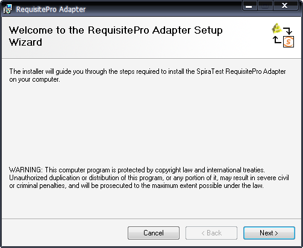
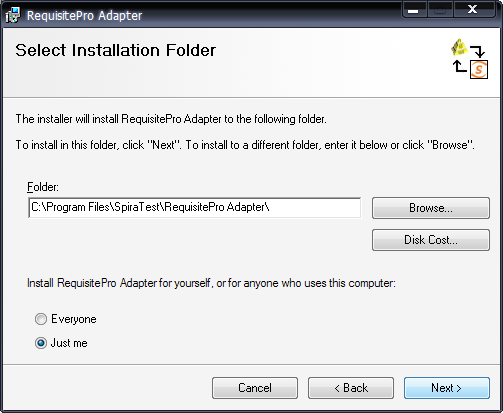
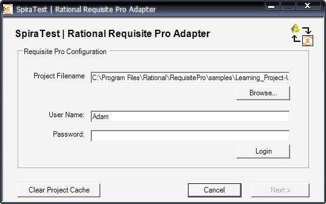
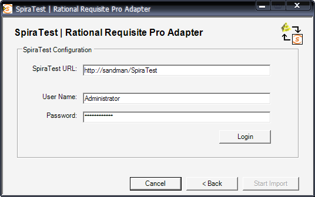
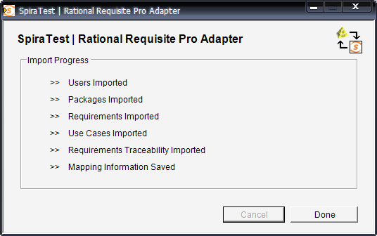

# Importing From RequisitePro

This section outlines how to use the included Integration Adapter for
importing Requirements, and Use Cases from IBM Rational®
RequisitePro® into SpiraTest®.

## Installing the Integration Adapter

This section outlines how to install the integration adapter for
RequisitePro onto a workstation so that you can then import requirements
and use cases from RequisitePro into SpiraTest. It assumes that you
already have a working installation of SpiraTest v2.2 or later and a
working installation of RequisitePro v7.0 or later. If you have an
earlier version of SpiraTest or RequisitePro, you will need to upgrade
to at least v2.2 and v7.0 respectively before trying to import data.

To obtain the version of the migration tool that is compatible with your
version of SpiraTest, you simply need to log-in as a project-level
administrator to SpiraTest, go to the Administration home page and
download the Integration Adapter Windows Installer package (.msi). This
process is described in the *SpiraTest Administration Guide* in more
detail.

**Important: You must install the integration adapter on
the same workstation that has the installed copy of RequisitePro**. Once
you have obtained the Windows Installer package, simply double-click on
the package to begin the installation wizard which should display the
following welcome page:

 
 

Click the <Next\> button to choose the folder to install the
integration adapter to:

 
 

Choose the folder to install to, and then decide whether the application
should be accessible by all users on the workstation or just the current
user. Then click the <Next\> button to start the installation process.
It will confirm if you want to proceed, click <Next\> then wait for it
to finish.

## Importing From RequisitePro

Now that you have installed the integration adapter, you can launch it
at any time by going to Start \> Programs \> SpiraTest \> Tools \>
RequisitePro Adapter. This will launch the import application itself:

The first thing you need to do is to click the <Browse\> button and
select the Rational RequisitePro project file (.rqs) that you want to
import from. You also need to select a valid username and password for
that project. Once you have done this, click the <Login\> button to
verify that the project file can be opened.

The button marked <Clear Project Cache\> will be explained later on.

Assuming that the user name selected has permission to access this
project, you will be prompted with a message box indicating that the
login was successful. Now click the <Next\> button to move to the next
page in the import wizard:

 

This page allows you to enter the URL, user name and password that you
want to use to access the instance of SpiraTest that you want to
***import to*** and click <Login\>. Typically the URL is of the form
(http://<server name\>/SpiraTest). The version of the importer being
used must be compatible with the version of SpiraTest you're importing
into; if not you will receive an error message.

Assuming that the login was successful, click the <Start Import\>
button to actually begin the process of importing the various artifacts
from RequisitePro into SpiraTest. Note that the first time the importer
sees a particular project file, it will create a new project in
SpiraTest to hold all the artifacts with the same name as that used in
RequisitePro.

During the import process, as each of the types of artifact are
imported, the progress display will change (as illustrated above). Once
the import has finished, you will receive a message to that effect and
the <Done\> button will be enabled. Clicking this button closed the
importer. You should now log into SpiraTest using the same user name and
password that was used for the import to view the imported project.

## Using RequisitePro with SpiraTest

Once you have completed this initial import, you will now have two
systems that can be used together to manage your project's lifecycle.
How they should be used together depends on which methodology you have
been using in your RequisitePro project:

**Traditional Mode** -- In this mode, RequisitePro only contains product
requirements and software requirements. These are both loaded into
SpiraTest's requirements matrix and can be used as a starting point for
developing the necessary test case coverage. In this mode, requirements
are managed in RequisitePro and all other artifacts are managed in
SpiraTest.

**Use Cases Mode** -- In this mode, RequisitePro contains features,
supplementary requirements and use cases. The features and supplementary
requirements are loaded into SpiraTest's requirements matrix, and the
use cases are loaded into SpiraTest's test case list. Note that these
use cases do not contain any test steps. In this mode, requirements and
test cases are managed in RequisitePro, and test steps, test runs and
incidents are managed in SpiraTest.

Regardless of the mode employed, you can manage the appropriate
artifacts in RequisitePro and then periodically re-run the import
application to update SpiraTest. The application will remember that the
project was already used for an initial load and will simply update the
requirements and/or test cases as appropriate as well as add any
additional ones added.

Note that this update process does **not** delete any artifacts removed
in RequisitePro and any changes to the requirement or use case
hierarchies are not reflected. This allows you to change the
organization of the artifacts in SpiraTest to make them easier to use
without the changes being overwritten on the next import cycle.

Finally, should you want to start again and re-import a project from
scratch that has already been imported once before, you should choose
the <Clear Project Cache\> button on the first screen which will remove
all the stored history of all previously loaded projects. ***This option
is irreversible and should be performed with care.***

