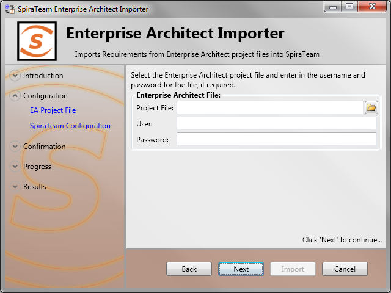
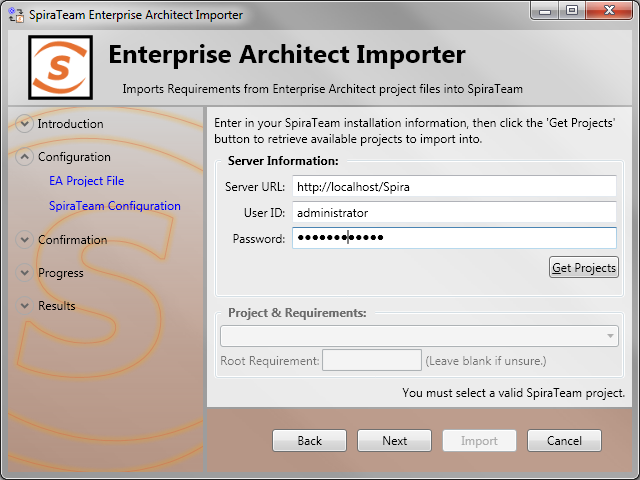
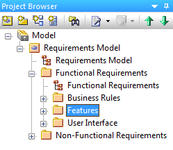
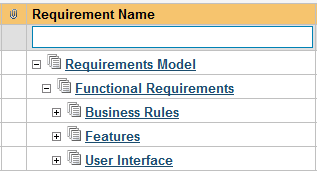
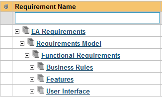
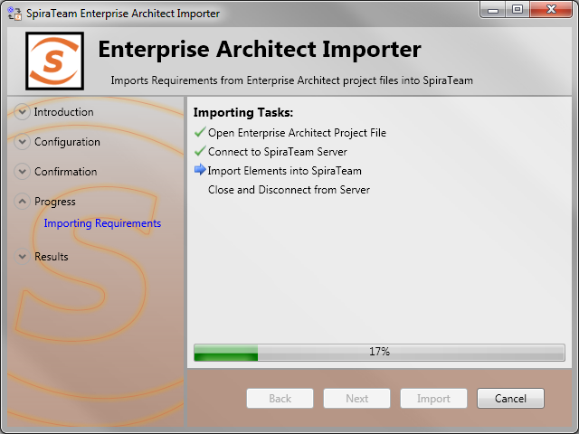
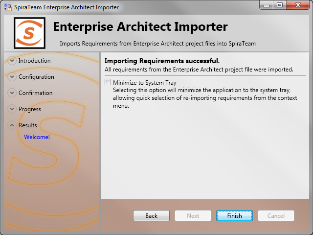

# Importing From EnterpriseArchitect
!!! abstract "Compatible with SpiraTest, SpiraTeam, SpiraPlan"

This section outlines how to use the included Importer for importing Requirements, Features, and Screens from a Sparx Enterprise Architect (EA) project file into Spira.

## Installing the Importer
This section outlines how to install the importer onto a desktop so that you can then import requirements and use cases from EA into Spira. It assumes that you already have a working installation of Spira v3.0 or later and a working installation of Enterprise Architect.

**Important: You must install the integration adapter on the same desktop that has the installed copy of Enterprise Architect**.

You can download the Importer from the Inflectra's website under "Downloads and Add-Ons". When downloaded, double-click the MSI file. Follow the instructions in the MSI file to install the importer.

## Importing from an EA Project File
Now that you have installed the integration adapter, you can launch it at any time by going to Start \> Programs \> Spira \> Tools \> Enterprise Architect Importer. This will launch the import application itself. You will be shown an introduction screen. Click 'Next' to get to the second screen:

Click the folder button () to open the file open dialog. In this dialog, select the Enterprise Architect Project file (\*.EAP) that you want to use for importing. If the file has access credentials required, enter the username and password needed to access the file.

Once the file is selected, click *Next* to continue to the screen where you enter your Spira project information:

If the file you selected in the previous step was already lined to a Spira project, that information will be automatically populated in the fields, and you can click *Next* to proceed.

Otherwise, enter in the Spira Server URL, your username and password used to log onto the system with and click the *Get Projects* button. The program will connect to the server and get a list of all available projects. Select the project you want to import into under the *Project & Requirement* section.

The *Root Requirement* box is for specifying a base requirement to load all the EA elements into. If left blank, then the root folders in the EAP's model will be root requirement folders in the Spira Project.

For example, if your EAP file has a tree that looks like:

Then the requirements imported into Spira will appear like:

Note that the folder "Non-Functional Requirements" does not appear in the list. Folders that have no importable elements will not get imported into Spira. At this time, only "Requirement", "Feature", and "Screen" elements are imported.

If you had a requirement already in Spira, and wanted the "Requirements Model" to appear in it, then enter the requirement number into the *Root Requirement* text box. For example, if I have a requirement named "EA Requirements" with a number of RQ1920, then put 1920 into the *Root Requirement* field and run the import. When import is finished, the Spira requirement tree will look like:

Once the fields are entered, click *Next* to get to the summary screen. The summary screen tells you what will be done, and once it's reviewed, click the *Import* button to start importing:

Anything flagged with a red

 failed, green

 means that they succeeded. Once finished, click *Finish* to get to the last page of the wizard:

If the *Minimize to System Tray* option is selected, when you click Finish or exit the form, the application will minimize to the system tray and give you some quick actions to re-import from the same file or select another file. Otherwise the program will exit, and you can re-launch the importer to import from the same or another EAP file.

## Using the System Tray Shortcut Menu

When the application is minimized to the system tray, there are several shortcuts available:

-   Double-Clicking the icon will bring the importer back to the first screen, allowing you to import another EAP file.
-   Right-clicking will give a shortcut menu with the following options:
-   Exit -- Close the program entirely.
-   Rerun Import -- Will provide you the screen to re-launch the last import you just ran.
-   Show Window -- Same as double-clicking on the icon, this will cause the wizard to appear back on the first screen, allowing new input options to be set.

## Enterprise Architect & Spira Importing Notes

At this time, only elements that are Requirements, Features, or Screens are imported. All three types are imported into Requirements within Spira, and most fields are brought over into Spira from EA. Mapping for fields are as follows:

| **Enterprise Architect Field**                         | **Spira Field**                                                      |
| ------------------------------------------------------ | -------------------------------------------------------------------- |
| Short Description / Name                               | Name                                                                 |
| Notes                                                  | Description (with HTML)                                              |
| Priority                                               | Importance (maps as High to High, Medium to Medium, Low to Low)      |
| Status                                                 | Status (see below for more details)                                  |
|                                                        | Author (not transferred, always set to user who ran the import last) |
|                                                        | Release (not transferred)                                            |
|                                                        | Owner (not transferred)                                              |
|                                                        | Planned Effort (not transferred)                                     |
| Alias                                                  | Custom Text Property \#1                                             |
| Element Type ('Requirement', 'Feature', 'Screen', etc) | Custom Text Property \#2                                             |
| Phase                                                  | Custom Text Property \#3                                             |
| Version                                                | Custom Text Property \#4                                             |
| Difficulty                                             | Custom Text Property \#5                                             |

| **Enterprise Architect Status** | **Spira Status** |
| ------------------------------- | ---------------- |
| Approved                        | Accepted         |
| Implemented                     | In Progress      |
| Validated                       | Completed        |
| Mandatory                       | Requested        |
| Proposed                        | Requested        |
| (None)                          | Requested        |

When a mapping is made, a Tagged Value is saved into the EAP file with the name of SPIRA::Mapping. The number of the value is the requirement number within Spira. If the requirement is deleted from Spira, and the mapping value in the EA project still exists, the item will not be re-imported into Spira. Similarly, folders are also given a SPIRA::Mapping value, and if a new Requirement element is created within a folder that was deleted in Spira, it will not be added. If you need to remove all mappings from the EAP file, you may do so by re-running the Importer, and entering in **-1** as the *Root Requirement*. Note that this will not delete requirements from Spira, only remove mappings, so the next time you run the importer on this file, all new requirements will be created.