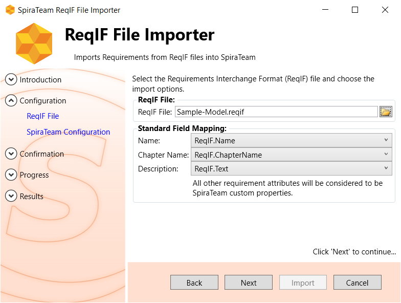

# Importing From Requirements Interchange Format (ReqIF) Files

The SpiraTeam ReqIF Importer
imports requirements, specifications, custom properties, relationships
and other information from Requirements Interchange Format (ReqIF)
files into SpiraTeam.

## Installing the Importer

This section outlines how to install the importer onto a desktop so that
you can then import requirements from ReqIF files into SpiraTeam.
It assumes that you already have a working installation of SpiraTest, SpiraTeam, or SpiraPlan (hereafter SpiraTeam) v6.0 or later.

You can download the Importer from the Inflectra's website under
"Downloads and Add-Ons". When downloaded, double-click the MSI file.
Follow the instructions in the MSI file to install the importer.

## Importing from a ReqIF Requirements File

Now that you have installed the integration adapter, you can launch it
at any time by going to Start \> Programs \> SpiraTeam \> Tools \>
ReqIF Importer. This will launch the import application
itself. You will be shown an introduction screen.

Click 'Next' to get to the second screen:

Click the folder button
() to open the file open dialog. In this
dialog, select the Requirements Interchange Format (\*.reqif) file that you
want to use for importing.

**Choose the requirements attributes you want from the .ReqIF file
model to map to the Name and Description fields in SpiraTeam. Any
other fields will be imported as custom properties.**

Once the file is selected, and the name/description attributes mapped,
click *Next* to continue to the screen where
you enter your SpiraTeam project information:

If the file you selected in the previous step was already lined to a
SpiraTeam project, that information will be automatically populated in
the fields, and you can click *Next* to proceed.

Otherwise, enter in the SpiraTeam Server URL, your username and password
used to log onto the system with and click the *Get Projects* button.
The program will connect to the server and get a list of all available
projects. Select the project you want to import into under the *Project
& Requirement* section.

The *Root Requirement* box is for specifying the name of the parent requirement in SpiraTeam, that all the imported requirements will be nested under. The system will default this to the name of the ReqIF file unless you choose something else.

Once the fields are entered, click *Next* to get to the summary screen.
The summary screen tells you what will be done, and once it's reviewed,
click the *Import* button to start importing:

Anything flagged with a:
- red  failed
- green  means that they succeeded

Once finished,
click *Finish* to get to the last page of the wizard:

If anything failed, you can view the details import log at the following location:

<pre>
C:\ProgramData\SpiraTeamReqIFImporter.log
</pre>

## ReqIF & SpiraTeam Importing Notes

- The importer uses the [ReqIFSharp library](https://reqifsharp.org/) and supports the following ReqIF versions:
  - ReqIF v1.0.1
  - ReqIF v1.1
  - ReqIF v1.2
- The importer will bring across the requirements hierarchy from the ReqIF file.
- It will also import any cross-relationships between requirements.
- It will store the special unique ReqIF identifier field for each requirement in a special 'identifier' custom property. 
- It will bring over any text, boolean and enumeration (list) attributes as the corresponding custom properties in SpiraTeam.

For example, if you import the sample **Sample-Model.reqif** file that is supplied with the importer, you will see the following requirements in SpiraTeam:

In addition, the importer will create the necessary custom properties as needed automatically:

If you run the same import twice, the importer will create a new requirements hierarchy each time, but it will reuse the existing custom properties if they are already defined in the SpiraTeam product.